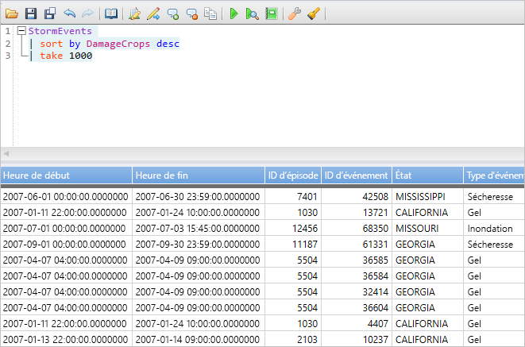
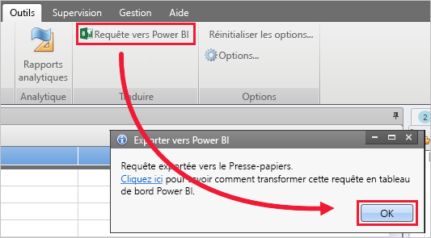
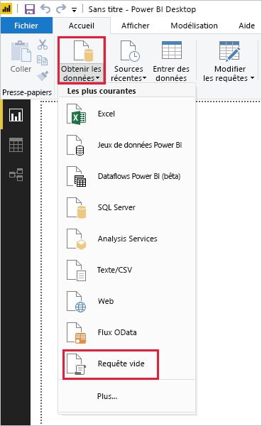
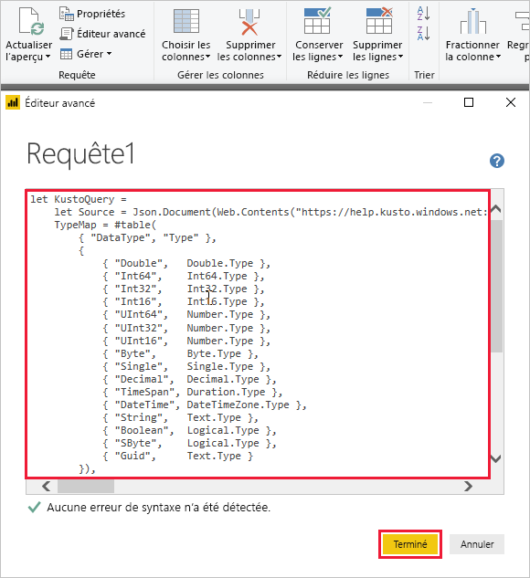
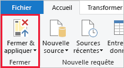

# <a name="visualize-data-using-a-query-imported-into-power-bi"></a>Visualiser des données avec une requête importée dans Power BI

L’Explorateur de données Azure est un service d’exploration de données rapide et hautement évolutive pour les données des journaux et les données de télémétrie. Power BI est une solution d’analytique métier qui vous permet de visualiser vos données et de partager les résultats dans votre organisation.

Azure Data Explorer offre trois options pour se connecter à des données dans Power BI : utiliser le connecteur intégré, importer une requête depuis Azure Data Explorer ou utiliser une requête SQL. Cet article vous montre comment importer une requête pour obtenir des données et les visualiser dans un rapport Power BI.

Si vous n’avez pas d’abonnement Azure, créez un [compte Azure gratuit](https://azure.microsoft.com/free/) avant de commencer.

## <a name="prerequisites"></a>Conditions préalables requises

Vous avez besoin des éléments suivants dans le cadre de cet article :

* Un compte e-mail professionnel qui est membre d’Azure Active Directory pour pouvoir vous connecter au [cluster help d’Azure Data Explorer](https://dataexplorer.azure.com/clusters/help/databases/samples).

* [Power BI Desktop](https://powerbi.microsoft.com/get-started/) (sélectionnez **TÉLÉCHARGER GRATUITEMENT**)

* [Application de poste de travail Azure Data Explorer](/azure/kusto/tools/kusto-explorer)

## <a name="get-data-from-azure-data-explorer"></a>Obtenir des données auprès d’Azure Data Explorer

Vous créez d’abord une requête dans l’application de poste de travail Azure Data Explorer et vous l’exportez pour l’utiliser dans Power BI. Ensuite, vous vous connectez au cluster help d’Azure Data Explorer et vous récupérez un sous-ensemble des données de la table *StormEvents*. [!INCLUDE [data-explorer-storm-events](../../includes/data-explorer-storm-events.md)]

1. Dans un navigateur, accédez à [https://help.kusto.windows.net/](https://help.kusto.windows.net/) pour lancer l’application de poste de travail Azure Data Explorer.

1. Dans l’application de poste de travail, copiez la requête suivante dans la fenêtre de requête en haut à droite, puis exécutez-la.

    ```Kusto
    StormEvents
    | sort by DamageCrops desc
    | take 1000
    ```

    Les premières lignes du jeu de résultats doivent être similaires à l’image suivante.

    

1. Sous l’onglet **Outils**, sélectionnez **Requête vers Power BI**, puis **OK**.

    

1. Dans Power BI Desktop, sous l’onglet **Accueil**, sélectionnez **Obtenir les données**, puis **Requête vide**.

    

1. Dans l’éditeur Power Query, sous l’onglet **Accueil**, sélectionnez **Éditeur avancé**.

1. Dans la fenêtre **Éditeur avancé**, collez la requête que vous avez exportée, puis sélectionnez **Terminé**.

    

1. Dans la fenêtre principale de l’éditeur Power Query, sélectionnez **Modifier les informations d’identification**. Sélectionnez **Compte professionnel**, connectez-vous, puis sélectionnez **Se connecter**.

    

1. Sous l’onglet **Accueil**, sélectionnez **Fermer et appliquer**.

    

## <a name="visualize-data-in-a-report"></a>Visualiser les données dans un rapport

[!INCLUDE [data-explorer-power-bi-visualize-basic](../../includes/data-explorer-power-bi-visualize-basic.md)]

## <a name="clean-up-resources"></a>Nettoyer les ressources

Si vous n’avez plus besoin du rapport que vous avez créé pour cet article, supprimez le fichier Power BI Desktop (.pbix).

## <a name="next-steps"></a>Étapes suivantes

[Visualiser des données à l'aide du connecteur Azure Data Explorer pour Power BI](power-bi-connector.md)