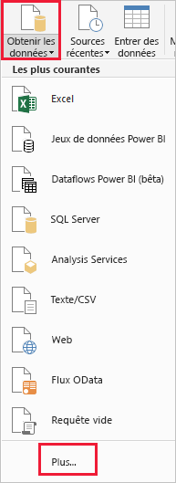
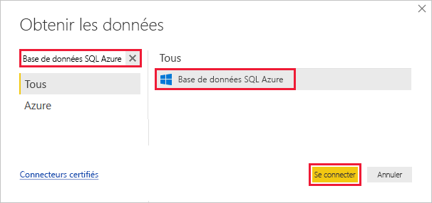
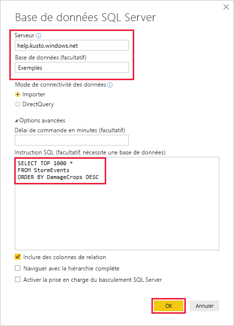
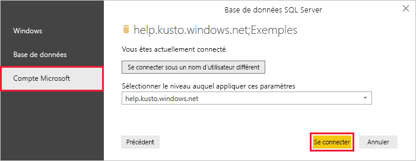
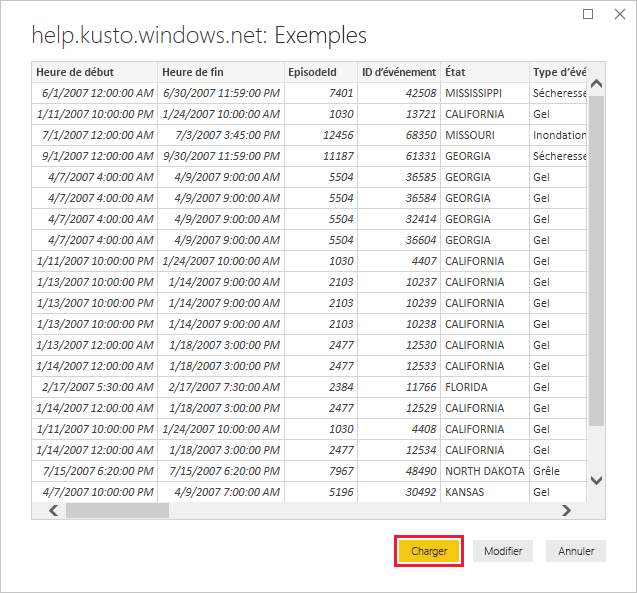

# <a name="visualize-data-from-azure-data-explorer-using-a-sql-query-in-power-bi"></a>Visualiser des données Azure Data Explorer avec une requête SQL dans Power BI

L’Explorateur de données Azure est un service d’exploration de données rapide et hautement évolutive pour les données des journaux et les données de télémétrie. Power BI est une solution d’analytique métier qui vous permet de visualiser vos données et de partager les résultats dans votre organisation.

Azure Data Explorer offre trois options pour se connecter à des données dans Power BI : utiliser le connecteur intégré, importer une requête depuis Azure Data Explorer ou utiliser une requête SQL. Cet article vous montre comment utiliser une requête SQL pour obtenir des données et les visualiser dans un rapport Power BI.

Si vous n’avez pas d’abonnement Azure, créez un [compte Azure gratuit](https://azure.microsoft.com/free/) avant de commencer.

## <a name="prerequisites"></a>Conditions préalables requises

Vous avez besoin des éléments suivants dans le cadre de cet article :

* Un compte e-mail professionnel qui est membre d’Azure Active Directory pour pouvoir vous connecter au [cluster help d’Azure Data Explorer](https://dataexplorer.azure.com/clusters/help/databases/samples).

* [Power BI Desktop](https://powerbi.microsoft.com/get-started/) (sélectionnez **TÉLÉCHARGER GRATUITEMENT**)

## <a name="get-data-from-azure-data-explorer"></a>Obtenir des données auprès d’Azure Data Explorer

Connectez-vous d’abord au cluster help d’Azure Data Explorer : vous récupérez alors une partie des données de la table *StormEvents*. [!INCLUDE [data-explorer-storm-events](../../includes/data-explorer-storm-events.md)]

Vous utilisez généralement le langage de requête natif avec Azure Data Explorer, mais celui-ci prend également en charge les requêtes SQL, que vous allez utiliser ici. Azure Data Explorer traduit pour vous la requête SQL en une requête native.

1. Dans Power BI Desktop, sous l’onglet **Accueil**, sélectionnez **Obtenir les données**, puis **Plus**.

    

1. Recherchez *Azure SQL Database*, sélectionnez **Azure SQL Database**, puis **Se connecter**.

    

1. Dans l’écran **Base de données SQL Server**, renseignez le formulaire avec les informations suivantes.

    

    **Paramètre** | **Valeur** | **Description du champ**
    |---|---|---|
    | Serveur | *help.kusto.windows.net* | URL pour le cluster help (sans *https://* ). Pour les autres clusters, l’URL est de la forme *\<NomCluster\>.\<Région\>.kusto.windows.net*. |
    | Base de données | *Exemples* | Exemple de base de données hébergée sur le cluster auquel vous vous connectez. |
    | Mode de connectivité des données | *Importer* | Détermine si Power BI importe les données ou s’il se connecte directement à la source de données. Vous pouvez utiliser l’une ou l’autre des options avec ce connecteur. |
    | Délai d’expiration de la commande | Laisser vide | Durée pendant laquelle la requête s’exécute avant de lever une erreur d’expiration. |
    | Instruction SQL | Copiez la requête sous ce tableau | Instruction SQL qu’Azure Data Explorer traduit pour vous en requête native. |
    | Autres options | Laissez les valeurs par défaut | Les options ne s’appliquent pas aux clusters Azure Data Explorer. |
    | | | |

    ```SQL
    SELECT TOP 1000 *
    FROM StormEvents
    ORDER BY DamageCrops DESC
    ```

1. Si vous n’avez pas déjà une connexion au cluster help, connectez-vous. Connectez-vous avec un compte Microsoft, puis sélectionnez **Se connecter**.

    

1. Dans l’écran **help.kusto.windows.net : Exemples**, sélectionnez **Charger**.

    

    La table s’ouvre dans la fenêtre principale de Power BI, dans la vue Rapport, où vous pouvez créer des rapports basés sur les exemples de données.

## <a name="visualize-data-in-a-report"></a>Visualiser les données dans un rapport

[!INCLUDE [data-explorer-power-bi-visualize-basic](../../includes/data-explorer-power-bi-visualize-basic.md)]

## <a name="clean-up-resources"></a>Nettoyer les ressources

Si vous n’avez plus besoin du rapport que vous avez créé pour cet article, supprimez le fichier Power BI Desktop (.pbix).

## <a name="next-steps"></a>Étapes suivantes

[Visualiser des données à l'aide du connecteur Azure Data Explorer pour Power BI](power-bi-connector.md)