# <a name="quickstart-query-data-in-azure-data-explorer-web-ui"></a>Démarrage rapide : Interroger des données dans l’interface utilisateur web Azure Data Explorer

L’Explorateur de données Azure est un service d’exploration de données rapide et hautement évolutive pour les données des journaux et les données de télémétrie. L’Explorateur de données Azure fournit une application web qui vous permet d’exécuter et de partager des requêtes. L’application est disponible dans le portail Azure en tant qu’application web autonome. Dans cet article, vous travaillez dans la version autonome, laquelle vous permet de vous connecter à plusieurs clusters et de partager des liens ciblés vers vos requêtes.

Si vous n’avez pas d’abonnement Azure, créez un [compte Azure gratuit](https://azure.microsoft.com/free/) avant de commencer.

## <a name="prerequisites"></a>Prérequis

En plus d’un abonnement Azure, vous devez disposer d’un [cluster de test et d’une base de données](create-cluster-database-portal.md) pour suivre ce guide de démarrage rapide.

## <a name="sign-in-to-the-application"></a>Se connecter à l’application

Connectez-vous à [l’application](https://dataexplorer.azure.com/).

## <a name="add-clusters"></a>Ajouter des clusters

Lorsque vous ouvrez l’application la première fois, vous n’avez aucune connexion.


Avant de commencer à exécuter des requêtes, vous devez ajouter une connexion à au moins un cluster. Dans cette section, vous ajoutez des connexions au *cluster help* de l’Explorateur de données Azure, que nous avons configuré afin de vous assister dans votre apprentissage, et au cluster de test que vous avez créé dans un guide de démarrage rapide précédent.

1. Dans la partie supérieure gauche de l’application, sélectionnez **Ajouter un cluster**.

1. Dans la boîte de dialogue **Ajouter un cluster**, entrez l’URI, puis sélectionnez **Ajouter**.

   Vous pouvez utiliser l’URI du cluster help : `https://help.kusto.windows.net`. Si vous disposez de votre propre cluster, indiquez son URI. Par exemple, `https://mydataexplorercluster.westus.kusto.windows.net` comme dans l’image suivante :

    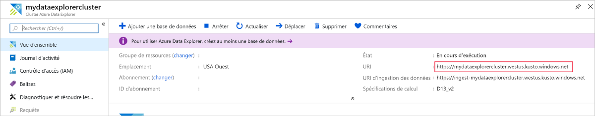

1. Dans le volet gauche, vous devriez maintenant voir le cluster **help**. Développez la base de données **Samples** afin de pouvoir voir les exemples de tables auxquels vous avez accès.

    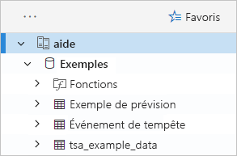

    Nous utilisons la table **StormEvents** plus loin dans ce guide de démarrage rapide et dans d’autres articles de l’Explorateur de données Azure.

Ajoutez maintenant le cluster de test que vous avez créé.

1. Sélectionnez **Ajouter un cluster**.

1. Dans la boîte de dialogue **Ajouter un cluster**, entrez l’URL de votre cluster de test sous la forme `https://<ClusterName>.<Region>.kusto.windows.net/`, puis sélectionnez **Ajouter**.

    Dans l’exemple ci-dessous, vous voyez le cluster **help** et un nouveau cluster, **docscluster.westus** (l’URL complète est `https://docscluster.westus.kusto.windows.net/`).

    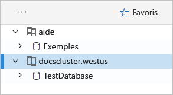

## <a name="run-queries"></a>Exécuter des requêtes

Vous pouvez maintenant exécuter des requêtes sur un cluster auquel vous êtes connecté (en supposant que vous avez des données dans votre cluster de test). Nous allons nous concentrer sur le cluster **help**.

1. Dans le volet gauche, sous le cluster **help**, sélectionnez la base de données **Samples**.

1. Copiez et collez la requête ci-après dans la fenêtre de requête. En haut de la fenêtre, sélectionnez **Exécuter**.

    ```Kusto
    StormEvents
    | sort by StartTime desc
    | take 10
    ```
    Cette requête retourne les dix enregistrements les plus récents dans la table **StormEvents**. Le côté gauche du résultat doit ressembler à la table suivante.

    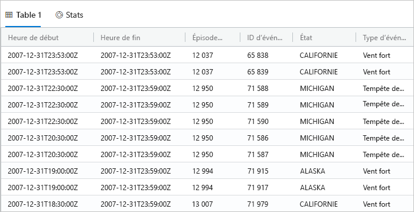

    L’image suivante montre à quoi l’application doit maintenant ressembler, avec les clusters ajoutés et une requête avec les résultats.

    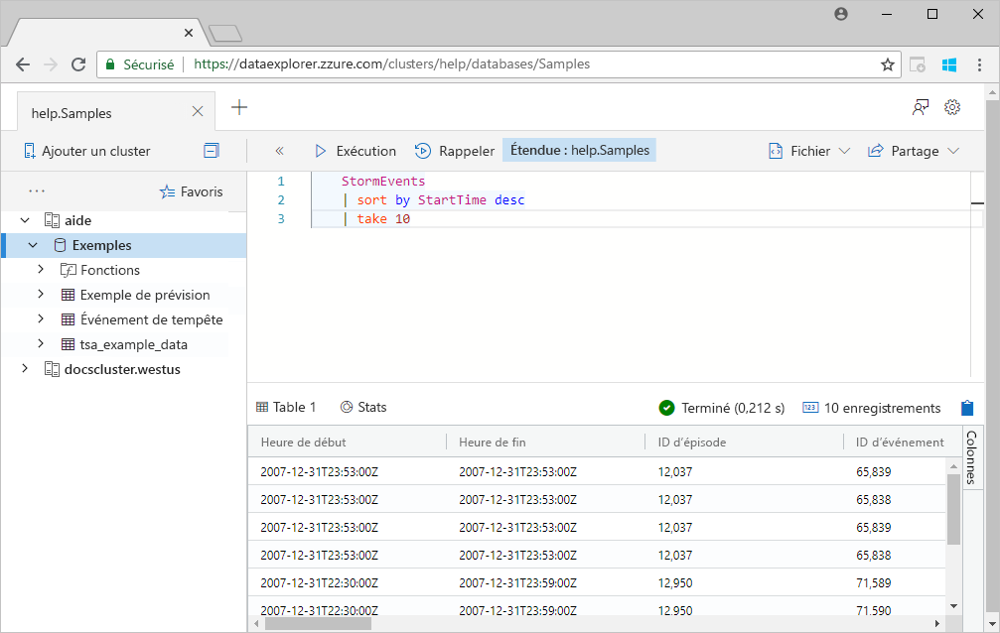

1. Copiez et collez la requête ci-après dans la fenêtre de requête, sous la première requête. Notez qu’elle ne se présente pas sur des lignes distinctes comme la première requête.

    ```Kusto
    StormEvents | sort by StartTime desc | project StartTime, EndTime, State, EventType, DamageProperty, EpisodeNarrative | take 10
    ```

1. Cliquez sur la nouvelle requête dans la fenêtre, ce qui la sélectionne. Appuyez sur Maj+Alt+F pour mettre en forme la requête pour qu’elle ressemble à ceci.

    

1. Appuyez sur Maj+ Entrée, raccourci pour exécuter une requête.

   Cette requête retourne les mêmes enregistrements que la première, mais contient uniquement les colonnes spécifiées dans l’instruction `project`. Le résultat doit ressembler à la table suivante.

    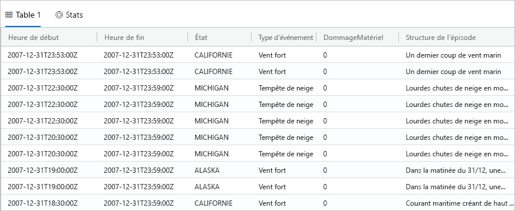

1. En haut de la fenêtre de requête, sélectionnez **Rappeler**.

    La fenêtre de requête montre maintenant le jeu de résultats de la première requête sans avoir à réexécuter la requête. Souvent pendant l’analyse, vous exécutez plusieurs requêtes, et **Rappeler** vous permet de revoir les résultats des requêtes précédentes.

1. Exécutons une autre requête pour voir un autre type de sortie.

    ```Kusto
    StormEvents
    | summarize event_count=count(), mid = avg(BeginLat) by State
    | sort by mid
    | where event_count > 1800
    | project State, event_count
    | render columnchart
    ```
    Le résultat doit ressembler au graphique suivant.

    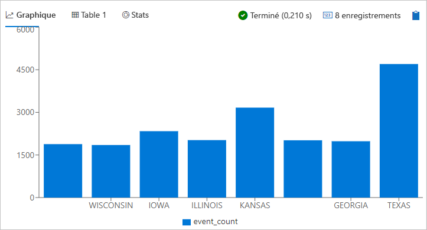

## <a name="work-with-the-table-grid"></a>Utiliser la grille de table

Maintenant que vous avez vu comment fonctionnent les requêtes simples, voyons comment vous pouvez utiliser la grille de table pour personnaliser les résultats et approfondir les analyses.

1. Réexécutez la première requête. Placez le curseur de la souris sur la colonne **État**, sélectionnez le menu et **Grouper par état**.

    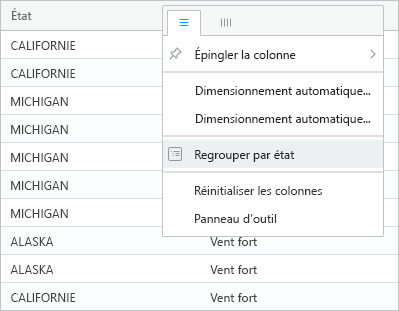

1. Dans la grille, développez **California** pour voir les enregistrements de cet état.

    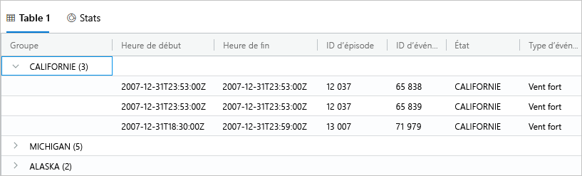

    Ce type de regroupement peut être utile lors d’une analyse exploratoire.

1. Placez le curseur de la souris sur la colonne **Grouper**, puis sélectionnez **Réinitialiser les colonnes**.

    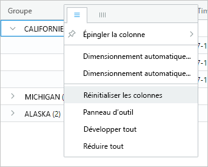

    Cette opération rétablit la grille à son état d’origine.

1. Exécutez la requête suivante.

    ```Kusto
    StormEvents
    | sort by StartTime desc
    | where DamageProperty > 5000
    | project StartTime, State, EventType, DamageProperty, Source
    | take 10
    ```

1. Sur le côté droit de la grille, sélectionnez **Colonnes** pour voir le panneau d’outil.

    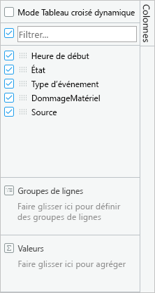

    Ce panneau fonctionne comme la liste des champs des tableaux croisés dynamiques dans Excel, ce qui vous permet d’effectuer davantage d’analyses dans la grille elle-même.

1. Sélectionnez **Mode Pivot**, puis faites glisser les colonnes comme suit : **State** sur **Groupes de lignes**, **DamageProperty** sur **Valeurs** et **EventType** sur **Étiquettes de colonne**.  

    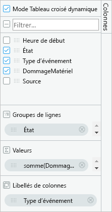

    Le résultat doit ressembler au tableau croisé dynamique suivant.

    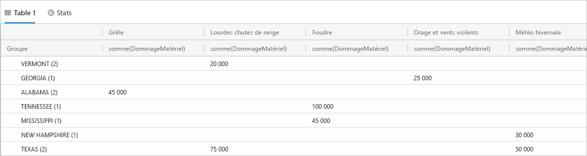

    Notez que Vermont et Alabama ont chacun deux événements sous la même catégorie, tandis que Texas présente deux événements sous des catégories différentes. Les tableaux croisés dynamiques vous permettent de repérer rapidement les détails comme ceux-ci. Ils constituent un excellent outil pour des analyses rapides.

## <a name="share-queries"></a>Partager des requêtes

Souvent, vous souhaitez partager les requêtes que vous créez. Vous pouvez fournir un lien ciblé afin que les utilisateurs avec un accès au cluster puissent exécuter les requêtes.

1. Dans la fenêtre de requête, sélectionnez la première requête que vous avez copiée.

1. En haut de la fenêtre de la requête, sélectionnez **Partager**.

1. Sélectionnez **Lien et requête dans le Presse-papiers**.

1. Copiez le lien et la requête dans un fichier texte.

1. Collez le lien dans une nouvelle fenêtre de navigateur. Une fois la requête exécutée, le résultat doit ressembler à ceci.

    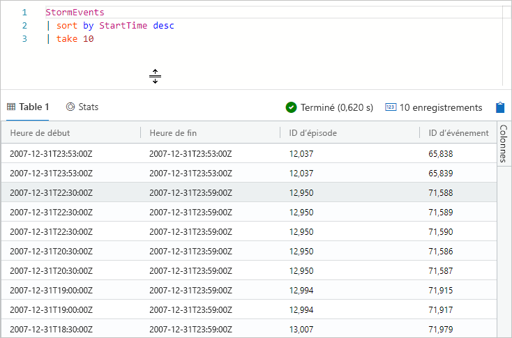

## <a name="provide-feedback"></a>Fournir des commentaires

L’Explorateur de données est actuellement en préversion, vos commentaires sur votre expérience sont les bienvenus. Vous pouvez les partager maintenant ou attendre d’avoir passé plus de temps dessus.

1. En haut à droite de l’application, sélectionnez l’icône de commentaires : .

1. Entrez vos commentaires et sélectionnez **Envoyer**.

## <a name="clean-up-resources"></a>Nettoyer les ressources

Vous n’avez pas créé aucune ressource dans ce guide de démarrage rapide, mais si vous souhaitez supprimer un ou les deux clusters de l’application, cliquez avec le bouton droit sur le cluster et sélectionnez **Supprimer la connexion**.

## <a name="next-steps"></a>Étapes suivantes

[Écrire des requêtes pour l’Explorateur de données Azure](write-queries.md)
