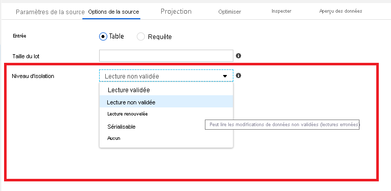
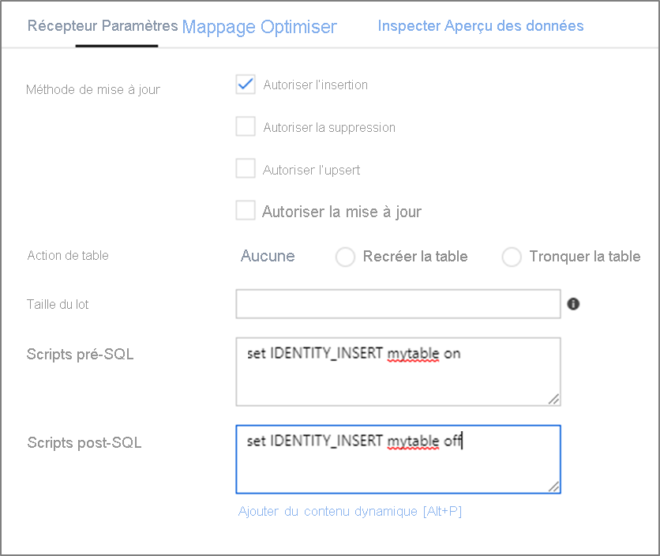

# <a name="copy-and-transform-data-in-azure-synapse-analytics-formerly-azure-sql-data-warehouse-by-using-azure-data-factory"></a>Copier et transformer des données dans Azure Synapse Analytics (anciennement Azure SQL Data Warehouse) à l’aide d’Azure Data Factory 

> [!div class="op_single_selector" title1="Sélectionnez la version du service Data Factory que vous utilisez :"]
> * [Version1](v1/data-factory-azure-sql-data-warehouse-connector.md)
> * [Version actuelle](connector-azure-sql-data-warehouse.md)

Cet article explique comment utiliser l’activité de copie dans Azure Data Factory pour copier des données depuis et vers Azure Synapse Analytics et utiliser Data Flow pour transformer les données dans Azure Data Lake Storage Gen2. Pour en savoir plus sur Azure Data Factory, lisez l’[article d’introduction](introduction.md).

## <a name="supported-capabilities"></a>Fonctionnalités prises en charge

Ce connecteur Azure Synapse Analytics est pris en charge pour les activités suivantes :

- [Activité Copy](copy-activity-overview.md) avec tableau de [prise en charge de la matrice source/du récepteur](copy-activity-overview.md)
- [Mappage de flux de données](concepts-data-flow-overview.md)
- [Activité de recherche](control-flow-lookup-activity.md)
- [Activité GetMetadata](control-flow-get-metadata-activity.md)

Pour l’activité de copie, ce connecteur Azure Synapse Analytics prend en charge les fonctions suivantes :

- Copie de données à l’aide de l’authentification SQL et de l’authentification du jeton de l’application Azure Active Directory (Azure AD) avec un principal de service ou l’identité managée pour les ressources Azure.
- En tant que source, récupération de données à l’aide d’une requête SQL ou d’une procédure stockée.
- En tant que récepteur, chargement des données à l’aide de [PolyBase](#use-polybase-to-load-data-into-azure-sql-data-warehouse) ou [instruction COPY](#use-copy-statement) (préversion) ou insertion en bloc. Nous vous recommandons d’utiliser PolyBase ou l’instruction COPY (préversion) pour améliorer les performances de copie.

> [!IMPORTANT]
> Si vous copiez des données à l’aide d’Azure Data Factory Integration Runtime, configurez un [pare-feu de serveur Azure SQL](https://msdn.microsoft.com/library/azure/ee621782.aspx#ConnectingFromAzure) de façon à ce que les services Azure puissent accéder au serveur.
> Si vous copiez des données à l’aide d’un runtime d’intégration auto-hébergé, configurez le pare-feu du serveur Azure SQL pour autoriser la plage IP appropriée. Cette plage inclut l’adresse IP de l’ordinateur qui est utilisé pour se connecter à Azure Synapse Analytics.

## <a name="get-started"></a>Bien démarrer

> [!TIP]
> Pour obtenir les meilleures performances, utilisez PolyBase pour charger des données dans Azure Synapse Analytics. Pour plus de détails, consultez la section [Utiliser PolyBase pour charger des données dans Azure Synapse Analytics](#use-polybase-to-load-data-into-azure-sql-data-warehouse). Consultez [Charger 1 To dans Azure Synapse Analytics en moins de 15 minutes avec Azure Data Factory](load-azure-sql-data-warehouse.md) pour obtenir une procédure pas à pas avec un cas d’utilisation.

[!INCLUDE [data-factory-v2-connector-get-started](../../includes/data-factory-v2-connector-get-started.md)]

Les sections suivantes fournissent des informations détaillées sur les propriétés qui définissent les entités Data Factory propres à un connecteur Azure Synapse Analytics.

## <a name="linked-service-properties"></a>Propriétés du service lié

Les propriétés prises en charge pour le service lié Azure Synapse Analytics sont les suivantes :

| Propriété            | Description                                                  | Obligatoire                                                     |
| :------------------ | :----------------------------------------------------------- | :----------------------------------------------------------- |
| type                | La propriété de type doit être définie sur **AzureSqlDW**             | Oui                                                          |
| connectionString    | Spécifiez les informations requises pour la connexion à l’instance Azure Synapse Analytics pour la propriété **connectionString**. <br/>Marquez ce champ comme SecureString pour le stocker de façon sécurisée dans Data Factory. Vous pouvez également stocker un mot de passe/une clé de principal de service dans Azure Key Vault et, en cas d'authentification SQL, extraire la configuration `password` de la chaîne de connexion. Pour plus d'informations, reportez-vous à l'exemple JSON décrit sous le tableau et à l'article [Stocker des informations d'identification dans Azure Key Vault](store-credentials-in-key-vault.md). | Oui                                                          |
| servicePrincipalId  | Spécifiez l’ID client de l’application.                         | Oui, quand vous utilisez l’authentification Azure AD avec le principal de service. |
| servicePrincipalKey | Spécifiez la clé de l’application. Marquez ce champ en tant que SecureString afin de le stocker en toute sécurité dans Data Factory, ou [référencez un secret stocké dans Azure Key Vault](store-credentials-in-key-vault.md). | Oui, quand vous utilisez l’authentification Azure AD avec le principal de service. |
| tenant              | Spécifiez les informations de locataire (nom de domaine ou ID de locataire) dans lesquels se trouve votre application. Vous pouvez le récupérer en pointant la souris dans le coin supérieur droit du Portail Azure. | Oui, quand vous utilisez l’authentification Azure AD avec le principal de service. |
| connectVia          | Le [runtime d’intégration](concepts-integration-runtime.md) à utiliser pour se connecter à la banque de données. Vous pouvez utiliser Azure Integration Runtime ou un runtime d’intégration auto-hébergé (si votre magasin de données se trouve sur un réseau privé). À défaut de spécification, le runtime d’intégration Azure par défaut est utilisé. | Non                                                           |

Pour en savoir plus sur les autres types d’authentification, consultez les sections suivantes sur les prérequis et les exemples JSON, respectivement :

- [Authentification SQL](#sql-authentication)
- Authentification par jeton d’application Azure AD : [Principal du service](#service-principal-authentication)
- Authentification par jeton d’application Azure AD : [Identités managées pour les ressources Azure](#managed-identity)

>[!TIP]
>Si vous rencontrez une erreur avec le code d’erreur « UserErrorFailedToConnectToSqlServer » et un message tel que « La limite de session pour la base de données est XXX et a été atteinte. », ajoutez `Pooling=false` à votre chaîne de connexion, puis réessayez.

### <a name="sql-authentication"></a>Authentification SQL

#### <a name="linked-service-example-that-uses-sql-authentication"></a>Exemple de service lié qui utilise l’authentification SQL

```json
{
    "name": "AzureSqlDWLinkedService",
    "properties": {
        "type": "AzureSqlDW",
        "typeProperties": {
            "connectionString": "Server=tcp:<servername>.database.windows.net,1433;Database=<databasename>;User ID=<username>@<servername>;Password=<password>;Trusted_Connection=False;Encrypt=True;Connection Timeout=30"
        },
        "connectVia": {
            "referenceName": "<name of Integration Runtime>",
            "type": "IntegrationRuntimeReference"
        }
    }
}
```

**Mot de passe dans Azure Key Vault :**

```json
{
    "name": "AzureSqlDWLinkedService",
    "properties": {
        "type": "AzureSqlDW",
        "typeProperties": {
            "connectionString": "Server=tcp:<servername>.database.windows.net,1433;Database=<databasename>;User ID=<username>@<servername>;Trusted_Connection=False;Encrypt=True;Connection Timeout=30",
            "password": { 
                "type": "AzureKeyVaultSecret", 
                "store": { 
                    "referenceName": "<Azure Key Vault linked service name>", 
                    "type": "LinkedServiceReference" 
                }, 
                "secretName": "<secretName>" 
            }
        },
        "connectVia": {
            "referenceName": "<name of Integration Runtime>",
            "type": "IntegrationRuntimeReference"
        }
    }
}
```

### <a name="service-principal-authentication"></a>Authentification d’un principal du service

Pour utiliser l’authentification du jeton d’application Azure AD basée sur le principal de service, effectuez les étapes suivantes :

1. **[Créez une application Azure Active Directory](../active-directory/develop/howto-create-service-principal-portal.md#create-an-azure-active-directory-application)** dans le portail Azure. Prenez note du nom de l’application et des valeurs suivantes qui définissent le service lié :

    - ID de l'application
    - Clé de l'application
    - ID client

2. **[Provisionnez un administrateur Azure Active Directory](../sql-database/sql-database-aad-authentication-configure.md#provision-an-azure-active-directory-administrator-for-your-azure-sql-database-server)** pour votre serveur SQL Azure sur le portail Azure si ce n’est déjà fait. L’administrateur Azure AD peut être un utilisateur Azure AD ou un groupe Azure AD. Si vous accordez au groupe avec identité managée un rôle d’administrateur, ignorez les étapes 3 et 4. L’administrateur a un accès complet à la base de données.

3. **[Créez des utilisateurs de base de données autonome](../sql-database/sql-database-aad-authentication-configure.md#create-contained-database-users-in-your-database-mapped-to-azure-ad-identities)** pour le principal de service. Connectez-vous à l’entrepôt de données vers lequel ou à partir duquel vous souhaitez copier des données à l’aide d’outils tels que SSMS, avec une identité Azure AD qui a au moins l’autorisation ALTER ANY USER. Exécutez la commande T-SQL suivante :
  
    ```sql
    CREATE USER [your application name] FROM EXTERNAL PROVIDER;
    ```

4. **Accordez les autorisations requises par le principal de service** comme vous le feriez d’habitude pour des utilisateurs SQL ou autres. Exécutez le code suivant, ou consultez davantage d’options [ici](https://docs.microsoft.com/sql/relational-databases/system-stored-procedures/sp-addrolemember-transact-sql?view=sql-server-2017). Si vous souhaitez utiliser PolyBase pour charger les données, consultez l’[autorisation de base de données requise](#required-database-permission).

    ```sql
    EXEC sp_addrolemember db_owner, [your application name];
    ```

5. **Configurez un service lié Azure Synapse Analytics** dans Azure Data Factory.


#### <a name="linked-service-example-that-uses-service-principal-authentication"></a>Exemple de service lié qui utilise l’authentification du principal de service

```json
{
    "name": "AzureSqlDWLinkedService",
    "properties": {
        "type": "AzureSqlDW",
        "typeProperties": {
            "connectionString": "Server=tcp:<servername>.database.windows.net,1433;Database=<databasename>;Connection Timeout=30",
            "servicePrincipalId": "<service principal id>",
            "servicePrincipalKey": {
                "type": "SecureString",
                "value": "<service principal key>"
            },
            "tenant": "<tenant info, e.g. microsoft.onmicrosoft.com>"
        },
        "connectVia": {
            "referenceName": "<name of Integration Runtime>",
            "type": "IntegrationRuntimeReference"
        }
    }
}
```

### <a name="managed-identity"></a> Identités managées pour authentifier les ressources Azure

Une fabrique de données peut être associée à une [identité managée pour les ressources Azure](data-factory-service-identity.md), laquelle représente cette même fabrique. Vous pouvez utiliser cette identité managée pour l’authentification Azure Synapse Analytics. La fabrique désignée peut accéder et copier des données vers ou à partir de votre entrepôt de données à l’aide de cette identité.

Pour utiliser l’authentification par identité managée, effectuez les étapes suivantes :

1. **[Provisionnez un administrateur Azure Active Directory](../sql-database/sql-database-aad-authentication-configure.md#provision-an-azure-active-directory-administrator-for-your-azure-sql-database-server)** pour votre serveur SQL Azure sur le portail Azure si ce n’est déjà fait. L’administrateur Azure AD peut être un utilisateur Azure AD ou un groupe Azure AD. Si vous accordez au groupe avec identité managée un rôle d’administrateur, ignorez les étapes 3 et 4. L’administrateur a un accès complet à la base de données.

2. **[Créer des utilisateurs de base de données autonome](../sql-database/sql-database-aad-authentication-configure.md#create-contained-database-users-in-your-database-mapped-to-azure-ad-identities)** pour l’identité managée de Data Factory. Connectez-vous à l’entrepôt de données vers lequel ou à partir duquel vous souhaitez copier des données à l’aide d’outils tels que SSMS, avec une identité Azure AD qui a au moins l’autorisation ALTER ANY USER. Exécutez le code T-SQL suivant. 
  
    ```sql
    CREATE USER [your Data Factory name] FROM EXTERNAL PROVIDER;
    ```

3. **Accordez les autorisations requises par l’identité managée Data Factory** comme vous le feriez d’habitude pour des utilisateurs SQL et autres. Exécutez le code suivant, ou consultez davantage d’options [ici](https://docs.microsoft.com/sql/relational-databases/system-stored-procedures/sp-addrolemember-transact-sql?view=sql-server-2017). Si vous souhaitez utiliser PolyBase pour charger les données, consultez l’[autorisation de base de données requise](#required-database-permission).

    ```sql
    EXEC sp_addrolemember db_owner, [your Data Factory name];
    ```

5. **Configurez un service lié Azure Synapse Analytics** dans Azure Data Factory.

**Exemple :**

```json
{
    "name": "AzureSqlDWLinkedService",
    "properties": {
        "type": "AzureSqlDW",
        "typeProperties": {
            "connectionString": "Server=tcp:<servername>.database.windows.net,1433;Database=<databasename>;Connection Timeout=30"
        },
        "connectVia": {
            "referenceName": "<name of Integration Runtime>",
            "type": "IntegrationRuntimeReference"
        }
    }
}
```

## <a name="dataset-properties"></a>Propriétés du jeu de données

Pour obtenir la liste complète des sections et propriétés disponibles pour la définition de jeux de données, consultez l’article [Jeux de données](concepts-datasets-linked-services.md). 

Les propriétés prises en charge pour le jeu de données Azure Synapse Analytics sont les suivantes :

| Propriété  | Description                                                  | Obligatoire                    |
| :-------- | :----------------------------------------------------------- | :-------------------------- |
| type      | La propriété **type** du jeu de données doit être définie sur **AzureSqlDWTable**. | Oui                         |
| schéma | Nom du schéma. |Non pour Source, Oui pour Récepteur  |
| table | Nom de la table/vue. |Non pour Source, Oui pour Récepteur  |
| tableName | Nom de la table/vue avec schéma. Cette propriété est prise en charge pour la compatibilité descendante. Pour les nouvelles charges de travail, utilisez `schema` et `table`. | Non pour Source, Oui pour Récepteur |

#### <a name="dataset-properties-example"></a>Exemple de propriétés du jeu de données

```json
{
    "name": "AzureSQLDWDataset",
    "properties":
    {
        "type": "AzureSqlDWTable",
        "linkedServiceName": {
            "referenceName": "<Azure Synapse Analytics linked service name>",
            "type": "LinkedServiceReference"
        },
        "schema": [ < physical schema, optional, retrievable during authoring > ],
        "typeProperties": {
            "schema": "<schema_name>",
            "table": "<table_name>"
        }
    }
}
```

## <a name="copy-activity-properties"></a>Propriétés de l’activité de copie

Pour obtenir la liste complète des sections et des propriétés disponibles pour la définition des activités, consultez l’article [Pipelines](concepts-pipelines-activities.md). Cette section fournit la liste des propriétés prises en charge par Azure Synapse Analytics en tant que source et récepteur.

### <a name="azure-synapse-analytics-as-the-source"></a>Azure Synapse Analytics en tant que source

Pour copier des données depuis Azure Synapse Analytics, affectez la valeur **SqlDWSource** à la propriété **type** dans la source d’activité de copie. Les propriétés prises en charge dans la section **source** de l’activité de copie sont les suivantes :

| Propriété                     | Description                                                  | Obligatoire |
| :--------------------------- | :----------------------------------------------------------- | :------- |
| type                         | La propriété **type** de la source d’activité de copie doit être définie sur **SqlDWSource**. | Oui      |
| sqlReaderQuery               | Utiliser la requête SQL personnalisée pour lire les données. Exemple : `select * from MyTable`. | Non       |
| sqlReaderStoredProcedureName | Nom de la procédure stockée qui lit les données de la table source. La dernière instruction SQL doit être une instruction SELECT dans la procédure stockée. | Non       |
| storedProcedureParameters    | Paramètres de la procédure stockée.<br/>Les valeurs autorisées sont des paires de noms ou de valeurs. Les noms et la casse des paramètres doivent correspondre aux noms et à la casse des paramètres de la procédure stockée. | Non       |

**Exemple : utilisation d’une requête SQL**

```json
"activities":[
    {
        "name": "CopyFromAzureSQLDW",
        "type": "Copy",
        "inputs": [
            {
                "referenceName": "<Azure SQL DW input dataset name>",
                "type": "DatasetReference"
            }
        ],
        "outputs": [
            {
                "referenceName": "<output dataset name>",
                "type": "DatasetReference"
            }
        ],
        "typeProperties": {
            "source": {
                "type": "SqlDWSource",
                "sqlReaderQuery": "SELECT * FROM MyTable"
            },
            "sink": {
                "type": "<sink type>"
            }
        }
    }
]
```

**Exemple : utilisation d’une procédure stockée**

```json
"activities":[
    {
        "name": "CopyFromAzureSQLDW",
        "type": "Copy",
        "inputs": [
            {
                "referenceName": "<Azure SQL DW input dataset name>",
                "type": "DatasetReference"
            }
        ],
        "outputs": [
            {
                "referenceName": "<output dataset name>",
                "type": "DatasetReference"
            }
        ],
        "typeProperties": {
            "source": {
                "type": "SqlDWSource",
                "sqlReaderStoredProcedureName": "CopyTestSrcStoredProcedureWithParameters",
                "storedProcedureParameters": {
                    "stringData": { "value": "str3" },
                    "identifier": { "value": "$$Text.Format('{0:yyyy}', <datetime parameter>)", "type": "Int"}
                }
            },
            "sink": {
                "type": "<sink type>"
            }
        }
    }
]
```

**Exemple de procédure stockée :**

```sql
CREATE PROCEDURE CopyTestSrcStoredProcedureWithParameters
(
    @stringData varchar(20),
    @identifier int
)
AS
SET NOCOUNT ON;
BEGIN
    select *
    from dbo.UnitTestSrcTable
    where dbo.UnitTestSrcTable.stringData != stringData
    and dbo.UnitTestSrcTable.identifier != identifier
END
GO
```

### <a name="azure-sql-data-warehouse-as-sink"></a> Azure Synapse Analytics en tant que récepteur

Azure Data Factory prend en charge trois manières de charger des données dans SQL Data Warehouse.


- [Utiliser PolyBase](#use-polybase-to-load-data-into-azure-sql-data-warehouse) 
- [Utiliser l’instruction COPY (préversion)](#use-copy-statement)
- Utiliser l’insertion en bloc

La méthode la plus rapide et la plus scalable pour charger des données consiste à utiliser [PolyBase](https://docs.microsoft.com/sql/relational-databases/polybase/polybase-guide) ou [l’instruction COPY](https://docs.microsoft.com/sql/t-sql/statements/copy-into-transact-sql?view=azure-sqldw-latest) (préversion).

Pour copier des données vers Azure SQL Data Warehouse, définissez **SqlDWSink** comme type de récepteur dans l’activité de copie. Les propriétés suivantes sont prises en charge dans la section **sink** de l’activité de copie :

| Propriété          | Description                                                  | Obligatoire                                      |
| :---------------- | :----------------------------------------------------------- | :-------------------------------------------- |
| type              | La propriété **type** du récepteur d’activité de copie doit être définie sur **SqlDWSink**. | Oui                                           |
| allowPolyBase     | Indique s’il faut utiliser PolyBase pour charger des données dans SQL Data Warehouse. `allowCopyCommand` et `allowPolyBase` ne peuvent pas avoir tous les deux la valeur True. <br/><br/>Reportez-vous à la section [Utiliser PolyBase pour charger des données dans Azure SQL Data Warehouse](#use-polybase-to-load-data-into-azure-sql-data-warehouse) pour connaître les contraintes et les détails.<br/><br/>Les valeurs autorisées sont **True** et **False** (par défaut). | Non.<br/>Appliquer lors de l’utilisation de PolyBase.     |
| polyBaseSettings  | Groupe de propriétés pouvant être spécifié lorsque la propriété `allowPolybase` est définie sur **true**. | Non.<br/>Appliquer lors de l’utilisation de PolyBase. |
| allowCopyCommand | Indique s’il faut utiliser [l’instruction COPY](https://docs.microsoft.com/sql/t-sql/statements/copy-into-transact-sql?view=azure-sqldw-latest) (préversion) pour charger des données dans SQL Data Warehouse. `allowCopyCommand` et `allowPolyBase` ne peuvent pas avoir tous les deux la valeur True. <br/><br/>Consultez la section [Utiliser l’instruction COPY pour charger des données dans Azure SQL Data Warehouse](#use-copy-statement) afin de connaître les contraintes et les détails.<br/><br/>Les valeurs autorisées sont **True** et **False** (par défaut). | Non.<br>Appliquer lors de l’utilisation de l’instruction COPY. |
| copyCommandSettings | Groupe de propriétés pouvant être spécifié lorsque la propriété `allowCopyCommand` est définie sur TRUE. | Non.<br/>Appliquer lors de l’utilisation de l’instruction COPY. |
| writeBatchSize    | Nombre de lignes à insérer dans le tableau SQL **par lot**.<br/><br/>La valeur autorisée est **integer** (nombre de lignes). Par défaut, Data Factory détermine de façon dynamique la taille de lot appropriée selon la taille de ligne. | Non.<br/>Appliquer lors de l’utilisation de l’insertion en bloc.     |
| writeBatchTimeout | Temps d’attente pour que l’opération d’insertion de lot soit terminée avant d’expirer.<br/><br/>La valeur autorisée est **timespan**. Exemple : “00:30:00” (30 minutes). | Non.<br/>Appliquer lors de l’utilisation de l’insertion en bloc.        |
| preCopyScript     | Spécifiez une requête SQL pour l’activité de copie à exécuter avant l’écriture de données dans Azure SQL Data Warehouse à chaque exécution. Utilisez cette propriété pour nettoyer les données préchargées. | Non                                            |
| tableOption | Spécifie si la table du récepteur doit être créée automatiquement si elle n’existe pas en fonction du schéma source. La création automatique de la table n’est pas prise en charge quand une copie intermédiaire est configurée dans l’activité de copie. Les valeurs autorisées sont `none` (par défaut) et `autoCreate`. |Non |
| disableMetricsCollection | Data Factory collecte des métriques telles que les DWU SQL Data Warehouse pour effectuer des suggestions et l’optimisation des performances de copie. Si ce comportement vous préoccupe, spécifiez `true` pour le désactiver. | Non (la valeur par défaut est `false`) |

#### <a name="sql-data-warehouse-sink-example"></a>Exemple de récepteur SQL Data Warehouse

```json
"sink": {
    "type": "SqlDWSink",
    "allowPolyBase": true,
    "polyBaseSettings":
    {
        "rejectType": "percentage",
        "rejectValue": 10.0,
        "rejectSampleValue": 100,
        "useTypeDefault": true
    }
}
```

## <a name="use-polybase-to-load-data-into-azure-sql-data-warehouse"></a>Utiliser PolyBase pour charger des données dans Azure SQL Data Warehouse

L’utilisation de [PolyBase](https://docs.microsoft.com/sql/relational-databases/polybase/polybase-guide) est un moyen efficace de charger de grandes quantités de données dans Azure Synapse Analytics avec un débit élevé. Vous profiterez d’un gain important de débit en utilisant PolyBase au lieu du mécanisme BULKINSERT par défaut. Consultez [Charger 1 To dans Azure Synapse Analytics](v1/data-factory-load-sql-data-warehouse.md) pour obtenir une procédure pas à pas avec un cas d’utilisation.

* Si votre source de données se trouve dans **Blob Azure, Azure Data Lake Storage Gen1 ou Azure Data Lake Storage Gen2**et que le **format est compatible à PolyBase**, vous pouvez utiliser l’activité de copie pour appeler directement PolyBase et permettre à Azure SQL Data Warehouse d’extraire les données à partir de la source. Pour plus d’informations, consultez **[Copie directe à l’aide de PolyBase](#direct-copy-by-using-polybase)** .
* Si votre magasin de données source et son format ne sont pas pris en charge à l’origine par PolyBase, utilisez plutôt la fonctionnalité **[Copie intermédiaire avec PolyBase](#staged-copy-by-using-polybase)** . La fonctionnalité de copie intermédiaire offre également un meilleur débit. Elle convertit automatiquement les données dans un format compatible avec PolyBase, stocke les données dans le Stockage Blob Azure, puis appelle PolyBase pour charger les données dans SQL Data Warehouse.

>[!TIP]
>Apprenez-en plus sur les [Bonnes pratiques d’utilisation de PolyBase](#best-practices-for-using-polybase).

Les paramètres PolyBase suivants sont pris en charge sous `polyBaseSettings` dans l’activité de copie :

| Propriété          | Description                                                  | Obligatoire                                      |
| :---------------- | :----------------------------------------------------------- | :-------------------------------------------- |
| rejectValue       | Spécifie le nombre ou le pourcentage de lignes pouvant être rejetées avant l’échec de la requête.<br/><br/>Découvrez-en plus sur les options de rejet de PolyBase dans la section Arguments de [CREATE EXTERNAL TABLE (Transact-SQL)](https://msdn.microsoft.com/library/dn935021.aspx). <br/><br/>Les valeurs autorisées sont : 0 (par défaut), 1, 2, et ainsi de suite. | Non                                            |
| rejectType        | Indique si l’option **rejectValue** est une valeur littérale ou un pourcentage.<br/><br/>Les valeurs autorisées sont **Value** (par défaut) et **Percentage**. | Non                                            |
| rejectSampleValue | Détermine le nombre de lignes à extraire avant que PolyBase recalcule le pourcentage de lignes rejetées.<br/><br/>Les valeurs autorisées sont 1, 2, et ainsi de suite. | Oui, si **rejectType** est **percentage** |
| useTypeDefault    | Spécifie comment gérer les valeurs manquantes dans les fichiers texte délimité lorsque PolyBase récupère les données à partir du fichier texte.<br/><br/>Pour plus d’informations sur cette propriété, consultez la section Arguments dans [CREATE EXTERNAL FILE FORMAT (Transact-SQL)](https://msdn.microsoft.com/library/dn935026.aspx).<br/><br/>Les valeurs autorisées sont **True** et **False** (par défaut).<br><br> | Non                                            |

### <a name="direct-copy-by-using-polybase"></a>Copie directe à l’aide de PolyBase

SQL Data Warehouse PolyBase prend directement en charge les objets Blob Azure, Azure Data Lake Storage Gen1 et Azure Data Lake Storage Gen2. Si vos données sources répondent aux critères décrits dans cette section, utilisez PolyBase pour copier directement à partir du magasin de données source vers Azure Synapse Analytics. Sinon, utilisez la méthode [Copie intermédiaire à l’aide de PolyBase](#staged-copy-by-using-polybase).

> [!TIP]
> Pour copier des données vers SQL Data Warehouse efficacement, consultez [Azure Data Factory makes it even easier and convenient to uncover insights from data when using Data Lake Store with SQL Data Warehouse](https://blogs.msdn.microsoft.com/azuredatalake/2017/04/08/azure-data-factory-makes-it-even-easier-and-convenient-to-uncover-insights-from-data-when-using-data-lake-store-with-sql-data-warehouse/) (Azure Data Factory facilite et rend plus pratique la découverte d’informations à partir de données lors de l’utilisation de Data Lake Store avec SQL Data Warehouse).

Si les critères ne sont pas remplis, Azure Data Factory contrôle les paramètres et rétablit automatiquement le mécanisme BULKINSERT pour le déplacement des données.

1. Le **service lié source** contient les types et méthodes d’authentification suivants :

    | Type de magasin de données source pris en charge                             | Type d’authentification source pris en charge                        |
    | :----------------------------------------------------------- | :---------------------------------------------------------- |
    | [Blob Azure](connector-azure-blob-storage.md)                | Authentification par clé de compte, l’authentification d’une identité gérée |
    | [Azure Data Lake Storage Gen1](connector-azure-data-lake-store.md) | Authentification d’un principal du service                            |
    | [Azure Data Lake Storage Gen2](connector-azure-data-lake-storage.md) | Authentification par clé de compte, l’authentification d’une identité gérée |

    >[!IMPORTANT]
    >Si votre stockage Azure est configuré avec le point de terminaison de service réseau virtuel, vous devez utiliser l’authentification d’identité gérée. Consultez [Impact de l’utilisation des points de terminaison de service de réseau virtuel avec le stockage Azure](../sql-database/sql-database-vnet-service-endpoint-rule-overview.md#impact-of-using-vnet-service-endpoints-with-azure-storage). Découvrez les configurations requises dans Data Factory dans les sections [Blob Azure - authentification de l’identité gérée](connector-azure-blob-storage.md#managed-identity) et [Azure Data Lake Storage Gen2 - authentification de l’identité gérée](connector-azure-data-lake-storage.md#managed-identity).

2. Le **format de données source** est **Parquet**, **ORC**, ou **Texte délimité**, avec les configurations suivantes :

   1. Le chemin du dossier ne contient pas de filtre de caractères génériques.
   2. Le nom de fichier est vide ou pointe vers un fichier unique. Si vous spécifiez un nom de fichier avec caractères génériques dans l’activité de copie, les seuls caractères autorisés sont `*` et `*.*`.
   3. `rowDelimiter` peut être **\n**, **\r\n** ou **\r** ou conserver sa valeur **par défaut**.
   4. `nullValue` est défini sur **une chaîne vide** («») ou conserve sa valeur par défaut, et `treatEmptyAsNull` conserve sa valeur par défaut ou est défini sur true.
   5. `encodingName` conserve sa valeur par défaut ou est défini sur **utf-8**.
   6. `quoteChar`, `escapeChar` et `skipLineCount` ne sont pas spécifiés. PolyBase est capable d’ignorer la ligne d’en-tête. Cela peut être paramétré en tant que `firstRowAsHeader` dans ADF.
   7. `compression` peut être **aucune compression**, **GZip** ou **Deflate**.

3. Si votre source est un dossier, `recursive` dans l’activité de copie doit être défini sur true.

4. `wildcardFolderPath`, `wildcardFilename`, `modifiedDateTimeStart` et `modifiedDateTimeEnd` ne sont pas spécifiés.

>[!NOTE]
>Si votre source est un dossier, notez que PolyBase récupère les fichiers du dossier et de tous ses sous-dossiers, mais qu’il ne récupère pas les données des fichiers dont le nom commence par un trait de soulignement (_) ou un point (.), comme indiqué [ici - argument LOCATION](https://docs.microsoft.com/sql/t-sql/statements/create-external-table-transact-sql?view=azure-sqldw-latest#arguments-2).

```json
"activities":[
    {
        "name": "CopyFromAzureBlobToSQLDataWarehouseViaPolyBase",
        "type": "Copy",
        "inputs": [
            {
                "referenceName": "ParquetDataset",
                "type": "DatasetReference"
            }
        ],
        "outputs": [
            {
                "referenceName": "AzureSQLDWDataset",
                "type": "DatasetReference"
            }
        ],
        "typeProperties": {
            "source": {
                "type": "ParquetSource",
                "storeSettings":{
                    "type": "AzureBlobStorageReadSettings",
                    "recursive": true
                }
            },
            "sink": {
                "type": "SqlDWSink",
                "allowPolyBase": true
            }
        }
    }
]
```

### <a name="staged-copy-by-using-polybase"></a>Copie intermédiaire à l’aide de PolyBase

Lorsque vos données sources ne sont pas compatibles en mode natif avec PolyBase, activez la copie des données via une instance Stockage Blob Azure intermédiaire temporaire (il ne peut pas s’agir du Stockage Azure Premium). Dans ce cas, Azure Data Factory convertit automatiquement les données pour répondre aux exigences de format de données de PolyBase. Ensuite, il invoque PolyBase pour charger les données dans SQL Data Warehouse. Pour finir, il nettoie vos données temporaires du stockage Blob. Pour plus d’informations sur la copie des données par le biais d’une instance de Stockage Blob Azure, consultez [Copie intermédiaire](copy-activity-performance.md#staged-copy).

Pour utiliser cette fonctionnalité, créez un [service lié au Stockage Blob Azure](connector-azure-blob-storage.md#linked-service-properties) qui fait référence au compte de stockage Azure avec le stockage Blob intermédiaire. Spécifiez ensuite les propriétés `enableStaging` et `stagingSettings` de l’activité de copie comme indiqué dans le code suivant :

>[!IMPORTANT]
>Si votre stockage Azure est configuré avec le point de terminaison de service réseau virtuel, vous devez utiliser l’authentification d’identité gérée. Consultez [Impact de l’utilisation des points de terminaison de service de réseau virtuel avec le stockage Azure](../sql-database/sql-database-vnet-service-endpoint-rule-overview.md#impact-of-using-vnet-service-endpoints-with-azure-storage). Découvrez les configurations requises dans Data Factory à partir de [Blob Azure - authentification de l’identité gérée](connector-azure-blob-storage.md#managed-identity).

```json
"activities":[
    {
        "name": "CopyFromSQLServerToSQLDataWarehouseViaPolyBase",
        "type": "Copy",
        "inputs": [
            {
                "referenceName": "SQLServerDataset",
                "type": "DatasetReference"
            }
        ],
        "outputs": [
            {
                "referenceName": "AzureSQLDWDataset",
                "type": "DatasetReference"
            }
        ],
        "typeProperties": {
            "source": {
                "type": "SqlSource",
            },
            "sink": {
                "type": "SqlDWSink",
                "allowPolyBase": true
            },
            "enableStaging": true,
            "stagingSettings": {
                "linkedServiceName": {
                    "referenceName": "MyStagingBlob",
                    "type": "LinkedServiceReference"
                }
            }
        }
    }
]
```

### <a name="best-practices-for-using-polybase"></a>Bonnes pratiques d’utilisation de PolyBase

Les sections suivantes contiennent des bonnes pratiques qui s’ajoutent à celles mentionnées dans [Bonnes pratiques pour Azure Synapse Analytics](../sql-data-warehouse/sql-data-warehouse-best-practices.md).

#### <a name="required-database-permission"></a>Autorisation de base de données requise

Pour utiliser PolyBase, l’utilisateur qui charge des données dans SQL Data Warehouse doit avoir [l’autorisation « CONTROL »](https://msdn.microsoft.com/library/ms191291.aspx) sur la base de données cible. Vous pouvez pour cela l’ajouter en tant que membre du rôle **db_owner**. Découvrez comment procéder dans la [Présentation de SQL Data Warehouse](../sql-data-warehouse/sql-data-warehouse-overview-manage-security.md#authorization).

#### <a name="row-size-and-data-type-limits"></a>Limitations en matière de taille de ligne et de type de données

Les chargements PolyBase sont limités aux lignes inférieures à 1 Mo. Vous ne pouvez pas l’utiliser pour charger VARCHR(MAX), NVARCHAR(MAX) ou VARBINARY(MAX). Pour en savoir plus, consultez [Limites de la capacité de SQL Data Warehouse](../sql-data-warehouse/sql-data-warehouse-service-capacity-limits.md#loads).

Quand votre source de données comporte des lignes supérieures à 1 Mo, vous pouvez fractionner verticalement les tables sources en plusieurs petites tables. Vérifiez que la taille maximale de chaque ligne ne dépasse pas la limite. Vous pouvez ensuite charger les tables plus petites à l’aide de PolyBase et les fusionner dans Azure Synapse Analytics.

Autrement, pour les données avec des colonnes aussi larges, vous pouvez utiliser non-PolyBase pour charger les données à l’aide d’ADF, en désactivant le paramètre « Autoriser PolyBase ».

#### <a name="sql-data-warehouse-resource-class"></a>Classe de ressources SQL Data Warehouse

Pour obtenir le meilleur débit possible, attribuez une classe de ressources plus volumineuse à l’utilisateur qui charge des données dans SQL Data Warehouse par le biais de PolyBase.

#### <a name="polybase-troubleshooting"></a>Résolution des problèmes liés à PolyBase

**Chargement de la colonne décimale**

Si votre source de données est au format texte ou dans d’autres magasins non compatibles avec PolyBase (avec copie intermédiaire et PolyBase), et qu’elle contient une valeur vide à charger dans une colonne décimale de SQL Data Warehouse, il se peut que vous rencontriez l’erreur suivante :

```
ErrorCode=FailedDbOperation, ......HadoopSqlException: Error converting data type VARCHAR to DECIMAL.....Detailed Message=Empty string can't be converted to DECIMAL.....
```

La solution consiste à désélectionner l’option « **Utiliser l’option de type par défaut** » (false) dans Récepteur d’activité de copie -> Paramètres de PolyBase. « [USE_TYPE_DEFAULT](https://docs.microsoft.com/sql/t-sql/statements/create-external-file-format-transact-sql?view=azure-sqldw-latest#arguments
) » est une configuration native PolyBase qui spécifie comment gérer les valeurs manquantes dans les fichiers texte délimités quand PolyBase extrait des données à partir du fichier texte. 

**`tableName` dans Azure Synapse Analytics**

Le tableau suivant donne des exemples montrant comment spécifier la propriété **tableName** dans le jeu de données JSON. Il montre plusieurs combinaisons de noms de schéma et de table.

| Schéma BD | Nom de la table | Propriété JSON **tableName**               |
| --------- | ---------- | ----------------------------------------- |
| dbo       | MyTable    | MyTable ou dbo.MyTable ou [dbo].[MyTable] |
| dbo1      | MyTable    | dbo1.MyTable ou [dbo1].[MyTable]          |
| dbo       | My.Table   | [My.Table] ou [dbo].[My.Table]            |
| dbo1      | My.Table   | [dbo1].[My.Table]                         |

Si vous voyez l’erreur suivante, il peut s’agir d’un problème avec la valeur spécifiée pour la propriété **tableName**. Consultez le tableau précédent pour savoir comment spécifier des valeurs pour la propriété JSON **tableName**.

```
Type=System.Data.SqlClient.SqlException,Message=Invalid object name 'stg.Account_test'.,Source=.Net SqlClient Data Provider
```

**Colonnes avec valeurs par défaut**

Actuellement, la fonctionnalité PolyBase dans Data Factory accepte seulement le même nombre de colonnes que dans la table cible. Par exemple, vous avez une table avec quatre colonnes dont l’une est définie avec une valeur par défaut. Les données d’entrée doivent toujours avoir quatre colonnes. Un jeu de données d’entrée de trois colonnes produit une erreur semblable au message suivant :

```
All columns of the table must be specified in the INSERT BULK statement.
```

La valeur NULL est une forme spéciale de la valeur par défaut. Si la colonne est nullable, les données d’entrée dans l’objet Blob pour cette colonne peuvent être vides. En revanche, elles ne peuvent pas être manquantes dans le jeu de données d’entrée. PolyBase insère NULL pour les données manquantes dans Azure Synapse Analytics.

## <a name="use-copy-statement"></a> Utiliser l’instruction COPY (préversion) pour charger des données dans Azure SQL Data Warehouse

[L’instruction COPY](https://docs.microsoft.com/sql/t-sql/statements/copy-into-transact-sql?view=azure-sqldw-latest) (préversion) de SQL Data Warehouse prend directement en charge le chargement de données à partir **d’Azure Blob et d’Azure Data Lake Storage Gen2**. Si vos données sources répondent aux critères décrits dans cette section, vous pouvez choisir d’utiliser l’instruction COPY dans ADF pour charger des données dans Azure SQL Data Warehouse. Azure Data Factory vérifie les paramètres et fait échouer l’exécution de l’activité de copie si les critères ne sont pas satisfaits.

>[!NOTE]
>Actuellement, Data Factory prend uniquement en charge la copie à partir des sources compatibles avec l’instruction COPY mentionnées ci-dessous.

L’utilisation de l’instruction COPY prend en charge la configuration suivante :

1. Le **format et le service liés à la source** ont les types et méthodes d’authentification suivants :

    | Type de magasin de données source pris en charge                             | Format pris en charge           | Type d’authentification source pris en charge                         |
    | :----------------------------------------------------------- | -------------------------- | :----------------------------------------------------------- |
    | [Blob Azure](connector-azure-blob-storage.md)                | [Texte délimité](format-delimited-text.md)             | Authentification avec clé de compte, authentification avec signature d’accès partagé, authentification avec principal du service, authentification avec identité managée |
    | &nbsp;                                                       | [Parquet](format-parquet.md)                    | Authentification avec clé de compte, authentification avec signature d’accès partagé |
    | &nbsp;                                                       | [ORC](format-orc.md)                        | Authentification avec clé de compte, authentification avec signature d’accès partagé |
    | [Azure Data Lake Storage Gen2](connector-azure-data-lake-storage.md) | [Texte délimité](format-delimited-text.md)<br/>[Parquet](format-parquet.md)<br/>[ORC](format-orc.md) | Authentification avec clé de compte, authentification avec principal du service, authentification avec identité managée |

    >[!IMPORTANT]
    >Si votre stockage Azure est configuré avec le point de terminaison de service réseau virtuel, vous devez utiliser l’authentification d’identité gérée. Consultez [Impact de l’utilisation des points de terminaison de service de réseau virtuel avec le stockage Azure](../sql-database/sql-database-vnet-service-endpoint-rule-overview.md#impact-of-using-vnet-service-endpoints-with-azure-storage). Découvrez les configurations requises dans Data Factory dans les sections [Blob Azure - authentification de l’identité gérée](connector-azure-blob-storage.md#managed-identity) et [Azure Data Lake Storage Gen2 - authentification de l’identité gérée](connector-azure-data-lake-storage.md#managed-identity).

2. Les paramètres du format sont comme suit :

   1. Pour **Parquet** : `compression` peut être **sans compression**, **Snappy** ou **GZip**.
   2. Pour **ORC** : `compression` peut être **sans compression**, **zlib** ou **Snappy**.
   3. Pour **Texte délimité** :
      1. `rowDelimiter` est explicitement défini comme **caractère unique** ou « **\r\n** », la valeur par défaut n’est pas prise en charge.
      2. `nullValue` conserve sa valeur par défaut ou est défini sur **chaîne vide** ("").
      3. `encodingName` conserve sa valeur par défaut ou est défini sur **utf-8 ou utf-16**.
      4. `escapeChar` doit être identique à `quoteChar` et n’est pas vide.
      5. `skipLineCount` conserve sa valeur par défaut ou est défini sur 0.
      6. `compression` peut être **sans compression** ou **GZip**.

3. Si votre source est un dossier, `recursive` dans l’activité de copie doit être défini sur true.

4. `wildcardFolderPath`, `wildcardFilename`, `modifiedDateTimeStart` et `modifiedDateTimeEnd` ne sont pas spécifiés.

Les paramètres de l’instruction COPY suivants sont pris en charge sous `allowCopyCommand` dans l’activité de copie :

| Propriété          | Description                                                  | Obligatoire                                      |
| :---------------- | :----------------------------------------------------------- | :-------------------------------------------- |
| defaultValues | Spécifie les valeurs par défaut de chaque colonne cible dans SQL DW.  Les valeurs par défaut de la propriété remplacent le jeu de contraintes DEFAULT défini dans l’entrepôt de données, et la colonne d’identité ne peut pas avoir de valeur par défaut. | Non |
| additionalOptions | Options supplémentaires qui seront passées à l’instruction COPY SQL DW directement dans la clause « With » dans [l’instruction COPY](https://docs.microsoft.com/sql/t-sql/statements/copy-into-transact-sql?view=azure-sqldw-latest). Citez la valeur en fonction des besoins pour l’aligner sur les spécifications de l’instruction COPY. | Non |

```json
"activities":[
    {
        "name": "CopyFromAzureBlobToSQLDataWarehouseViaCOPY",
        "type": "Copy",
        "inputs": [
            {
                "referenceName": "ParquetDataset",
                "type": "DatasetReference"
            }
        ],
        "outputs": [
            {
                "referenceName": "AzureSQLDWDataset",
                "type": "DatasetReference"
            }
        ],
        "typeProperties": {
            "source": {
                "type": "ParquetSource",
                "storeSettings":{
                    "type": "AzureBlobStorageReadSettings",
                    "recursive": true
                }
            },
            "sink": {
                "type": "SqlDWSink",
                "allowCopyCommand": true, 
                "copyCommandSettings": {
                    "defaultValues": [ 
                        { 
                            "columnName": "col_string", 
                            "defaultValue": "DefaultStringValue" 
                        }
                    ],
                    "additionalOptions": { 
                        "MAXERRORS": "10000", 
                        "DATEFORMAT": "'ymd'" 
                    }
                }
            },
            "enableSkipIncompatibleRow": true
        }
    }
]
```


## <a name="lookup-activity-properties"></a>Propriétés de l’activité Lookup

Pour en savoir plus sur les propriétés, consultez [Activité Lookup](control-flow-lookup-activity.md).

## <a name="getmetadata-activity-properties"></a>Propriétés de l’activité GetMetadata

Pour en savoir plus sur les propriétés, consultez [Activité GetMetadata](control-flow-get-metadata-activity.md). 

## <a name="data-type-mapping-for-azure-sql-data-warehouse"></a>Mappage de type de données pour Azure SQL Data Warehouse

## <a name="mapping-data-flow-properties"></a>Propriétés du mappage de flux de données

Lors de la transformation de données dans le flux de données de mappage, vous pouvez lire et écrire dans des tables à partir d’Azure Synapse Analytics. Pour plus d’informations, consultez la [transformation de la source](data-flow-source.md) et la [transformation du récepteur](data-flow-sink.md) dans le flux de données de mappage.

### <a name="source-transformation"></a>Transformation de la source

Les paramètres spécifiques à Azure Synapse Analytics sont disponibles dans l’onglet **Options de la source** de la transformation de la source. 

**Entrée :** Indiquez si votre source pointe vers une table (ce qui correspond à ```Select * from <table-name>```) ou si vous souhaitez entrer une requête SQL personnalisée.

**Requête** : Si vous sélectionnez Requête dans le champ Entrée, entrez une requête SQL pour votre source. Ce paramètre remplace toute table que vous avez choisie dans le jeu de données. Les clauses **Order By** ne sont pas prises en charge ici, mais vous pouvez définir une instruction SELECT FROM complète. Vous pouvez également utiliser des fonctions de table définies par l’utilisateur. **select * from udfGetData()** est une fonction UDF dans SQL qui retourne une table. Cette requête génère une table source que vous pouvez utiliser dans votre flux de données. L’utilisation de requêtes est également un excellent moyen de réduire les lignes pour les tests ou les recherches. 

* Exemple SQL : ```Select * from MyTable where customerId > 1000 and customerId < 2000```

**Taille du lot** : entrez la taille de lot que doivent avoir les lectures créées à partir d’un large volume de données.

**Niveaux d’isolement** : La valeur par défaut pour les sources SQL dans le flux de données de mappage est Lecture non validée. Vous pouvez remplacer ici le niveau d’isolement par l’une des valeurs suivantes :
* Lecture validée
* Lecture non validée
* Lecture renouvelée
* Sérialisable
* Aucun (ignorer le niveau d’isolement)



### <a name="sink-transformation"></a>Transformation du récepteur

Les paramètres spécifiques à Azure Synapse Analytics sont disponibles dans l’onglet **Paramètres** de la transformation du récepteur.

**Méthode de mise à jour** : détermine les opérations autorisées sur la destination de votre base de données. Par défaut, seules les insertions sont autorisées. Pour mettre à jour, effectuer un upsert ou supprimer des lignes, une transformation alter-row est requise afin de baliser les lignes relatives à ces actions. Pour les mises à jour, les opérations upsert et les suppressions, une ou plusieurs colonnes clés doivent être définies pour déterminer la ligne à modifier.

**Action table :** Détermine si toutes les lignes de la table de destination doivent être recréées ou supprimées avant l’écriture.
* Aucune : Aucune action ne sera effectuée sur la table.
* Recréer : La table sera supprimée et recréée. Obligatoire en cas de création dynamique d’une nouvelle table.
* Tronquer : Toutes les lignes de la table cible seront supprimées.

**Activer le mode intermédiaire :** Détermine s’il faut ou non utiliser [PolyBase](https://docs.microsoft.com/sql/relational-databases/polybase/polybase-guide?view=sql-server-ver15) lors de l’écriture dans Azure Synapse Analytics

**Taille du lot** : contrôle le nombre de lignes écrites dans chaque compartiment. Les plus grandes tailles de lot améliorent la compression et l’optimisation de la mémoire, mais risquent de lever des exceptions de type mémoire insuffisante lors de la mise en cache des données.

**Pré et post-scripts SQL** : Entrez des scripts SQL multilignes qui s’exécutent avant (prétraitement) et après (post-traitement) l’écriture de données dans votre base de données de réception.



## <a name="data-type-mapping-for-azure-synapse-analytics"></a>Mappage de type de données pour Azure Synapse Analytics

Quand vous copiez des données depuis ou vers Azure Synapse Analytics, les mappages suivants sont utilisés entre les types de données Azure Synapse Analytics et les types de données intermédiaires Azure Data Factory. Pour découvrir comment l’activité de copie mappe le schéma et le type de données sources au récepteur, consultez [Mappages de schémas et de types de données](copy-activity-schema-and-type-mapping.md).

>[!TIP]
>Reportez-vous à l’article [Types de tables de données dans Azure Synapse Analytics](../sql-data-warehouse/sql-data-warehouse-tables-data-types.md) pour découvrir les types de données pris en charge par SQL DW et les solutions de contournement pour les types non pris en charge.

| Type de données Azure Synapse Analytics    | Type de données intermédiaires d’Azure Data Factory |
| :------------------------------------ | :----------------------------- |
| bigint                                | Int64                          |
| binary                                | Byte[]                         |
| bit                                   | Boolean                        |
| char                                  | String, Char[]                 |
| Date                                  | DateTime                       |
| Datetime                              | DateTime                       |
| datetime2                             | DateTime                       |
| Datetimeoffset                        | DateTimeOffset                 |
| Decimal                               | Decimal                        |
| FILESTREAM attribute (varbinary(max)) | Byte[]                         |
| Float                                 | Double                         |
| image                                 | Byte[]                         |
| int                                   | Int32                          |
| money                                 | Decimal                        |
| NCHAR                                 | String, Char[]                 |
| numeric                               | Decimal                        |
| NVARCHAR                              | String, Char[]                 |
| real                                  | Unique                         |
| rowversion                            | Byte[]                         |
| smalldatetime                         | DateTime                       |
| SMALLINT                              | Int16                          |
| SMALLMONEY                            | Decimal                        |
| time                                  | TimeSpan                       |
| TINYINT                               | Byte                           |
| UNIQUEIDENTIFIER                      | Guid                           |
| varbinary                             | Byte[]                         |
| varchar                               | String, Char[]                 |

## <a name="next-steps"></a>Étapes suivantes
Pour obtenir la liste des magasins de données pris en charge en tant que sources et récepteurs par l’activité de copie dans Azure Data Factory, consultez le tableau [Magasins de données pris en charge](copy-activity-overview.md#supported-data-stores-and-formats).
