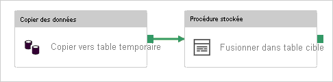

# <a name="copy-and-transform-data-in-azure-sql-database-by-using-azure-data-factory"></a>Copier et transformer des données dans Azure SQL Database à l’aide d’Azure Data Factory

> [!div class="op_single_selector" title1="Sélectionnez la version Azure Data Factory que vous utilisez :"]
>
> - [Version 1](v1/data-factory-azure-sql-connector.md)
> - [Version actuelle](connector-azure-sql-database.md)

[!INCLUDE[appliesto-adf-asa-md](includes/appliesto-adf-asa-md.md)]

Cet article indique comment utiliser l’activité de copie dans Azure Data Factory pour copier des données depuis et vers Azure SQL Database, et utiliser Data Flow pour transformer les données dans Azure SQL Database. Pour en savoir plus sur Azure Data Factory, lisez l’[article d’introduction](introduction.md).

## <a name="supported-capabilities"></a>Fonctionnalités prises en charge

Ce connecteur Azure SQL Database est pris en charge pour les activités suivantes :

- [Activité Copy](copy-activity-overview.md) avec tableau de [prise en charge de la matrice source/du récepteur](copy-activity-overview.md)
- [Mappage de flux de données](concepts-data-flow-overview.md)
- [Activité de recherche](control-flow-lookup-activity.md)
- [Activité GetMetadata](control-flow-get-metadata-activity.md)

Pour l’activité de copie, ce connecteur Azure SQL Database prend en charge les fonctions suivantes :

- Copie de données à l’aide de l’authentification SQL et de l’authentification du jeton de l’application Azure Active Directory (Azure AD) avec un principal de service ou l’identité managée pour les ressources Azure.
- En tant que source, la récupération de données à l’aide d’une requête SQL ou d’une procédure stockée. Vous pouvez également choisir de copier en parallèle à partir de la source Azure SQL Database. Pour plus d’informations, consultez la section [Copier en parallèle à partir de la base de données SQL](#parallel-copy-from-sql-database).
- En tant que récepteur, la création automatique de la table de destination si elle n’existe pas, en fonction du schéma source, l’ajout de données à une table ou l’appel d’une procédure stockée avec une logique personnalisée pendant la copie.

À savoir si vous utilisez le [niveau serverless](../azure-sql/database/serverless-tier-overview.md) d’Azure SQL Database : lorsque le serveur est en pause, l’exécution d’activité échoue au lieu d’attendre que la reprise automatique soit prête. Vous pouvez ajouter une nouvelle tentative d’activité ou chaîner des activités supplémentaires pour faire en sorte que le serveur soit opérationnel lors de l’exécution.

>[!NOTE]
> Azure SQL Database [Always Encrypted](/sql/relational-databases/security/encryption/always-encrypted-database-engine) n’est actuellement pas pris en charge par ce connecteur. Pour contourner ce problème, vous pouvez utiliser un [connecteur ODBC générique](connector-odbc.md) et un pilote SQL Server ODBC via un runtime d’intégration auto-hébergé. Pour en savoir plus, consultez la section [Utilisation d’Always Encrypted](#using-always-encrypted). 

> [!IMPORTANT]
> Si vous copiez des données à l’aide du runtime d’intégration Azure, configurez une [règle de pare-feu au niveau du serveur](../azure-sql/database/firewall-configure.md) de façon à ce que les services Azure puissent accéder au serveur.
> Si vous copiez des données à l’aide d’un runtime d’intégration auto-hébergé, configurez le pare-feu pour qu’il autorise la plage d’adresses IP appropriée. Cette plage inclut l’adresse IP de l’ordinateur utilisé pour se connecter à Azure SQL Database.

## <a name="get-started"></a>Bien démarrer

[!INCLUDE [data-factory-v2-connector-get-started](../../includes/data-factory-v2-connector-get-started.md)]

Les sections suivantes fournissent des informations détaillées sur les propriétés utilisées pour définir des entités Azure Data Factory propres à un connecteur Azure SQL Database.

## <a name="linked-service-properties"></a>Propriétés du service lié

Les propriétés prises en charge pour un service lié Azure SQL Database sont les suivantes :

| Propriété | Description | Obligatoire |
|:--- |:--- |:--- |
| type | La propriété **type** doit être définie sur **AzureSqlDatabase**. | Oui |
| connectionString | Spécifiez les informations requises pour la connexion à l’instance Azure SQL Database pour la propriété **connectionString**. <br/>Vous pouvez également placer un mot de passe ou une clé de principal de service dans Azure Key Vault. En cas d’authentification SQL, extrayez la configuration `password` de la chaîne de connexion. Pour plus d’informations, consultez l’exemple JSON figurant après le tableau et l’article [Stocker des informations d’identification dans Azure Key Vault](store-credentials-in-key-vault.md). | Oui |
| servicePrincipalId | Spécifiez l’ID client de l’application. | Oui, quand vous utilisez l’authentification Azure AD avec le principal de service. |
| servicePrincipalKey | Spécifiez la clé de l’application. Marquez ce champ en tant que **SecureString** afin de le stocker en toute sécurité dans Azure Data Factory, ou [référencez un secret stocké dans Azure Key Vault](store-credentials-in-key-vault.md). | Oui, quand vous utilisez l’authentification Azure AD avec le principal de service. |
| tenant | Spécifiez les informations de locataire, comme le nom de domaine ou l’ID de locataire, dans lequel votre application se trouve. Récupérez-les en pointant la souris dans le coin supérieur droit du Portail Azure. | Oui, quand vous utilisez l’authentification Azure AD avec le principal de service. |
| azureCloudType | Pour l'authentification du principal de service, spécifiez le type d'environnement cloud Azure auquel votre application Azure AD est inscrite. <br/> Les valeurs autorisées sont **AzurePublic**, **AzureChina**, **AzureUsGovernment** et **AzureGermany**. Par défaut, l’environnement cloud de la fabrique de données est utilisé. | Non |
| connectVia | Ce [runtime d'intégration](concepts-integration-runtime.md) permet de se connecter au magasin de données. Vous pouvez utiliser le runtime d’intégration Azure ou un runtime d’intégration auto-hébergé si votre banque de données se trouve sur un réseau privé. À défaut de spécification, l’Azure Integration Runtime par défaut est utilisé. | Non |

Pour en savoir plus sur les autres types d’authentification, consultez les sections suivantes sur les prérequis et les exemples JSON, respectivement :

- [Authentification SQL](#sql-authentication)
- [Authentification par jeton d’application Azure AD : Principal du service](#service-principal-authentication)
- [Authentification par jeton d’application Azure AD : Identités managées pour les ressources Azure](#managed-identity)

>[!TIP]
>Si vous rencontrez une erreur avec le code d’erreur « UserErrorFailedToConnectToSqlServer » et un message tel que « La limite de session de la base de données XXX a été atteinte », ajoutez `Pooling=false` à votre chaîne de connexion, puis réessayez.

### <a name="sql-authentication"></a>Authentification SQL

**Exemple : utilisation de l’authentification SQL**

```json
{
    "name": "AzureSqlDbLinkedService",
    "properties": {
        "type": "AzureSqlDatabase",
        "typeProperties": {
            "connectionString": "Data Source=tcp:<servername>.database.windows.net,1433;Initial Catalog=<databasename>;User ID=<username>@<servername>;Password=<password>;Trusted_Connection=False;Encrypt=True;Connection Timeout=30"
        },
        "connectVia": {
            "referenceName": "<name of Integration Runtime>",
            "type": "IntegrationRuntimeReference"
        }
    }
}
```

**Exemple : mot de passe dans Azure Key Vault**

```json
{
    "name": "AzureSqlDbLinkedService",
    "properties": {
        "type": "AzureSqlDatabase",
        "typeProperties": {
            "connectionString": "Data Source=tcp:<servername>.database.windows.net,1433;Initial Catalog=<databasename>;User ID=<username>@<servername>;Trusted_Connection=False;Encrypt=True;Connection Timeout=30",
            "password": {
                "type": "AzureKeyVaultSecret",
                "store": {
                    "referenceName": "<Azure Key Vault linked service name>",
                    "type": "LinkedServiceReference"
                },
                "secretName": "<secretName>"
            }
        },
        "connectVia": {
            "referenceName": "<name of Integration Runtime>",
            "type": "IntegrationRuntimeReference"
        }
    }
}
```

### <a name="service-principal-authentication"></a>Authentification d’un principal du service

Pour utiliser l’authentification du jeton d’application Azure AD basée sur le principal de service, effectuez les étapes suivantes :

1. [Créez une application Azure Active Directory](../active-directory/develop/howto-create-service-principal-portal.md#register-an-application-with-azure-ad-and-create-a-service-principal) dans le Portail Azure. Prenez note du nom de l’application et des valeurs suivantes qui définissent le service lié :

    - ID de l'application
    - Clé de l'application
    - ID client

2. [Approvisionnez un administrateur Azure Active Directory](../azure-sql/database/authentication-aad-configure.md#provision-azure-ad-admin-sql-database) pour votre serveur sur le portail Azure, si ce n’est pas déjà fait. L’administrateur Azure AD doit être un utilisateur Azure AD ou un groupe Azure AD, mais il ne doit pas s’agir d’un principal de service. Vous devez effectuer cette étape pour qu’à l’étape suivante vous puissiez utiliser une identité Azure AD pour créer un utilisateur de base de données autonome pour le principal de service.

3. [Créez des utilisateurs de base de données autonome](../azure-sql/database/authentication-aad-configure.md#create-contained-users-mapped-to-azure-ad-identities) pour le principal de service. Connectez-vous à la base de données vers ou à partir de laquelle vous souhaitez copier des données à l’aide d’outils tels que SQL Server Management Studio, avec une identité Azure AD qui a au moins l’autorisation ALTER ANY USER. Exécutez la commande T-SQL suivante :
  
    ```sql
    CREATE USER [your application name] FROM EXTERNAL PROVIDER;
    ```

4. Accordez les autorisations requises par le principal de service comme vous le feriez d’habitude pour des utilisateurs SQL ou autres. Exécutez le code suivant. Pour plus d’options, consultez [ce document](/sql/relational-databases/system-stored-procedures/sp-addrolemember-transact-sql).

    ```sql
    ALTER ROLE [role name] ADD MEMBER [your application name];
    ```

5. Dans Azure Data Factory, configurez un service lié Azure SQL Database.

#### <a name="linked-service-example-that-uses-service-principal-authentication"></a>Exemple de service lié qui utilise l’authentification du principal de service

```json
{
    "name": "AzureSqlDbLinkedService",
    "properties": {
        "type": "AzureSqlDatabase",
        "typeProperties": {
            "connectionString": "Data Source=tcp:<servername>.database.windows.net,1433;Initial Catalog=<databasename>;Connection Timeout=30",
            "servicePrincipalId": "<service principal id>",
            "servicePrincipalKey": {
                "type": "SecureString",
                "value": "<service principal key>"
            },
            "tenant": "<tenant info, e.g. microsoft.onmicrosoft.com>"
        },
        "connectVia": {
            "referenceName": "<name of Integration Runtime>",
            "type": "IntegrationRuntimeReference"
        }
    }
}
```

### <a name="managed-identities-for-azure-resources-authentication"></a><a name="managed-identity"></a> Identités managées pour authentifier les ressources Azure

Une fabrique de données peut être associée à une [identité managée pour les ressources Azure](data-factory-service-identity.md), laquelle représente cette même fabrique de données. Vous pouvez utiliser cette identité managée pour l’authentification Azure SQL Database. La fabrique en question peut accéder à votre base de données et copier des données depuis ou vers celle-ci à l’aide de cette identité.

Pour utiliser l’authentification par identité managée, effectuez les étapes suivantes.

1. [Approvisionnez un administrateur Azure Active Directory](../azure-sql/database/authentication-aad-configure.md#provision-azure-ad-admin-sql-database) pour votre serveur sur le portail Azure, si ce n’est pas déjà fait. L’administrateur Azure AD peut être un utilisateur Azure AD ou un groupe Azure AD. Si vous accordez au groupe avec identité managée un rôle d’administrateur, ignorez les étapes 3 et 4. L’administrateur dispose d’un accès complet à la base de données.

2. [Créer des utilisateurs de base de données autonome](../azure-sql/database/authentication-aad-configure.md#create-contained-users-mapped-to-azure-ad-identities) pour l’identité managée d’Azure Data Factory. Connectez-vous à la base de données vers ou à partir de laquelle vous souhaitez copier des données à l’aide d’outils tels que SQL Server Management Studio, avec une identité Azure AD qui a au moins l’autorisation ALTER ANY USER. Exécutez la commande T-SQL suivante :
  
    ```sql
    CREATE USER [your Data Factory name] FROM EXTERNAL PROVIDER;
    ```

3. Accordez les autorisations requises par l’identité managée Data Factory comme vous le feriez d’habitude pour des utilisateurs SQL et autres. Exécutez le code suivant. Pour plus d’options, consultez [ce document](/sql/relational-databases/system-stored-procedures/sp-addrolemember-transact-sql).

    ```sql
    ALTER ROLE [role name] ADD MEMBER [your Data Factory name];
    ```

4. Dans Azure Data Factory, configurez un service lié Azure SQL Database.

**Exemple**

```json
{
    "name": "AzureSqlDbLinkedService",
    "properties": {
        "type": "AzureSqlDatabase",
        "typeProperties": {
            "connectionString": "Data Source=tcp:<servername>.database.windows.net,1433;Initial Catalog=<databasename>;Connection Timeout=30"
        },
        "connectVia": {
            "referenceName": "<name of Integration Runtime>",
            "type": "IntegrationRuntimeReference"
        }
    }
}
```

## <a name="dataset-properties"></a>Propriétés du jeu de données

Pour obtenir la liste complète des sections et propriétés disponibles pour la définition de jeux de données, consultez l’article consacré aux [jeux de données](./concepts-datasets-linked-services.md).

Les propriétés prises en charge pour le jeu de données Azure SQL Database sont les suivantes :

| Propriété | Description | Obligatoire |
|:--- |:--- |:--- |
| type | La propriété **type** du jeu de données doit être définie sur **AzureSqlTable**. | Oui |
| schéma | Nom du schéma. |Non pour Source, Oui pour Récepteur  |
| table | Nom de la table/vue. |Non pour Source, Oui pour Récepteur  |
| tableName | Nom de la table/vue avec schéma. Cette propriété est prise en charge pour la compatibilité descendante. Pour les nouvelles charges de travail, utilisez `schema` et `table`. | Non pour Source, Oui pour Récepteur |

### <a name="dataset-properties-example"></a>Exemple de propriétés du jeu de données

```json
{
    "name": "AzureSQLDbDataset",
    "properties":
    {
        "type": "AzureSqlTable",
        "linkedServiceName": {
            "referenceName": "<Azure SQL Database linked service name>",
            "type": "LinkedServiceReference"
        },
        "schema": [ < physical schema, optional, retrievable during authoring > ],
        "typeProperties": {
            "schema": "<schema_name>",
            "table": "<table_name>"
        }
    }
}
```

## <a name="copy-activity-properties"></a>Propriétés de l’activité de copie

Pour obtenir la liste complète des sections et propriétés disponibles pour la définition des activités, consultez [Pipelines](concepts-pipelines-activities.md). Cette section fournit la liste des propriétés prises en charge par Azure SQL Database en tant que source et récepteur.

### <a name="azure-sql-database-as-the-source"></a>Azure SQL Database en tant que source

>[!TIP]
>Pour savoir comment charger efficacement des données à partir d’Azure SQL Database à l’aide du partitionnement des données, consultez [Copier en parallèle à partir de la base de données SQL](#parallel-copy-from-sql-database).

Pour copier des données à partir d’Azure SQL Database, les propriétés suivantes sont prises en charge dans la section **source** de l’activité de copie :

| Propriété | Description | Obligatoire |
|:--- |:--- |:--- |
| type | La propriété de **type** de la source d’activité de copie doit être définie sur **AzureSqlSource**. Le type « SqlSource » est toujours pris en charge à des fins de compatibilité descendante. | Oui |
| sqlReaderQuery | Cette propriété utilise la requête SQL personnalisée pour lire les données. par exemple `select * from MyTable`. | Non |
| sqlReaderStoredProcedureName | Nom de la procédure stockée qui lit les données de la table source. La dernière instruction SQL doit être une instruction SELECT dans la procédure stockée. | Non |
| storedProcedureParameters | Paramètres de la procédure stockée.<br/>Les valeurs autorisées sont des paires de noms ou de valeurs. Les noms et la casse des paramètres doivent correspondre aux noms et à la casse des paramètres de procédure stockée. | Non |
| isolationLevel | Spécifie le comportement de verrouillage des transactions pour la source SQL. Les valeurs autorisées sont les suivantes : **ReadCommitted**, **ReadUncommitted**, **RepeatableRead**, **Serializable**, **Snapshot**. S’il n’est pas spécifié, le niveau d’isolation par défaut de la base de données est utilisé. Pour plus d’informations, consultez [ce document](/dotnet/api/system.data.isolationlevel). | Non |
| partitionOptions | Spécifie les options de partitionnement des données utilisées pour charger des données à partir d’Azure SQL Database. <br>Les valeurs autorisées sont les suivantes : **None** (valeur par défaut), **PhysicalPartitionsOfTable** et **DynamicRange**.<br>Lorsqu’une option de partition est activée (autrement dit, pas `None`), le degré de parallélisme pour charger simultanément des données à partir d’une instance Azure SQL Database est contrôlé par le paramètre [`parallelCopies`](copy-activity-performance-features.md#parallel-copy) de l’activité de copie. | Non |
| partitionSettings | Spécifiez le groupe de paramètres pour le partitionnement des données. <br>S’applique lorsque l’option de partitionnement n’est pas `None`. | Non |
| ***Sous `partitionSettings`:*** | | |
| partitionColumnName | Spécifiez le nom de la colonne source **en type entier ou date/DateHeure** (`int`, `smallint`, `bigint`, `date`, `smalldatetime`, `datetime`, `datetime2` ou `datetimeoffset`) qu’utilisera le partitionnement par plages de valeurs pour la copie en parallèle. S’il n’est pas spécifié, l’index ou la clé primaire de la table seront automatiquement détectés et utilisés en tant que colonne de partition.<br>S’applique lorsque l’option de partitionnement est `DynamicRange`. Si vous utilisez une requête pour récupérer des données sources, utilisez `?AdfDynamicRangePartitionCondition ` dans la clause WHERE. Pour obtenir un exemple, consultez la section [Copier en parallèle à partir de la base de données SQL](#parallel-copy-from-sql-database). | Non |
| partitionUpperBound | Valeur maximale de la colonne de partition pour le fractionnement de la plage de partition. Cette valeur est utilisée pour décider du stride de la partition, et non pour filtrer les lignes de la table. Toutes les lignes de la table ou du résultat de la requête seront partitionnées et copiées. Si la valeur n’est pas spécifiée, l’activité de copie la détecte automatiquement.  <br>S’applique lorsque l’option de partitionnement est `DynamicRange`. Pour obtenir un exemple, consultez la section [Copier en parallèle à partir de la base de données SQL](#parallel-copy-from-sql-database). | Non |
| partitionLowerBound | Valeur minimale de la colonne de partition pour le fractionnement de la plage de partition. Cette valeur est utilisée pour décider du stride de la partition, et non pour filtrer les lignes de la table. Toutes les lignes de la table ou du résultat de la requête seront partitionnées et copiées. Si la valeur n’est pas spécifiée, l’activité de copie la détecte automatiquement.<br>S’applique lorsque l’option de partitionnement est `DynamicRange`. Pour obtenir un exemple, consultez la section [Copier en parallèle à partir de la base de données SQL](#parallel-copy-from-sql-database). | Non |

**Notez les points suivants :**

- Si **sqlReaderQuery** est spécifié pour **AzureSqlSource**, l’activité de copie exécute cette requête sur la source Azure SQL Database pour obtenir les données. Vous pouvez également spécifier une procédure stockée en spécifiant **sqlReaderStoredProcedureName** et **storedProcedureParameters** si la procédure stockée accepte des paramètres.
- Lorsque vous utilisez une procédure stockée dans la source pour récupérer des données, sachez que si votre procédure stockée est conçue pour renvoyer un schéma différent quand une valeur de paramètre différente est entrée, vous risquez d’échouer ou d’obtenir un résultat inattendu lors de l’importation d’un schéma à partir de l’interface utilisateur ou lors de la copie de données dans la base de données SQL avec création de table automatique.

#### <a name="sql-query-example"></a>Exemple de requête SQL

```json
"activities":[
    {
        "name": "CopyFromAzureSQLDatabase",
        "type": "Copy",
        "inputs": [
            {
                "referenceName": "<Azure SQL Database input dataset name>",
                "type": "DatasetReference"
            }
        ],
        "outputs": [
            {
                "referenceName": "<output dataset name>",
                "type": "DatasetReference"
            }
        ],
        "typeProperties": {
            "source": {
                "type": "AzureSqlSource",
                "sqlReaderQuery": "SELECT * FROM MyTable"
            },
            "sink": {
                "type": "<sink type>"
            }
        }
    }
]
```

#### <a name="stored-procedure-example"></a>Exemple de procédure stockée

```json
"activities":[
    {
        "name": "CopyFromAzureSQLDatabase",
        "type": "Copy",
        "inputs": [
            {
                "referenceName": "<Azure SQL Database input dataset name>",
                "type": "DatasetReference"
            }
        ],
        "outputs": [
            {
                "referenceName": "<output dataset name>",
                "type": "DatasetReference"
            }
        ],
        "typeProperties": {
            "source": {
                "type": "AzureSqlSource",
                "sqlReaderStoredProcedureName": "CopyTestSrcStoredProcedureWithParameters",
                "storedProcedureParameters": {
                    "stringData": { "value": "str3" },
                    "identifier": { "value": "$$Text.Format('{0:yyyy}', <datetime parameter>)", "type": "Int"}
                }
            },
            "sink": {
                "type": "<sink type>"
            }
        }
    }
]
```

### <a name="stored-procedure-definition"></a>Définition de la procédure stockée

```sql
CREATE PROCEDURE CopyTestSrcStoredProcedureWithParameters
(
    @stringData varchar(20),
    @identifier int
)
AS
SET NOCOUNT ON;
BEGIN
     select *
     from dbo.UnitTestSrcTable
     where dbo.UnitTestSrcTable.stringData != stringData
    and dbo.UnitTestSrcTable.identifier != identifier
END
GO
```

### <a name="azure-sql-database-as-the-sink"></a>Azure SQL Database en tant que récepteur

> [!TIP]
> Pour en savoir plus sur les meilleures pratiques, les configurations et les comportements d’écriture pris en charge, consultez l’article [Meilleures pratiques de chargement de données dans Azure SQL Database](#best-practice-for-loading-data-into-azure-sql-database).

Pour copier des données vers Azure SQL Database, les propriétés suivantes sont prises en charge dans la section **sink** de l’activité de copie :

| Propriété | Description | Obligatoire |
|:--- |:--- |:--- |
| type | La propriété de **type** du récepteur d’activité de copie doit être définie sur **AzureSqlSink**. Le type « SqlSink » est toujours pris en charge à des fins de compatibilité descendante. | Oui |
| preCopyScript | Spécifiez une requête SQL pour l’activité de copie à exécuter avant l’écriture de données dans Azure SQL Database. Elle n'est appelée qu'une seule fois par copie. Utilisez cette propriété pour nettoyer les données préchargées. | Non |
| tableOption | Spécifie si [la table du récepteur doit être créée automatiquement](copy-activity-overview.md#auto-create-sink-tables) si elle n’existe pas en fonction du schéma source. <br>La création automatique de la table n’est pas prise en charge quand le récepteur spécifie une procédure stockée. <br>Les valeurs autorisées sont `none` (par défaut) et `autoCreate`. | Non |
| sqlWriterStoredProcedureName | Nom de la procédure stockée qui définit comment appliquer des données sources dans une table cible. <br/>Cette procédure stockée est *appelée par lot*. Pour les opérations qui ne s’exécutent qu’une seule fois et qui n’ont rien à voir avec les données sources (par exemple, supprimer ou tronquer), utilisez la propriété `preCopyScript`.<br>Voir l’exemple dans la section [Appel d’une procédure stockée à partir d’un récepteur SQL](#invoke-a-stored-procedure-from-a-sql-sink). | Non |
| storedProcedureTableTypeParameterName |Nom du paramètre du type de table spécifié dans la procédure stockée.  |Non |
| sqlWriterTableType |Nom du type de table à utiliser dans la procédure stockée. L'activité de copie rend les données déplacées disponibles dans une table temporaire avec ce type de table. Le code de procédure stockée peut ensuite fusionner les données copiées avec les données existantes. |Non |
| storedProcedureParameters |Paramètres de la procédure stockée.<br/>Les valeurs autorisées sont des paires de noms et de valeurs. Les noms et la casse des paramètres doivent correspondre aux noms et à la casse des paramètres de la procédure stockée. | Non |
| writeBatchSize | Nombre de lignes à insérer dans la table SQL *par lot*.<br/> La valeur autorisée est **integer** (nombre de lignes). Par défaut, Azure Data Factory détermine de façon dynamique la taille de lot appropriée en fonction de la taille de ligne. | Non |
| writeBatchTimeout | Temps d’attente pour que l’opération d’insertion de lot soit terminée avant d’expirer.<br/> La valeur autorisée est **timespan**. Par exemple : « 00:30:00 » (30 minutes). | Non |
| disableMetricsCollection | Data Factory collecte des métriques telles que les DTU Azure SQL Database pour effectuer des suggestions et l’optimisation des performances de copie, introduisant un accès de base de données master supplémentaire. Si ce comportement vous préoccupe, spécifiez `true` pour le désactiver. | Non (la valeur par défaut est `false`) |

**Exemple 1 : Ajout de données**

```json
"activities":[
    {
        "name": "CopyToAzureSQLDatabase",
        "type": "Copy",
        "inputs": [
            {
                "referenceName": "<input dataset name>",
                "type": "DatasetReference"
            }
        ],
        "outputs": [
            {
                "referenceName": "<Azure SQL Database output dataset name>",
                "type": "DatasetReference"
            }
        ],
        "typeProperties": {
            "source": {
                "type": "<source type>"
            },
            "sink": {
                "type": "AzureSqlSink",
                "tableOption": "autoCreate",
                "writeBatchSize": 100000
            }
        }
    }
]
```

**Exemple 2 : Appeler une procédure stockée pendant la copie**

Pour en savoir plus, consultez [Appel d'une procédure stockée à partir d'un récepteur SQL](#invoke-a-stored-procedure-from-a-sql-sink).

```json
"activities":[
    {
        "name": "CopyToAzureSQLDatabase",
        "type": "Copy",
        "inputs": [
            {
                "referenceName": "<input dataset name>",
                "type": "DatasetReference"
            }
        ],
        "outputs": [
            {
                "referenceName": "<Azure SQL Database output dataset name>",
                "type": "DatasetReference"
            }
        ],
        "typeProperties": {
            "source": {
                "type": "<source type>"
            },
            "sink": {
                "type": "AzureSqlSink",
                "sqlWriterStoredProcedureName": "CopyTestStoredProcedureWithParameters",
                "storedProcedureTableTypeParameterName": "MyTable",
                "sqlWriterTableType": "MyTableType",
                "storedProcedureParameters": {
                    "identifier": { "value": "1", "type": "Int" },
                    "stringData": { "value": "str1" }
                }
            }
        }
    }
]
```

## <a name="parallel-copy-from-sql-database"></a>Copier en parallèle à partir de la base de données SQL

Le connecteur Azure SQL Database dans l’activité de copie propose un partitionnement de données intégré pour copier des données en parallèle. Vous trouverez des options de partitionnement de données dans l’onglet **Source** de l’activité de copie.


Lorsque vous activez la copie partitionnée, l’activité de copie exécute des requêtes en parallèle sur votre source Azure SQL Database pour charger des données par partitions. Le degré de parallélisme est contrôlé via le paramètre [`parallelCopies`](copy-activity-performance-features.md#parallel-copy) sur l’activité de copie. Par exemple, si vous définissez `parallelCopies` sur la valeur quatre, Data Factory génère et exécute simultanément quatre requêtes selon l’option de partition et les paramètres que vous avez spécifiés, chacune récupérant des données à partir de votre instance Azure SQL Database.

Il vous est recommandé d’activer la copie en parallèle avec partitionnement des données notamment lorsque vous chargez une grande quantité de données à partir de votre instance Azure SQL Database. Voici quelques suggestions de configurations pour différents scénarios. Lors de la copie de données dans un magasin de données basé sur un fichier, il est recommandé d’écrire les données dans un dossier sous la forme de plusieurs fichiers (spécifiez uniquement le nom du dossier). Les performances seront meilleures qu’avec l’écriture de données dans un seul fichier.

| Scénario                                                     | Paramètres suggérés                                           |
| ------------------------------------------------------------ | ------------------------------------------------------------ |
| Chargement complet à partir d’une table volumineuse, avec des partitions physiques.        | **Option de partition** : Partitions physiques de la table. <br><br/>Lors de l’exécution, Data Factory détecte automatiquement les partitions physiques et copie les données par partitions. <br><br/>Pour vérifier si votre table possède, ou non, une partition physique, vous pouvez vous reporter à [cette requête](#sample-query-to-check-physical-partition). |
| Chargement complet d’une table volumineuse, sans partitions physiques, avec une colonne d’entiers ou DateHeure pour le partitionnement des données. | **Options de partition** : Partition dynamique par spécification de plages de valeurs.<br>**Colonne de partition** (facultatif) : Spécifiez la colonne utilisée pour partitionner les données. Si la valeur n’est pas spécifiée, la colonne de l’index ou de la clé primaire est utilisée.<br/>**Limite supérieure de partition** et **limite inférieure de partition** (facultatif) : Spécifiez si vous souhaitez déterminer le stride de la partition. Cela ne permet pas de filtrer les lignes de la table ; toutes les lignes de la table sont partitionnées et copiées. Si les valeurs ne sont pas spécifiées, l’activité de copie les détecte automatiquement.<br><br>Par exemple, si les valeurs de la colonne de partition « ID » sont comprises entre 1 et 100, et que vous définissez la limite inférieure à 20 et la limite supérieure à 80, avec la copie parallèle sur 4, Data Factory récupère des données par 4 partitions, les ID dans la plage <=20, [21, 50], [51, 80] et >=81, respectivement. |
| Chargement d’une grande quantité de données à l’aide d’une requête personnalisée, sans partitions physiques, et avec une colonne d’entiers ou de date/DateHeure pour le partitionnement des données. | **Options de partition** : Partition dynamique par spécification de plages de valeurs.<br>**Requête**: `SELECT * FROM <TableName> WHERE ?AdfDynamicRangePartitionCondition AND <your_additional_where_clause>`.<br>**Colonne de partition** : Spécifiez la colonne utilisée pour partitionner les données.<br>**Limite supérieure de partition** et **limite inférieure de partition** (facultatif) : Spécifiez si vous souhaitez déterminer le stride de la partition. Cela ne permet pas de filtrer les lignes de la table ; toutes les lignes du résultat de la requête sont partitionnées et copiées. Si la valeur n’est pas spécifiée, l’activité de copie la détecte automatiquement.<br><br>Lors de l’exécution, Data Factory remplace `?AdfRangePartitionColumnName` par le nom réel de la colonne et les plages de valeurs de chaque partition, et les envoie à Azure SQL Database. <br>Par exemple, si les valeurs de la colonne de partition « ID » sont comprises entre 1 et 100, et que vous définissez la limite inférieure à 20 et la limite supérieure à 80, avec la copie parallèle sur 4, Data Factory récupère des données par 4 partitions, les ID dans la plage <=20, [21, 50], [51, 80] et >=81, respectivement. <br><br>Voici d’autres exemples de requêtes pour différents scénarios :<br> 1. Interroger l’ensemble de la table : <br>`SELECT * FROM <TableName> WHERE ?AdfDynamicRangePartitionCondition`<br> 2. Interroger une table avec une sélection de colonnes et des filtres de la clause WHERE supplémentaires : <br>`SELECT <column_list> FROM <TableName> WHERE ?AdfDynamicRangePartitionCondition AND <your_additional_where_clause>`<br> 3. Effectuer une requête avec des sous-requêtes : <br>`SELECT <column_list> FROM (<your_sub_query>) AS T WHERE ?AdfDynamicRangePartitionCondition AND <your_additional_where_clause>`<br> 4. Effectuer une requête avec une partition dans une sous-requête : <br>`SELECT <column_list> FROM (SELECT <your_sub_query_column_list> FROM <TableName> WHERE ?AdfDynamicRangePartitionCondition) AS T`
|

Meilleures pratiques pour charger des données avec l’option de partition :

1. Choisissez une colonne distinctive comme colonne de partition (p. ex. : clé primaire ou clé unique) pour éviter l’asymétrie des données. 
2. Si la table possède une partition intégrée, utilisez l’option de partition « Partitions physiques de la table » pour obtenir de meilleures performances.    
3. Si vous utilisez Azure Integration Runtime pour copier des données, vous pouvez définir des « [unités d’intégration de données (DIU)](copy-activity-performance-features.md#data-integration-units) » plus grandes (>4) pour utiliser davantage de ressources de calcul. Vérifiez les scénarios applicables ici.
4. Le « [degré de parallélisme de copie](copy-activity-performance-features.md#parallel-copy) » contrôle le nombre de partitions : un nombre trop élevé nuit parfois aux performances. Il est recommandé de définir ce nombre selon (DIU ou nombre de nœuds d'IR auto-hébergé) * (2 à 4).

**Exemple : chargement complet à partir d’une table volumineuse, avec des partitions physiques**

```json
"source": {
    "type": "AzureSqlSource",
    "partitionOption": "PhysicalPartitionsOfTable"
}
```

**Exemple : requête avec partition dynamique par spécification de plages de valeurs**

```json
"source": {
    "type": "AzureSqlSource",
    "query": "SELECT * FROM <TableName> WHERE ?AdfDynamicRangePartitionCondition AND <your_additional_where_clause>",
    "partitionOption": "DynamicRange",
    "partitionSettings": {
        "partitionColumnName": "<partition_column_name>",
        "partitionUpperBound": "<upper_value_of_partition_column (optional) to decide the partition stride, not as data filter>",
        "partitionLowerBound": "<lower_value_of_partition_column (optional) to decide the partition stride, not as data filter>"
    }
}
```

### <a name="sample-query-to-check-physical-partition"></a>Exemple de requête pour vérifier une partition physique

```sql
SELECT DISTINCT s.name AS SchemaName, t.name AS TableName, pf.name AS PartitionFunctionName, c.name AS ColumnName, iif(pf.name is null, 'no', 'yes') AS HasPartition
FROM sys.tables AS t
LEFT JOIN sys.objects AS o ON t.object_id = o.object_id
LEFT JOIN sys.schemas AS s ON o.schema_id = s.schema_id
LEFT JOIN sys.indexes AS i ON t.object_id = i.object_id 
LEFT JOIN sys.index_columns AS ic ON ic.partition_ordinal > 0 AND ic.index_id = i.index_id AND ic.object_id = t.object_id 
LEFT JOIN sys.columns AS c ON c.object_id = ic.object_id AND c.column_id = ic.column_id 
LEFT JOIN sys.partition_schemes ps ON i.data_space_id = ps.data_space_id 
LEFT JOIN sys.partition_functions pf ON pf.function_id = ps.function_id 
WHERE s.name='[your schema]' AND t.name = '[your table name]'
```

Si la table a une partition physique, vous voyez « HasPartition » avec la valeur « yes » (oui) comme suit.


## <a name="best-practice-for-loading-data-into-azure-sql-database"></a>Meilleures pratiques de chargement de données dans Azure SQL Data

Lors de la copie de données dans Azure SQL Database, vous pourriez avoir besoin d’un comportement d’écriture différent :

- [Append](#append-data): Mes données sources contiennent uniquement de nouveaux enregistrements.
- [Upsert](#upsert-data) : Mes données sources contiennent à la fois des insertions et des mises à jour.
- [Remplacer](#overwrite-the-entire-table) : Je veux recharger une table de dimension entière à chaque fois.
- [Écrire avec une logique personnalisée](#write-data-with-custom-logic) : J’ai besoin d’un traitement supplémentaire avant l’insertion finale dans la table de destination.

Reportez-vous aux sections correspondantes pour savoir comment configurer cela dans Azure Data Factory et pour connaître les meilleures pratiques associées.

### <a name="append-data"></a>Ajout de données

L’ajout de données est le comportement par défaut de ce connecteur de récepteur Azure SQL Database. Azure Data Factory effectue une insertion en bloc pour écrire efficacement dans votre table. Vous pouvez configurer la source et le récepteur en conséquence dans l’activité de copie.

### <a name="upsert-data"></a>Effectuer un upsert de données

**Option 1 :** Lorsque vous avez une grande quantité de données à copier, vous pouvez charger en masse tous les enregistrements dans une table de mise en lots à l’aide de l’activité de copie, puis exécuter une activité de procédure stockée pour appliquer une instruction [MERGE](/sql/t-sql/statements/merge-transact-sql) ou INSERT/UPDATE en une seule fois. 

Actuellement, l’activité de copie ne prend pas en charge en mode natif le chargement des données dans une table temporaire de base de données. Un moyen avancé permet de le mettre en place en combinant plusieurs activités, reportez-vous à l’[optimisation des scénarios d’upserts en masse Azure SQL Database (en anglais)](https://github.com/scoriani/azuresqlbulkupsert). Vous trouverez ci-dessous un exemple d’utilisation d’une table permanente comme mise en lots.

Par exemple, dans Azure Data Factory, vous pouvez créer un pipeline avec une **activité de copie** chaînée avec une **activité de procédure stockée**. La première activité copie des données de votre banque source vers une table de mise en lots Azure SQL Database, par exemple **UpsertStagingTable**, comme nom de table dans le jeu de données. La seconde activité appelle ensuite une procédure stockée pour fusionner les données sources de la table de mise en lots vers la table cible et nettoyer la table de mise en lots.



Dans votre base de données, définissez une procédure stockée avec la logique MERGE, comme dans l’exemple suivant, qui est pointée à partir de l’activité de procédure stockée précédente. Supposons que la cible est la table **Marketing** comportant trois colonnes : **ProfileID**, **State** et **Category**. Effectuez l’opération d’upsert sur la colonne **ProfileID**.

```sql
CREATE PROCEDURE [dbo].[spMergeData]
AS
BEGIN
   MERGE TargetTable AS target
   USING UpsertStagingTable AS source
   ON (target.[ProfileID] = source.[ProfileID])
   WHEN MATCHED THEN
      UPDATE SET State = source.State
    WHEN NOT matched THEN
       INSERT ([ProfileID], [State], [Category])
      VALUES (source.ProfileID, source.State, source.Category);
    TRUNCATE TABLE UpsertStagingTable
END
```

**Option 2 :** Vous pouvez choisir d’[appeler une procédure stockée dans l’activité de copie](#invoke-a-stored-procedure-from-a-sql-sink). Cette approche exécute chaque lot (tel que gouverné par la propriété `writeBatchSize`) de la table source au lieu d’utiliser l’insertion en bloc comme approche par défaut dans l’activité de copie.

**Option 3** : Vous pouvez utiliser le [flux de données de mappage](#sink-transformation) qui offre des méthodes intégrées d’insertion, d’upsert et de mise à jour.

### <a name="overwrite-the-entire-table"></a>Remplacer l’intégralité de la table

Vous pouvez configurer la propriété **preCopyScript** dans le récepteur de l’activité de copie. Dans le cas présent, pour chaque activité de copie qui s’exécute, Azure Data Factory exécute d’abord le script. Il exécute ensuite la copie pour insérer les données. Par exemple, pour remplacer l’intégralité de la table par les données les plus récentes, spécifiez un script pour d’abord supprimer tous les enregistrements avant de charger en bloc les nouvelles données à partir de la source.

### <a name="write-data-with-custom-logic"></a>Écrire des données avec une logique personnalisée

Les étapes permettant d’écrire des données à l’aide d’une logique personnalisée sont semblables à celles décrites dans la section [Effectuer un upsert de données](#upsert-data). Lorsque vous devez appliquer un traitement supplémentaire avant l’insertion finale des données sources dans la table de destination, vous pouvez charger une table de mise en lots et appeler une activité de procédure stockée, appeler une procédure stockée dans le récepteur de l’activité de copie pour appliquer les données ou utiliser le flux de données de mappage.

## <a name="invoke-a-stored-procedure-from-a-sql-sink"></a><a name="invoke-a-stored-procedure-from-a-sql-sink"></a> Appel d'une procédure stockée à partir d'un récepteur SQL

Quand vous copiez des données dans Azure SQL Database, vous pouvez également configurer et appeler une procédure stockée spécifiée par l’utilisateur avec des paramètres supplémentaires sur chaque lot de la table source. La fonction de procédure stockée tire parti des [paramètres table](/dotnet/framework/data/adonet/sql/table-valued-parameters).

Vous pouvez utiliser une procédure stockée à la place des mécanismes de copie intégrée. Par exemple, quand vous souhaitez appliquer un traitement supplémentaire avant l’insertion finale de données sources dans la table de destination. Fusionner des colonnes, rechercher des valeurs supplémentaires et effectuer des insertions dans plusieurs tables sont des exemples de traitement supplémentaire.

L’exemple suivant montre comment utiliser une procédure stockée pour effectuer une opération upsert dans une table Azure SQL Database. Supposons que les données d’entrée et la table réceptrice **Marketing** ont trois colonnes : **ProfileID**, **State** et **Category**. Effectuez l’opération upsert basée sur la colonne **ProfileID** et appliquez-la uniquement à une catégorie spécifique appelée « ProductA ».

1. Dans votre base de données, définissez le type de table avec le même nom que **sqlWriterTableType**. Le schéma du type de table doit être identique au schéma retourné par vos données d'entrée.

    ```sql
    CREATE TYPE [dbo].[MarketingType] AS TABLE(
        [ProfileID] [varchar](256) NOT NULL,
        [State] [varchar](256) NOT NULL,
        [Category] [varchar](256) NOT NULL
    )
    ```

2. Dans votre base de données, définissez la procédure stockée portant le même nom que **sqlWriterStoredProcedureName**. Elle gère les données d’entrée à partir de la source que vous avez spécifiée et les fusionne dans la table de sortie. Le nom de paramètre du type de table de la procédure stockée doit être identique au **tableName** défini dans le jeu de données.

    ```sql
    CREATE PROCEDURE spOverwriteMarketing @Marketing [dbo].[MarketingType] READONLY, @category varchar(256)
    AS
    BEGIN
    MERGE [dbo].[Marketing] AS target
    USING @Marketing AS source
    ON (target.ProfileID = source.ProfileID and target.Category = @category)
    WHEN MATCHED THEN
        UPDATE SET State = source.State
    WHEN NOT MATCHED THEN
        INSERT (ProfileID, State, Category)
        VALUES (source.ProfileID, source.State, source.Category);
    END
    ```

3. Dans Azure Data Factory, définissez la section **Récepteur SQL** de l’activité de copie comme suit :

    ```json
    "sink": {
        "type": "AzureSqlSink",
        "sqlWriterStoredProcedureName": "spOverwriteMarketing",
        "storedProcedureTableTypeParameterName": "Marketing",
        "sqlWriterTableType": "MarketingType",
        "storedProcedureParameters": {
            "category": {
                "value": "ProductA"
            }
        }
    }
    ```

## <a name="mapping-data-flow-properties"></a>Propriétés du mappage de flux de données

Lors de la transformation de données dans le flux de données de mappage, vous pouvez lire et écrire dans des tables à partir d’Azure SQL Database. Pour plus d’informations, consultez la [transformation de la source](data-flow-source.md) et la [transformation du récepteur](data-flow-sink.md) dans le flux de données de mappage.

### <a name="source-transformation"></a>Transformation de la source

Les paramètres spécifiques à Azure SQL Database sont disponibles dans l’onglet **Options de la source** de la transformation de la source.

**Entrée :** Indiquez si votre source pointe vers une table (ce qui correspond à ```Select * from <table-name>```) ou si vous souhaitez entrer une requête SQL personnalisée.

**Requête** : Si vous sélectionnez Requête dans le champ Entrée, entrez une requête SQL pour votre source. Ce paramètre remplace toute table que vous avez choisie dans le jeu de données. Les clauses **Order By** ne sont pas prises en charge ici, mais vous pouvez définir une instruction SELECT FROM complète. Vous pouvez également utiliser des fonctions de table définies par l’utilisateur. **select * from udfGetData()** est une fonction UDF dans SQL qui retourne une table. Cette requête génère une table source que vous pouvez utiliser dans votre flux de données. L’utilisation de requêtes est également un excellent moyen de réduire les lignes pour les tests ou les recherches.

**Procédure stockée** : choisissez cette option si vous souhaitez générer une projection et des données source à partir d’une procédure stockée exécutée à partir de votre base de données source. Vous pouvez entrer le schéma, le nom de la procédure et les paramètres, ou cliquer sur Actualiser pour demander à ADF de découvrir les schémas et les noms des procédures. Ensuite, vous pouvez cliquer sur Importer pour importer tous les paramètres de procédure avec la forme ``@paraName``.


- Exemple SQL : ```Select * from MyTable where customerId > 1000 and customerId < 2000```
- Exemple de SQL paramétrisé : ``"select * from {$tablename} where orderyear > {$year}"``

**Taille du lot** : entrez la taille de lot que doivent avoir les lectures créées à partir d’un large volume de données.

**Niveaux d’isolement** : La valeur par défaut pour les sources SQL dans le flux de données de mappage est Lecture non validée. Vous pouvez remplacer ici le niveau d’isolement par l’une des valeurs suivantes :

- Lecture validée
- Lecture non validée
- Lecture renouvelée
- Sérialisable
- Aucun (ignorer le niveau d’isolement)


### <a name="sink-transformation"></a>Transformation du récepteur

Les paramètres spécifiques à Azure SQL Database sont disponibles dans l’onglet **Paramètres** de la transformation du récepteur.

**Méthode de mise à jour** : détermine les opérations autorisées sur la destination de votre base de données. Par défaut, seules les insertions sont autorisées. Pour mettre à jour, effectuer un upsert ou supprimer des lignes, une transformation alter-row est requise afin de baliser les lignes relatives à ces actions. Pour les mises à jour, les opérations upsert et les suppressions, une ou plusieurs colonnes clés doivent être définies afin de déterminer la ligne à modifier.


Le nom de colonne que vous choisissez comme clé ici sera utilisé par ADF dans le cadre des opérations suivantes de mise à jour, d’upsert et de suppression. Vous devez donc choisir une colonne qui existe dans le mappage du récepteur. Si vous ne souhaitez pas écrire la valeur dans cette colonne clé, cliquez sur Ignorer l’écriture des colonnes clés.

Vous pouvez paramétrer la colonne clé utilisée ici pour mettre à jour votre table Azure SQL Database cible. Si vous avez plusieurs colonnes pour une clé composite, cliquez sur « Expression personnalisée ». Vous pourrez ajouter du contenu dynamique à l’aide du langage d’expression du flux de données ADF, qui peut inclure un tableau de chaînes avec des noms de colonnes pour une clé composite.

**Action table :** Détermine si toutes les lignes de la table de destination doivent être recréées ou supprimées avant l’écriture.

- Aucune : Aucune action ne sera effectuée sur la table.
- Recréer : La table sera supprimée et recréée. Obligatoire en cas de création dynamique d’une nouvelle table.
- Tronquer : Toutes les lignes de la table cible seront supprimées.

**Taille du lot** : contrôle le nombre de lignes écrites dans chaque compartiment. Les plus grandes tailles de lot améliorent la compression et l’optimisation de la mémoire, mais risquent de lever des exceptions de type mémoire insuffisante lors de la mise en cache des données.

**Utiliser TempDB :** Par défaut, Data Factory utilise une table temporaire globale pour stocker des données dans le cadre du processus de chargement. Vous pouvez également désélectionner l’option « Utiliser TempDB » et demander à Data Factory de stocker la table d’hébergement temporaire dans une base de données utilisateur qui se trouve dans la base de données utilisée pour ce récepteur.


**Pré et post-scripts SQL** : Entrez des scripts SQL multilignes qui s’exécutent avant (prétraitement) et après (post-traitement) l’écriture de données dans votre base de données de réception.


### <a name="error-row-handling"></a>Gestion des lignes d’erreur

Lors de l’écriture dans Azure SQL DB, certaines lignes de données peuvent échouer en raison de contraintes définies par la destination. Quelques exemples d’erreurs courantes :

*    Les données binary ou String seront tronquées dans le tableau
*    Impossible d’insérer la valeur NULL dans la colonne
*    L'instruction INSERT était en conflit avec la contrainte CHECK

Par défaut, l’exécution d’un flux de données échouera à la première erreur rencontrée. Vous pouvez choisir de **Continuer en cas d’erreur**, ce qui permet à votre flux de données de se terminer, même si des lignes individuelles comportent des erreurs. Azure Data Factory offre différentes options qui vous permettent de gérer ces lignes d’erreur.

**Valider une transaction :** Indiquez si vos données sont écrites dans une seule transaction ou par lots. Une transaction unique offre des performances plus mauvaises, mais aucune donnée écrite n’est visible des autres utilisateurs tant que la transaction n’est pas terminée.  

**Données de sortie rejetées :** Si cette option est activée, vous pouvez générer les lignes d’erreur dans un fichier CSV dans le stockage Blob Azure ou dans un compte Azure Data Lake Storage Gen2 de votre choix. Cela écrira les lignes d’erreur avec trois colonnes supplémentaires : l’opération SQL comme INSERT ou UPDATE, le code d’erreur de flux de données et le message d’erreur sur la ligne.

**Réussite signalée malgré l’erreur :** S’il est activé, le flux de données est marqué comme ayant réussi, même si des lignes d’erreur sont détectées. 


## <a name="data-type-mapping-for-azure-sql-database"></a>Mappage de type de données pour Azure SQL Database

Quand des données sont copiées vers ou à partir d’Azure SQL Database, les mappages suivants sont utilisés entre les types de données Azure Data Factory et les types de données intermédiaires Azure Data Factory. Pour découvrir comment l’activité de copie mappe le schéma et le type de données la source au récepteur, consultez [Mappage de schéma dans l’activité de copie](copy-activity-schema-and-type-mapping.md).

| Type de données Azure SQL Database | Type de données intermédiaires Azure Data Factory |
|:--- |:--- |
| bigint |Int64 |
| binary |Byte[] |
| bit |Boolean |
| char |String, Char[] |
| Date |DateTime |
| Datetime |DateTime |
| datetime2 |DateTime |
| Datetimeoffset |DateTimeOffset |
| Decimal |Decimal |
| FILESTREAM attribute (varbinary(max)) |Byte[] |
| Float |Double |
| image |Byte[] |
| int |Int32 |
| money |Decimal |
| NCHAR |String, Char[] |
| ntext |String, Char[] |
| numeric |Decimal |
| NVARCHAR |String, Char[] |
| real |Unique |
| rowversion |Byte[] |
| smalldatetime |DateTime |
| SMALLINT |Int16 |
| SMALLMONEY |Decimal |
| sql_variant |Object |
| text |String, Char[] |
| time |TimeSpan |
| timestamp |Byte[] |
| TINYINT |Byte |
| UNIQUEIDENTIFIER |Guid |
| varbinary |Byte[] |
| varchar |String, Char[] |
| Xml |String |

>[!NOTE]
> Pour les types de données mappés avec le type intermédiaire Decimal,l’activité de copie prend actuellement en charge une précision maximale de 28. Si les données ont une précision supérieure à 28, envisagez de les convertir en chaîne dans la requête SQL.

## <a name="lookup-activity-properties"></a>Propriétés de l’activité Lookup

Pour en savoir plus sur les propriétés, consultez [Activité Lookup](control-flow-lookup-activity.md).

## <a name="getmetadata-activity-properties"></a>Propriétés de l’activité GetMetadata

Pour en savoir plus sur les propriétés, consultez [Activité GetMetadata](control-flow-get-metadata-activity.md).

## <a name="using-always-encrypted"></a>Utilisation d’Always Encrypted

Lorsque vous copiez des données depuis ou vers Azure SQL Database avec [Always Encrypted](/sql/relational-databases/security/encryption/always-encrypted-database-engine), utilisez le [connecteur ODBC générique](connector-odbc.md) et le pilote ODBC SQL Server via le runtime d’intégration auto-hébergé. Ce connecteur Azure SQL Database ne prend pas en charge Always Encrypted pour le moment. 

Plus précisément :

1. Configurez un runtime d’intégration auto-hébergé si vous n’en avez pas. Pour plus d’informations, consultez l’article [Runtime d’intégration autohébergé](create-self-hosted-integration-runtime.md).

2. Téléchargez le pilote ODBC 64 bits pour SQL Server [ici](/sql/connect/odbc/download-odbc-driver-for-sql-server) et installez-le sur l’ordinateur du runtime d’intégration. Pour en savoir plus sur le fonctionnement de ce pilote, consultez [Utilisation d’Always Encrypted avec le pilote ODBC pour SQL Server](/sql/connect/odbc/using-always-encrypted-with-the-odbc-driver#using-the-azure-key-vault-provider).

3. Créez un service lié avec un type ODBC pour vous connecter à votre base de données SQL en vous référant aux exemples suivants :

    - Pour utiliser **l’authentification SQL** : Spécifiez la chaîne de connexion ODBC comme indiqué ci-dessous, puis sélectionnez l’authentification **de base** pour définir le nom d’utilisateur et le mot de passe.

        ```
        Driver={ODBC Driver 17 for SQL Server};Server=<serverName>;Database=<databaseName>;ColumnEncryption=Enabled;KeyStoreAuthentication=KeyVaultClientSecret;KeyStorePrincipalId=<servicePrincipalKey>;KeyStoreSecret=<servicePrincipalKey>
        ```

    - Si vous exécutez des runtimes d’intégration auto-hébergés sur une machine virtuelle Azure, vous pouvez utiliser l’**authentification d’identité managée** avec l’identité de la machine virtuelle Azure :

        1. Respectez les mêmes [conditions préalables](#managed-identity) pour créer un utilisateur de base de données pour l’identité managée et accorder le rôle approprié dans votre base de données.
        2. Dans le service lié, spécifiez la chaîne de connexion ODBC comme indiqué ci-dessous, puis sélectionnez l’authentification **anonyme**, car la chaîne de connexion elle-même indique `Authentication=ActiveDirectoryMsi`.

        ```
        Driver={ODBC Driver 17 for SQL Server};Server=<serverName>;Database=<databaseName>;ColumnEncryption=Enabled;KeyStoreAuthentication=KeyVaultClientSecret;KeyStorePrincipalId=<servicePrincipalKey>;KeyStoreSecret=<servicePrincipalKey>; Authentication=ActiveDirectoryMsi;
        ```

4. Créez le jeu de données et l’activité de copie avec le type ODBC en conséquence. Pour en savoir plus, consultez l’article [Connecteur ODBC](connector-odbc.md).

## <a name="next-steps"></a>Étapes suivantes

Pour obtenir la liste des banques de données prises en charge en tant que sources et récepteurs par l’activité de copie dans Azure Data Factory, consultez [Banques de données et formats pris en charge](copy-activity-overview.md#supported-data-stores-and-formats).
