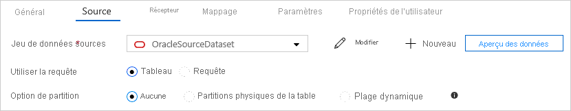

# <a name="copy-data-from-and-to-oracle-by-using-azure-data-factory"></a>Copier des données depuis/vers Oracle à l’aide d’Azure Data Factory

> [!div class="op_single_selector" title1="Sélectionnez la version du service Data Factory que vous utilisez :"]
> * [Version 1](v1/data-factory-onprem-oracle-connector.md)
> * [Version actuelle](connector-oracle.md)

[!INCLUDE[appliesto-adf-asa-md](includes/appliesto-adf-asa-md.md)]

Cet article décrit comment utiliser l’activité de copie dans Azure Data Factory pour copier des données depuis/vers une base de données Oracle. Il s’appuie sur la [vue d’ensemble de l’activité de copie](copy-activity-overview.md).

## <a name="supported-capabilities"></a>Fonctionnalités prises en charge

Ce connecteur Oracle est pris en charge pour les activités suivantes :

- [Activité Copy](copy-activity-overview.md) avec [prise en charge de la matrice source/du récepteur](copy-activity-overview.md)
- [Activité de recherche](control-flow-lookup-activity.md)

Vous pouvez copier des données d’une base de données Oracle vers toute banque de données réceptrice prise en charge. Vous pouvez également copier des données de n’importe quel magasin de données source pris en charge vers une base de données Oracle. Pour obtenir la liste des banques de données prises en charge en tant que sources ou récepteurs par l’activité de copie, consultez le tableau [banques de données prises en charge](copy-activity-overview.md#supported-data-stores-and-formats).

Plus précisément, ce connecteur Oracle prend en charge :

- Les versions suivantes d’une base de données Oracle :
    - Oracle 19c R1 (19.1) et versions ultérieures
    - Oracle 18c R1 (18.1) et versions ultérieures
    - Oracle 12c R1 (12.1) et versions ultérieures
    - Oracle 11g R1 (11.1) et versions ultérieures
    - Oracle 10g R1 (10.1) et versions ultérieures
    - Oracle 9i R2 (9.2) et versions ultérieures
    - Oracle 8i R3 (8.1.7) et versions ultérieures
    - Service Exadata Oracle Database Cloud
- Copie en parallèle à partir d’une source Oracle. Pour en savoir plus, voir [Copie en parallèle à partir d’Oracle](#parallel-copy-from-oracle).

> [!Note]
> Le serveur proxy Oracle n’est pas pris en charge.

## <a name="prerequisites"></a>Prérequis

[!INCLUDE [data-factory-v2-integration-runtime-requirements](../../includes/data-factory-v2-integration-runtime-requirements.md)] 

Le runtime d’intégration intègre un pilote Oracle. Par conséquent, vous n’avez pas besoin d’installer manuellement un pilote pour copier des données depuis et vers Oracle.

## <a name="get-started"></a>Bien démarrer

[!INCLUDE [data-factory-v2-connector-get-started](../../includes/data-factory-v2-connector-get-started.md)]

Les sections suivantes fournissent des informations sur les propriétés utilisées pour définir les entités Data Factory spécifiques du connecteur Oracle.

## <a name="linked-service-properties"></a>Propriétés du service lié

Le service lié Oracle prend en charge les propriétés suivantes :

| Propriété | Description | Obligatoire |
|:--- |:--- |:--- |
| type | La propriété type doit être définie sur **Oracle**. | Oui |
| connectionString | Spécifie les informations requises pour se connecter à l’instance Oracle Database. <br/>Vous pouvez également définir un mot de passe dans Azure Key Vault et extraire la configuration `password` de la chaîne de connexion. Pour plus d’informations, reportez-vous aux exemples suivants et à [Stocker des informations d’identification dans Azure Key Vault](store-credentials-in-key-vault.md). <br><br>**Type de connexion pris en charge** : Vous pouvez utiliser le **SID Oracle** ou le **nom du service Oracle** pour identifier votre base de données :<br>- Si vous utilisez le SID : `Host=<host>;Port=<port>;Sid=<sid>;User Id=<username>;Password=<password>;`<br>- Si vous utilisez le nom du service : `Host=<host>;Port=<port>;ServiceName=<servicename>;User Id=<username>;Password=<password>;`<br>Comme options avancées de connexion native Oracle, vous pouvez choisir d’ajouter une entrée dans le fichier [TNSNAMES.ORA](http://www.orafaq.com/wiki/Tnsnames.ora) sur le serveur Oracle et, dans le service lié Oracle ADF, choisissez d’utiliser le type de connexion avec nom de service Oracle et configurez le nom de service correspondant. | Oui |
| connectVia | Le [runtime d’intégration](concepts-integration-runtime.md) à utiliser pour se connecter à la banque de données. Pour plus d’informations, consultez la section [Conditions préalables](#prerequisites). À défaut de spécification, l’Azure Integration Runtime par défaut est utilisé. |Non |

>[!TIP]
>En cas d’erreur, « ORA-01025 : UPI parameter out of range » et que votre version d’Oracle est 8i, ajoutez `WireProtocolMode=1` à votre chaîne de connexion, puis réessayez.

Si vous avez plusieurs instances Oracle pour le scénario de basculement, vous pouvez créer un service lié à Oracle et renseigner l’hôte principal, le port, le nom d’utilisateur, le mot de passe, etc., et ajouter une nouvelle propriété « **Propriétés de connexion supplémentaires** » avec le nom `AlternateServers` et la valeur `(HostName=<secondary host>:PortNumber=<secondary port>:ServiceName=<secondary service name>)`. N’oubliez pas les crochets et faites attention aux signes deux-points (`:`) utilisés comme séparateur. À titre d’exemple, la valeur suivante de serveurs secondaires définit deux serveurs de base de données de remplacement pour le basculement de connexion : `(HostName=AccountingOracleServer:PortNumber=1521:SID=Accounting,HostName=255.201.11.24:PortNumber=1522:ServiceName=ABackup.NA.MyCompany)`.

Autres propriétés de connexion que vous pouvez définir dans la chaîne de connexion selon votre cas :

| Propriété | Description | Valeurs autorisées |
|:--- |:--- |:--- |
| ArraySize |Nombre d’octets que le connecteur peut extraire dans un aller-retour réseau. Par exemple, `ArraySize=‭10485760‬`.<br/><br/>Des valeurs plus élevées augmentent le débit en réduisant le nombre de fois que des données sont extraites sur le réseau. Des valeurs réduites augmentent le temps de réponse, car il y a moins de retard à attendre que le serveur transmette les données. | Entier compris entre 1 et 4294967296 (4 Go). La valeur par défaut est `60000`. La valeur 1 ne définit pas le nombre d’octets, mais indique une allocation d’espace pour une seule ligne de données. |

Pour activer le chiffrement sur la connexion Oracle, deux options s’offrent à vous :

-   Pour utiliser le **chiffrement 3DES (Triple-DES) et AES (Advanced Encryption Standard)** , du côté du serveur Oracle, accédez à Oracle Advanced Security (OAS) et configurez les paramètres de chiffrement. Pour plus d’informations, consultez cette [documentation Oracle](https://docs.oracle.com/cd/E11882_01/network.112/e40393/asointro.htm#i1008759). Le connecteur Oracle ADF (Application Development Framework) négocie automatiquement la méthode de chiffrement pour utiliser celle que vous configurez dans OAS lors de l’établissement d’une connexion à Oracle.

-   Pour utiliser **TLS** :

    1.  Obtenez les informations de certificat TLS/SSL. Obtenez les informations de certificat encodé DER (Distinguished Encoding Rules) de votre certificat TLS/SSL et enregistrez la sortie (-----Begin Certificate … End Certificate---) sous forme de fichier texte.

        ```
        openssl x509 -inform DER -in [Full Path to the DER Certificate including the name of the DER Certificate] -text
        ```

        **Exemple :** Extrayez les informations de certificat de DERcert.cer, puis enregistrez la sortie dans cert.txt.

        ```
        openssl x509 -inform DER -in DERcert.cer -text
        Output:
        -----BEGIN CERTIFICATE-----
        XXXXXXXXXXXXXXXXXXXXXXXXXXXXXXXXXXXXXXXXXXXX
        XXXXXXXXXXXXXXXXXXXXXXXXXXXXXXXXXXXXXXXXXXXX
        XXXXXXXXXXXXXXXXXXXXXXXXXXXXXXXXXXXXXXXXXXXX
        XXXXXXXXXXXXXXXXXXXXXXXXXXXXXXXXXXXXXXXXXXXX
        XXXXXXXXX
        -----END CERTIFICATE-----
        ```
    
    2.  Générez le `keystore` ou le `truststore`. La commande suivante crée le fichier `truststore`, avec ou sans mot de passe, au format PKCS-12.

        ```
        openssl pkcs12 -in [Path to the file created in the previous step] -out [Path and name of TrustStore] -passout pass:[Keystore PWD] -nokeys -export
        ```

        **Exemple :** Créez un fichier `truststore` PKCS12 nommé MyTrustStoreFile, avec un mot de passe.

        ```
        openssl pkcs12 -in cert.txt -out MyTrustStoreFile -passout pass:ThePWD -nokeys -export  
        ```

    3.  Placez le fichier `truststore` sur l’ordinateur IR auto-hébergé. Par exemple, placez le fichier sur C:\MyTrustStoreFile.
    4.  Dans Azure Data Factory, configurez la chaîne de connexion Oracle avec `EncryptionMethod=1` et la valeur `TrustStore`/`TrustStorePassword`correspondante, par exemple. Par exemple : `Host=<host>;Port=<port>;Sid=<sid>;User Id=<username>;Password=<password>;EncryptionMethod=1;TrustStore=C:\\MyTrustStoreFile;TrustStorePassword=<trust_store_password>`.

**Exemple :**

```json
{
    "name": "OracleLinkedService",
    "properties": {
        "type": "Oracle",
        "typeProperties": {
            "connectionString": "Host=<host>;Port=<port>;Sid=<sid>;User Id=<username>;Password=<password>;"
        },
        "connectVia": {
            "referenceName": "<name of Integration Runtime>",
            "type": "IntegrationRuntimeReference"
        }
    }
}
```

**Exemple : stockage du mot de passe dans Azure Key Vault**

```json
{
    "name": "OracleLinkedService",
    "properties": {
        "type": "Oracle",
        "typeProperties": {
            "connectionString": "Host=<host>;Port=<port>;Sid=<sid>;User Id=<username>;",
            "password": { 
                "type": "AzureKeyVaultSecret", 
                "store": { 
                    "referenceName": "<Azure Key Vault linked service name>", 
                    "type": "LinkedServiceReference" 
                }, 
                "secretName": "<secretName>" 
            }
        },
        "connectVia": {
            "referenceName": "<name of Integration Runtime>",
            "type": "IntegrationRuntimeReference"
        }
    }
}
```
## <a name="dataset-properties"></a>Propriétés du jeu de données

Cette section fournit la liste des propriétés prises en charge par le jeu de données Oracle. Pour obtenir la liste complète des sections et propriétés disponibles pour la définition de jeux de données, consultez l’article sur les [jeux de données](concepts-datasets-linked-services.md). 

Pour copier des données depuis et vers Oracle, affectez la valeur `OracleTable` à la propriété type du jeu de données. Les propriétés suivantes sont prises en charge.

| Propriété | Description | Obligatoire |
|:--- |:--- |:--- |
| type | La propriété type du jeu de données doit être définie sur `OracleTable`. | Oui |
| schéma | Nom du schéma. |Non pour Source, Oui pour Récepteur  |
| table | Nom de la table/vue. |Non pour Source, Oui pour Récepteur  |
| tableName | Nom de la table/vue avec schéma. Cette propriété est prise en charge pour la compatibilité descendante. Pour les nouvelles charges de travail, utilisez `schema` et `table`. | Non pour Source, Oui pour Récepteur |

**Exemple :**

```json
{
    "name": "OracleDataset",
    "properties":
    {
        "type": "OracleTable",
        "schema": [],
        "typeProperties": {
            "schema": "<schema_name>",
            "table": "<table_name>"
        },
        "linkedServiceName": {
            "referenceName": "<Oracle linked service name>",
            "type": "LinkedServiceReference"
        }
    }
}
```

## <a name="copy-activity-properties"></a>Propriétés de l’activité de copie

Cette section fournit la liste des propriétés prises en charge par Oracle en tant que source et récepteur. Pour obtenir la liste complète des sections et propriétés disponibles pour la définition des activités, consultez [Pipelines](concepts-pipelines-activities.md). 

### <a name="oracle-as-source"></a>Oracle en tant que source

>[!TIP]
>Pour savoir comment charger efficacement des données à partir d’Oracle à l’aide du partitionnement, voir [Copie en parallèle à partir d’Oracle](#parallel-copy-from-oracle).

Pour copier des données à partir d’Oracle, définissez le type de source dans l’activité de copie sur `OracleSource`. Les propriétés suivantes sont prises en charge dans la section **source** de l’activité de copie.

| Propriété | Description | Obligatoire |
|:--- |:--- |:--- |
| type | La propriété type de la source de l’activité de copie doit être définie sur `OracleSource`. | Oui |
| oracleReaderQuery | Utiliser la requête SQL personnalisée pour lire les données. par exemple `"SELECT * FROM MyTable"`.<br>Lorsque vous activez la charge partitionnée, vous devez utiliser les paramètres de partition intégrés correspondants dans votre requête. Pour consulter des exemples, voir la section [Copie en parallèle à partir d’Oracle](#parallel-copy-from-oracle). | Non |
| partitionOptions | Spécifie les options de partitionnement des données utilisées pour charger des données à partir d’Oracle. <br>Les valeurs autorisées sont les suivantes : **None** (valeur par défaut), **PhysicalPartitionsOfTable** et **DynamicRange**.<br>Lorsqu’une option de partition est activée (autrement dit, pas `None`), le degré de parallélisme pour charger simultanément des données à partir d’une base de données Oracle est contrôlé par le paramètre [`parallelCopies`](copy-activity-performance-features.md#parallel-copy) de l’activité de copie. | Non |
| partitionSettings | Spécifiez le groupe de paramètres pour le partitionnement des données. <br>S’applique lorsque l’option de partitionnement n’est pas `None`. | Non |
| partitionNames | La liste des partitions physiques qui doivent être copiées. <br>S’applique lorsque l’option de partitionnement est `PhysicalPartitionsOfTable`. Si vous utilisez une requête pour récupérer des données sources, utilisez `?AdfTabularPartitionName` dans la clause WHERE. Pour consulter un exemple, voir la section [Copie en parallèle à partir d’Oracle](#parallel-copy-from-oracle). | Non |
| partitionColumnName | Spécifiez le nom de la colonne source **dans type entier** qu’utilisera le partitionnement par plages de valeurs pour la copie en parallèle. S’il n’est pas spécifié, la clé primaire de la table sera automatiquement détectée et utilisée en tant que colonne de partition. <br>S’applique lorsque l’option de partitionnement est `DynamicRange`. Si vous utilisez une requête pour récupérer des données sources, utilisez `?AdfRangePartitionColumnName` dans la clause WHERE. Pour consulter un exemple, voir la section [Copie en parallèle à partir d’Oracle](#parallel-copy-from-oracle). | Non |
| partitionUpperBound | Valeur maximale de la colonne de partition à partir de laquelle copier des données. <br>S’applique lorsque l’option de partitionnement est `DynamicRange`. Si vous utilisez une requête pour récupérer des données sources, utilisez `?AdfRangePartitionUpbound` dans la clause WHERE. Pour consulter un exemple, voir la section [Copie en parallèle à partir d’Oracle](#parallel-copy-from-oracle). | Non |
| partitionLowerBound | Valeur minimale de la colonne de partition à partir de laquelle copier des données. <br>S’applique lorsque l’option de partitionnement est `DynamicRange`. Si vous utilisez une requête pour récupérer des données sources, utilisez `?AdfRangePartitionLowbound` dans la clause WHERE. Pour consulter un exemple, voir la section [Copie en parallèle à partir d’Oracle](#parallel-copy-from-oracle). | Non |

**Exemple : copie de données à l’aide de la requête de base sans partition**

```json
"activities":[
    {
        "name": "CopyFromOracle",
        "type": "Copy",
        "inputs": [
            {
                "referenceName": "<Oracle input dataset name>",
                "type": "DatasetReference"
            }
        ],
        "outputs": [
            {
                "referenceName": "<output dataset name>",
                "type": "DatasetReference"
            }
        ],
        "typeProperties": {
            "source": {
                "type": "OracleSource",
                "oracleReaderQuery": "SELECT * FROM MyTable"
            },
            "sink": {
                "type": "<sink type>"
            }
        }
    }
]
```

### <a name="oracle-as-sink"></a>Oracle en tant que récepteur

Pour copier des données vers Oracle, définissez `OracleSink` comme type de récepteur dans l’activité de copie. Les propriétés suivantes sont prises en charge dans la section **récepteur** de l’activité de copie.

| Propriété | Description | Obligatoire |
|:--- |:--- |:--- |
| type | La propriété type du récepteur d’activité de copie doit être définie sur `OracleSink`. | Oui |
| writeBatchSize | Insère des données dans la table SQL quand la taille de la mémoire tampon atteint `writeBatchSize`.<br/>Valeurs autorisées : integer (nombre de lignes). |Non (valeur par défaut : 10 000) |
| writeBatchTimeout | Temps d’attente avant expiration de l’opération d’insertion de lot.<br/>Valeurs autorisées : timespan. Exemple : 00:30:00 (30 minutes). | Non |
| preCopyScript | Spécifiez une requête SQL pour l’activité de copie à exécuter avant l’écriture de données dans Oracle à chaque exécution. Vous pouvez utiliser cette propriété pour nettoyer des données préchargées. | Non |
| maxConcurrentConnections |La limite supérieure de connexions simultanées établies au magasin de données pendant l’exécution de l’activité. Spécifiez une valeur uniquement lorsque vous souhaitez limiter les connexions simultanées.| Non |

**Exemple :**

```json
"activities":[
    {
        "name": "CopyToOracle",
        "type": "Copy",
        "inputs": [
            {
                "referenceName": "<input dataset name>",
                "type": "DatasetReference"
            }
        ],
        "outputs": [
            {
                "referenceName": "<Oracle output dataset name>",
                "type": "DatasetReference"
            }
        ],
        "typeProperties": {
            "source": {
                "type": "<source type>"
            },
            "sink": {
                "type": "OracleSink"
            }
        }
    }
]
```

## <a name="parallel-copy-from-oracle"></a>Copie en parallèle à partir d’Oracle

Le connecteur Oracle de Data Factory propose un partitionnement de données intégré pour copier des données à partir de Oracle en parallèle. Vous trouverez des options de partitionnement de données dans l’onglet **Source** de l’activité de copie.



Lorsque vous activez la copie partitionnée, Data Factory exécute des requêtes en parallèle sur votre source Oracle pour charger des données par partitions. Le degré de parallélisme est contrôlé via le paramètre [`parallelCopies`](copy-activity-performance-features.md#parallel-copy) sur l’activité de copie. Par exemple, si vous définissez `parallelCopies` sur quatre, Data Factory génère et exécute simultanément quatre requêtes basées l’option de partition et les paramètres que vous avez spécifiés, chacune récupérant des données à partir de votre base de données Oracle.

Il vous est recommandé d’activer la copie en parallèle avec partitionnement des données notamment lorsque vous chargez une grande quantité de données à partir de votre base de données Oracle. Voici quelques suggestions de configurations pour différents scénarios. Lors de la copie de données dans un magasin de données basé sur des fichiers, il est recommandé de les écrire dans un dossier sous la forme de plusieurs fichiers (spécifiez uniquement le nom du dossier). Les performances seront meilleures qu’avec l’écriture dans un seul fichier.

| Scénario                                                     | Paramètres suggérés                                           |
| ------------------------------------------------------------ | ------------------------------------------------------------ |
| Chargement complet à partir d’une table volumineuse, avec des partitions physiques.          | **Option de partition** : Partitions physiques de la table. <br><br/>Lors de l’exécution, Data Factory détecte automatiquement les partitions physiques et copie les données par partitions. |
| Chargement complet d’une table volumineuse, sans partitions physiques, avec une colonne entière pour le partitionnement des données. | **Options de partition** : Partition dynamique par spécification de plages de valeurs.<br>**Colonne de partition** : Spécifiez la colonne utilisée pour partitionner les données. Si la valeur n’est pas spécifiée, la colonne de la clé primaire est utilisée. |
| Chargement d’une grande quantité de données à l’aide d’une requête personnalisée, avec des partitions physiques. | **Option de partition** : Partitions physiques de la table.<br>**Requête**: `SELECT * FROM <TABLENAME> PARTITION("?AdfTabularPartitionName") WHERE <your_additional_where_clause>`.<br>**Nom de la partition** : Spécifiez le(s) nom(s) de partition à copier. S’il n’est pas spécifié, Data Factory détecte automatiquement les partitions physiques de la table que vous avez spécifiée dans le jeu de données Oracle.<br><br>Pendant l’exécution, Data Factory remplace `?AdfTabularPartitionName` par le nom de la partition actuelle, et l’envoie à Oracle. |
| Chargement d’une grande quantité de données à l’aide d’une requête personnalisée, sans partitions physiques, et avec une colonne entière pour le partitionnement des données. | **Options de partition** : Partition dynamique par spécification de plages de valeurs.<br>**Requête**: `SELECT * FROM <TABLENAME> WHERE ?AdfRangePartitionColumnName <= ?AdfRangePartitionUpbound AND ?AdfRangePartitionColumnName >= ?AdfRangePartitionLowbound AND <your_additional_where_clause>`.<br>**Colonne de partition** : Spécifiez la colonne utilisée pour partitionner les données. Vous pouvez procéder au partitionnement par rapport à la colonne avec le type de données entier.<br>**Limite supérieure de partition** et **limite inférieure de partition** : Indiquez si vous souhaitez filtrer le contenu par rapport à la colonne de partition pour récupérer uniquement les données entre les plages inférieure et supérieure.<br><br>Lors de l’exécution, Data Factory remplace `?AdfRangePartitionColumnName`, `?AdfRangePartitionUpbound` et `?AdfRangePartitionLowbound` par le nom réel de la colonne et les plages de valeurs de chaque partition, et les envoie à Oracle. <br>Par exemple, si l’ID de la colonne de partition « ID » est défini sur une limite inférieure de 1 et une limite supérieure de 80, avec une copie en parallèle définie sur 4, Data Factory récupère les données via 4 partitions. Les ID sont inclus entre [1,20], [21, 40], [41, 60] et [61, 80], respectivement. |

> [!TIP]
> Lorsque vous copiez des données à partir d’une table non partitionnée, vous pouvez utiliser l’option de partition « Plage dynamique » afin de partitionner par rapport à une colonne d’entiers. Si vos données sources n’incluent pas un tel type de colonne, vous pouvez tirer parti de la fonction [ORA_HASH]( https://docs.oracle.com/database/121/SQLRF/functions136.htm) dans une requête source pour générer une colonne et l’utiliser comme colonne de partition.

**Exemple : requête avec partition physique**

```json
"source": {
    "type": "OracleSource",
    "query": "SELECT * FROM <TABLENAME> PARTITION(\"?AdfTabularPartitionName\") WHERE <your_additional_where_clause>",
    "partitionOption": "PhysicalPartitionsOfTable",
    "partitionSettings": {
        "partitionNames": [
            "<partitionA_name>",
            "<partitionB_name>"
        ]
    }
}
```

**Exemple : requête avec partition dynamique par spécification de plages de valeurs**

```json
"source": {
    "type": "OracleSource",
    "query": "SELECT * FROM <TABLENAME> WHERE ?AdfRangePartitionColumnName <= ?AdfRangePartitionUpbound AND ?AdfRangePartitionColumnName >= ?AdfRangePartitionLowbound AND <your_additional_where_clause>",
    "partitionOption": "DynamicRange",
    "partitionSettings": {
        "partitionColumnName": "<partition_column_name>",
        "partitionUpperBound": "<upper_value_of_partition_column>",
        "partitionLowerBound": "<lower_value_of_partition_column>"
    }
}
```

## <a name="data-type-mapping-for-oracle"></a>Mappage de type de données pour Oracle

Lorsque vous copiez des données à partir d’Oracle, les mappages suivants s’appliquent. Pour découvrir comment l’activité de copie mappe le schéma et le type de données la source au récepteur, consultez [Mappage de schéma dans l’activité de copie](copy-activity-schema-and-type-mapping.md).

| Type de données Oracle | Type de données intermédiaires d’Azure Data Factory |
|:--- |:--- |
| BFILE |Byte[] |
| BLOB |Byte[]<br/>(seulement pris en charge sur Oracle 10g et les versions ultérieures) |
| CHAR |String |
| CLOB |String |
| DATE |DateTime |
| FLOAT |Décimale, chaîne (si précision > 28) |
| INTEGER |Décimale, chaîne (si précision > 28) |
| LONG |String |
| LONG RAW |Byte[] |
| NCHAR |String |
| NCLOB |String |
| NUMBER (p,s) |Decimal, String (if p > 28) |
| NUMBER sans précision ni échelle |Double |
| NVARCHAR2 |String |
| RAW |Byte[] |
| ROWID |String |
| timestamp |DateTime |
| TIMESTAMP WITH LOCAL TIME ZONE |String |
| TIMESTAMP WITH TIME ZONE |String |
| UNSIGNED INTEGER |Number |
| VARCHAR2 |String |
| XML |String |

> [!NOTE]
> Les types de données INTERVAL YEAR TO MONTH et INTERVAL DAY TO SECOND ne sont pas pris en charge.

## <a name="lookup-activity-properties"></a>Propriétés de l’activité Lookup

Pour en savoir plus sur les propriétés, consultez [Activité Lookup](control-flow-lookup-activity.md).

## <a name="next-steps"></a>Étapes suivantes
Pour obtenir la liste des banques de données prises en charge en tant que sources et récepteurs par l’activité de copie dans Azure Data Factory, consultez le tableau [Banques de données prises en charge](copy-activity-overview.md#supported-data-stores-and-formats).
