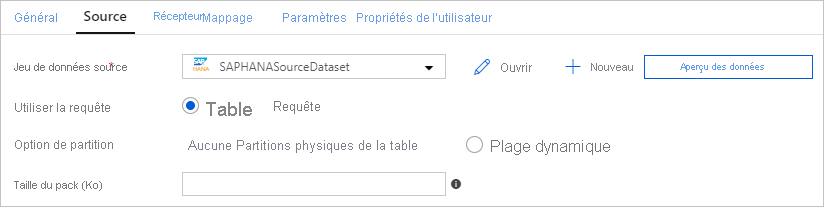

# <a name="copy-data-from-sap-hana-using-azure-data-factory"></a>Copier des données de SAP HANA à l’aide d’Azure Data Factory
> [!div class="op_single_selector" title1="Sélectionnez la version du service Data Factory que vous utilisez :"]
> * [Version 1](v1/data-factory-sap-hana-connector.md)
> * [Version actuelle](connector-sap-hana.md)

Cet article décrit comment utiliser l’activité de copie dans Azure Data Factory pour copier des données d’une base de données SAP HANA. Il s’appuie sur l’article [Vue d’ensemble de l’activité de copie](copy-activity-overview.md).

>[!TIP]
>Pour en savoir plus sur la prise en charge générale de l’intégration de données SAP par ADF, consultez le livre blanc [Intégration de données SAP à l’aide d’Azure Data Factory](https://github.com/Azure/Azure-DataFactory/blob/master/whitepaper/SAP%20Data%20Integration%20using%20Azure%20Data%20Factory.pdf) offrant une présentation détaillée, une comparaison et des conseils.

## <a name="supported-capabilities"></a>Fonctionnalités prises en charge

Ce connecteur SAP HANA est pris en charge pour les activités suivantes :

- [Activité Copy](copy-activity-overview.md) avec [prise en charge de la matrice source/du récepteur](copy-activity-overview.md)
- [Activité de recherche](control-flow-lookup-activity.md)

Vous pouvez copier des données d’une base de données SAP HANA vers toute banque de données réceptrice prise en charge. Pour obtenir la liste des banques de données prises en charge en tant que sources ou récepteurs pour l’activité de copie, consultez le tableau [banques de données prises en charge](copy-activity-overview.md#supported-data-stores-and-formats).

Plus précisément, ce connecteur SAP HANA prend en charge ce qui suit :

- Copie de données de toute version de base de données SAP HANA.
- Copie de données de **modèles d’informations HANA** (tels que les vues Analyse et Calcul) et de **tables Ligne/Colonne**.
- Copie des données avec l’authentification **De base** ou **Windows**.
- Copie en parallèle à partir d’une source SAP HANA. Pour plus d’informations, consultez la section [Copie en parallèle à partir de SAP HANA](#parallel-copy-from-sap-hana).

> [!TIP]
> Pour copier des données **vers** une banque de données SAP HANA, utilisez le connecteur ODBC générique. Pour plus de détails, voir [Récepteur SAP HANA](connector-odbc.md#sap-hana-sink). Notez que les services liés pour les connecteurs SAP HANA et ODBC sont de types différents et qu’ils ne peuvent donc pas être réutilisées.

## <a name="prerequisites"></a>Prérequis

Pour utiliser ce connecteur SAP HANA, vous devez :

- Configurer un Runtime d’intégration autohébergé. Pour plus d’informations, consultez l’article [Runtime d’intégration autohébergé](create-self-hosted-integration-runtime.md).
- Installer le pilote ODBC de SAP HANA sur l’ordinateur exécutant le runtime d’intégration. Vous pouvez télécharger le pilote ODBC SAP HANA à partir du [Centre de téléchargement de logiciels SAP](https://support.sap.com/swdc). Faites une recherche avec le mot-clé **SAP HANA CLIENT for Windows**.

## <a name="getting-started"></a>Prise en main

[!INCLUDE [data-factory-v2-connector-get-started](../../includes/data-factory-v2-connector-get-started.md)]

Les sections suivantes fournissent des détails sur les propriétés utilisées pour définir les entités Data Factory spécifiques du connecteur SAP HANA.

## <a name="linked-service-properties"></a>Propriétés du service lié

Les propriétés prises en charge pour le service lié SAP HANA sont les suivantes :

| Propriété | Description | Obligatoire |
|:--- |:--- |:--- |
| type | La propriété type doit être définie sur : **SapHana** | Oui |
| connectionString | Spécifiez les informations nécessaires pour établir une connexion au SAP HANA à l’aide de l’**authentification SQL** ou de l’**authentification Windows**. Consultez les exemples suivants.<br>Dans la chaîne de connexion, la définition du serveur/port est obligatoire (le port par défaut est 30015), et le nom d’utilisateur et le mot de passe sont obligatoires lors de l’utilisation de l’authentification de base. Pour plus de paramètres avancés, voir [Propriétés de la connexion ODBC à SAP HANA](<https://help.sap.com/viewer/0eec0d68141541d1b07893a39944924e/2.0.02/en-US/7cab593774474f2f8db335710b2f5c50.html>).<br/>Vous pouvez également définir un mot de passe dans Azure Key Vault et extraire la configuration du mot de passe de la chaîne de connexion. Pour plus d’informations, consultez l'article [Stocker des informations d’identification dans Azure Key Vault](store-credentials-in-key-vault.md). | Oui |
| userName | Si vous utilisez l’authentification Windows, spécifiez un nom d’utilisateur. Exemple : `user@domain.com` | Non |
| password | Spécifiez le mot de passe du compte d'utilisateur. Marquez ce champ en tant que SecureString afin de le stocker en toute sécurité dans Data Factory, ou [référencez un secret stocké dans Azure Key Vault](store-credentials-in-key-vault.md). | Non |
| connectVia | [Runtime d’intégration](concepts-integration-runtime.md) à utiliser pour la connexion à la banque de données. Un Runtime d’intégration autohébergé est nécessaire comme indiqué dans [Prérequis](#prerequisites). |Oui |

**Exemple : utiliser l’authentification de base**

```json
{
    "name": "SapHanaLinkedService",
    "properties": {
        "type": "SapHana",
        "typeProperties": {
            "connectionString": "SERVERNODE=<server>:<port (optional)>;UID=<userName>;PWD=<Password>"
        },
        "connectVia": {
            "referenceName": "<name of Integration Runtime>",
            "type": "IntegrationRuntimeReference"
        }
    }
}
```

**Exemple : utiliser l’authentification Windows**

```json
{
    "name": "SapHanaLinkedService",
    "properties": {
        "type": "SapHana",
        "typeProperties": {
            "connectionString": "SERVERNODE=<server>:<port (optional)>;",
            "userName": "<username>", 
            "password": { 
                "type": "SecureString", 
                "value": "<password>" 
            } 
        },
        "connectVia": {
            "referenceName": "<name of Integration Runtime>",
            "type": "IntegrationRuntimeReference"
        }
    }
}
```

Si vous utilisiez le service lié SAP HANA avec la charge utile suivante, il reste pris en charge tel quel, mais nous vous suggérons d’utiliser le nouveau à l’avenir.

**Exemple :**

```json
{
    "name": "SapHanaLinkedService",
    "properties": {
        "type": "SapHana",
        "typeProperties": {
            "server": "<server>:<port (optional)>",
            "authenticationType": "Basic",
            "userName": "<username>",
            "password": {
                "type": "SecureString",
                "value": "<password>"
            }
        },
        "connectVia": {
            "referenceName": "<name of Integration Runtime>",
            "type": "IntegrationRuntimeReference"
        }
    }
}
```

## <a name="dataset-properties"></a>Propriétés du jeu de données

Pour obtenir la liste complète des sections et propriétés disponibles pour la définition de jeux de données, consultez l’article sur les [jeux de données](concepts-datasets-linked-services.md). Cette section fournit la liste des propriétés prises en charge par le jeu de données SAP HANA.

Pour copier des données à partir de SAP HANA, les propriétés prises en charge sont les suivantes :

| Propriété | Description | Obligatoire |
|:--- |:--- |:--- |
| type | La propriété type du jeu de données doit être définie sur : **SapHanaTable** | Oui |
| schéma | Nom du schéma dans la base de données SAP HANA. | Non (si « query » dans la source de l’activité est spécifié) |
| table | Nom de la table dans la base de données SAP HANA. | Non (si « query » dans la source de l’activité est spécifié) |

**Exemple :**

```json
{
    "name": "SAPHANADataset",
    "properties": {
        "type": "SapHanaTable",
        "typeProperties": {
            "schema": "<schema name>",
            "table": "<table name>"
        },
        "schema": [],
        "linkedServiceName": {
            "referenceName": "<SAP HANA linked service name>",
            "type": "LinkedServiceReference"
        }
    }
}
```

Si vous utilisiez un dataset typé `RelationalTable`, il reste pris en charge tel quel, mais nous vous suggérons d’utiliser désormais le nouveau dataset.

## <a name="copy-activity-properties"></a>Propriétés de l’activité de copie

Pour obtenir la liste complète des sections et des propriétés disponibles pour la définition des activités, consultez l’article [Pipelines](concepts-pipelines-activities.md). Cette section fournit la liste des propriétés prises en charge par la source SAP HANA.

### <a name="sap-hana-as-source"></a>SAP HANA en tant que source

>[!TIP]
>Pour ingérer efficacement des données à partir de SAP HANA à l’aide du partitionnement des données, consultez la section [Copie en parallèle à partir de SAP HANA](#parallel-copy-from-sap-hana).

Pour copier des données à partir de SAP HANA, les propriétés prises en charge dans la section **source** de l’activité de copie sont les suivantes :

| Propriété | Description | Obligatoire |
|:--- |:--- |:--- |
| type | La propriété type de la source d’activité de copie doit être définie sur : **SapHanaSource** | Oui |
| query | Spécifie la requête SQL pour lire les données de l’instance SAP HANA. | Oui |
| partitionOptions | Spécifie les options de partitionnement des données utilisées pour ingérer des données à partir de SAP HANA. Pour plus d’informations, consultez la section [Copie en parallèle à partir de SAP HANA](#parallel-copy-from-sap-hana).<br>Les valeurs autorisées sont :  **None** (valeur par défaut),  **PhysicalPartitionsOfTable** et **SapHanaDynamicRange**. Pour plus d’informations, consultez la section [Copie en parallèle à partir de SAP HANA](#parallel-copy-from-sap-hana). `PhysicalPartitionsOfTable` peut être utilisé lors de la copie de données à partir d’une table, mais pas à partir d’une requête. <br>Lorsqu’une option de partition est activée (donc, autre que `None`), le degré de parallélisme pour charger simultanément des données à partir de SAP HANA est contrôlé par le paramètre [`parallelCopies`](copy-activity-performance.md#parallel-copy) de l’activité de copie. | False |
| partitionSettings | Spécifiez le groupe de paramètres pour le partitionnement des données.<br>S’applique lorsque de l’option de partition est `SapHanaDynamicRange`. | False |
| partitionColumnName | Spécifiez le nom de la colonne source qu’utilisera la partition pour la copie en parallèle. S’il n’est pas spécifié, l’index ou la clé primaire de la table seront automatiquement détectés et utilisés en tant que colonne de partition.<br>S’applique lorsque l’option de partitionnement est  `SapHanaDynamicRange`. Si vous utilisez une requête pour récupérer des données sources, utilisez  `?AdfHanaDynamicRangePartitionCondition` dans la clause WHERE. Consultez l’exemple de la section [Copie en parallèle à partir de SAP HANA](#parallel-copy-from-sap-hana). | Oui, lors de l’utilisation de la partition `SapHanaDynamicRange`. |
| packetSize | Spécifie la taille de paquet réseau (en kilo-octets) pour fractionner les données en plusieurs blocs. Si vous avez une grande quantité de données à copier, une augmentation de la taille de paquet peut accélérer la vitesse de lecture à partir de SAP HANA. Il est recommandé de tester les performances lors de l’ajustement de la taille de paquet. | Non.<br>La valeur par défaut est 2048 (2 Mo). |

**Exemple :**

```json
"activities":[
    {
        "name": "CopyFromSAPHANA",
        "type": "Copy",
        "inputs": [
            {
                "referenceName": "<SAP HANA input dataset name>",
                "type": "DatasetReference"
            }
        ],
        "outputs": [
            {
                "referenceName": "<output dataset name>",
                "type": "DatasetReference"
            }
        ],
        "typeProperties": {
            "source": {
                "type": "SapHanaSource",
                "query": "<SQL query for SAP HANA>"
            },
            "sink": {
                "type": "<sink type>"
            }
        }
    }
]
```

Si vous utilisiez un source de données typée `RelationalSource`, elle reste pris en charge telle quelle, mais nous vous suggérons d’utiliser désormais la nouvelle source.

## <a name="parallel-copy-from-sap-hana"></a>Copie en parallèle à partir de SAP HANA

Le connecteur SAP HANA de Data Factory propose un partitionnement de données intégré pour copier des données en parallèle à partir de SAP HANA. Vous trouverez des options de partitionnement de données dans la table **Source** de l’activité de copie.



Lorsque vous activez la copie partitionnée, Data Factory exécute des requêtes en parallèle sur votre source SAP HANA pour récupérer des données par partition. Le degré de parallélisme est contrôlé via le paramètre [`parallelCopies`](copy-activity-performance.md#parallel-copy) sur l’activité de copie. Par exemple, si vous définissez `parallelCopies` sur la valeur quatre, Data Factory génère et exécute simultanément quatre requêtes selon l’option de partition et les paramètres que vous avez spécifiés, chacune récupérant des données à partir de votre table SAP HANA.

Il vous est recommandé d’activer la copie en parallèle avec partitionnement des données notamment lorsque vous ingérez une grande quantité de données à partir de SAP HANA. Voici quelques suggestions de configurations pour différents scénarios. Lors de la copie de données dans un magasin de données basé sur un fichier, il est recommandé d’écrire les données dans un dossier sous la forme de plusieurs fichiers (spécifiez uniquement le nom du dossier). Les performances seront meilleures qu’avec l’écriture de données dans un seul fichier.

| Scénario                                           | Paramètres suggérés                                           |
| -------------------------------------------------- | ------------------------------------------------------------ |
| Chargement complet à partir d’une table volumineuse.                        | **Option de partition** : Partitions physiques de la table. <br><br/>Pendant l’exécution, Data Factory détecte automatiquement le type de partition physique de la table SAP HANA spécifiée et choisit la stratégie de partition correspondante :<br>- **Partitionnement par plages de valeurs :** Récupérez la colonne de partition et les plages de partitions définies pour la table, puis copiez les données par plage. <br>- **Partitionnement de hachage** : Utilisez la clé de partition par hachage comme colonne de partition, puis partitionnez et copiez les données en fonction des plages calculées ADF. <br>- **Partitionnement par tourniquet (round robin)** ou **Aucune partition** : Utilisez la clé primaire comme colonne de partition, puis partitionnez et copiez les données en fonction des plages calculées ADF. |
| Chargez une grande quantité de données à l’aide d’une requête personnalisée. | **Option de partition** : Partition dynamique par spécification de plages de valeurs.<br>**Requête**: `SELECT * FROM <TABLENAME> WHERE ?AdfHanaDynamicRangePartitionCondition AND <your_additional_where_clause>`.<br>**Colonne de partition** : Spécifiez la colonne utilisée pour appliquer la partition par spécification de plages de valeurs dynamique. <br><br>Pendant l’exécution, Data Factory calcule d’abord les plages de valeurs de la colonne de partition spécifiée, en répartissant équitablement les lignes entre les compartiments, en fonction du nombre de valeurs de colonne de partition distinctes et du paramètre de copie en parallèle ADF. Ensuite, il remplace `?AdfHanaDynamicRangePartitionCondition` par le filtrage de la plage de valeurs de la colonne de partition pour chaque partition, et envoie les données à SAP HANA.<br><br>Si vous souhaitez utiliser plusieurs colonnes pour la colonne de partition, dans la requête, concaténez les valeurs de chaque colonne au sein d’une colonne, et spécifier celle-ci en tant que colonne de partition dans ADF, comme dans `SELECT * FROM (SELECT *, CONCAT(<KeyColumn1>, <KeyColumn2>) AS PARTITIONCOLUMN FROM <TABLENAME>) WHERE ?AdfHanaDynamicRangePartitionCondition`. |

**Exemple : requête avec partitions physiques d’une table**

```json
"source": {
    "type": "SapHanaSource",
    "partitionOption": "PhysicalPartitionsOfTable"
}
```

**Exemple : requête avec partition dynamique par spécification de plages de valeurs**

```json
"source": {
    "type": "SapHanaSource",
    "query": "SELECT * FROM <TABLENAME> WHERE ?AdfHanaDynamicRangePartitionCondition AND <your_additional_where_clause>",
    "partitionOption": "SapHanaDynamicRange",
    "partitionSettings": {
        "partitionColumnName": "<Partition_column_name>"
    }
}
```

## <a name="data-type-mapping-for-sap-hana"></a>Mappage de type de données pour SAP HANA

Lors de la copie de données de SAP HANA, les mappages suivants sont utilisés entre les types de données SAP HANA et les types de données intermédiaires d’Azure Data Factory. Pour découvrir comment l’activité de copie mappe le schéma et le type de données la source au récepteur, voir [Mappages de schémas et de types de données](copy-activity-schema-and-type-mapping.md).

| Type de données SAP HANA | Type de données intermédiaires de Data Factory |
| ------------------ | ------------------------------ |
| ALPHANUM           | String                         |
| bigint             | Int64                          |
| BINARY             | Byte[]                         |
| BINTEXT            | String                         |
| BLOB               | Byte[]                         |
| BOOL               | Byte                           |
| CLOB               | String                         |
| DATE               | DateTime                       |
| DECIMAL            | Decimal                        |
| DOUBLE             | Double                         |
| FLOAT              | Double                         |
| INTEGER            | Int32                          |
| NCLOB              | String                         |
| NVARCHAR           | String                         |
| real               | Unique                         |
| SECONDDATE         | DateTime                       |
| SHORTTEXT          | String                         |
| SMALLDECIMAL       | Decimal                        |
| SMALLINT           | Int16                          |
| STGEOMETRYTYPE     | Byte[]                         |
| STPOINTTYPE        | Byte[]                         |
| TEXT               | String                         |
| TEMPS               | TimeSpan                       |
| TINYINT            | Byte                           |
| VARCHAR            | String                         |
| timestamp          | DateTime                       |
| VARBINARY          | Byte[]                         |

## <a name="lookup-activity-properties"></a>Propriétés de l’activité Lookup

Pour en savoir plus sur les propriétés, consultez [Activité Lookup](control-flow-lookup-activity.md).

## <a name="next-steps"></a>Étapes suivantes
Pour obtenir la liste des banques de données prises en charge en tant que sources et récepteurs par l’activité de copie dans Azure Data Factory, consultez le tableau [banques de données prises en charge](copy-activity-overview.md#supported-data-stores-and-formats).
