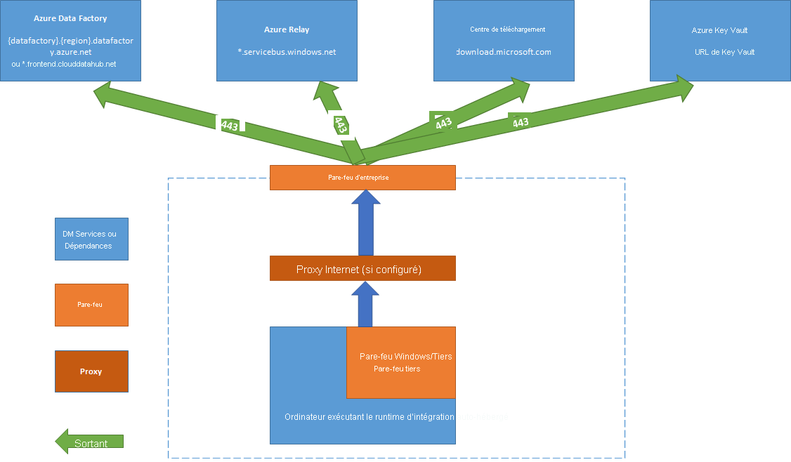

# <a name="create-and-configure-a-self-hosted-integration-runtime"></a>Créer et configurer un runtime d’intégration auto-hébergé

[!INCLUDE[appliesto-adf-asa-md](includes/appliesto-adf-asa-md.md)]

Le runtime d’intégration (IR) représente l’infrastructure de calcul utilisée par Azure Data Factory pour fournir des capacités d’intégration de données entre différents environnements réseau. Pour plus d’informations sur le runtime d’intégration (IR), consultez [Runtime d’intégration dans Azure Data Factory](concepts-integration-runtime.md).

Un runtime d’intégration auto-hébergé peut exécuter des activités de copie entre un magasin de données cloud et un magasin de données dans un réseau privé. Il peut aussi répartir les activités de transformation suivantes selon les ressources de calcul dans un réseau local ou un réseau virtuel Azure. L’installation d’un runtime d’intégration auto-hébergé nécessite une machine locale ou une machine virtuelle à l’intérieur d’un réseau privé.  

Cet article décrit la façon dont vous pouvez créer et configurer un runtime d’intégration auto-hébergé.

[!INCLUDE [updated-for-az](../../includes/updated-for-az.md)]

## <a name="considerations-for-using-a-self-hosted-ir"></a>Considérations relatives à l’utilisation du runtime d’intégration auto-hébergé

- Vous pouvez utiliser un même runtime d’intégration auto-hébergé pour plusieurs sources de données locales. Vous pouvez également le partager avec une autre fabrique de données au sein du même locataire Azure Active Directory (Azure AD). Pour plus d’informations, consultez [Partage du runtime d’intégration auto-hébergé avec plusieurs fabriques de données](./create-shared-self-hosted-integration-runtime-powershell.md).
- Vous ne pouvez installer qu’une seule instance d’un runtime d’intégration auto-hébergé sur une machine. En présence de deux fabriques de données devant accéder aux sources de données locales, utilisez la [fonctionnalité de partage du runtime d’intégration auto-hébergé](./create-shared-self-hosted-integration-runtime-powershell.md) pour partager le runtime d’intégration auto-hébergé ou installez le runtime d’intégration auto-hébergé sur deux ordinateurs locaux, un pour chaque fabrique de données.  
- Le runtime d’intégration auto-hébergé ne doit pas nécessairement se trouver sur la même machine que la source de données. Cela étant, la présence du runtime d’intégration auto-hébergé à proximité de la source de données réduit le temps de connexion du runtime d’intégration auto-hébergé à la source de données. Nous vous recommandons d’installer le runtime d’intégration auto-hébergé sur une machine différente de celle hébergeant la source de données locale. Lorsque le runtime d’intégration auto-hébergé et la source de données se trouvent sur des machines différentes, le runtime d’intégration auto-hébergé ne s'oppose pas à la source de données en termes de ressources.
- Vous pouvez avoir plusieurs runtimes d’intégration auto-hébergés sur différentes machines connectées à la même source de données locale. Par exemple, si vous avez deux runtimes d’intégration auto-hébergés utilisés pour deux fabriques de données, la même source de données locale peut être inscrite auprès des deux fabriques de données.
- Utilisez un runtime d’intégration auto-hébergé prendre en charge l’intégration des données au sein d’un réseau virtuel Azure.
- Considérez votre source de données comme une source de données locale qui se trouve derrière un pare-feu, même lorsque vous utilisez Azure ExpressRoute. Utilisez le runtime d’intégration auto-hébergé pour connecter le service à la source de données.
- Utiliser le runtime d’intégration auto-hébergé même si le magasin de données se trouve dans le cloud sur une infrastructure en tant que service (IaaS) Azure.
- Les tâches peuvent échouer dans un runtime d’intégration auto-hébergé que vous avez installé sur un serveur Windows pour lequel le chiffrement compatible FIPS est activé. Pour contourner ce problème, vous avez deux options : stocker les informations d’identification/valeurs secrètes dans un Azure Key Vault ou désactiver le chiffrement conforme aux normes FIPS sur le serveur. Pour désactiver le chiffrement compatible FIPS, modifiez la valeur de la sous-clé du registre suivante de 1 (activé) à 0 (désactivé) : `HKLM\System\CurrentControlSet\Control\Lsa\FIPSAlgorithmPolicy\Enabled`. Si vous utilisez le [runtime d’intégration auto-hébergé comme proxy pour le runtime d’intégration SSIS](./self-hosted-integration-runtime-proxy-ssis.md), le chiffrement conforme aux normes FIPS peut être activé et utilisé lors du déplacement de données de l’environnement local vers le stockage Blob Azure en tant que zone de transit.

## <a name="command-flow-and-data-flow"></a>Flux de commandes et flux de données

Lorsque vous déplacez les données entre des machines locales et cloud, l’activité utilise un runtime d’intégration auto-hébergé pour transférer les données entre source de données locale au cloud.

Voici un résumé global des étapes de flux de données de copie avec un runtime d’intégration auto-hébergé :


1. Un développeur des données crée un runtime d’intégration auto-hébergé dans une fabrique de données Azure à l’aide du portail Azure ou de la cmdlet PowerShell.

2. Le développeur de données crée un service lié pour un magasin de données local. Pour ce faire, le développeur spécifie l’instance de runtime d’intégration auto-hébergé que le service doit utiliser pour se connecter à des magasins de données.

3. Le nœud du runtime d’intégration auto-hébergé chiffre les informations d’identification à l’aide de l’API de protection des données (DPAPI) Windows et les enregistre localement. Si plusieurs nœuds sont définis pour une haute disponibilité, les informations d’identification sont synchronisées sur les autres nœuds. Chaque nœud chiffre les informations d’identification à l’aide de DPAPI et les stocke localement. La synchronisation des informations d’identification est une opération transparente pour le développeur des données, et elle est gérée par le runtime d’intégration auto-hébergé.

4. Azure Data Factory communique avec le runtime d’intégration auto-hébergé afin de planifier et de gérer les travaux. La communication s'effectue via un canal de contrôle qui utilise une connexion [Azure Relay](../azure-relay/relay-what-is-it.md#wcf-relay) partagée. Lorsqu’une tâche de l’activité doit être lancée, Data Factory place la requête en file d’attente, de même que les informations d’identification. Et ce au cas où les informations d'identification ne sont pas déjà stockées sur le runtime d’intégration auto-hébergé. Le runtime d’intégration auto-hébergé démarre le travail après interrogation de la file d’attente.

5. Le runtime d’intégration auto-hébergé copie des données entre un magasin local et le stockage cloud. La direction de la copie dépend de la manière dont l’activité de copie est configurée dans le pipeline de données. Pour cette étape, le runtime d’intégration auto-hébergé communique directement avec les services de stockage cloud, comme le stockage Blob Azure, via un canal sécurisé (HTTPS).

## <a name="prerequisites"></a>Prérequis

- Les versions de Windows Server prises en charge sont les suivantes :
  - Windows 8.1
  - Windows 10
  - Windows Server 2012
  - Windows Server 2012 R2
  - Windows Server 2016
  - Windows Server 2019

L’installation du runtime d’intégration auto-hébergé sur un contrôleur de domaine n’est pas prise en charge.

- Le runtime d’intégration auto-hébergé nécessite un système d’exploitation 64 bits avec .NET Framework 4.7.2 ou ultérieur. Consultez [Configuration système requise pour .NET Framework](/dotnet/framework/get-started/system-requirements) pour plus d’informations.
- La configuration minimale recommandée pour la machine exécutant le runtime d’intégration auto-hébergé correspond à un processeur à 2 GHz avec 4 cœurs, 8 Go de RAM et 80 Go d’espace disponible sur le disque dur. Pour plus d'informations sur la configuration requise, consultez [Télécharger](https://www.microsoft.com/download/details.aspx?id=39717).
- Si la machine hôte est en veille prolongée, le runtime d’intégration auto-hébergé ne répond pas aux demandes de données. Configurez un plan d’alimentation approprié sur l’ordinateur avant d’installer le runtime d’intégration auto-hébergé. Si la machine est configurée pour se mettre en veille prolongée, le programme d'installation du runtime d’intégration auto-hébergé ouvre un message.
- Vous devez disposer de droits d'administrateur sur la machine pour correctement installer et configurer le runtime d’intégration auto-hébergé.
- L’activité de copie s’exécute selon une fréquence spécifique. L'utilisation du processeur et de la RAM sur la machine suit le même modèle avec des périodes de pointe et d’inactivité. L'utilisation des ressources dépend également en grande partie de la quantité de données déplacées. Lorsque plusieurs travaux sont en cours, vous constaterez une augmentation des ressources utilisées pendant les heures de pointe.
- Les tâches peuvent échouer lors de l’extraction de données aux formats Parquet, ORC ou Avro. Pour plus d'informations sur Parquet, reportez-vous à [Parquet format in Azure Data Factory](./format-parquet.md#using-self-hosted-integration-runtime). La création de fichiers s’exécute sur la machine d’intégration auto-hébergée. Pour fonctionner comme prévu, la création de fichiers requiert les conditions préalables suivantes :
  - Package [redistribuable Visual C++ 2010](https://download.microsoft.com/download/3/2/2/3224B87F-CFA0-4E70-BDA3-3DE650EFEBA5/vcredist_x64.exe) (x64)
  - Java Runtime Environment (JRE) version 8 provenant d’un fournisseur JRE comme [Adopt OpenJDK](https://adoptopenjdk.net/). Assurez-vous que la variable d’environnement `JAVA_HOME` est définie sur le dossier JRE (et pas seulement sur le dossier JDK).

## <a name="setting-up-a-self-hosted-integration-runtime"></a>Installation d’un runtime d’intégration auto-hébergé

Pour créer et installer un runtime d’intégration auto-hébergé, suivez les procédures ci-dessous.

### <a name="create-a-self-hosted-ir-via-azure-powershell"></a>Créer un runtime d’intégration auto-hébergé via Azure PowerShell

1. Vous pouvez utiliser Azure PowerShell pour cette tâche. Voici un exemple :

    ```powershell
    Set-AzDataFactoryV2IntegrationRuntime -ResourceGroupName $resourceGroupName -DataFactoryName $dataFactoryName -Name $selfHostedIntegrationRuntimeName -Type SelfHosted -Description "selfhosted IR description"
    ```
  
2. [Téléchargez](https://www.microsoft.com/download/details.aspx?id=39717) et installez le runtime d’intégration auto-hébergé sur une machine locale.

3. Récupérez la clé d’authentification et inscrivez le runtime d’intégration auto-hébergé à l’aide de la clé. Voici un exemple PowerShell :

    ```powershell

    Get-AzDataFactoryV2IntegrationRuntimeKey -ResourceGroupName $resourceGroupName -DataFactoryName $dataFactoryName -Name $selfHostedIntegrationRuntimeName  

    ```

### <a name="create-a-self-hosted-ir-via-azure-data-factory-ui"></a>Créer un runtime d’intégration auto-hébergé via l’interface utilisateur Azure Data Factory

Suivez les étapes ci-dessous pour créer un runtime d’intégration auto-hébergé à l’aide de l’interface utilisateur Azure Data Factory.

1. Dans la page **Prise en main** de l’interface utilisateur Azure Data Factory, sélectionnez l’[onglet Gérer](./author-management-hub.md) dans le volet le plus à gauche.

   

1. Sélectionnez **Runtimes d’intégration** dans le volet gauche, puis **+ Nouveau**.

   

1. Sur la page **Configuration du runtime d’intégration**, sélectionnez **Azure, auto-hébergé**, puis **Continuer**.

1. Sur la page suivante, sélectionnez **Auto-hébergé** pour créer un runtime d’intégration auto-hébergé, puis sélectionnez **Continuer**.
   

1. Entrez un nom pour votre runtime d’intégration, puis sélectionnez **Créer**.

1. Sur la page **Configuration du runtime d'intégration**, sélectionnez le lien sous **Option 1** pour ouvrir l'installation rapide sur votre ordinateur. Vous pouvez également suivre la procédure décrite sous **Option 2** pour une installation manuelle. Les instructions suivantes sont basées sur l'installation manuelle :

   

    1. Copiez et collez la clé d’authentification. Sélectionnez **Download and install integration runtime** (Télécharger et installer le runtime d’intégration).

    1. Téléchargez le runtime d’intégration auto-hébergé sur un ordinateur Windows local. Exécutez le programme d’installation.

    1. Sur la page **Inscrire le runtime d'intégration (auto-hébergé)** , collez la clé que vous avez enregistrée précédemment, puis cliquez sur **Inscrire**.

       

    1. Dans la page **Nouveau runtime d’intégration (auto-hébergé)** , sélectionnez **Terminer**.

1. Une fois le runtime d’intégration auto-hébergé correctement inscrit, la fenêtre suivante s'affiche :

    

### <a name="set-up-a-self-hosted-ir-on-an-azure-vm-via-an-azure-resource-manager-template"></a>Installer un runtime d’intégration auto-hébergé sur une machine virtuelle Azure via un modèle Azure Resource Manager

Vous pouvez automatiser l'installation du runtime d’intégration auto-hébergé sur une machine virtuelle Azure à l’aide du [modèle Créer un runtime d'intégration auto-hébergé](https://github.com/Azure/azure-quickstart-templates/tree/master/101-vms-with-selfhost-integration-runtime). Le modèle permet de facilement disposer d'un runtime d’intégration auto-hébergé entièrement fonctionnel au sein d'un réseau virtuel Azure. Le runtime d'intégration offre des fonctionnalités de haute disponibilité et d’évolutivité, à condition de définir le nombre de nœuds sur 2 ou plus.

### <a name="set-up-an-existing-self-hosted-ir-via-local-powershell"></a>Installer un runtime d’intégration auto-hébergé existant via la version locale de PowerShell

Vous pouvez utiliser une ligne de commande pour configurer ou gérer un runtime d’intégration auto-hébergé existant. Cette utilisation contribue notamment à automatiser l’installation et l’inscription de nœuds de runtime d'intégration auto-hébergé.

Dmgcmd.exe est inclus dans le programme d'installation auto-hébergé. Il est généralement situé dans le dossier C:\Program Files\Microsoft Integration Runtime\4.0\Shared\. Cette application prend en charge différents paramètres et peut être appelé à l’aide d'une ligne de commande en utilisant des scripts de commandes par lot pour l’automatisation.

Utilisez l’application comme suit :

```powershell
dmgcmd ACTION args...
```

Voici les détails relatifs aux actions et aux arguments de l'application : 

|ACTION|args|Description|
|------|----|-----------|
|`-rn`,<br/>`-RegisterNewNode`|"`<AuthenticationKey>`" ["`<NodeName>`"]|Inscrire un nœud de runtime d’intégration auto-hébergé avec la clé d’authentification et le nom de nœud spécifiés.|
|`-era`,<br/>`-EnableRemoteAccess`|"`<port>`" ["`<thumbprint>`"]|Activer l’accès à distance sur le nœud actuel pour configurer un cluster haute disponibilité. Il est également possible d'activer la définition des informations d’identification directement sur le runtime d’intégration auto-hébergé, sans passer par Azure Data Factory. Pour ce faire, utilisez la cmdlet **New-AzDataFactoryV2LinkedServiceEncryptedCredential** à partir d’une machine distante du même réseau.|
|`-erac`,<br/>`-EnableRemoteAccessInContainer`|"`<port>`" ["`<thumbprint>`"]|Activer l’accès à distance au nœud actif lorsque le nœud s’exécute dans le conteneur.|
|`-dra`,<br/>`-DisableRemoteAccess`||Désactiver l’accès à distance au nœud actif. L’accès à distance est nécessaire pour une configuration à plusieurs nœuds. La cmdlet PowerShell **New-AzDataFactoryV2LinkedServiceEncryptedCredential** fonctionne toujours même lorsque l’accès à distance est désactivé. Ce comportement se vérifie tant que la cmdlet est exécutée sur le même ordinateur que le nœud du runtime d’intégration auto-hébergé.|
|`-k`,<br/>`-Key`|"`<AuthenticationKey>`"|Remplacer ou mettre à jour la clé d’authentification précédente. Utilisez cette action avec précaution. Elle peut entraîner la mise hors connexion de votre nœud du runtime d’intégration auto-hébergé précédent si la clé appartient à un nouveau runtime d’intégration.|
|`-gbf`,<br/>`-GenerateBackupFile`|"`<filePath>`" "`<password>`"|Générer un fichier de sauvegarde pour le nœud actif. Ce fichier inclut la clé du nœud et les informations d’identification du magasin de données.|
|`-ibf`,<br/>`-ImportBackupFile`|"`<filePath>`" "`<password>`"|Restaurer le nœud à partir d’un fichier de sauvegarde.|
|`-r`,<br/>`-Restart`||Redémarrer le service hôte du runtime d'intégration auto-hébergé.|
|`-s`,<br/>`-Start`||Démarrer le service hôte du runtime d'intégration auto-hébergé.|
|`-t`,<br/>`-Stop`||Arrêter le service hôte du runtime d'intégration auto-hébergé.|
|`-sus`,<br/>`-StartUpgradeService`||Démarrer le service hôte du runtime d'intégration auto-hébergé.|
|`-tus`,<br/>`-StopUpgradeService`||Arrêter le service de mise à niveau du runtime d'intégration auto-hébergé.|
|`-tonau`,<br/>`-TurnOnAutoUpdate`||Activer la mise à jour automatique du runtime d'intégration auto-hébergé.|
|`-toffau`,<br/>`-TurnOffAutoUpdate`||Désactiver la mise à jour automatique du runtime d'intégration auto-hébergé.|
|`-ssa`,<br/>`-SwitchServiceAccount`|"`<domain\user>`" ["`<password>`"]|Définir DIAHostService de façon à ce qu’il s’exécute en tant que nouveau compte. Utilisez le mot de passe vide (« ») pour les comptes système et comptes virtuels.|

## <a name="install-and-register-a-self-hosted-ir-from-microsoft-download-center"></a>Installer et inscrire le runtime d’intégration auto-hébergé à partir du Centre de téléchargement Microsoft

1. Rendez-vous sur la [page de téléchargement du runtime d’intégration Microsoft](https://www.microsoft.com/download/details.aspx?id=39717).
2. Sélectionnez **Télécharger**, la version 64 bits, puis **Suivant**. La version 32 bits n'est pas prise en charge.
3. Exécutez le fichier de l’identité gérée directement ou enregistrez-le sur votre disque dur avant de l’exécuter.
4. Dans la fenêtre **Bienvenue**, sélectionnez une langue, puis **Suivant**.
5. Acceptez les termes du contrat de licence du logiciel Microsoft et sélectionnez **Suivant**.
6. Sélectionnez le **dossier** pour l’installation du runtime d’intégration auto-hébergé et sélectionnez **Suivant**.
7. Sur la page **Prêt pour l’installation**, sélectionnez **Installer**.
8. Cliquez sur **Terminer** pour terminer l’installation.
9. Obtenez la clé d’authentification à l’aide PowerShell. Voici un exemple PowerShell pour récupérer la clé d’authentification :

    ```powershell
    Get-AzDataFactoryV2IntegrationRuntimeKey -ResourceGroupName $resourceGroupName -DataFactoryName $dataFactoryName -Name $selfHostedIntegrationRuntime
    ```

10. Dans la fenêtre **Inscrire un runtime d'intégration (auto-hébergé)** du Gestionnaire de configuration de Microsoft Integration Runtime en cours d’exécution sur votre machine, procédez comme suit :

    1. Collez la clé d’authentification dans la zone de texte.

    2. Éventuellement, sélectionnez **Afficher la clé d’authentification** pour afficher le texte de la clé.

    3. Sélectionnez **Inscription**.

## <a name="service-account-for-self-hosted-integration-runtime"></a>Compte de service du runtime d'intégration auto-hébergé

Par défaut, le compte de service utilisé pour la connexion du runtime d'intégration auto-hébergé est **NT SERVICE\DIAHostService**. Celui-ci figure sous **Services -> Runtime d'intégration -> Propriétés -> Connexion**.


Assurez-vous que le compte dispose de l'autorisation Ouvrir une session en tant que service. À défaut, le démarrage du runtime d'intégration auto-hébergé échouera. Pour vérifier l'autorisation, accédez à **Stratégie de sécurité locale -> Paramètres de sécurité -> Stratégies locales -> Attribution des droits utilisateur -> Ouvrir une session en tant que service**


## <a name="notification-area-icons-and-notifications"></a>Notifications et icônes de la zone de notification

Si vous déplacez votre curseur sur les icônes ou les messages de la zone de notification, vous pouvez consulter des informations supplémentaires sur l’état du runtime d’intégration auto-hébergé.


## <a name="high-availability-and-scalability"></a>Haute disponibilité et extensibilité

Vous pouvez associer un runtime d’intégration auto-hébergé à plusieurs machines locales ou machines virtuelles dans Azure. Ces ordinateurs sont appelés nœuds. Vous pouvez associer jusqu’à quatre nœuds à un runtime d’intégration auto-hébergé. La présence de plusieurs nœuds sur des machines locales avec une passerelle installée présente les avantages suivants pour une passerelle logique :

- La haute disponibilité du runtime d’intégration auto-hébergé supprime le point de défaillance unique dans votre solution Big Data ou dans l’intégration de vos données cloud avec Data Factory. Cette disponibilité contribue à garantir une continuité lorsque vous utilisez jusqu'à quatre nœuds.
- Les performances et le débit lors du déplacement des données entre les magasins de données locaux et dans le cloud ont été améliorés. Plus d’informations sur les [comparaisons des performances](copy-activity-performance.md).

Vous pouvez associer plusieurs nœuds en installant le logiciel du runtime d’intégration auto-hébergé à partir du [Centre de téléchargement](https://www.microsoft.com/download/details.aspx?id=39717). Ensuite, inscrivez-le à l’aide des clés d’authentification obtenues par le biais de la cmdlet **New-AzDataFactoryV2IntegrationRuntimeKey**, comme décrit dans le [tutoriel](tutorial-hybrid-copy-powershell.md).

> [!NOTE]
> Vous n'êtes pas tenu de créer un runtime d’intégration auto-hébergé pour associer chaque nœud. Vous pouvez installer le runtime d’intégration auto-hébergé sur une autre machine et l’inscrire à l’aide de la même clé d’authentification.

> [!NOTE]
> Avant d’ajouter un autre nœud de haute disponibilité et d’extensibilité, vérifiez que l’option **Accès à distance à partir de l’intranet** est activée sur le premier nœud. Pour ce faire, sélectionnez **Gestionnaire de configuration Microsoft Integration Runtime** > **Paramètres** > **Accès à distance à l'intranet**.

### <a name="scale-considerations"></a>Considérations d’échelle

#### <a name="scale-out"></a>Scale-out

Si l'utilisation du processeur est élevé et la mémoire disponible faible sur le runtime d’intégration auto-hébergé, ajoutez un nouveau nœud pour permettre d’effectuer un scale-out de la charge sur les machines. Si des activités échouent parce qu’elles expirent ou que le nœud du runtime d’intégration auto-hébergé passe à l’état hors connexion, il est judicieux d’ajouter un nœud à la passerelle.

#### <a name="scale-up"></a>Monter en puissance

Lorsque le processeur et la RAM disponible ne sont pas correctement utilisés, mais que l’exécution de travaux simultanés atteint les limites d’un nœud, procédez à une montée en puissance en augmentant le nombre de travaux simultanés qu'un nœud peut exécuter. Vous pouvez également procéder à une montée en puissance lorsque les activités expirent en raison d'une surcharge du runtime d’intégration auto-hébergé. Comme le montre l’image suivante, vous pouvez augmenter la capacité maximale d’un nœud :  


### <a name="tlsssl-certificate-requirements"></a>Configuration requise des certificats TLS/SSL

Voici la configuration requise pour le certificat TLS/SSL que vous utilisez pour sécuriser les communications entre les nœuds de runtime d’intégration :

- Le certificat doit être un certificat X509 v3 approuvé publiquement. Nous vous recommandons d’utiliser des certificats émis par une autorité de certification partenaire publique.
- Chaque nœud de runtime d’intégration doit approuver ce certificat.
- Nous déconseillons les certificats SAN (Subject Alternative Name) car seul le dernier élément SAN est utilisé. Tous les autres éléments SAN sont ignorés. Par exemple, si vous disposez d'un certificat SAN dont les noms SAN sont **node1.domain.contoso.com** et **node2.domain.contoso.com**, vous pouvez utiliser ce certificat uniquement sur une machine dont le nom de domaine complet (FQDN) est **node2.domain.contoso.com**.
- Le certificat peut utiliser toutes les tailles de clé prises en charge par Windows Server 2012 R2 pour les certificats TLS/SSL.
- Les certificats qui utilisent des clés CNG ne sont pas pris en charge.  

> [!NOTE]
> Ce certificat est utilisé :
>
> - Pour chiffrer les ports sur un nœud de runtime d'intégration auto-hébergé.
> - Pour la communication nœud à nœud à des fins de synchronisation d'état, ce qui comprend la synchronisation des informations d’identification des services liés entre les nœuds.
> - Lorsqu’une cmdlet PowerShell est utilisée pour les paramètres d’informations d’identification de service lié à partir d’un réseau local.
>
> Nous vous conseillons d'utiliser ce certificat si votre environnement de réseau privé n'est pas sécurisé ou si vous souhaitez sécuriser la communication entre les nœuds de votre réseau privé.
>
> Le déplacement des données en transit d'un runtime d'intégration auto-hébergé vers d'autres magasins de données se fait toujours au sein d'un canal chiffré, que ce certificat soit défini ou non.

## <a name="proxy-server-considerations"></a>Considérations relatives aux serveurs proxy

Si votre environnement de réseau d’entreprise utilise un serveur proxy pour accéder à Internet, configurez le runtime d’intégration auto-hébergé pour utiliser les bons paramètres de proxy. Vous pouvez définir le proxy lors de la phase initiale de l’enregistrement.


Une fois configuré, le runtime d’intégration auto-hébergé utilise le serveur proxy pour se connecter à la source et à la destination du service cloud (à l'aide du protocole HTTP ou HTTPS). C'est la raison pour laquelle vous sélectionnez **Changer le lien** lors de la configuration initiale.


Il existe trois options de configuration :

- **Ne pas utiliser de proxy** : le runtime d’intégration auto-hébergé n’utilise pas explicitement de proxy pour se connecter aux services cloud.
- **Utiliser le proxy système** : le runtime d’intégration autohébergé utilise le paramètre de proxy configuré dans diahost.exe.config et diawp.exe.config. Si ces fichiers ne spécifient aucune configuration de proxy, le runtime d’intégration auto-hébergé se connecte directement au service cloud sans passer par un proxy.
- **Utiliser un proxy personnalisé** : configurez les paramètres du proxy HTTP à utiliser pour le runtime d’intégration auto-hébergé au lieu d’utiliser les configurations dans diahost.exe.config et diawp.exe.config. Les valeurs **Adresse** et **Port** sont requises. Les valeurs **Nom d’utilisateur** et **Mot de passe** sont facultatives, en fonction des paramètres d’authentification de votre proxy. Tous les paramètres sont chiffrés avec Windows DPAPI sur le runtime d’intégration autohébergé et stockés localement sur l’ordinateur.

Le service hôte du runtime d’intégration auto-hébergé redémarre automatiquement après avoir enregistré les paramètres de proxy mis à jour.

Une fois le runtime d’intégration auto-hébergé inscrit, si vous souhaitez afficher ou mettre à jour les paramètres de proxy, utilisez le Gestionnaire de configuration Microsoft Integration Runtime.

1. Ouvrez le **Gestionnaire de configuration de Microsoft Integration Runtime**.
1. Sélectionnez l’onglet **Paramètres**.
1. Sous **Proxy HTTP**, sélectionnez le lien **Modifier** pour ouvrir la boîte de dialogue **Définir le proxy HTTP**.
1. Sélectionnez **Suivant**. Vous pouvez voir un avertissement demandant l’autorisation d’enregistrer les paramètres de proxy et de redémarrer le service hôte du runtime d’intégration.

Vous pouvez utiliser l'outil Gestionnaire de configuration pour afficher et mettre à jour le proxy HTTP.


> [!NOTE]
> Si vous configurez un serveur proxy avec l’authentification NTLM, le service hôte du runtime d’intégration s’exécute sous le compte du domaine. Si vous modifiez ultérieurement le mot de passe du compte du domaine, veillez à mettre à jour les paramètres de configuration du service et à redémarrer ce dernier. En raison de cette exigence, nous vous conseillons d'accéder au serveur proxy à l'aide d'un compte de domaine dédié qui ne nécessite pas de mettre à jour le mot de passe fréquemment.

### <a name="configure-proxy-server-settings"></a>Configurer les paramètres du serveur proxy

Si vous sélectionnez l'option **Utiliser le proxy système** pour le proxy HTTP, le runtime d’intégration auto-hébergé utilise les paramètres du proxy dans diahost.exe.config et diawp.exe.config. Si ces fichiers ne spécifient aucun proxy, le runtime d’intégration auto-hébergé se connecte directement au service cloud sans passer par un proxy. La procédure suivante fournit des instructions pour mettre à jour le fichier diahost.exe.config :

1. Dans l’Explorateur de fichiers, effectuez une copie de sauvegarde de C:\Program Files\Microsoft Integration Runtime\4.0\Shared\diahost.exe.config en tant que sauvegarde du fichier d’origine.
1. Ouvrez le Bloc-notes en tant qu’administrateur.
1. Dans le Bloc-notes, ouvrez le fichier texte C:\Program Files\Microsoft Integration Runtime\4.0\Shared\diahost.exe.config.
1. Localisez la balise par défaut **system.net** comme indiqué dans le code suivant :

    ```xml
    <system.net>
        <defaultProxy useDefaultCredentials="true" />
    </system.net>
    ```

    Vous pouvez ensuite ajouter les détails du serveur proxy comme illustré dans l’exemple suivant :

    ```xml
    <system.net>
        <defaultProxy enabled="true">
              <proxy bypassonlocal="true" proxyaddress="http://proxy.domain.org:8888/" />
        </defaultProxy>
    </system.net>
    ```

    La balise de proxy permet des propriétés supplémentaires pour spécifier les paramètres requis comme `scriptLocation`. Consultez [\<proxy\>Elément (paramètres réseau)](/dotnet/framework/configure-apps/file-schema/network/proxy-element-network-settings) pour connaître la syntaxe.

    ```xml
    <proxy autoDetect="true|false|unspecified" bypassonlocal="true|false|unspecified" proxyaddress="uriString" scriptLocation="uriString" usesystemdefault="true|false|unspecified "/>
    ```

1. Enregistrez le fichier config dans son emplacement d’origine. Redémarrez ensuite le service hôte du runtime d’intégration auto-hébergé, qui relève les modifications.

   Pour redémarrer le service, utilisez l’applet des services dans le Panneau de configuration. Ou, dans le Gestionnaire de configuration Integration Runtime, sélectionnez le bouton **Arrêter le service**, puis **Démarrer le service**.

   Si le service ne démarre pas, il est probable que vous ayez ajouté une syntaxe de balise XML incorrecte au fichier de configuration de l’application modifié.

> [!IMPORTANT]
> N’oubliez pas de mettre à jour diahost.exe.config et diawp.exe.config.

Vous devez également vérifier que Microsoft Azure figure dans la liste autorisée de votre entreprise. Vous pouvez télécharger la liste des adresses IP Azure valides à partir du [Centre de téléchargement Microsoft](https://www.microsoft.com/download/details.aspx?id=41653).

### <a name="possible-symptoms-for-issues-related-to-the-firewall-and-proxy-server"></a>Symptômes possibles problèmes liés au pare-feu et au serveur proxy

Si des messages d’erreur semblables aux suivants s’affichent, il est fort probable qu'ils soient dus à une mauvaise configuration du pare-feu ou du serveur proxy. Une telle configuration empêche le runtime d’intégration auto-hébergé de se connecter à Data Factory à des fins d'authentification. Pour vous assurer que votre pare-feu et votre serveur proxy sont correctement configurés, reportez-vous à la section précédente.

- Lorsque vous tentez d’inscrire le runtime d’intégration auto-hébergé, le message d'erreur suivant s'affiche : Échec d’inscription de ce nœud Runtime d’intégration ! Vérifiez que la clé d’authentification est valide et que le service hôte d’intégration est en cours d’exécution sur cette machine.
- Lorsque vous ouvrez le Gestionnaire de configuration Integration Runtime, l’état indiqué est **Déconnecté** ou **En cours de connexion**. Lorsque vous affichez les journaux des événements Windows, sous **Observateur d’événements** > **Journaux des applications et services** > **Microsoft Integration Runtime**, des messages d’erreur tels que le suivant s’affichent :

  ```output
  Unable to connect to the remote server
  A component of Integration Runtime has become unresponsive and restarts automatically. Component name: Integration Runtime (Self-hosted).
  ```

### <a name="enable-remote-access-from-an-intranet"></a>Activer l'accès à distance à partir d'un intranet

Si vous utilisez PowerShell pour chiffrer les informations d’identification à partir d’une machine en réseau autre que celle sur laquelle vous avez installé le runtime d’intégration auto-hébergé, vous pouvez activer l’option **Accès à distance à partir de l’intranet**. Si vous exécutez PowerShell pour chiffrer les informations d’identification sur la machine sur laquelle vous avez installé le runtime d’intégration auto-hébergé, vous ne pouvez pas activer l’option **Accès à distance à partir de l’intranet**.

Activer l’option **Accès à distance à partir de l’intranet** avant d’ajouter un autre nœud à des fins de haute disponibilité et d’extensibilité.  

Lorsque vous exécutez la configuration du runtime d’intégration auto-hébergé version 3.3 ou ultérieure, par défaut, l’installation du runtime d’intégration auto-hébergé désactive l’option **Accès à distance à partir de l’intranet** sur la machine du runtime d’intégration auto-hébergé.

Lorsque vous utilisez le pare-feu d’un partenaire ou autres, vous pouvez manuellement ouvrir le port 8060 ou le port configuré par l’utilisateur. Si vous rencontrez des problèmes de pare-feu lors de la configuration du runtime intégration auto-hébergé, utilisez la commande suivante pour installer le runtime intégration auto-hébergé sans configurer le pare-feu :

```cmd
msiexec /q /i IntegrationRuntime.msi NOFIREWALL=1
```

Si vous choisissez de ne pas ouvrir le port 8060 sur la machine du runtime intégration auto-hébergé, utilisez d’autres mécanismes que l’application Définition des informations d’identification pour configurer les informations d’identification du magasin de données. Vous pouvez, par exemple, utiliser l’applet de commande PowerShell **New-AzDataFactoryV2LinkedServiceEncryptCredential**.

## <a name="ports-and-firewalls"></a>Ports et pare-feu

Il existe deux pare-feu à prendre en compte :

- Le *pare-feu d’entreprise* qui s’exécute sur le routeur central de l’organisation.
- Le *pare-feu Windows* configuré en tant que démon sur l’ordinateur local sur lequel est installé le runtime d’intégration auto-hébergé.



Au niveau du pare-feu d’entreprise, vous devez configurer les domaines et ports de sortie suivants :

[!INCLUDE [domain-and-outbound-port-requirements](./includes/domain-and-outbound-port-requirements-internal.md)]

Au niveau du pare-feu Windows ou au niveau de la machine, ces ports de sortie sont normalement activés. Dans le cas contraire, vous pouvez configurer les domaines et les ports sur une machine du runtime d’intégration auto-hébergé.

> [!NOTE]
> Dans la mesure où Azure Relay ne prend actuellement pas en charge l'étiquette de service, vous devez utiliser l'étiquette de service **AzureCloud** ou **Internet** dans les règles de groupe de sécurité réseau pour la communication avec Azure Relay.
> Pour la communication avec Azure Data Factory, vous pouvez utiliser l'étiquette de service **DataFactoryManagement** dans la configuration des règles de groupe de sécurité réseau.

Selon votre source et vos récepteurs, vous devrez peut-être autoriser des domaines et des ports de sortie supplémentaires dans votre pare-feu d’entreprise ou Windows.

[!INCLUDE [domain-and-outbound-port-requirements](./includes/domain-and-outbound-port-requirements-external.md)]

Pour certaines bases de données cloud, comme Azure SQL Database et Azure Data Lake, vous devrez peut-être autoriser les adresses IP des machines du runtime d’intégration auto-hébergé dans la configuration du pare-feu.

### <a name="get-url-of-azure-relay"></a>Obtenir l'URL d'Azure Relay

Un domaine et un port requis doivent être placés dans la liste verte de votre pare-feu pour la communication avec Azure Relay. Le runtime d'intégration auto-hébergé les utilisera pour la création interactive, par exemple pour tester la connexion, parcourir la liste des dossiers et la liste des tables, obtenir le schéma et afficher un aperçu des données. Si vous ne souhaitez pas autoriser **.servicebus.windows.net** et tenez à bénéficier d'URL plus spécifiques, vous pouvez afficher tous les noms de domaine complets requis par le runtime d'intégration auto-hébergé à partir du portail ADF. Procédez comme suit :

1. Accédez au portail ADF et sélectionnez votre runtime d'intégration auto-hébergé.
2. Sur la page Modifier, sélectionnez **Nœuds**.
3. Sélectionnez **Afficher les URL de service** pour obtenir tous les noms de domaine complets.

   

4. Vous pouvez ajouter ces noms de domaine complets à la liste verte des règles de pare-feu.

### <a name="copy-data-from-a-source-to-a-sink"></a>Copier des données d’une source vers un récepteur

Assurez-vous de correctement activer les règles de pare-feu sur le pare-feu d’entreprise, le pare-feu Windows de la machine du runtime d’intégration auto-hébergé, ainsi le magasin de données lui-même. Activer ces règles permet au runtime d’intégration auto-hébergé de se connecter correctement à la source et au récepteur. Activez les règles pour chaque magasin de données impliqué dans l’opération de copie.

Par exemple, pour copier à partir d’une banque de données locale vers un récepteur SQL Database ou un récepteur Azure Synapse Analytics, effectuez les opérations suivantes :

1. Autorisez le trafic TCP sortant sur le port 1433 pour le pare-feu Windows et le pare-feu d’entreprise.
2. Configurez les paramètres de pare-feu de la base de données SQL pour ajouter l’adresse IP de la machine du runtime d’intégration auto-hébergé à la liste des adresses IP autorisées.

> [!NOTE]
> Si votre pare-feu n’autorise pas le port de sortie 1433, le runtime d’intégration auto-hébergé ne peut pas accéder directement à la base de données SQL. Dans ce cas, vous pouvez effectuer une [copie intermédiaire](copy-activity-performance.md) vers SQL Database et Azure Synapse Analytics. Dans ce scénario, vous avez uniquement besoin du protocole HTTPS (port 443) pour le déplacement des données.

## <a name="installation-best-practices"></a>Bonnes pratiques d’installation

Vous pouvez installer le runtime d’intégration auto-hébergé en téléchargeant un package de configuration d’identité gérée à partir du [Centre de téléchargement Microsoft](https://www.microsoft.com/download/details.aspx?id=39717). Pour des instructions pas à pas, consultez l’article [Déplacement de données entre des sources locales et le cloud](tutorial-hybrid-copy-powershell.md).

- Configurez un plan d’alimentation sur la machine hôte du runtime d’intégration auto-hébergé afin d’empêcher la mise en veille prolongée de la machine. Si cette dernière se met en veille prolongée, le runtime d’intégration auto-hébergé passe à l’état hors connexion.
- Sauvegardez régulièrement les informations d’identification associées au runtime d’intégration auto-hébergé.
- Pour automatiser les opérations d’installation du runtime d’intégration auto-hébergé, consultez [Installer un runtime d’intégration auto-hébergé existant via PowerShell](#setting-up-a-self-hosted-integration-runtime).

## <a name="next-steps"></a>Étapes suivantes

Pour obtenir des instructions pas à pas, consultez le [Tutoriel : Copier des données locales dans le cloud](tutorial-hybrid-copy-powershell.md).
