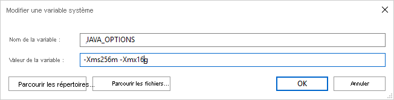

# <a name="parquet-format-in-azure-data-factory"></a>Format Parquet dans Azure Data Factory
[!INCLUDE[appliesto-adf-asa-md](includes/appliesto-adf-asa-md.md)]

Suivez cet article si vous souhaitez **analyser des fichiers Parquet ou écrire des données au format Parquet**. 

Le format Parquet est pris en charge pour les connecteurs suivants : [Amazon S3](connector-amazon-simple-storage-service.md), [Azure Blob](connector-azure-blob-storage.md), [Azure Data Lake Storage Gen1](connector-azure-data-lake-store.md), [Azure Data Lake Storage Gen2](connector-azure-data-lake-storage.md), [Azure File Storage](connector-azure-file-storage.md), [Système de fichiers](connector-file-system.md), [FTP](connector-ftp.md), [Google Cloud Storage](connector-google-cloud-storage.md), [HDFS](connector-hdfs.md), [HTTP](connector-http.md) et [SFTP](connector-sftp.md).

## <a name="dataset-properties"></a>Propriétés du jeu de données

Pour obtenir la liste complète des sections et propriétés disponibles pour la définition de jeux de données, consultez l’article [Jeux de données](concepts-datasets-linked-services.md). Cette section donne la liste des propriétés prises en charge par le jeu de données Parquet.

| Propriété         | Description                                                  | Obligatoire |
| ---------------- | ------------------------------------------------------------ | -------- |
| type             | La propriété type du jeu de données doit être définie sur **Parquet**. | Oui      |
| location         | Paramètres d’emplacement du ou des fichiers. Chaque connecteur basé sur un fichier possède ses propres type d’emplacement et propriétés prises en charge sous `location`. **Consultez les détails dans l’article du connecteur -> section des propriétés du jeu de données**. | Oui      |
| compressionCodec | Codec de compression à utiliser lors de l’écriture dans des fichiers Parquet. Lors de la lecture de fichiers Parquet, les fabriques de données déterminent automatiquement le codec de compression sur la base des métadonnées de fichier.<br>Les types pris en charge sont « **none** », « **gzip** », « **snappy** » (valeur par défaut) et « **lzo** ». Notez que l’activité de copie ne prend pas en charge LZO lors de la lecture ou de l’écriture des fichiers Parquet. | Non       |

> [!NOTE]
> Les espaces blancs dans le nom de colonne ne sont pas pris en charge pour les fichiers Parquet.

Voici un exemple de jeu de données Parquet sur Stockage Blob Azure :

```json
{
    "name": "ParquetDataset",
    "properties": {
        "type": "Parquet",
        "linkedServiceName": {
            "referenceName": "<Azure Blob Storage linked service name>",
            "type": "LinkedServiceReference"
        },
        "schema": [ < physical schema, optional, retrievable during authoring > ],
        "typeProperties": {
            "location": {
                "type": "AzureBlobStorageLocation",
                "container": "containername",
                "folderPath": "folder/subfolder",
            },
            "compressionCodec": "snappy"
        }
    }
}
```

## <a name="copy-activity-properties"></a>Propriétés de l’activité de copie

Pour obtenir la liste complète des sections et des propriétés disponibles pour la définition des activités, consultez l’article [Pipelines](concepts-pipelines-activities.md). Cette section fournit la liste des propriétés prises en charge par Parquet en tant que source et récepteur.

### <a name="parquet-as-source"></a>Parquet en tant que source

Les propriétés prises en charge dans la section ***\*source\**** de l’activité de copie sont les suivantes.

| Propriété      | Description                                                  | Obligatoire |
| ------------- | ------------------------------------------------------------ | -------- |
| type          | La propriété type de la source de l’activité de copie doit être définie sur **ParquetSource**. | Oui      |
| storeSettings | Un groupe de propriétés sur la façon de lire les données d’un magasin de données. Chaque connecteur basé sur un fichier possède ses propres paramètres de lecture pris en charge sous `storeSettings`. **Consultez les détails dans l’article du connecteur -> section des propriétés de l’activité de copie**. | Non       |

### <a name="parquet-as-sink"></a>Parquet en tant que récepteur

Les propriétés prises en charge dans la section ***\*récepteur\**** de l’activité de copie sont les suivantes.

| Propriété      | Description                                                  | Obligatoire |
| ------------- | ------------------------------------------------------------ | -------- |
| type          | La propriété type du récepteur de l’activité de copie doit être définie sur **ParquetSink**. | Oui      |
| formatSettings | Un groupe de propriétés. Reportez-vous au tableau **Paramètres d’écriture Parquet** ci-dessous. |    Non      |
| storeSettings | Groupe de propriétés sur la méthode d’écriture de données dans un magasin de données. Chaque connecteur basé sur un fichier possède ses propres paramètres d’écriture pris en charge sous `storeSettings`. **Consultez les détails dans l’article du connecteur -> section des propriétés de l’activité de copie**. | Non       |

**Paramètres d’écriture Parquet** pris en charge sous `formatSettings` :

| Propriété      | Description                                                  | Obligatoire                                              |
| ------------- | ------------------------------------------------------------ | ----------------------------------------------------- |
| type          | Le type de formatSettings doit être défini sur **ParquetWriteSettings**. | Oui                                                   |
| maxRowsPerFile | Lorsque vous écrivez des données dans un dossier, vous pouvez choisir d’écrire dans plusieurs fichiers et de spécifier le nombre maximal de lignes par fichier.  | Non |
| fileNamePrefix | Applicable lorsque `maxRowsPerFile` est configuré.<br> Spécifiez le préfixe du nom de fichier lors de l’écriture de données dans plusieurs fichiers, ce qui a généré ce modèle : `<fileNamePrefix>_00000.<fileExtension>`. S’il n’est pas spécifié, le préfixe du nom de fichier est généré automatiquement. Cette propriété ne s’applique pas lorsque la source est un magasin basé sur des fichiers ou un [magasin de données partition-option-enabled](copy-activity-performance-features.md).  | Non |

## <a name="mapping-data-flow-properties"></a>Propriétés du mappage de flux de données

Dans les flux de données de mappage, vous pouvez lire et écrire des données au format Parquet dans les magasins de données suivants : [Stockage Blob Azure](connector-azure-blob-storage.md#mapping-data-flow-properties), [Azure Data Lake Storage Gen1](connector-azure-data-lake-store.md#mapping-data-flow-properties) et [Azure Data Lake Storage Gen2](connector-azure-data-lake-storage.md#mapping-data-flow-properties).

### <a name="source-properties"></a>Propriétés sources

Le tableau ci-dessous liste les propriétés prises en charge par une source Parquet. Vous pouvez modifier ces propriétés sous l’onglet **Options de la source**.

| Nom | Description | Obligatoire | Valeurs autorisées | Propriété du script de flux de données |
| ---- | ----------- | -------- | -------------- | ---------------- |
| Format | Le format doit être `parquet`. | Oui | `parquet` | format |
| Chemins génériques | Tous les fichiers correspondant au chemin générique seront traités. Remplace le chemin du dossier et du fichier défini dans le jeu de données. | non | String[] | wildcardPaths |
| Chemin racine de la partition | Pour les données de fichier qui sont partitionnées, vous pouvez entrer le chemin racine d’une partition pour pouvoir lire les dossiers partitionnés comme des colonnes. | non | String | partitionRootPath |
| Liste de fichiers | Si votre source pointe ou non vers un fichier texte qui liste les fichiers à traiter | non | `true` ou `false` | fileList |
| Colonne où stocker le nom du fichier | Crée une colonne avec le nom et le chemin du fichier source | non | String | rowUrlColumn |
| Après l’exécution | Supprime ou déplace les fichiers après le traitement. Le chemin du fichier commence à la racine du conteneur | non | Supprimer : `true` ou `false` <br> Déplacer : `[<from>, <to>]` | purgeFiles <br> moveFiles |
| Filtrer par date de dernière modification | Pour filtrer les fichiers en fonction de leur date de dernière modification | non | Timestamp | modifiedAfter <br> modifiedBefore |
| N’autoriser aucun fichier trouvé | Si la valeur est true, aucune erreur n’est levée si aucun fichier n’est trouvé | non | `true` ou `false` | ignoreNoFilesFound |

### <a name="source-example"></a>Exemple de source

L’image ci-dessous est un exemple de configuration de source Parquet dans des flux de données de mappage.


Le script de flux de données associé est le suivant :

```
source(allowSchemaDrift: true,
    validateSchema: false,
    rowUrlColumn: 'fileName',
    format: 'parquet') ~> ParquetSource
```

### <a name="sink-properties"></a>Propriétés du récepteur

Le tableau ci-dessous liste les propriétés prises en charge par un récepteur Parquet. Vous pouvez modifier ces propriétés sous l’onglet **Paramètres**.

| Nom | Description | Obligatoire | Valeurs autorisées | Propriété du script de flux de données |
| ---- | ----------- | -------- | -------------- | ---------------- |
| Format | Le format doit être `parquet`. | Oui | `parquet` | format |
| Effacer le contenu du dossier | Si le dossier de destination est vidé avant l’écriture | non | `true` ou `false` | truncate |
| Option de nom de fichier | Format de nommage des données écrites. Par défaut, un fichier par partition au format `part-#####-tid-<guid>` | non | Modèle : String <br> Par partition : String[] <br> Comme les données de la colonne : String <br> Sortie dans un fichier unique : `['<fileName>']` | filePattern <br> partitionFileNames <br> rowUrlColumn <br> partitionFileNames |

### <a name="sink-example"></a>Exemple de récepteur

L’image ci-dessous est un exemple de configuration de récepteur Parquet dans des flux de données de mappage.


Le script de flux de données associé est le suivant :

```
ParquetSource sink(
    format: 'parquet',
    filePattern:'output[n].parquet',
    truncate: true,
    allowSchemaDrift: true,
    validateSchema: false,
    skipDuplicateMapInputs: true,
    skipDuplicateMapOutputs: true) ~> ParquetSink
```

## <a name="data-type-support"></a>Prise en charge des types de données

Les types de données complexes Parquet (par exemple, MAP, LIST, STRUCT) ne sont actuellement pris en charge que dans des Data Flows, et non dans l’activité de copie. Pour utiliser des types complexes dans des flux de données, n’importez pas le schéma de fichier dans le jeu de données, en laissant ainsi le schéma vide dans le jeu de données. Ensuite, dans la transformation de la source, importez la projection.

## <a name="using-self-hosted-integration-runtime"></a>Utilisation du runtime d’intégration auto-hébergé

> [!IMPORTANT]
> Dans le cas de copies permises par le runtime d'intégration auto-hébergé, par exemple entre des magasins de données locaux et cloud, si vous ne copiez pas les fichiers Parquet **tels quels**, vous devez installer **JRE 8 (Java Runtime Environment) 64 bits ou OpenJDK** et le **package redistribuable Microsoft Visual C++ 2010** sur votre machine de runtime d’intégration. Pour plus de détails, consultez le paragraphe suivant.

Dans le cas de copies s’exécutant sur l’IR auto-hébergé avec sérialisation/désérialisation des fichiers Parquet, ADF localise le runtime Java en vérifiant d’abord le registre *`(SOFTWARE\JavaSoft\Java Runtime Environment\{Current Version}\JavaHome)`* pour JRE puis, s’il ne le trouve pas, en vérifiant la variable système *`JAVA_HOME`* pour OpenJDK.

- **Pour utiliser JRE** : Le runtime d’intégration de 64 bits requiert la version 64 bits de JRE. Vous pouvez la récupérer [ici](https://go.microsoft.com/fwlink/?LinkId=808605).
- **Pour utiliser OpenJDK** : il est pris en charge à compter de la version 3.13 du runtime d’intégration. Empaquetez jvm.dll avec tous les autres assemblys requis d’OpenJDK dans la machine d’IR auto-hébergé et définissez la variable d’environnement système JAVA_HOME en conséquence.
- **Pour installer le package redistribuable Visual C++ 2010** : Le package redistribuable Visual C++ 2010 n’est pas installé avec les installations du runtime d’intégration auto-hébergé. Vous pouvez la récupérer [ici](https://www.microsoft.com/download/details.aspx?id=14632).

> [!TIP]
> Si, en copiant des données au format Parquet avec le runtime d’intégration auto-hébergé, vous obtenez une erreur indiquant « An error occurred when invoking java, message: **java.lang.OutOfMemoryError:Java heap space** », vous pouvez ajouter une variable d’environnement `_JAVA_OPTIONS` sur l’ordinateur qui héberge le runtime d’intégration auto-hébergé afin d’ajuster la taille de segment de mémoire minimale/maximale nécessaire pour que la machine virtuelle Java puisse effectuer une copie de ce type, puis réexécuter le pipeline.



Exemple : donnez la valeur `-Xms256m -Xmx16g` à la variable `_JAVA_OPTIONS`. L’indicateur `Xms` spécifie le pool d’allocation de mémoire initial pour une Machine virtuelle Java (JVM), tandis que `Xmx` spécifie le pool d’allocation de mémoire maximal. En d’autres termes, JVM démarrera avec la quantité de mémoire `Xms` et pourra au maximum utiliser la quantité de mémoire `Xmx`. Par défaut, ADF utilise au minimum 64 Mo et au maximum 1 Go.

## <a name="next-steps"></a>Étapes suivantes

- [Vue d’ensemble des activités de copie](copy-activity-overview.md)
- [Mappage de flux de données](concepts-data-flow-overview.md)
- [Activité de recherche](control-flow-lookup-activity.md)
- [Activité GetMetadata](control-flow-get-metadata-activity.md)
