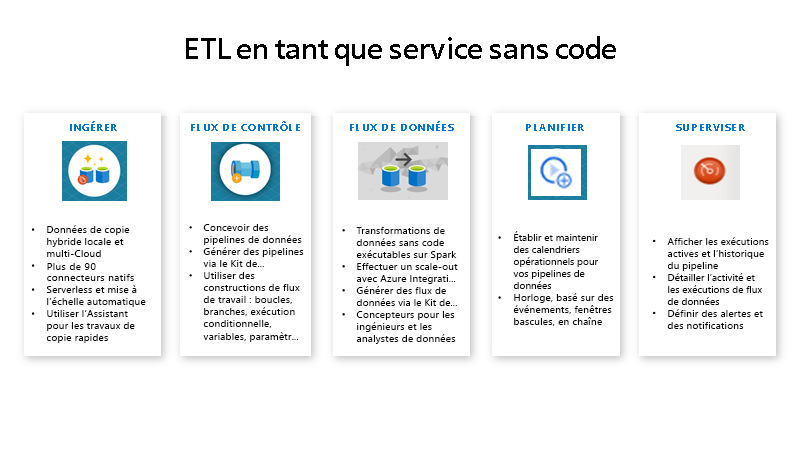

# qu'est-ce qu'Azure Data Factory ?

[!INCLUDE[appliesto-adf-xxx-md](includes/appliesto-adf-xxx-md.md)]

Dans le monde des Big Data, les données brutes et désorganisées sont souvent enregistrées dans des systèmes de stockage relationnels, non-relationnels et autres systèmes. Toutefois, lorsqu’elles sont isolées, les données brutes n’ont pas le contexte ou la signification appropriés pour fournir des informations significatives aux analystes, aux scientifiques des données ou aux décideurs en entreprise. 

Les Big Data requièrent un service qui permet d’orchestrer et d’opérationnaliser les processus pour affiner ces gigantesques magasins de données brutes pour les transformer en informations exploitables. Azure Data Factory est un service cloud géré créé pour ces projets complexes d’extraction, de transformation et de chargement (ETL), d’extraction, de chargement et de transformation (ELT) et d’intégration des données.

Prenons l’exemple d’une société d’édition de jeux qui rassemble plusieurs pétaoctets de journaux d’activité sur les jeux générés par les jeux dans le cloud. La société souhaite analyser ces journaux d’activité pour obtenir des informations détaillées sur les préférences des clients, les données démographiques et le comportement d’utilisation. Elle souhaite également identifier les opportunités de vente incitative et de ventes croisées, développer de nouvelles fonctionnalités attrayantes, accroître son activité et fournir une meilleure expérience à ses clients.

Pour analyser ces journaux d’activité, l’entreprise doit utiliser des données de référence comme des informations sur le client, des informations sur les jeux et des informations sur la campagne marketing qui sont contenues dans un magasin de données local. L’entreprise souhaite utiliser ces données issues du magasin de données local et les combiner avec d’autres données de journal dont elle dispose dans un magasin de données dans le cloud. 

Pour extraire des informations, elle souhaite traiter les données combinées au moyen d’un cluster Spark dans le cloud (Azure HDInsight) et publier les données transformées dans un entrepôt de données cloud, tel qu’Azure SQL Data Warehouse, afin de pouvoir créer facilement un rapport à partir de celles-ci. Ils souhaitent automatiser ce flux de travail, et le surveiller et le gérer sur une base quotidienne. Ils veulent également l’exécuter lorsque les fichiers arrivent dans un conteneur de magasin d’objets blob.

Azure Data Factory est la plateforme qui résout les scénarios de données de ce type. Il s’agit d’un *service d’ETL et d’intégration de données basé sur le cloud, qui vous permet de créer des workflows orientés données pour l’orchestration des déplacements de données et pour la transformation des données à grande échelle*. À l’aide d’Azure Data Factory, vous pouvez créer et planifier des flux de travail pilotés par les données (appelés pipelines) qui peuvent ingérer des données provenant de différents magasins de données. Vous pouvez créer des processus ETL complexes qui transforment les données visuellement avec des flux de données ou en utilisant des services de calcul comme Azure HDInsight Hadoop, Azure Databricks et Azure SQL Database. 

En outre, vous pouvez publier vos données transformées vers des magasins de données, comme Azure SQL Data Warehouse, pour que des applications décisionnelles puissent les consommer. Enfin, via Azure Data Factory, les données brutes peuvent être organisées en magasins de données et lacs de données pertinents en vue d’améliorer les prises de décisions.

## Comment cela fonctionne-t-il ?

Data Factory contient une série de systèmes interconnectés qui fournissent une plateforme de bout en bout complète pour les ingénieurs de données.

### Se connecter et collecter

Les entreprises disposent de données de différents types situées dans différentes sources locales, dans le cloud, structurées, non structurées et semi-structurées, toutes récupérées à des intervalles et à des vitesses variables. 

La première étape dans la création d'un système de production d’informations consiste à se connecter à toutes les sources nécessaires de données et de traitement des données comme les services Logiciel en tant que service (SaaS) et les services web de bases de données, de partage de fichiers et FTP. L’étape suivante consiste à déplacer les données souhaitées vers un emplacement centralisé pour un traitement ultérieur.

Sans Data Factory, les entreprises doivent concevoir des composants personnalisés chargés du déplacement des données ou écrire des services personnalisés pour intégrer ces sources de données et leur traitement. Il est coûteux et difficile d’intégrer et de gérer ces systèmes. En outre, ils sont souvent dépourvus des fonctionnalités de surveillance, d’alertes et de contrôles de niveau entreprise qu’un service entièrement géré peut offrir.

Avec Data Factory, vous pouvez utiliser l’[activité de copie](copy-activity-overview.md) dans un pipeline de données pour déplacer les données source des magasins de données locaux et dans le cloud vers un magasin de données centralisé dans le cloud, à des fins d’analyse ultérieure. Par exemple, vous pouvez collecter des données dans Azure Data Lake Storage et les transformer plus tard à l’aide d’un service de calcul Azure Data Lake Analytics. Vous pouvez aussi collecter des données dans un stockage Blob Azure, puis les transformer ultérieurement à l’aide d’un cluster Azure HDInsight Hadoop.

### Transformer et enrichir
Une fois que les données sont présentes dans un magasin de données centralisé dans le cloud, traitez ou transformez les données collectées en utilisant des flux de données de mappage Azure Data Factory. Les flux de données permettent aux ingénieurs des données de créer et de gérer des graphes de transformation de données qui s’exécutent sur Spark, sans avoir à comprendre les clusters Spark ou la programmation Spark.

Si vous préférez programmer des transformations manuellement, Azure Data Factory prend en charge les activités externes pour l’exécution de vos transformations sur des services de calcul comme HDInsight Hadoop, Spark, Data Lake Analytics et Machine Learning.

### CI/CD et publication
Data Factory offre une prise en charge complète de l’intégration continue/livraison continue (CI/CD) de vos pipelines de données avec Azure DevOps et GitHub. Ceci vous permet de développer et de distribuer de façon incrémentielle vos processus ETL avant de publier le produit fini. Une fois que les données brutes ont été affinées sous une forme utilisable par l’entreprise, chargez-les dans Azure Data Warehouse, Azure SQL Database, Azure CosmosDB ou n’importe quel moteur d’analyse auquel vos utilisateurs peuvent accéder à partir de leurs outils d’analyse décisionnelle.

### Superviser
Une fois que vous avez créé et déployé votre pipeline d’intégration de données afin de bénéficier de la valeur commerciale fournie par les données affinées, surveillez les activités planifiées et les pipelines pour connaître les taux de réussite et d’échec. Azure Data Factory intègre une prise en charge de la supervision des pipelines par le biais d’Azure Monitor, une API, PowerShell, des journaux Azure Monitor et les panneaux de contrôle d’intégrité du portail Azure.

## Concepts de niveau supérieur
Un abonnement Azure peut contenir une ou plusieurs instances Azure Data Factory (ou fabriques de données). Azure Data Factory s’articule autour de quatre composants clés. Ces composants fonctionnent ensemble et vous dotent de la plateforme sur laquelle composer des flux de travail orientés données constitués d’étapes de déplacement et de transformation des données.

### Pipeline
Une fabrique de données peut avoir un ou plusieurs pipelines. Un pipeline est un regroupement logique des activités nécessaires pour effectuer une unité de travail. Ensemble, les activités d’un pipeline effectuent une tâche. Par exemple, un pipeline peut contenir un groupe d’activités qui ingère des données à partir d’un objet Blob Azure, puis exécute une requête Hive sur un cluster HDInsight pour partitionner les données. 

L’avantage de cette opération, c’est que le pipeline vous permet de gérer les activités en tant qu’ensemble et non pas individuellement. Les activités d’un pipeline peuvent être chaînées pour fonctionner de manière séquentielle ou peuvent fonctionner en parallèle de façon indépendante.

### Mappage des flux de données
Créez et gérez des graphes de logique de transformation des données que vous pouvez utiliser pour transformer des données de n’importe quelle taille. Vous pouvez créer une bibliothèque réutilisable de routines de transformation de données et exécuter ces processus avec un scale-out depuis vos pipelines Azure Data Factory. Data Factory va exécuter votre logique sur un cluster Spark qui fonctionne et s’arrête quand vous en avez besoin. Vous ne devez jamais gérer ni maintenir des clusters.

### Activité
Les activités représentent une étape de traitement dans un pipeline. Par exemple, vous pouvez utiliser une activité de copie pour copier des données d’un magasin de données vers un autre. De même, vous pouvez utiliser une activité Hive qui exécute une requête Hive sur un cluster Azure HDInsight afin de convertir ou d’analyser vos données. Data Factory prend en charge trois types d’activités : les activités de déplacement des données, les activités de transformation des données et les activités de contrôle.

### Groupes de données
Les jeux de données représentent les structures des données dans les magasins. Ils pointent vers ou référencent simplement en tant qu’entrées ou sorties les données que vous voulez utiliser dans vos activités. 

### Services liés
Les services liés ressemblent à des chaînes de connexion. Ils définissent les informations de connexion nécessaires à Data Factory pour se connecter à des ressources externes. Voyez les choses de la façon suivante : un service lié définit la connexion à la source de données et un jeu de données représente la structure des données. Par exemple, un service lié Stockage Azure spécifie la chaîne de connexion pour se connecter au compte de stockage Azure. De plus, un jeu de données blob Azure spécifie le conteneur d’objets blob et le dossier qui contient les données.

Data Factory fait appel aux services liés pour deux raisons :

- Pour représenter un **magasin de données** qui inclut, sans s’y limiter, une base de données SQL Server, une base de données Oracle, un partage de fichiers locaux ou un compte de stockage d’objets blob Azure. Pour obtenir la liste des banques de données prises en charge, consultez l’article sur l’[activité de copie](copy-activity-overview.md).

- Pour représenter une **ressource de calcul** qui peut héberger l’exécution d’une activité. Par exemple, l’activité HDInsightHive s’exécute sur un cluster HDInsight Hadoop. Pour obtenir la liste des activités de transformation et des environnements Compute pris en charge, consultez l’article sur la [transformation des données](transform-data.md).

### Déclencheurs
Les déclencheurs correspondent à l’unité de traitement qui détermine le moment auquel une exécution de pipeline doit être lancée. Il existe différents types de déclencheurs pour différents types d’événements.

### Exécutions de pipeline
Une exécution du pipeline est une instance de l’exécution du pipeline. Les exécutions de pipeline sont généralement instanciées par la transmission des arguments aux paramètres définis dans les pipelines. Les arguments peuvent être transmis manuellement ou être inclus dans la définition du déclencheur.

### Paramètres
Les paramètres sont des paires clé-valeur de configuration en lecture seule.  Les paramètres sont définis dans le pipeline. Les arguments des paramètres définis sont transmis au cours de l’exécution à partir du contexte d’exécution qui a été créé par un déclencheur ou un pipeline qui a été exécuté manuellement. Les activités contenues dans le pipeline utilisent les valeurs des paramètres.

Un jeu de données est un paramètre fortement typé et une entité réutilisable/pouvant être référencée. Une activité peut faire référence à des jeux de données et utiliser les propriétés définies dans la définition du jeu de données.

Un service lié est également un paramètre fortement typé qui contient les informations de connexion à un magasin de données ou à un environnement Compute. C’est également une entité réutilisable/pouvant être référencée.

### Flux de contrôle
Control flow est une orchestration des activités du pipeline, qui inclut le chaînage des activités en une séquence, la création de branches, la définition de paramètres au niveau du pipeline et la transmission des arguments lors de l’appel du pipeline à la demande ou à partir d’un déclencheur. Il inclut également la transmission d’états personnalisés et le bouclage des conteneurs, autrement dit, des itérateurs ForEach.

### Variables
Des variables peuvent être utilisées dans des pipelines pour stocker des valeurs temporaires et elles peuvent également être utilisées conjointement avec des paramètres pour permettre le passage de valeurs entre des pipelines, des flux de données et d’autres activités.

## Étapes suivantes
Voici des documents importants à explorer pour l’étape suivante :

- [Jeux de données et services liés](concepts-datasets-linked-services.md)
- [Pipelines et activités](concepts-pipelines-activities.md)
- [Runtime d’intégration](concepts-integration-runtime.md)
- [Mappage des flux de données](concepts-data-flow-overview.md)
- [IU Data Factory dans le portail Azure](quickstart-create-data-factory-portal.md)
- [Outil Copier les données dans le portail Azure](quickstart-create-data-factory-copy-data-tool.md)
- [PowerShell](quickstart-create-data-factory-powershell.md)
- [.NET](quickstart-create-data-factory-dot-net.md)
- [Python](quickstart-create-data-factory-python.md)
- [REST](quickstart-create-data-factory-rest-api.md)
- [Modèle Azure Resource Manager](quickstart-create-data-factory-resource-manager-template.md)
 
