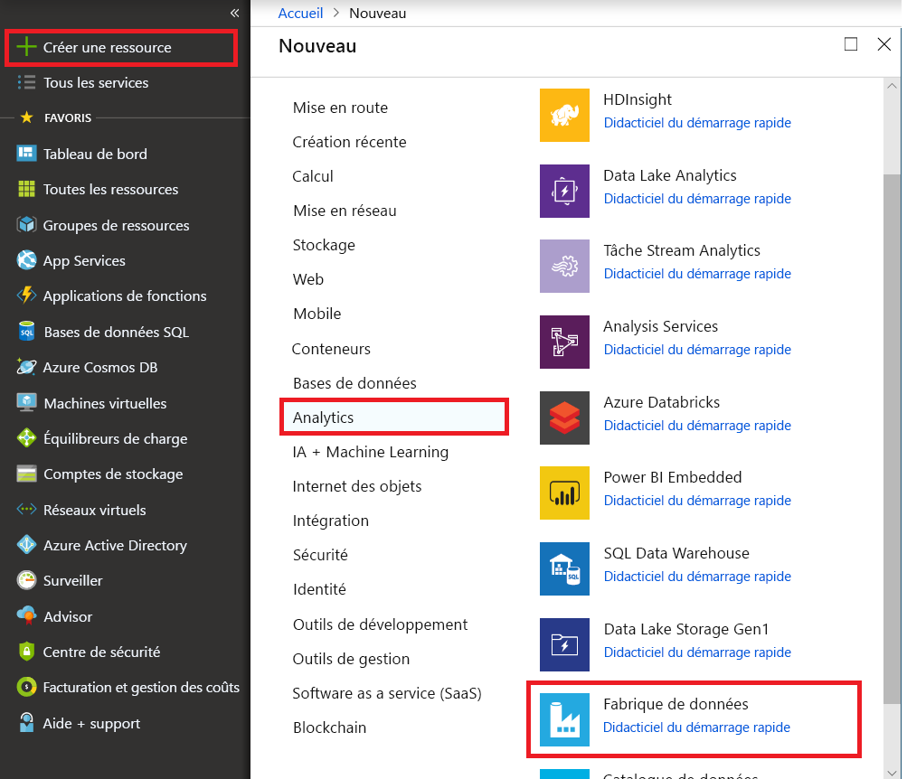

# Charger des données dans Azure SQL Data Warehouse à l’aide d’Azure Data Factory

[Azure SQL Data Warehouse](../sql-data-warehouse/sql-data-warehouse-overview-what-is.md) est une base de données de mise à l’échelle basée sur le cloud qui prend en charge le traitement de grands volumes de données relationnelles et non relationnelles. SQL Data Warehouse repose sur une architecture MPP (massively parallel processing) optimisée pour les charges de travail d’entrepôt de données d’entreprise. Elle offre l’élasticité du cloud avec la flexibilité de mettre à l’échelle le stockage et d’exécuter le calcul indépendamment.

La prise en main d’Azure SQL Data Warehouse est désormais plus facile lorsque vous utilisez Azure Data Factory. Azure Data Factory est un service informatique d’intégration de données informatique intégralement managé. Vous pouvez utiliser le service pour remplir une base de données SQL Data Warehouse avec les données de votre système existant et gagner du temps lors de la création de vos solutions d’analyse.

Azure Data Factory offre les avantages suivants pour le chargement des données dans Azure SQL Data Warehouse :

* **Facilité de configuration** : assistant intuitif en 5 étapes. Aucun script nécessaire.
* **Prise en charge étendue du magasin de données** : prise en charge intégrée d’un ensemble complet de magasins de données locaux et dans le cloud. Pour une liste détaillée, consultez le tableau [Banques de données prises en charge](copy-activity-overview.md#supported-data-stores-and-formats).
* **Sécurité et conformité** : les données sont transférées via HTTPS ou ExpressRoute. La présence globale du service garantit que vos données ne quittent jamais les limites géographiques.
* **Performances sans précédent à l’aide de PolyBase** : PolyBase est le moyen le plus efficace de déplacer des données dans Azure SQL Data Warehouse. Utilisez la fonction blob intermédiaire pour atteindre des vitesses de charge élevées pour tous les types de magasins de données, y compris le stockage Blob Azure et Data Lake Store. (Polybase prend en charge le stockage Blob Azure et Azure Data Lake Store par défaut.) Pour en savoir plus, voir [Performances de l’activité de copie](copy-activity-performance.md).

Cet article explique comment utiliser l’outil de copie de données Data Factory pour _charger des données d’Azure SQL Database dans Azure SQL Data Warehouse_. Vous pouvez procéder de même pour copier des données à partir d’autres types de banques de données.

> [!NOTE]
> Pour plus d’informations, consultez [Copier des données depuis/vers Azure SQL Data Warehouse à l’aide d’Azure Data Factory](connector-azure-sql-data-warehouse.md).

## Conditions préalables requises

* Abonnement Azure : Si vous n’avez pas d’abonnement Azure, créez un [compte gratuit](https://azure.microsoft.com/free/) avant de commencer.
* Azure SQL Data Warehouse : l'entrepôt de données conserve les données copiées à partir de SQL Database. Si vous n’avez pas d’entrepôt de données Azure SQL Data Warehouse, consultez les instructions dans [Créer un entrepôt de données SQL](../sql-data-warehouse/sql-data-warehouse-get-started-tutorial.md).
* Azure SQL Database : ce tutoriel copie les données à partir d’une base de données SQL avec l’exemple de données Adventure Works LT. Vous pouvez créer une base de données SQL en suivant les instructions dans [Création d’une base de données Azure SQL](../sql-database/sql-database-get-started-portal.md). 
* Compte Azure Storage : Stockage Azure est utilisé comme objet blob _intermédiaire_ dans l’opération de copie en bloc. Si vous ne possédez pas de compte de stockage Azure, consultez les instructions dans [Créer un compte de stockage](../storage/common/storage-quickstart-create-account.md).

## Créer une fabrique de données

1. Dans le menu de gauche, sélectionnez **Créer une ressource** > **Données + Analytique** > **Data Factory** : 
   
   

2. Sur la page **Nouvelle fabrique de données**, fournissez les valeurs des champs qui apparaissent dans l’image suivante :
      
   
 
    * **Name** : Entrez un nom global unique pour votre fabrique de données Azure. Si l’erreur « Le nom de fabrique de données \"LoadSQLDWDemo\" n’est pas disponible » apparaît, saisissez un autre nom pour la fabrique de données. Par exemple, utilisez le nom _**votrenom**_ **ADFTutorialDataFactory**. Essayez à nouveau de créer la fabrique de données. Pour savoir comment nommer les artefacts Data Factory, voir [Data Factory - Règles d’affectation des noms](naming-rules.md).
    * **Abonnement**: Sélectionnez l’abonnement Azure dans lequel créer la fabrique de données. 
    * **Groupe de ressources** : Sélectionnez un groupe de ressources existant dans la liste déroulante ou sélectionnez l’option **Créer** et entrez le nom d’un groupe de ressources. Pour plus d’informations sur les groupes de ressources, consultez [Utilisation des groupes de ressources pour gérer vos ressources Azure](../azure-resource-manager/management/overview.md).  
    * **Version** : Sélectionnez **V2**.
    * **Emplacement** : Sélectionnez l’emplacement de la fabrique de données. Seuls les emplacements pris en charge sont affichés dans la liste déroulante. Les magasins de données utilisés par la fabrique de données peuvent se trouver dans d’autres emplacements et régions. Ces magasins de données incluent Azure Data Lake Store, Stockage Azure, Azure SQL Database, etc.

3. Sélectionnez **Create** (Créer).
4. Une fois la création terminée, accédez à votre fabrique de données. La page d’accueil **Data Factory** devrait s’afficher comme dans l’image suivante :
   
   

   Sélectionnez la vignette **Créer et surveiller** pour lancer l’application d’intégration de données dans un onglet séparé.

## Chargement de données dans Azure SQL Data Warehouse

1. Dans la page **Prise en main**, sélectionnez la vignette **Copier les données** pour démarrer l’outil Copier les données :

   
1. Dans la page **Propriétés**, spécifiez **CopyFromSQLToSQLDW** dans le champ **Nom de tâche**, puis cliquez sur **Suivant** :

    

1. Dans la page **Banque de données source**, effectuez les étapes suivantes :

    a. Cliquez sur **+ Créer une connexion** :

    

    b. Sélectionnez **Azure SQL Database** dans la galerie, puis sélectionnez **Continuer**. Vous pouvez taper « SQL » dans la zone de recherche pour filtrer les connecteurs.

    

    c. Dans la page **Nouveau service lié**, sélectionnez le nom de votre serveur et le nom de votre base de données dans la liste déroulante, puis spécifiez le nom d’utilisateur et le mot de passe. Cliquez sur **Tester la connexion** pour vérifier les paramètres, puis sélectionnez **Terminer**.
   
    

    d. Sélectionnez le service lié récemment créé comme source, puis cliquez sur **Suivant**.

    

1. Dans la page **Sélectionner les tables à partir desquelles copier les données ou utiliser une requête personnalisée**, entrez **SalesLT** pour filtrer les tables. Activez la case **(Sélectionner tout)** pour utiliser toutes les tables pour la copie, puis cliquez sur **Suivant** : 

    

1. Dans la page **Banque de données de destination**, effectuez les étapes suivantes :

    a. Cliquez sur **+ Créer une connexion** pour ajouter une connexion.

    

    b. Sélectionnez **Azure SQL Data Warehouse** dans la galerie, puis sélectionnez **Suivant**.

    

    c. Dans la page **Nouveau service lié**, sélectionnez le nom de votre serveur et le nom de votre base de données dans la liste déroulante, puis spécifiez le nom d’utilisateur et le mot de passe. Cliquez sur **Tester la connexion** pour vérifier les paramètres, puis sélectionnez **Terminer**.
   
    

    d. Sélectionnez le service lié nouvellement créé comme récepteur, puis cliquez sur **Suivant**.

    

1. Dans la page **Mappage de table**, passez en revue le contenu, puis cliquez sur **Suivant**. Un mappage de table intelligent s’affiche. Les tables source sont mappées sur les tables de destination en fonction des noms de tables. Si une table source n’existe pas dans la destination, Azure Data Factory crée une table de destination par défaut qui porte le même nom. Vous pouvez également mapper une table source sur une table de destination existante. 

   > [!NOTE]
   > La création automatique de table pour le récepteur SQL Data Warehouse s’applique quand SQL Server ou Azure SQL Database est la source. Si vous copiez des données à partir d’un autre magasin de données source, vous devez précréer le schéma dans le récepteur Azure SQL Data Warehouse avant d’exécuter la copie des données.

   

1. Dans la page **Mappage de table**, passez en revue le contenu, puis cliquez sur **Suivant**. Le mappage de table intelligent repose sur le nom de colonne. Lorsque vous autorisez Data Factory à créer automatiquement les tables, la conversion du type de données peut se produire en cas d’incompatibilités entre les magasins source et de destination. Si la conversion du type de données n’est pas prise en charge entre la colonne de destination source et de destination, un message d’erreur s’affiche en regard de la table correspondante.

    

1. Dans la page **Paramètres**, effectuez les étapes suivantes :

    a. Dans **Paramètres de préproduction**, cliquez sur **+ Nouveau** pour créer un stockage de préproduction. Le stockage est utilisé pour les données en préproduction avant leur chargement dans SQL Data Warehouse avec PolyBase. Une fois la copie terminée, les données temporaires du stockage Azure sont nettoyées automatiquement. 

    

    b. Dans la page **Nouveau service lié**, sélectionnez votre compte de stockage, puis sélectionnez **Terminer**.
   
    

    c. Dans la section **Paramètres avancés**, décochez l’option **Utiliser le type par défaut**, puis sélectionnez **Suivant**.

    

1. Dans la page **Résumé**, vérifiez les paramètres, puis cliquez sur **Suivant** :

    
1. Dans la page **Déploiement**, sélectionnez **Surveiller** pour surveiller le pipeline (tâche) :

    
1. Notez que l’onglet **Surveiller** sur la gauche est sélectionné automatiquement. La colonne **Actions** comprend les liens permettant d’afficher les détails de l’exécution de l’activité et de réexécuter le pipeline : 

    
1. Pour afficher les exécutions d’activités associées à l’exécution du pipeline, sélectionnez le lien **Afficher les exécutions d’activités** dans la colonne **Actions**. Pour revenir à l’affichage des exécutions du pipeline, sélectionnez le lien **Pipelines** affiché en haut de la fenêtre. Sélectionnez **Actualiser** pour actualiser la liste. 

    

1. Pour surveiller l’exécution de chaque activité de copie, cliquez sur le lien **Détails** sous **Actions** dans la page de surveillance des activités. Vous pouvez suivre les informations détaillées comme le volume de données copiées à partir de la source dans le récepteur, le débit des données, les étapes d’exécution avec une durée correspondante et les configurations utilisées :

    

## Étapes suivantes

Lisez l’article suivant pour en savoir plus sur la prise en charge d’Azure SQL Data Warehouse : 

> [!div class="nextstepaction"]
>[Connecteur Azure SQL Data Warehouse](connector-azure-sql-data-warehouse.md)
