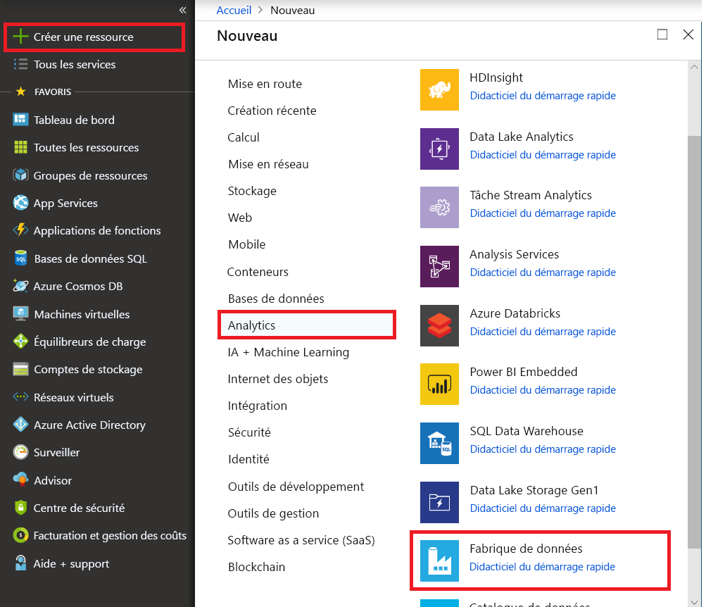
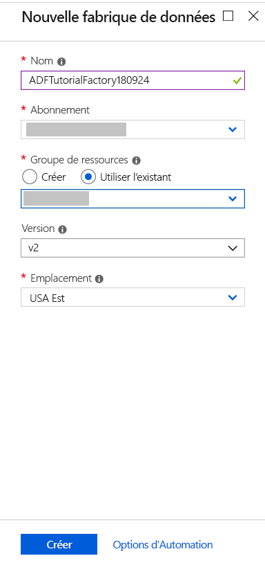
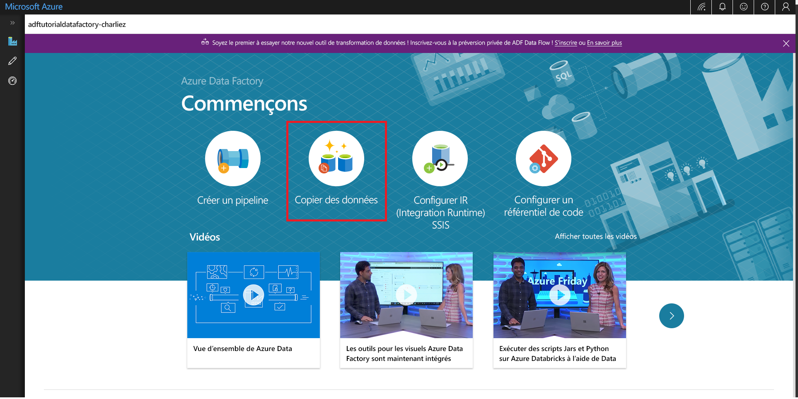

# Utiliser l’outil Copier des données pour copier des données 
> [!div class="op_single_selector" title1="Select the version of Data Factory service that you are using:"]
> * [Version 1](v1/data-factory-copy-data-from-azure-blob-storage-to-sql-database.md)
> * [Version actuelle](quickstart-create-data-factory-copy-data-tool.md)

Dans ce guide de démarrage rapide, vous utilisez le portail Azure pour créer une fabrique de données. Vous utilisez ensuite l’outil Copier des données pour créer un pipeline qui copie des données depuis un dossier dans un stockage d’objets Blob Azure vers un autre dossier. 

> [!NOTE]
> Si vous débutez avec Azure Data Factory, consultez [Présentation d’Azure Data Factory](data-factory-introduction.md) avant de commencer ce guide de démarrage rapide. 

[!INCLUDE [data-factory-quickstart-prerequisites](../../includes/data-factory-quickstart-prerequisites.md)] 

## Créer une fabrique de données

1. Sélectionnez **Nouveau** dans le menu de gauche, sélectionnez **Données + Analytique**, puis **Data Factory**. 
   
   
2. Dans la page **Nouvelle fabrique de données**, entrez **ADFTutorialDataFactory** comme **nom**. 
      
   
 
   Le nom de la fabrique de données Azure doit être un nom *global unique*. Si l’erreur suivante s’affiche, changez le nom de la fabrique de données (par exemple, **&lt;votrenom&gt;ADFTutorialDataFactory**), puis tentez de la recréer. Consultez l’article [Data Factory - Règles d’affectation des noms](naming-rules.md) pour en savoir plus sur les règles d’affectation des noms d’artefacts Data Factory.
  
   
3. Pour **Abonnement**, sélectionnez l’abonnement Azure dans lequel vous voulez créer la fabrique de données. 
4. Pour **Groupe de ressources**, réalisez l’une des opérations suivantes :
     
   - Sélectionnez **Utiliser l’existant**, puis sélectionnez un groupe de ressources existant dans la liste. 
   - Sélectionnez **Créer**, puis entrez le nom d’un groupe de ressources.   
         
   Pour plus d’informations sur les groupes de ressources, consultez [Utilisation des groupes de ressources pour gérer vos ressources Azure](../azure-resource-manager/resource-group-overview.md).  
4. Pour **Version**, sélectionnez **V2**.
5. Pour **Emplacement**, sélectionnez l’emplacement de la fabrique de données. 

   Seuls les emplacements pris en charge sont affichés dans la liste. Les magasins de données (tels que le Stockage Azure et Azure SQL Database) et les services de calcul (comme Azure HDInsight) utilisés par Data Factory peuvent se trouver dans d’autres emplacements/régions.

6. Sélectionnez **Épingler au tableau de bord**.     
7. Sélectionnez **Créer**.
8. Sur le tableau de bord, vous voyez la vignette suivante avec l’état **Déploiement de Data Factory** : 

    
9. Une fois la création terminée, la page **Data Factory** s’affiche. Sélectionnez la vignette **Créer et surveiller** pour démarrer l’application d’interface utilisateur (IU) d’Azure Data Factory dans un onglet séparé.
   
   

## Démarrer l’outil Copier des données

1. Sur la page **Prise en main**, sélectionnez la vignette **Copier des données** pour démarrer l’outil Copier des données. 

   

2. Sur la page **Propriétés** de l’outil de copie des données, vous pouvez spécifier un nom pour le pipeline et sa description. Sélectionnez ensuite **Suivant**. 

   
3. Sur la page **Banque de données source**, procédez comme suit :

    a. Cliquez sur **+Créer une connexion** pour ajouter une connexion.

    

    b. Sélectionnez **Stockage Blob Azure** à partir de la galerie, puis sélectionnez **Suivant**.

    

    c. Sur la page **Spécifier le compte de stockage d’objets Blob Azure**, sélectionnez votre compte de stockage dans la liste **Nom de compte de stockage**, puis cliquez sur **Terminer**. 

   

   d. Sélectionnez le service lié récemment créé comme source, puis cliquez sur **Suivant**.

   

4. Sur la page **Choisir le fichier ou le dossier de sortie**, procédez comme suit :

   a. Cliquez sur **Parcourir** pour accédez au dossier **adftutorial/input**, sélectionnez le fichier **emp.txt**, puis cliquez sur **Terminer**. 

   

   d. Cochez l’option **Copie binaire** pour copier le fichier tel quel, puis sélectionnez **Suivant**. 

   

5. Dans la page **Magasin de données de destination**, sélectionnez le service lié **Stockage Blob Azure** que vous venez de créer, puis cliquez sur **Suivant**. 

   

6. Sur la page **Choisir le fichier ou le dossier de sortie**, entrez **adftutorial/output** comme chemin d'accès, puis cliquez sur **Suivant**. 

    

7. Sur la page **Paramètres**, cliquez sur **Suivant** pour utiliser les configurations par défaut. 

8. Dans la page **Résumé**, passez en revue tous les paramètres, puis cliquez sur **Suivant**. 

    

9. Sur la page **Déploiement terminé**, sélectionnez **Surveiller** pour surveiller le pipeline que vous avez créé. 

    

10. L’application bascule vers l’onglet **Surveiller**. Vous voyez l’état du pipeline dans cet onglet. Sélectionnez **Actualiser** pour actualiser la liste. 
    
    

11. Cliquez sur le lien **Afficher les exécutions d’activités** dans la colonne **Actions**. Le pipeline n’a qu’une seule activité de type **Copier**. 

    
    
12. Pour afficher les détails de l’opération de copie, cliquez sur le lien **Détails** (image en forme de lunettes) dans la colonne **Actions**. Pour plus d’informations sur les propriétés, consultez [Vue d’ensemble de l’activité de copie](copy-activity-overview.md).

    

13. Vérifiez que le fichier **emp.txt** est créé dans le dossier **de sortie** du conteneur **adftutorial**. Si le dossier de sortie n’existe pas, le service Data Factory le crée automatiquement. 

14. Passez sur l’onglet **Auteur** au-dessus de l’onglet **Surveiller** du volet gauche afin de pouvoir modifier les services liés, jeux de données et pipelines. Pour apprendre à les modifier dans l’interface utilisateur de Data Factory, consultez [Créer une fabrique de données à l’aide du portail Azure](quickstart-create-data-factory-portal.md).

## Étapes suivantes
Dans cet exemple, le pipeline copie les données d’un emplacement vers un autre dans un stockage Blob Azure. Pour en savoir plus sur l’utilisation de Data Factory dans d’autres scénarios, consultez les [didacticiels](tutorial-copy-data-portal.md). 