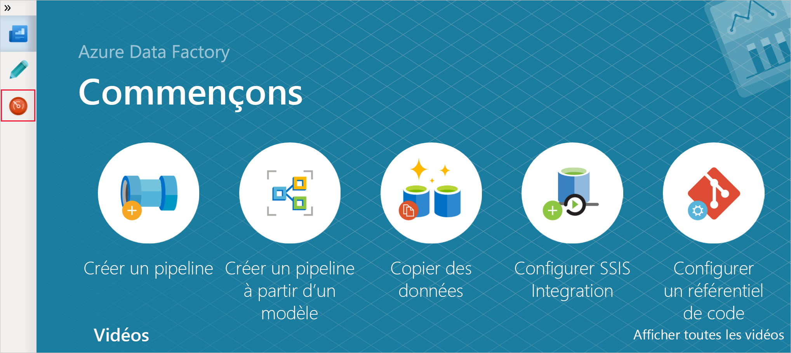
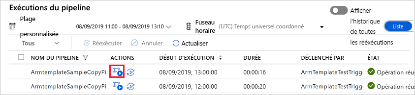
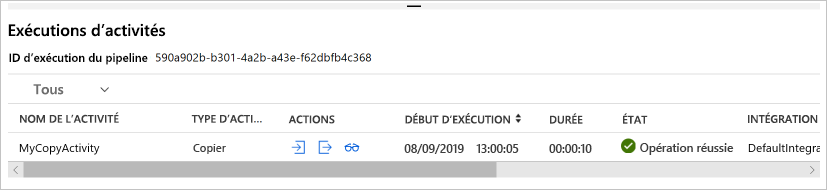

# <a name="tutorial-create-an-azure-data-factory-using-azure-resource-manager-template"></a>Tutoriel : Créer une fabrique de données Azure à l’aide du modèle Azure Resource Manager

> [!div class="op_single_selector" title1="Sélectionnez la version du service Data Factory que vous utilisez :"]
> * [Version 1](v1/data-factory-build-your-first-pipeline-using-arm.md)
> * [Version actuelle](quickstart-create-data-factory-resource-manager-template.md)

Ce démarrage rapide vous montre comment utiliser un modèle Azure Resource Manager pour créer une fabrique de données Azure. Le pipeline que vous créez dans cette fabrique de données **copie** les données d’un dossier vers un autre dossier dans un stockage Blob Azure. Pour suivre un tutoriel sur la **transformation** des données à l’aide d’Azure Data Factory, consultez [Tutoriel : Transformer des données à l’aide de Spark](transform-data-using-spark.md).

> [!NOTE]
> Cet article ne fournit pas de présentation détaillée du service Data Factory. Pour une présentation du service Azure Data Factory, consultez [Présentation d’Azure Data Factory](introduction.md).

[!INCLUDE [data-factory-quickstart-prerequisites](../../includes/data-factory-quickstart-prerequisites.md)]

### <a name="azure-powershell"></a>Azure PowerShell

[!INCLUDE [updated-for-az](../../includes/updated-for-az.md)]

Installez les modules Azure PowerShell les plus récents en suivant les instructions décrites dans [Comment installer et configurer Azure PowerShell](/powershell/azure/install-Az-ps).

## <a name="resource-manager-templates"></a>Modèles Resource Manager

Pour en savoir plus sur les modèles Azure Resource Manager, consultez l’article [Création de modèles Azure Resource Manager](../azure-resource-manager/templates/template-syntax.md).

La section suivante fournit le modèle Resource Manager complet permettant de définir des entités Data Factory pour que vous puissiez rapidement parcourir le didacticiel et tester le modèle. Pour comprendre comment chaque entité Data Factory est définie, consultez la section [Entités Data Factory dans le modèle](#data-factory-entities-in-the-template).

Pour en savoir plus sur la syntaxe JSON et les propriétés à utiliser pour les ressources Data Factory dans un modèle, consultez [Types de ressources Microsoft.DataFactory](/azure/templates/microsoft.datafactory/allversions).

## <a name="data-factory-json"></a>JSON de la fabrique de données

Créez un fichier JSON nommé **ADFTutorialARM.json** dans le dossier **C:\ADFTutorial** (créez le dossier ADFTutorial s’il n’existe pas déjà) avec le contenu suivant :

```json
{  
    "$schema":"http://schema.management.azure.com/schemas/2015-01-01/deploymentTemplate.json#",
    "contentVersion":"1.0.0.0",
    "parameters":{  
        "dataFactoryName":{  
            "type":"string",
            "metadata":"Data Factory Name"
        },
        "dataFactoryLocation":{  
            "type":"string",
            "defaultValue":"East US",
            "metadata":{  
                "description":"Location of the data factory. Currently, only East US, East US 2, and West Europe are supported. "
            }
        },
        "storageAccountName":{  
            "type":"string",
            "metadata":{  
                "description":"Name of the Azure storage account that contains the input/output data."
            }
        },
        "storageAccountKey":{  
            "type":"securestring",
            "metadata":{  
                "description":"Key for the Azure storage account."
            }
        },
        "triggerStartTime": {
            "type": "string",
            "metadata": {
                "description": "Start time for the trigger."
            }
        },
        "triggerEndTime": {
            "type": "string",
            "metadata": {
                "description": "End time for the trigger."
            }
        }
    },      
    "variables":{  
        "factoryId":"[concat('Microsoft.DataFactory/factories/', parameters('dataFactoryName'))]"
    },
    "resources":[  
        {  
            "name":"[parameters('dataFactoryName')]",
            "apiVersion":"2018-06-01",
            "type":"Microsoft.DataFactory/factories",
            "location":"[parameters('dataFactoryLocation')]",
            "identity":{  
                "type":"SystemAssigned"
            },
            "resources":[  
                {  
                    "name":"[concat(parameters('dataFactoryName'), '/ArmtemplateStorageLinkedService')]",
                    "type":"Microsoft.DataFactory/factories/linkedServices",
                    "apiVersion":"2018-06-01",
                    "properties":{  
                        "annotations":[  

                        ],
                        "type":"AzureBlobStorage",
                        "typeProperties":{  
                            "connectionString":"[concat('DefaultEndpointsProtocol=https;AccountName=',parameters('storageAccountName'),';AccountKey=',parameters('storageAccountKey'))]"
                        }
                    },
                    "dependsOn":[  
                        "[parameters('dataFactoryName')]"
                    ]
                },
                {  
                    "name":"[concat(parameters('dataFactoryName'), '/ArmtemplateTestDatasetIn')]",
                    "type":"Microsoft.DataFactory/factories/datasets",
                    "apiVersion":"2018-06-01",
                    "properties":{  
                        "linkedServiceName":{  
                            "referenceName":"ArmtemplateStorageLinkedService",
                            "type":"LinkedServiceReference"
                        },
                        "annotations":[  

                        ],
                        "type":"Binary",
                        "typeProperties":{  
                            "location":{  
                                "type":"AzureBlobStorageLocation",
                                "fileName":"emp.txt",
                                "folderPath":"input",
                                "container":"adftutorial"
                            }
                        }
                    },
                    "dependsOn":[  
                        "[parameters('dataFactoryName')]",
                        "[concat(variables('factoryId'), '/linkedServices/ArmtemplateStorageLinkedService')]"
                    ]
                },
                {  
                    "name":"[concat(parameters('dataFactoryName'), '/ArmtemplateTestDatasetOut')]",
                    "type":"Microsoft.DataFactory/factories/datasets",
                    "apiVersion":"2018-06-01",
                    "properties":{  
                        "linkedServiceName":{  
                            "referenceName":"ArmtemplateStorageLinkedService",
                            "type":"LinkedServiceReference"
                        },
                        "annotations":[  

                        ],
                        "type":"Binary",
                        "typeProperties":{  
                            "location":{  
                                "type":"AzureBlobStorageLocation",
                                "folderPath":"output",
                                "container":"adftutorial"
                            }
                        }
                    },
                    "dependsOn":[  
                        "[parameters('dataFactoryName')]",
                        "[concat(variables('factoryId'), '/linkedServices/ArmtemplateStorageLinkedService')]"
                    ]
                },
                {  
                    "name":"[concat(parameters('dataFactoryName'), '/ArmtemplateSampleCopyPipeline')]",
                    "type":"Microsoft.DataFactory/factories/pipelines",
                    "apiVersion":"2018-06-01",
                    "properties":{  
                        "activities":[  
                            {  
                                "name":"MyCopyActivity",
                                "type":"Copy",
                                "dependsOn":[  

                                ],
                                "policy":{  
                                    "timeout":"7.00:00:00",
                                    "retry":0,
                                    "retryIntervalInSeconds":30,
                                    "secureOutput":false,
                                    "secureInput":false
                                },
                                "userProperties":[  

                                ],
                                "typeProperties":{  
                                    "source":{  
                                        "type":"BinarySource",
                                        "storeSettings":{  
                                            "type":"AzureBlobStorageReadSettings",
                                            "recursive":true
                                        }
                                    },
                                    "sink":{  
                                        "type":"BinarySink",
                                        "storeSettings":{  
                                            "type":"AzureBlobStorageWriteSettings"
                                        }
                                    },
                                    "enableStaging":false
                                },
                                "inputs":[  
                                    {  
                                        "referenceName":"ArmtemplateTestDatasetIn",
                                        "type":"DatasetReference",
                                        "parameters":{  

                                        }
                                    }
                                ],
                                "outputs":[  
                                    {  
                                        "referenceName":"ArmtemplateTestDatasetOut",
                                        "type":"DatasetReference",
                                        "parameters":{  

                                        }
                                    }
                                ]
                            }
                        ],
                        "annotations":[  

                        ]
                    },
                    "dependsOn":[  
                        "[parameters('dataFactoryName')]",
                        "[concat(variables('factoryId'), '/datasets/ArmtemplateTestDatasetIn')]",
                        "[concat(variables('factoryId'), '/datasets/ArmtemplateTestDatasetOut')]"
                    ]
                },
                {  
                    "name":"[concat(parameters('dataFactoryName'), '/ArmTemplateTestTrigger')]",
                    "type":"Microsoft.DataFactory/factories/triggers",
                    "apiVersion":"2018-06-01",
                    "properties":{  
                        "annotations":[  

                        ],
                        "runtimeState":"Started",
                        "pipelines":[  
                            {  
                                "pipelineReference":{  
                                    "referenceName":"ArmtemplateSampleCopyPipeline",
                                    "type":"PipelineReference"
                                },
                                "parameters":{  

                                }
                            }
                        ],
                        "type":"ScheduleTrigger",
                        "typeProperties":{  
                            "recurrence":{  
                                "frequency":"Hour",
                                "interval":1,
                                "startTime":"[parameters('triggerStartTime')]",
                                "endTime":"[parameters('triggerEndTime')]",
                                "timeZone":"UTC"
                            }
                        }
                    },
                    "dependsOn":[  
                        "[parameters('dataFactoryName')]",
                        "[concat(variables('factoryId'), '/pipelines/ArmtemplateSampleCopyPipeline')]"
                    ]
                }
            ]
        }
    ]
}
```
## <a name="parameters-json"></a>Paramètres JSON

Créez un fichier JSON nommé **ADFTutorialARM-Parameters** contient les paramètres du modèle Azure Resource Manager.

> [!IMPORTANT]
> - Spécifiez le nom et la clé de votre compte Stockage Azure pour les paramètres **storageAccountName** et **storageAccountKey** dans ce fichier de paramètres. Vous avez créé le conteneur adftutorial et téléchargé l’exemple de fichier (emp.txt) dans le dossier d’entrée de ce stockage d’objets blob Azure.
> - Spécifiez un nom global unique pour la fabrique de données pour le paramètre **dataFactoryName**. Par exemple :  ARMTutorialFactoryJohnDoe11282017.
> - Pour la valeur **triggerStartTime**, spécifiez la date du jour au format : `2019-09-08T00:00:00`.
> - Pour la valeur **triggerEndTime**, spécifiez la date du jour suivant au format : `2019-09-09T00:00:00`. Vous pouvez également vérifier l’heure UTC actuelle et spécifier l’heure suivante ou les deux heures suivantes comme heure de fin. Par exemple, si l’heure UTC actuelle est 1:32, spécifiez `2019-09-09:03:00:00` comme heure de fin. Dans ce cas, le déclencheur exécute le pipeline deux fois (à 2:00 et 3:00).

```json
{  
    "$schema":"https://schema.management.azure.com/schemas/2015-01-01/deploymentParameters.json#",
    "contentVersion":"1.0.0.0",
    "parameters":{  
        "dataFactoryName":{  
            "value":"<datafactoryname>"
        },
        "dataFactoryLocation":{  
            "value":"East US"
        },
        "storageAccountName":{  
            "value":"<yourstorageaccountname>"
        },
        "storageAccountKey":{  
            "value":"<yourstorageaccountkey>"
        },
        "triggerStartTime":{  
            "value":"2019-09-08T11:00:00"
        },
        "triggerEndTime":{  
            "value":"2019-09-08T14:00:00"
        }
    }
}
```

> [!IMPORTANT]
> Vous pouvez utiliser des fichiers JSON de paramètres distincts pour les environnements de développement, de test et de production avec le même modèle JSON Data Factory. En utilisant un script PowerShell, vous pouvez automatiser le déploiement des entités Data Factory dans ces environnements.

## <a name="deploy-data-factory-entities"></a>Déployer des entités Data Factory

Dans PowerShell, exécutez la commande suivante pour déployer des entités Data Factory dans votre groupe de ressources (dans ce cas, prenez ADFTutorialResourceGroup comme exemple) en utilisant le modèle Resource Manager que vous avez créé précédemment dans ce guide de démarrage rapide.

```powershell
New-AzResourceGroupDeployment -Name MyARMDeployment -ResourceGroupName ADFTutorialResourceGroup -TemplateFile C:\ADFTutorial\ADFTutorialARM.json -TemplateParameterFile C:\ADFTutorial\ADFTutorialARM-Parameters.json
```

Une sortie similaire à l’exemple suivant s’affiche :

```console
DeploymentName          : MyARMDeployment
ResourceGroupName       : ADFTutorialResourceGroup
ProvisioningState       : Succeeded
Timestamp               : 9/8/2019 10:52:29 AM
Mode                    : Incremental
TemplateLink            : 
Parameters              : 
                          Name                   Type                       Value     
                          =====================  =========================  ==========
                          dataFactoryName        String                     <data factory name>
                          dataFactoryLocation    String                     East US   
                          storageAccountName     String                     <storage account name>
                          storageAccountKey      SecureString                         
                          triggerStartTime       String                     9/8/2019 11:00:00 AM
                          triggerEndTime         String                     9/8/2019 2:00:00 PM
                          
Outputs                 : 
DeploymentDebugLogLevel : 
```

## <a name="start-the-trigger"></a>Démarrer le déclencheur

Le modèle déploie les entités Data Factory suivantes :

- Service lié Stockage Azure
- Jeux de données binaires (entrée et sortie)
- Pipeline avec une activité de copie
- Déclencheur pour déclencher le pipeline

Le déclencheur déployé est à l’arrêt. Une des méthodes pour démarrer le déclencheur consiste à utiliser l’applet de commande PowerShell **Start-AzDataFactoryV2Trigger**. La procédure suivante fournit des étapes détaillées :

1. Dans la fenêtre PowerShell, créez une variable pour contenir le nom du groupe de ressources. Copiez la commande suivante dans la fenêtre PowerShell et appuyez sur ENTRÉE. Si vous avez spécifié un nom de groupe de ressources différent pour la commande New-AzResourceGroupDeployment, mettez à jour la valeur ici.

    ```powershell
    $resourceGroupName = "ADFTutorialResourceGroup"
    ```
2. Créez une variable pour contenir le nom de la fabrique de données. Spécifiez le même nom que vous avez spécifié dans le fichier ADFTutorialARM-Parameters.json.

    ```powershell
    $dataFactoryName = "<yourdatafactoryname>"
    ```
3. Définissez une variable pour le nom du déclencheur. Le nom du déclencheur est codé en dur dans le fichier de modèle Resource Manager (ADFTutorialARM.json).

    ```powershell
    $triggerName = "ArmTemplateTestTrigger"
    ```
4. Obtenez l’**état du déclencheur** en exécutant la commande PowerShell suivante après avoir spécifié le nom de votre fabrique de données et de votre déclencheur :

    ```powershell
    Get-AzDataFactoryV2Trigger -ResourceGroupName $resourceGroupName -DataFactoryName $dataFactoryName -Name $triggerName
    ```

    Voici l'exemple de sortie :

    ```json

    TriggerName       : ArmTemplateTestTrigger
    ResourceGroupName : ADFTutorialResourceGroup
    DataFactoryName   : ADFQuickstartsDataFactory0905
    Properties        : Microsoft.Azure.Management.DataFactory.Models.ScheduleTrigger
    RuntimeState      : Stopped
    ```
    
    Notez que l’état d’exécution du déclencheur est **arrêté**.
5. **Démarrez le déclencheur**. Le déclencheur exécute le pipeline défini dans le modèle à l’heure suivante. Ainsi, si vous avez exécuté cette commande à 14:25, le déclencheur exécute le pipeline à 15:00 pour la première fois. Ensuite, il exécute le pipeline toutes les heures jusqu’à l’heure de fin que vous avez spécifiée pour le déclencheur.

    ```powershell
    Start-AzDataFactoryV2Trigger -ResourceGroupName $resourceGroupName -DataFactoryName $dataFactoryName -TriggerName $triggerName
    ```
    
    Voici l'exemple de sortie :
    
    ```console
    Confirm
    Are you sure you want to start trigger 'ArmTemplateTestTrigger' in data factory 'ARMFactory1128'?
    [Y] Yes  [N] No  [S] Suspend  [?] Help (default is "Y"): y
    True
    ```
6. Vérifiez que le déclencheur a été démarré en exécutant à nouveau la commande Get-AzDataFactoryV2Trigger.

    ```powershell
    Get-AzDataFactoryV2Trigger -ResourceGroupName $resourceGroupName -DataFactoryName $dataFactoryName -TriggerName $triggerName
    ```
    
    Voici l'exemple de sortie :
    
    ```console
    TriggerName       : ArmTemplateTestTrigger
    ResourceGroupName : ADFTutorialResourceGroup
    DataFactoryName   : ADFQuickstartsDataFactory0905
    Properties        : Microsoft.Azure.Management.DataFactory.Models.ScheduleTrigger
    RuntimeState      : Started
    ```

## <a name="monitor-the-pipeline"></a>Surveiller le pipeline

1. Après vous être connecté au [portail Azure](https://portal.azure.com/), cliquez sur **Tous les services**, faites une recherche avec le mot clé **data fa**, puis sélectionnez **Fabriques de données**.

2. Sur la page **Fabriques de données**, cliquez sur la fabrique de données que vous avez créée. Si nécessaire, filtrez la liste avec le nom de votre fabrique de données.

3. Dans la page Data Factory, cliquez sur **Créer et surveiller**.

4. Dans la page **Commençons**, sélectionnez **Onglet Surveiller**.  

    > [!IMPORTANT]
    > Les exécutions du pipeline s’affichent uniquement par heure (par exemple, 4:00, 5:00, 6:00, etc.). Cliquez sur **Actualiser** dans la barre d’outils pour actualiser la liste lorsque l’heure atteint l’heure suivante.

5. Cliquez sur le lien **Afficher les exécutions d’activités** dans la colonne **Actions**.

    

6. Vous voyez les exécutions d’activités associées avec l’exécution du pipeline. Dans ce guide de démarrage rapide, le pipeline n’a qu’une seule activité de type : Copier. Par conséquent, vous observez une exécution de cette activité.

    
7. Cliquez sur le lien **Sortie** sous la colonne Actions. Vous voyez la sortie de l’opération de copie dans une fenêtre **Sortie**. Cliquez sur le bouton Agrandir pour afficher la sortie complète. Vous pouvez fermer la fenêtre de sortie agrandie ou la fermer.

8. Arrêtez le déclencheur une fois que vous voyez une exécution réussie ou un échec. Le déclencheur exécute le pipeline une fois par heure. Le pipeline copie le même fichier à partir du dossier d’entrée dans le dossier de sortie à chaque exécution. Pour arrêter le déclencheur, exécutez la commande suivante dans la fenêtre PowerShell.
    
    ```powershell
    Stop-AzDataFactoryV2Trigger -ResourceGroupName $resourceGroupName -DataFactoryName $dataFactoryName -Name $triggerName
    ```

[!INCLUDE [data-factory-quickstart-verify-output-cleanup.md](../../includes/data-factory-quickstart-verify-output-cleanup.md)]

## <a name="data-factory-entities-in-the-template"></a> Définitions JSON pour les entités

Les entités Data Factory suivantes sont définies dans le modèle JSON :

- [Service lié Azure Storage](#azure-storage-linked-service)
- [Jeu de données d’entrée binaire](#binary-input-dataset)
- [Jeu de données de sortie binaire](#binary-output-dataset)
- [Pipeline de données avec une activité de copie](#data-pipeline)
- [Déclencheur](#trigger)

#### <a name="azure-storage-linked-service"></a>Service lié Stockage Azure

AzureStorageLinkedService relie votre compte de stockage Azure à la fabrique de données. Vous avez créé un conteneur et chargé des données dans ce compte de stockage en remplissant les conditions préalables. Vous spécifiez le nom et la clé de votre compte Stockage Azure dans cette section. Consultez [Service lié Stockage Azure](connector-azure-blob-storage.md#linked-service-properties) pour en savoir plus sur les propriétés JSON utilisées pour définir un service lié Stockage Azure.

```json
{  
    "name":"[concat(parameters('dataFactoryName'), '/ArmtemplateStorageLinkedService')]",
    "type":"Microsoft.DataFactory/factories/linkedServices",
    "apiVersion":"2018-06-01",
    "properties":{  
        "annotations":[  

        ],
        "type":"AzureBlobStorage",
        "typeProperties":{  
            "connectionString":"[concat('DefaultEndpointsProtocol=https;AccountName=',parameters('storageAccountName'),';AccountKey=',parameters('storageAccountKey'))]"
        }
    },
    "dependsOn":[  
        "[parameters('dataFactoryName')]"
    ]
}
```

La propriété connectionString utilise les paramètres storageAccountName et storageAccountKey. Les valeurs de ces paramètres sont transmises à l’aide d’un fichier de configuration. La définition utilise également les variables azureStorageLinkedService et dataFactoryName définies dans le modèle.

#### <a name="binary-input-dataset"></a>Jeu de données d’entrée binaire

Le service lié Stockage Azure spécifie la chaîne de connexion que le service Data Factory utilise au moment de l’exécution pour se connecter à votre compte de stockage Azure. Dans la définition de jeu de données binaire, vous spécifiez les noms du conteneur d’objets blob, du dossier et du fichier contenant les données d’entrée. Pour plus d’informations sur les propriétés JSON utilisées pour définir un jeu de données binaire, consultez [Propriétés de jeu de données binaire](format-binary.md#dataset-properties).

```json
{  
    "name":"[concat(parameters('dataFactoryName'), '/ArmtemplateTestDatasetIn')]",
    "type":"Microsoft.DataFactory/factories/datasets",
    "apiVersion":"2018-06-01",
    "properties":{  
        "linkedServiceName":{  
            "referenceName":"ArmtemplateStorageLinkedService",
            "type":"LinkedServiceReference"
        },
        "annotations":[  

        ],
        "type":"Binary",
        "typeProperties":{  
            "location":{  
                "type":"AzureBlobStorageLocation",
                "fileName":"emp.txt",
                "folderPath":"input",
                "container":"adftutorial"
            }
        }
    },
    "dependsOn":[  
        "[parameters('dataFactoryName')]",
        "[concat(variables('factoryId'), '/linkedServices/ArmtemplateStorageLinkedService')]"
    ]
}
```

#### <a name="binary-output-dataset"></a>Jeu de données de sortie binaire

Vous spécifiez le nom du dossier dans le Stockage Blob Azure contenant les données copiées à partir du dossier d’entrée. Pour plus d’informations sur les propriétés JSON utilisées pour définir un jeu de données binaire, consultez [Propriétés de jeu de données binaire](format-binary.md#dataset-properties).

```json
{  
    "name":"[concat(parameters('dataFactoryName'), '/ArmtemplateTestDatasetOut')]",
    "type":"Microsoft.DataFactory/factories/datasets",
    "apiVersion":"2018-06-01",
    "properties":{  
        "linkedServiceName":{  
            "referenceName":"ArmtemplateStorageLinkedService",
            "type":"LinkedServiceReference"
        },
        "annotations":[  

        ],
        "type":"Binary",
        "typeProperties":{  
            "location":{  
                "type":"AzureBlobStorageLocation",
                "folderPath":"output",
                "container":"adftutorial"
            }
        }
    },
    "dependsOn":[  
        "[parameters('dataFactoryName')]",
        "[concat(variables('factoryId'), '/linkedServices/ArmtemplateStorageLinkedService')]"
    ]
}
```

#### <a name="data-pipeline"></a>Pipeline de données

Vous définissez un pipeline qui copie les données d’un jeu de données binaire vers un autre jeu de données binaire. Consultez [Pipeline JSON](concepts-pipelines-activities.md#pipeline-json) pour obtenir des descriptions des éléments JSON permettant de définir un pipeline dans cet exemple.

```json
{  
    "name":"[concat(parameters('dataFactoryName'), '/ArmtemplateSampleCopyPipeline')]",
    "type":"Microsoft.DataFactory/factories/pipelines",
    "apiVersion":"2018-06-01",
    "properties":{  
        "activities":[  
            {  
                "name":"MyCopyActivity",
                "type":"Copy",
                "dependsOn":[  

                ],
                "policy":{  
                    "timeout":"7.00:00:00",
                    "retry":0,
                    "retryIntervalInSeconds":30,
                    "secureOutput":false,
                    "secureInput":false
                },
                "userProperties":[  

                ],
                "typeProperties":{  
                    "source":{  
                        "type":"BinarySource",
                        "storeSettings":{  
                            "type":"AzureBlobStorageReadSettings",
                            "recursive":true
                        }
                    },
                    "sink":{  
                        "type":"BinarySink",
                        "storeSettings":{  
                            "type":"AzureBlobStorageWriteSettings"
                        }
                    },
                    "enableStaging":false
                },
                "inputs":[  
                    {  
                        "referenceName":"ArmtemplateTestDatasetIn",
                        "type":"DatasetReference",
                        "parameters":{  

                        }
                    }
                ],
                "outputs":[  
                    {  
                        "referenceName":"ArmtemplateTestDatasetOut",
                        "type":"DatasetReference",
                        "parameters":{  

                        }
                    }
                ]
            }
        ],
        "annotations":[  

        ]
    },
    "dependsOn":[  
        "[parameters('dataFactoryName')]",
        "[concat(variables('factoryId'), '/datasets/ArmtemplateTestDatasetIn')]",
        "[concat(variables('factoryId'), '/datasets/ArmtemplateTestDatasetOut')]"
    ]
}
```

#### <a name="trigger"></a>Déclencheur

Vous définissez un déclencheur qui exécute le pipeline une fois par heure. Le déclencheur déployé est à l’arrêt. Démarrez le déclencheur avec la cmdlet **Start-AzDataFactoryV2Trigger**. Pour plus d’informations sur les déclencheurs, consultez l’article [Exécution de pipelines et déclencheurs](concepts-pipeline-execution-triggers.md#triggers).

```json
{  
    "name":"[concat(parameters('dataFactoryName'), '/ArmTemplateTestTrigger')]",
    "type":"Microsoft.DataFactory/factories/triggers",
    "apiVersion":"2018-06-01",
    "properties":{  
        "annotations":[  

        ],
        "runtimeState":"Started",
        "pipelines":[  
            {  
                "pipelineReference":{  
                    "referenceName":"ArmtemplateSampleCopyPipeline",
                    "type":"PipelineReference"
                },
                "parameters":{  

                }
            }
        ],
        "type":"ScheduleTrigger",
        "typeProperties":{  
            "recurrence":{  
                "frequency":"Hour",
                "interval":1,
                "startTime":"[parameters('triggerStartTime')]",
                "endTime":"[parameters('triggerEndTime')]",
                "timeZone":"UTC"
            }
        }
    },
    "dependsOn":[  
        "[parameters('dataFactoryName')]",
        "[concat(variables('factoryId'), '/pipelines/ArmtemplateSampleCopyPipeline')]"
    ]
}
```

## <a name="reuse-the-template"></a>Réutiliser le modèle

Dans ce didacticiel, vous avez créé un modèle pour définir des entités Data Factory et un modèle pour transmettre les valeurs des paramètres. Pour utiliser le même modèle afin de déployer des entités Data Factory dans des environnements différents, vous créez un fichier de paramètres pour chaque environnement et l’utiliser lors du déploiement de cet environnement.

Exemple :

```powershell
New-AzResourceGroupDeployment -Name MyARMDeployment -ResourceGroupName ADFTutorialResourceGroup -TemplateFile ADFTutorialARM.json -TemplateParameterFile ADFTutorialARM-Parameters-Dev.json

New-AzResourceGroupDeployment -Name MyARMDeployment -ResourceGroupName ADFTutorialResourceGroup -TemplateFile ADFTutorialARM.json -TemplateParameterFile ADFTutorialARM-Parameters-Test.json

New-AzResourceGroupDeployment -Name MyARMDeployment -ResourceGroupName ADFTutorialResourceGroup -TemplateFile ADFTutorialARM.json -TemplateParameterFile ADFTutorialARM-Parameters-Production.json
```

Notez que la première commande utilise le fichier de paramètres pour l’environnement de développement, la deuxième pour l’environnement de test et la troisième pour l’environnement de production.

Vous pouvez également réutiliser le modèle pour effectuer des tâches répétitives. Par exemple, créer plusieurs fabriques de données avec un ou plusieurs pipelines qui implémentent la même logique, mais chaque fabrique de données utilise des comptes Stockage Azure différents. Dans ce scénario, vous utilisez le même modèle dans le même environnement (développement, test ou production) avec différents fichiers de paramètres pour créer des fabriques de données.

## <a name="next-steps"></a>Étapes suivantes

Dans cet exemple, le pipeline copie les données d’un emplacement vers un autre dans un stockage Blob Azure. Consultez les [didacticiels](tutorial-copy-data-dot-net.md) pour en savoir plus sur l’utilisation de Data Factory dans d’autres scénarios.
