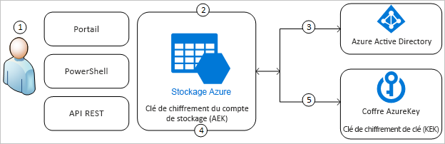
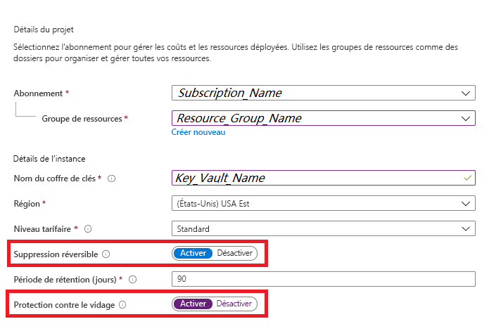
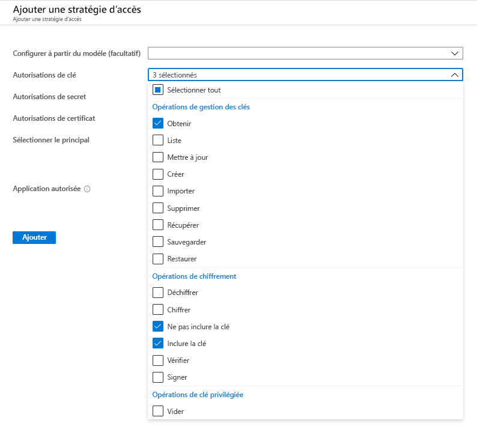
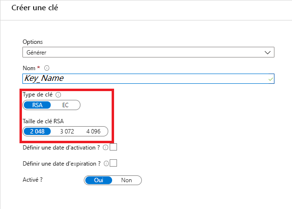
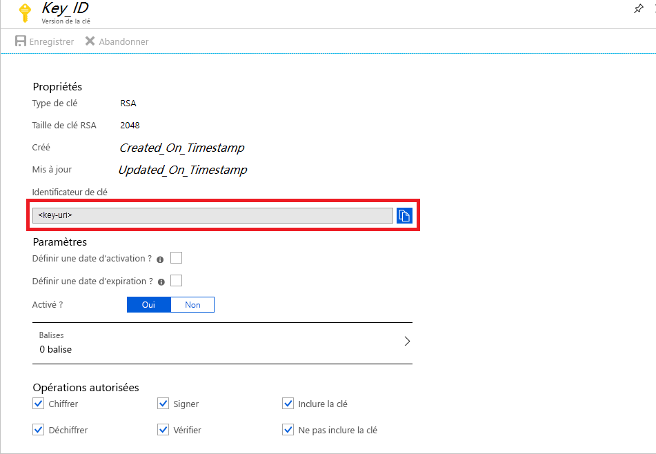
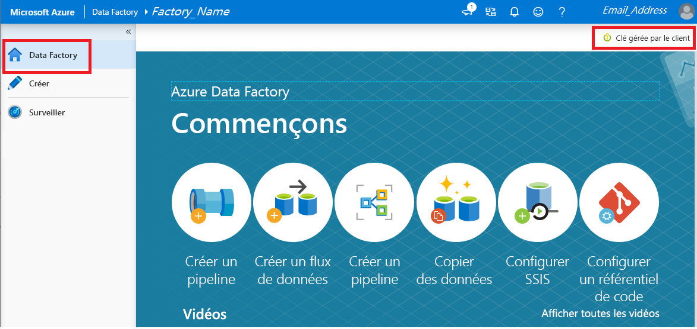

# Chiffrer Azure Data Factory avec des clés gérées par le client

[!INCLUDE[appliesto-adf-xxx-md](includes/appliesto-adf-xxx-md.md)]

Azure Data Factory chiffre les données au repos, y compris les définitions d’entités, toutes les données mises en cache pendant l’exécution et les données mises en cache pour l’aperçu des données. Par défaut, les données sont chiffrées à l’aide d’une clé générée de manière aléatoire et gérée par Microsoft, qui est affectée de manière unique à votre fabrique de données. Pour plus de sécurité, vous pouvez maintenant activer la fonctionnalité Bring Your Own Key (BYOK) avec des clés gérées par le client dans Azure Data Factory. Lorsque vous spécifiez une clé gérée par le client, Data Factory utilise __à la fois__ la clé système Data Factory et la clé CMK pour chiffrer les données client. L’absence d’une de ces clés entraîne le refus d’accès aux données et à la fabrique.

Azure Key Vault est nécessaire pour stocker les clés gérées par le client. Vous pouvez créer vos propres clés et les stocker dans un coffre de clés, ou utiliser les API d’Azure Key Vault pour générer des clés. Le coffre de clés et Data Factory doivent se trouver dans le même locataire Azure Active Directory (Azure AD) et dans la même région, mais ils peuvent être dans des abonnements différents. Pour plus d’informations sur le coffre de clés Azure, consultez la page [Présentation du coffre de clés Azure](../key-vault/general/overview.md)

> [!NOTE]
> Une clé gérée par le client ne peut être configurée que sur une fabrique de données vide. La fabrique de données ne peut pas contenir de ressources telles que des services liés, des pipelines et des flux de données. Il est recommandé d’activer la clé gérée par le client juste après la création de la fabrique.

## À propos des clés gérées par le client

Le diagramme suivant montre comment Data Factory utilise Azure Active Directory et Azure Key Vault pour effectuer des requêtes à l’aide de la clé gérée par le client :

  

La liste suivante décrit les étapes numérotées dans le diagramme :

1. Un administrateur Azure Key Vault accorde des autorisations d’accès à des clés de chiffrement à l’identité managée associée à la fabrique de données
1. Un administrateur Data Factory active la fonctionnalité de clé gérée par le client dans la fabrique
1. Data Factory utilise l’identité managée associée à la fabrique pour authentifier l’accès à Azure Key Vault par le biais d’Azure Active Directory
1. Data Factory encapsule la clé de chiffrement de la fabrique avec la clé du client dans Azure Key Vault
1. Pour les opérations de lecture/écriture, Data Factory envoie des requêtes à Azure Key Vault pour désencapsuler la clé de chiffrement du compte afin d’effectuer des opérations de chiffrement et de déchiffrement

## Conditions préalables : configurer Azure Key Vault et générer des clés

### Activer Suppression réversible et Ne pas vider dans Azure Key Vault

Pour utiliser des clés gérées par le client avec Data Factory, deux propriétés doivent être configurées sur le coffre de clés, __Suppression réversible__ et __Ne pas vider__. Ces propriétés peuvent être activées à l’aide de PowerShell ou d’Azure CLI sur un coffre de clés nouveau ou existant. Pour savoir comment activer ces propriétés sur un coffre de clés existant, consultez les sections intitulées _Activation de la suppression réversible_ et _Activation de la protection contre le vidage_ dans l’un des articles suivants :

- [Guide pratique pour utiliser la suppression réversible avec Power​Shell](../key-vault/general/soft-delete-powershell.md)
- [Guide pratique pour utiliser la suppression réversible avec Azure CLI](../key-vault/general/soft-delete-cli.md)

Si vous créez un coffre de clés Azure par le biais du portail Azure, les options __Suppression réversible__ et __Ne pas vider__ peuvent être activées comme suit :

  

### Accorder à Data Factory l’accès à Azure Key Vault

Assurez-vous qu’Azure Key Vault et Azure Data Factory se trouvent dans le même locataire Azure Active Directory (Azure AD) et dans la _même région_. À partir du contrôle d’accès Azure Key Vault, accordez à l’identité du service managé (MSI) de Data Factory les autorisations suivantes : _Obtenir_, _Ne pas inclure la clé_ et _Inclure la clé_. Ces autorisations sont requises pour activer des clés gérées par le client dans Data Factory.

  

### Générer ou charger une clé gérée par le client sur Azure Key Vault

Vous pouvez créer vos propres clés et les stocker dans un coffre de clés, ou utiliser les API d’Azure Key Vault pour générer des clés. Seules les clés RSA 2048 bits sont prises en charge avec le chiffrement Data Factory. Pour plus d’informations, consultez [À propos des clés, des secrets et des certificats](../key-vault/general/about-keys-secrets-certificates.md).

  

## Activer des clés gérées par le client

1. Vérifiez que la fabrique de données est vide. La fabrique de données ne peut pas contenir de ressources telles que des services liés, des pipelines et des flux de données. Pour le moment, le déploiement d’une clé gérée par le client vers une fabrique non vide génère une erreur.

1. Pour localiser l’URI de la clé dans le portail Azure, naviguez jusqu'à Azure Key Vault, puis sélectionnez le paramètre Clés. Sélectionnez la clé souhaitée, puis cliquez dessus pour afficher ses versions. Sélectionner une version de clé pour afficher les paramètres

1. Copier la valeur du champ Identificateur de clé, qui fournit l’URI

    

1. Lancer le portail Azure Data Factory puis, à l’aide de la barre de navigation sur la gauche, accéder à la page d'accueil Data Factory

1. Cliquez sur l’icône __Clé gérée par le client__

    

1. Entrer l’URI de la clé gérée par le client que vous avez copiée précédemment

1. Cliquez sur __Enregistrer__ ; le chiffrement de la clé gérée par le client est activé pour Data Factory

## Mettre à jour la version de la clé

Lors de la création d’une nouvelle version d’une clé, mettez à jour la fabrique de données afin qu’elle utilise cette nouvelle version. Suivez les étapes similaires décrites dans la section _Activer des clés gérées par le client_, notamment :

1. Rechercher l’URI de la nouvelle version de clé via le portail Azure Key Vault

1. Accéder au paramètre __Clé gérée par le client__

1. Remplacer et coller l’URI de la nouvelle clé

1. Cliquer sur __Enregistrer__ ; Data Factory chiffrera à présent les données avec la nouvelle version de clé

## Utiliser une autre clé

Pour modifier la clé utilisée pour le chiffrement Data Factory, vous devez mettre à jour manuellement les paramètres dans Data Factory. Suivez les étapes similaires décrites dans la section _Activer des clés gérées par le client_, notamment :

1. Rechercher l’URI de la nouvelle clé via le portail Azure Key Vault

1. Accéder au paramètre __Clé gérée par le client__

1. Remplacer et coller l’URI de la nouvelle clé

1. Cliquer sur __Enregistrer__ ; Data Factory chiffrera à présent les données avec la nouvelle clé

## Désactiver les clés gérées par le client

Par défaut, une fois que la fonctionnalité de clé gérée par le client est activée, vous ne pouvez pas supprimer l’étape de sécurité supplémentaire. Le système attendra toujours une clé fournie par le client pour chiffrer les fabriques et les données.

## Étapes suivantes

Consultez les [didacticiels](tutorial-copy-data-dot-net.md) pour en savoir plus sur l’utilisation de Data Factory dans d’autres scénarios.
