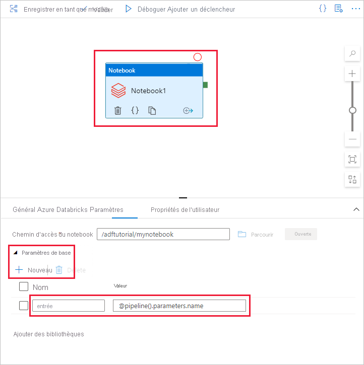

# <a name="run-a-databricks-notebook-with-the-databricks-notebook-activity-in-azure-data-factory"></a>Exécuter une instance Databricks Notebook avec l’activité Databricks Notebook dans Azure Data Factory

[!INCLUDE[appliesto-adf-xxx-md](includes/appliesto-adf-xxx-md.md)]

Dans ce tutoriel, vous allez utiliser le portail Azure pour créer un pipeline Azure Data Factory qui exécute une instance Databricks Notebook sur le cluster de travaux Databricks. Il transmet également les paramètres Azure Data Factory à l’instance Databricks Notebook pendant l’exécution.

Dans ce tutoriel, vous allez effectuer les étapes suivantes :

  - Créer une fabrique de données.

  - Créer un pipeline qui utilise l’activité Databricks Notebook.

  - Déclencher une exécution du pipeline.

  - Surveiller l’exécution du pipeline.

Si vous n’avez pas d’abonnement Azure, créez un [compte gratuit](https://azure.microsoft.com/free/) avant de commencer.

Pour une présentation de onze minutes et la démonstration de cette fonctionnalité, regardez la vidéo suivante :

> [!VIDEO https://channel9.msdn.com/Shows/Azure-Friday/ingest-prepare-and-transform-using-azure-databricks-and-data-factory/player]

## <a name="prerequisites"></a>Prérequis

  - **Espace de travail Azure Databricks**. [Créez un espace de travail Databricks](/azure/databricks/scenarios/quickstart-create-databricks-workspace-portal) ou utilisez-en un existant. Créez une instance Python Notebook dans votre espace de travail Azure Databricks. Exécutez ensuite l’instance Notebook et transmettez-lui les paramètres via Azure Data Factory.

## <a name="create-a-data-factory"></a>Créer une fabrique de données

1.  Lancez le navigateur web **Microsoft Edge** ou **Google Chrome**. L’interface utilisateur de Data Factory n’est actuellement prise en charge que par les navigateurs web Microsoft Edge et Google Chrome.

1.  Sélectionnez **Créer une ressource** dans le menu de gauche, sélectionnez **Analytique**, puis **Data Factory**.

    

1.  Dans le volet **Nouvelle fabrique de données**, entrez **ADFTutorialDataFactory** sous **Nom**.

    Le nom de la fabrique de données Azure doit être un nom *global unique*. Si vous voyez l’erreur suivante, modifiez le nom de la fabrique de données. Par exemple, utilisez **\<yourname\>ADFTutorialDataFactory**. Consultez l’article [Data Factory - Règles d’affectation des noms](./naming-rules.md) pour en savoir plus sur les règles d’affectation des noms d’artefacts Data Factory.

    

1.  Pour **Abonnement**, sélectionnez l’abonnement Azure dans lequel vous voulez créer la fabrique de données.

1.  Pour **Groupe de ressources**, réalisez l’une des opérations suivantes :
    
    - Sélectionnez **Utiliser l’existant**, puis sélectionnez un groupe de ressources existant dans la liste déroulante.
    
    - Sélectionnez **Créer**, puis entrez le nom d’un groupe de ressources.

    Certaines étapes de ce guide de démarrage rapide supposent que vous utilisez le nom **ADFTutorialResourceGroup** pour le groupe de ressources. Pour plus d’informations sur les groupes de ressources, consultez [Utilisation des groupes de ressources pour gérer vos ressources Azure](../azure-resource-manager/management/overview.md).

1.  Pour **Version**, sélectionnez **V2**.

1.  Pour **Emplacement**, sélectionnez l’emplacement de la fabrique de données.

    Pour obtenir la liste des régions Azure dans lesquelles Data Factory est actuellement disponible, sélectionnez les régions qui vous intéressent dans la page suivante, puis développez **Analytique** pour localiser **Data Factory** : [Disponibilité des produits par région](https://azure.microsoft.com/global-infrastructure/services/). Les magasins de données (tels que Stockage Azure et Azure SQL Database) et les services de calcul (comme HDInsight) utilisés par Data Factory peuvent se trouver dans d’autres régions.
1.  Sélectionnez **Create** (Créer).


1.  Une fois la création terminée, la page **Data Factory** s’affiche. Sélectionnez la vignette **Créer et surveiller** pour démarrer l’application d’interface utilisateur (IU) de Data Factory dans un onglet séparé.

    

## <a name="create-linked-services"></a>Créez des services liés

Dans cette section, vous allez créer un service Databricks lié. Ce service lié contient les informations de connexion au cluster Databricks :

### <a name="create-an-azure-databricks-linked-service"></a>Créer un service Azure Databricks lié

1.  Dans la page **Prise en main**, basculez vers l’onglet **Modifier** dans le volet gauche.

    

1.  Cliquez sur **Connexions** au bas de la fenêtre, puis cliquez sur **+ Nouveau**.
    
    

1.  Dans la fenêtre **Nouveau service lié**, sélectionnez **Calcul** \> **Azure Databricks**, puis **Continuer**.
    
    

1.  Dans la fenêtre **Nouveau service lié**, procédez comme suit :
    
    1.  Pour **Nom**, entrez **_AzureDatabricks\_LinkedService_**
    
    1.  Sélectionnez l’**espace de travail Databricks** approprié dans lequel vous exécuterez votre bloc-notes

    1.  Dans **Sélectionner un cluster**, sélectionnez **New job cluster** (Nouveau cluster de travail)
    
    1.  Dans **Domaine / Région**, les informations doivent être renseignées automatiquement

    1.  Dans le champ **Jeton d’accès**, indiquez le jeton généré à partir de l’espace de travail Azure Databricks. Vous trouverez la procédure [ici](https://docs.databricks.com/api/latest/authentication.html#generate-token).

    1.  Dans **Version du cluster**, sélectionnez **4.2** (avec Apache Spark 2.3.1, Scala 2.11)

    1.  Dans **Cluster node type** (Type de nœud de cluster), sélectionnez **Standard\_D3\_v2** sous la catégorie **General Purpose (HDD)** (Usage général (HDD)) pour ce didacticiel. 
    
    1.  Dans **Rôles de travail**, entrez **2**.
    
    1.  Sélectionnez **Terminer**.

        

## <a name="create-a-pipeline"></a>Créer un pipeline

1.  Cliquez sur le bouton **+** (plus), puis sélectionnez **Pipeline** dans le menu.

    

1.  Créez un **paramètre** à utiliser dans le **pipeline**. Vous pourrez ensuite le transmettre à l’activité Databricks Notebook. Dans le pipeline vide, cliquez sur l’onglet **Paramètres**, puis sur **Nouveau** et nommez-le ’**name**’.

    

    

1.  Dans la boîte à outils **Activités**, étendez **Databricks**. Faites glisser l’activité **Notebook** depuis la boîte à outils **Activités** vers la surface du concepteur de pipeline.

    

1.  Dans les propriétés de la fenêtre d’activité **Databricks** **Notebook** en bas, effectuez les étapes suivantes :

    a. Basculez vers l’onglet **Azure Databricks**.

    b. Sélectionnez **AzureDatabricks\_LinkedService** (créé lors de la procédure précédente).

    c. Basculez vers l’onglet **Paramètres**

    c. Parcourez pour sélectionner un chemin d’accès à **Notebook** Databricks. Créez une instance Notebook et spécifiez le chemin d’accès ici. Vous obtenez le chemin d’accès de l’instance Notebook en procédant comme suit.

       1. Lancer votre espace de travail Azure Databricks

       1. Créez un **nouveau dossier** dans l’espace de travail et nommez-le **adftutorial**.

          

       1. [Créez une instance Notebook](https://docs.databricks.com/user-guide/notebooks/index.html#creating-a-notebook) (Python), nommez-la **mynotebook** sous le dossier **adftutorial**, cliquez sur **Créer**.

          

          

       1. Dans l’instance Notebook récemment créée, mynotebook, ajoutez le code suivant :

           ```
           # Creating widgets for leveraging parameters, and printing the parameters

           dbutils.widgets.text("input", "","")
           y = dbutils.widgets.get("input")
           print ("Param -\'input':")
           print (y)
           ```

           

       1. Le **chemin d’accès à l’instance Notebook** dans ce cas est le suivant : **/adftutorial/mynotebook**

1.  Revenez à la **l’outil de création de l’interface utilisateur de la fabrique de données**. Accédez à l’onglet **Paramètres** sous l’**Activité Notebook1**.

    a.  **Ajoutez un paramètre** à l’activité Notebook. Utilisez le même paramètre que celui ajouté précédemment au **pipeline**.

       

    b.  Nommez le paramètre **input** et indiquez la valeur sous la forme de l’expression **\@pipeline().parameters.name**.

1.  Pour valider le pipeline, cliquez sur le bouton **Valider** dans la barre d’outils. Pour fermer la fenêtre de validation, cliquez sur le bouton **\>\>** (flèche droite).

    

1.  Sélectionnez **Publier tout**. L’interface utilisateur de Data Factory publie des entités (services liés et pipelines) sur le service Azure Data Factory.

    

## <a name="trigger-a-pipeline-run"></a>Déclencher une exécution du pipeline

Sélectionnez **Déclencher** dans la barre d’outils, puis **Déclencher maintenant**.


La boîte de dialogue **Exécution du pipeline** invite à saisir le paramètre **name**. Utilisez ici **/path/filename** comme paramètre. Cliquez sur **Terminer.**


## <a name="monitor-the-pipeline-run"></a>Surveiller l’exécution du pipeline.

1.  Basculez vers l’onglet **Surveiller**. Vérifiez qu’un pipeline est exécuté. Il faut compter environ 5 à 8 minutes pour créer un cluster de travaux Databricks, où s’exécute l’instance Notebook.

    

1.  Cliquez régulièrement sur **Actualiser** pour vérifier l’état de l’exécution des pipelines.

1.  Pour voir les exécutions d’activités associées à l’exécution du pipeline, cliquez sur le lien **Afficher les exécutions d’activités** dans la colonne **Actions**.

    

Vous pouvez basculer vers la vue des exécutions de pipelines en cliquant sur le lien **Pipelines** en haut.

## <a name="verify-the-output"></a>Vérifier la sortie

Vous pouvez vous connecter à l’**espace de travail Azure Databricks**, accéder à **Clusters** et voir le statut du **Travail** : *en attente d’exécution, en cours d’exécution ou terminé*.


Vous pouvez cliquer sur le **nom du travail** et naviguer pour afficher plus de détails. Une fois l’exécution réussie, vous pouvez valider les paramètres transmis et la sortie de l’instance Notebook Python.


## <a name="next-steps"></a>Étapes suivantes

Le pipeline dans cet exemple déclenche une activité Databricks Notebook et lui transmet un paramètre. Vous avez appris à :

  - Créer une fabrique de données.

  - Créer un pipeline qui utilise l’activité Databricks Notebook.

  - Déclencher une exécution du pipeline.

  - Surveiller l’exécution du pipeline.