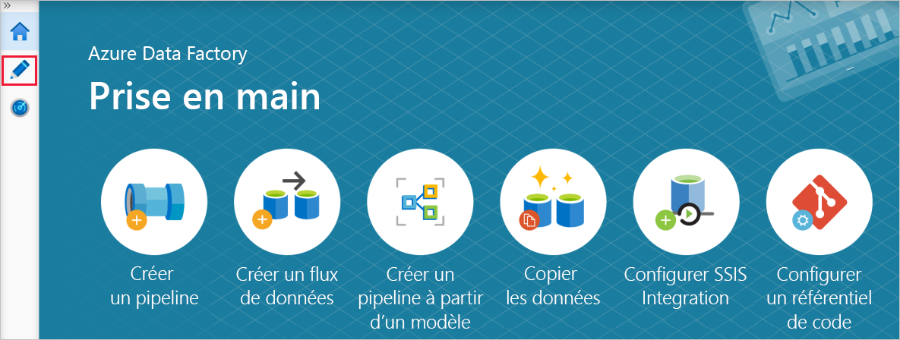

# <a name="copy-multiple-tables-in-bulk-by-using-azure-data-factory"></a>Copier plusieurs tables en bloc à l’aide d’Azure Data Factory

Ce tutoriel montre comment **copier des tables d’Azure SQL Database dans Azure Synapse Analytics (anciennement SQL DW)** . Vous pouvez appliquer le même modèle à d’autres scénarios de copie. Par exemple : copie de tables à partir de SQL Server/Oracle dans Azure SQL Database/Azure Synapse Analytics (anciennement SQL DW)/Stockage Blob Azure ou copie de différents chemins à partir du Stockage Blob dans des tables Azure SQL Database.

> [!NOTE]
> - Si vous débutez avec Azure Data Factory, consultez [Présentation d’Azure Data Factory](introduction.md).

Globalement, ce tutoriel implique les étapes suivantes :

> [!div class="checklist"]
> * Créer une fabrique de données.
> * Créez des services liés Azure SQL Database, Azure Synapse Analytics (anciennement SQL DW) et Stockage Azure.
> * Créez des jeux de données Azure SQL Database et Azure Synapse Analytics (anciennement SQL DW).
> * Créer un pipeline pour rechercher les tables à copier et un autre pipeline pour effectuer l’opération de copie. 
> * Démarrer une exécution de pipeline.
> * Surveiller les exécutions de pipeline et d’activité.

Ce tutoriel utilise le portail Azure. Pour en savoir plus sur l’utilisation d’autres outils/SDK pour créer une fabrique de données, consultez [Démarrages rapides](quickstart-create-data-factory-dot-net.md). 

## <a name="end-to-end-workflow"></a>Workflow de bout en bout
Dans ce scénario, vous disposez d’un certain nombre de tables dans Azure SQL Database, que vous souhaitez copier dans Azure Synapse Analytics (anciennement SQL DW). Voici l’ordre logique des étapes du workflow qui se produit dans les pipelines :


* Le premier pipeline recherche la liste des tables à copier dans les banques de données du récepteur.  Vous pouvez également conserver une table de métadonnées qui répertorie toutes les tables à copier dans la banque de données du récepteur. Le pipeline déclenche ensuite un autre pipeline qui itère chaque table dans la base de données et effectue l’opération de copie de données.
* Le second pipeline effectue la copie. Il prend la liste des tables comme paramètre. Pour chaque table de la liste, copiez la table spécifique d’Azure SQL Database dans la table correspondante d’Azure Synapse Analytics (anciennement SQL DW) à l’aide d’une [copie intermédiaire par le biais du Stockage Blob et de PolyBase](connector-azure-sql-data-warehouse.md#use-polybase-to-load-data-into-azure-sql-data-warehouse) pour obtenir de meilleurs résultats. Dans cet exemple, le premier pipeline passe la liste des tables comme valeur pour le paramètre. 

Si vous n’avez pas d’abonnement Azure, créez un [compte gratuit](https://azure.microsoft.com/free/) avant de commencer.

## <a name="prerequisites"></a>Prérequis
* **Compte Stockage Azure**. Le compte Stockage Azure est utilisé comme stockage d’objets blob intermédiaire dans l’opération de copie en bloc. 
* **Azure SQL Database**. Cette base de données contient les données sources. 
* **Azure Synapse Analytics (anciennement SQL DW)** . Cet entrepôt de données conserve les données copiées à partir de SQL Database. 

### <a name="prepare-sql-database-and-azure-synapse-analytics-formerly-sql-dw"></a>Préparer SQL Database et Azure Synapse Analytics (anciennement SQL DW)

**Préparer la base de données Azure SQL source** :

Créez une base de données Azure SQL avec l’exemple de données Adventure Works LT. Pour cela, suivez les instructions de l’article [Créer une base de données Azure SQL](../sql-database/sql-database-get-started-portal.md). Ce tutoriel copie toutes les tables de cet exemple de base de données dans un magasin de données Azure Synapse Analytics (anciennement SQL DW).

**Préparez le magasin de données Azure Synapse Analytics (anciennement SQL DW) récepteur** :

1. Si vous n’avez pas de magasin de données Azure Synapse Analytics (anciennement SQL DW), consultez l’article [Créer un entrepôt de données SQL](../sql-data-warehouse/sql-data-warehouse-get-started-tutorial.md) pour savoir comment en créer un.

1. Créez les schémas de table correspondants dans Azure Synapse Analytics (anciennement SQL DW). Plus tard, vous utiliserez Azure Data Factory pour migrer/copier les données.

## <a name="azure-services-to-access-sql-server"></a>Services Azure pour accéder au serveur SQL

Pour SQL Database et Azure Synapse Analytics (anciennement SQL DW), autorisez les services Azure à accéder au serveur SQL. Vérifiez que le paramètre **Autoriser les services et les ressources Azure à accéder à ce serveur** est défini sur **Activé** pour votre serveur SQL Azure. Ce paramètre permet au service Data Factory de lire les données de votre base de données Azure SQL et de les écrire dans votre magasin de données Azure Synapse Analytics (anciennement SQL DW). 

Pour vérifier et activer ce paramètre, accédez à votre serveur SQL Azure > Sécurité > Pare-feux et réseaux virtuels et affectez la valeur **Activé** à l’option **Autoriser les services et les ressources Azure à accéder à ce serveur**.

## <a name="create-a-data-factory"></a>Créer une fabrique de données
1. Lancez le navigateur web **Microsoft Edge** ou **Google Chrome**. L’interface utilisateur de Data Factory n’est actuellement prise en charge que par les navigateurs web Microsoft Edge et Google Chrome.
1. Accédez au [portail Azure](https://portal.azure.com). 
1. Dans le menu de gauche du portail Azure, sélectionnez **Créer une ressource** > **Analytics** > **Data Factory**. 
   
1. Dans la page **Nouvelle fabrique de données**, entrez **ADFTutorialBulkCopyDF** comme **nom**. 
 
   Le nom de la fabrique de données Azure doit être un nom **global unique**. Si l’erreur suivante s’affiche pour le champ du nom, changez le nom de la fabrique de données (par exemple, votrenomADFTutorialBulkCopyDF). Consultez l’article [Data Factory - Règles d’affectation des noms](naming-rules.md) pour savoir comment nommer les artefacts Data Factory.
  
       `Data factory name “ADFTutorialBulkCopyDF” is not available`
1. Sélectionnez l’**abonnement** Azure dans lequel vous voulez créer la fabrique de données. 
1. Pour le **groupe de ressources**, effectuez l’une des opérations suivantes :
     
   - Sélectionnez **Utiliser l’existant**, puis sélectionnez un groupe de ressources existant dans la liste déroulante. 
   - Sélectionnez **Créer**, puis entrez le nom d’un groupe de ressources.   
         
     Pour plus d’informations sur les groupes de ressources, consultez [Utilisation des groupes de ressources pour gérer vos ressources Azure](../azure-resource-manager/management/overview.md).  
1. Sélectionnez **V2** pour la **version**.
1. Sélectionnez **l’emplacement** de la fabrique de données. Pour obtenir la liste des régions Azure dans lesquelles Data Factory est actuellement disponible, sélectionnez les régions qui vous intéressent dans la page suivante, puis développez **Analytique** pour localiser **Data Factory** : [Disponibilité des produits par région](https://azure.microsoft.com/global-infrastructure/services/). Les magasins de données (Stockage Azure, Azure SQL Database, etc.) et les services de calcul (HDInsight, etc.) utilisés par la fabrique de données peuvent être proposés dans d’autres régions.
1. Cliquez sur **Créer**.
1. Une fois la ressource créée, sélectionnez **Accéder à la ressource** pour ouvrir la page **Data Factory**. 
   
1. Cliquez sur la vignette **Créer et surveiller** pour lancer l’application de l’interface utilisateur de Data Factory dans un onglet séparé.
1. Dans la page **Commençons**, basculez vers l’onglet **Créer** dans le volet gauche comme illustré dans l’image suivante :

     

## <a name="create-linked-services"></a>Créez des services liés
Vous créez des services liés pour lier vos magasins de données et vos calculs à une fabrique de données. Un service lié comporte les informations de connexion utilisées par le service Data Factory pour se connecter au magasin de données lors de l’exécution. 

Dans ce tutoriel, vous liez vos magasins de données Azure SQL Database, Azure Synapse Analytics (anciennement SQL DW) et Stockage Blob Azure à votre fabrique de données. Azure SQL Database correspond au magasin de données source. Le magasin de données Azure Synapse Analytics (anciennement SQL DW) est le magasin de données récepteur/de destination. Le Stockage Blob Azure permet d’effectuer une copie intermédiaire des données avant leur chargement dans Azure Synapse Analytics (anciennement SQL DW) à l’aide de PolyBase. 

### <a name="create-the-source-azure-sql-database-linked-service"></a>Créer le service lié Azure SQL Database pour la source
Dans cette étape, vous créez un service lié qui relie votre base de données Azure SQL à la fabrique de données. 

1. Cliquez sur **Connexions** en bas de la fenêtre, puis cliquez sur **+ Nouveau** dans la barre d’outils (le bouton **Connexions** se trouve au bas de la colonne de gauche sous **Ressources Factory**). 

1. Dans la fenêtre **Nouveau service lié**, sélectionnez **Azure SQL Database**, puis cliquez sur **Continuer**. 
1. Dans la fenêtre **Nouveau service lié (Azure SQL Database)** , effectuez les étapes suivantes : 

    a. Entrez **AzureSqlDatabaseLinkedService** pour **Nom**.
    
    b. Sélectionnez votre serveur SQL Azure pour **Nom du serveur**
    
    c. Sélectionnez votre base de données Azure SQL pour **Nom de la base de données**. 
    
    d. Entrez le **nom de l’utilisateur** pour se connecter à la base de données Azure SQL. 
    
    e. Entrez le **mot de passe** correspondant à l’utilisateur. 

    f. Pour tester la connexion à la base de données Azure SQL à l’aide des informations spécifiées, cliquez sur **Tester la connexion**.
  
    g. Cliquez sur **Créer** pour enregistrer le service lié.


### <a name="create-the-sink-azure-synapse-analytics-formerly-sql-dw-linked-service"></a>Créer le service lié Azure Synapse Analytics (anciennement SQL DW) récepteur

1. Dans l’onglet **Connexions**, cliquez à nouveau sur **+ Nouveau** dans la barre d’outils. 
1. Dans la fenêtre **Nouveau service lié**, sélectionnez **Azure Synapse Analytics (anciennement SQL DW)** , puis cliquez sur **Continuer**. 
1. Dans la fenêtre **Nouveau service lié (Azure Synapse Analytics (anciennement SQL DW))** , effectuez les étapes suivantes : 
   
    a. Entrez **AzureSqlDWLinkedService** pour **Nom**.
     
    b. Sélectionnez votre serveur SQL Azure pour **Nom du serveur**
     
    c. Sélectionnez votre base de données Azure SQL pour **Nom de la base de données**. 
     
    d. Sous **Nom d’utilisateur**, entrez le nom de l’utilisateur à connecter à la base de données Azure SQL. 
     
    e. Sous **Mot de passe**, entrez le mot de passe de l’utilisateur. 
     
    f. Pour tester la connexion à la base de données Azure SQL à l’aide des informations spécifiées, cliquez sur **Tester la connexion**.
     
    g. Cliquez sur **Créer**.

### <a name="create-the-staging-azure-storage-linked-service"></a>Créer le service lié Stockage Azure intermédiaire
Dans ce tutoriel, vous allez utiliser Stockage Blob Azure comme zone intermédiaire pour améliorer les performances de copie de PolyBase.

1. Dans l’onglet **Connexions**, cliquez à nouveau sur **+ Nouveau** dans la barre d’outils. 
1. Dans la fenêtre **Nouveau service lié**, sélectionnez **Stockage Blob Azure**, puis cliquez sur **Continuer**. 
1. Dans la fenêtre **Nouveau service lié (Stockage Blob Azure)** , effectuez les étapes suivantes : 

    a. Entrez **AzureStorageLinkedService** pour **Nom**.                                                 
    b. Sélectionnez votre **compte de stockage Azure** pour **Nom du compte de stockage**.
    
    c. Cliquez sur **Créer**.


## <a name="create-datasets"></a>Créez les jeux de données
Dans ce tutoriel, vous créez des jeux de données (source et récepteur) qui spécifient l’emplacement de stockage des données. 

Le jeu de données d’entrée **AzureSqlDatabaseDataset** fait référence à **AzureSqlDatabaseLinkedService**. Le service lié spécifie la chaîne de connexion pour se connecter à la base de données. Le jeu de données spécifie le nom de la base de données et la table contenant les données sources. 

Le jeu de données de sortie **AzureSqlDWDataset** fait référence à **AzureSqlDWLinkedService**. Le service lié spécifie la chaîne de connexion pour la connexion à Azure Synapse Analytics (anciennement SQL DW). Le jeu de données spécifie la base de données et la table dans lesquelles les données sont copiées. 

Dans ce didacticiel, les tables SQL source et de destination ne sont pas codées en dur dans les définitions de jeu de données. Au lieu de cela, l’activité ForEach transmet le nom de la table lors de l’exécution à l’activité de copie. 

### <a name="create-a-dataset-for-source-sql-database"></a>Créer un jeu de données pour la base de données SQL source

1. Cliquez sur **+ (plus)** dans le volet gauche, puis sur **Jeu de données**. 

    
1. Dans la fenêtre **Nouveau jeu de données**, sélectionnez **Azure SQL Database**, puis cliquez sur **Continuer**. 
    
1. Dans la fenêtre **Définir les propriétés**, sous **Nom**, entrez **AzureSqlDatabaseDataset**. Sous **Service lié**, sélectionnez **AzureSqlDatabaseLinkedService**. Cliquez ensuite sur **OK**.

1. Basculez vers l’onglet **Connexion** et sélectionnez n’importe quelle table pour **Table**. Cette table est une table fictive. Vous spécifiez une requête sur le jeu de données source lors de la création d’un pipeline. La requête est utilisée pour extraire des données de la base de données Azure SQL. Vous pouvez également cocher la case **Modifier** et entrer **dbo.dummyName** comme nom de table. 
 

### <a name="create-a-dataset-for-sink-azure-synapse-analytics-formerly-sql-dw"></a>Créer un jeu de données pour le magasin de données Azure Synapse Analytics (anciennement SQL DW) récepteur

1. Cliquez sur **+ (plus)** dans le volet gauche, puis cliquez sur **Jeu de données**. 
1. Dans la fenêtre **Nouveau jeu de données**, sélectionnez **Azure Synapse Analytics (anciennement SQL DW)** , puis cliquez sur **Continuer**.
1. Dans la fenêtre **Définir les propriétés**, sous **Nom**, entrez **AzureSqlDWDataset**. Sous **Service lié**, sélectionnez **AzureSqlDWLinkedService**. Cliquez ensuite sur **OK**.
1. Basculez vers l’onglet **Paramètres** , cliquez sur **+ Nouveau**, puis entrez **DWTableName** comme nom du paramètre. Si vous copiez-collez ce nom à partir de la page, vérifiez qu’il n’y a aucun **espace de fin** à la fin de **DWTableName**.
1. Basculez vers l’onglet **Connexion**. 

    a. Pour **Table**, activez l’option **Modifier**. Entrez **dbo** dans la première zone d’entrée du nom de la table. Puis, sélectionnez la deuxième zone d’entrée et cliquez sur le lien **Ajouter du contenu dynamique** situé dessous. 

    

    b. Dans la page **Ajouter du contenu dynamique**, cliquez sur **DWTAbleName** sous **Paramètres** afin de remplir automatiquement la zone de texte d’expression supérieure `@dataset().DWTableName`, puis Cliquez sur **Terminer**. La propriété **tableName** du jeu de données est définie sur la valeur qui est transmise en tant qu’argument pour le paramètre **DWTableName**. L’activité ForEach effectue une itération dans une liste de tables et les transmet une par une à l’activité de copie. 

    
 
## <a name="create-pipelines"></a>Créer des pipelines
Dans ce tutoriel, vous allez créer deux pipelines : **IterateAndCopySQLTables** et **GetTableListAndTriggerCopyData**. 

Le pipeline **GetTableListAndTriggerCopyData** effectue deux actions :

* Recherche la table système Azure SQL Database pour obtenir la liste des tables à copier.
* Déclenche le pipeline **IterateAndCopySQLTables** pour copier les données.

Le pipeline **IterateAndCopySQLTables** prend une liste de tables comme paramètre. Pour chaque table de la liste, il copie les données de la table Azure SQL Database vers Azure Synapse Analytics (anciennement SQL DW) en utilisant la copie intermédiaire et PolyBase.

### <a name="create-the-pipeline-iterateandcopysqltables"></a>Créer le pipeline IterateAndCopySQLTables

1. Dans le volet gauche, cliquez sur **+ (plus)** , puis cliquez sur **Pipeline**.

    
1. Dans l’onglet **Général**, indiquez **IterateAndCopySQLTables** pour le nom. 

1. Basculez vers l’onglet **Paramètres**, et effectuez les actions suivantes : 

    a. Cliquez sur **+ Nouveau**. 
    
    b. Entrez **tableList** pour le **Nom** du paramètre.
    
    c. Sélectionnez **Tableau** pour **Type**.

1. Dans la boîte à outils **Activités**, développez **Iteration & Conditions** (Itération et conditions), et glissez-déposez l’activité **ForEach** vers la surface du concepteur de pipeline. Vous pouvez également rechercher des activités dans la boîte à outils **Activités**. 

    a. Dans l’onglet **Général**, entrez **IterateSQLTables** pour le **Nom**. 

    b. Basculez vers l’onglet **Paramètres**, cliquez sur la zone d’entrée pour **Éléments**, puis cliquez sur le lien **Ajouter du contenu dynamique** en-dessous. 

    c. Dans la page **Ajouter du contenu dynamique**, réduisez les sections **Variables système** et **Fonctions**, puis cliquez sur **tableList** sous **Paramètres** pour renseigner automatiquement la zone de texte d’expression supérieure avec `@pipeline().parameter.tableList`. Puis, cliquez sur **Terminer**. 

    
    
    d. Basculez vers l’onglet **Activités**, puis cliquez sur l’**icône de crayon** pour ajouter une activité enfant à l’activité **ForEach**.
    

1. Dans la boîte à outils **Activités**, développez **Déplacer et transférer**, puis glissez-déposez l’activité **Copier des données** sur la surface du concepteur de pipeline. Notez le menu de navigation en haut. **IterateAndCopySQLTable** correspond au nom du pipeline et **IterateSQLTables** au nom de l’activité ForEach. Le concepteur se trouve dans l’étendue de l’activité. Pour revenir à l’éditeur de pipeline à partir de l’éditeur ForEach, vous pouvez cliquer sur le lien dans le menu de navigation. 

    

1. Basculez vers l’onglet **Source**, et procédez comme suit :

    1. Sélectionnez **AzureSqlDatabaseDataset** pour **Jeu de données source**. 
    1. Sélectionnez l’option **Requête** pour **Utiliser la requête**. 
    1. Cliquez sur la zone d’entrée **Requête** -> cliquez sur le lien **Ajouter du contenu dynamique** ci-dessous -> entrez l’expression suivante pour **Requête** -> cliquez sur **Terminer**.

        ```sql
        SELECT * FROM [@{item().TABLE_SCHEMA}].[@{item().TABLE_NAME}]
        ``` 


1. Basculez vers l’onglet **Réception**, et procédez comme suit : 

    1. Sélectionnez **AzureSqlDWDataset** pour **Jeu de données récepteur**.
    1. Cliquez sur la zone d’entrée de la valeur du paramètre DWTableName -> sélectionnez **Ajouter du contenu dynamique** ci-dessous, entrez l’expression `[@{item().TABLE_SCHEMA}].[@{item().TABLE_NAME}]` en tant que script -> cliquez sur **Terminer**.
    1. Pour la méthode de copie, sélectionnez **Polybase**. 
    1. Désactivez l’option **Utiliser le type par défaut**. 
    1. Cliquez sur la zone d’entrée **Pre-copy Script** (Script de précopie) -> sélectionnez le lien **Ajouter du contenu dynamique** au-dessous -> entrez l’expression ci-après en tant que script -> sélectionnez **Terminer**. 

        ```sql
        TRUNCATE TABLE [@{item().TABLE_SCHEMA}].[@{item().TABLE_NAME}]
        ```

        
1. Basculez vers l’onglet **Paramètres**, et procédez comme suit : 

    1. Cochez la case **Activer le mode de préproduction**.
    1. Sélectionnez **AzureStorageLinkedService** pour **Store Account Linked Service** (Service lié de compte de stockage).

1. Pour valider les paramètres du pipeline, cliquez sur **Valider** sur la barre d’outils pour le pipeline. Vérifiez qu’il n’existe aucune erreur de validation. Pour fermer le **Rapport de validation de pipeline**, cliquez sur **>>** .

### <a name="create-the-pipeline-gettablelistandtriggercopydata"></a>Créer le pipeline GetTableListAndTriggerCopyData

Ce pipeline effectue deux actions :

* Recherche la table système Azure SQL Database pour obtenir la liste des tables à copier.
* Déclenche le pipeline « IterateAndCopySQLTables » pour copier les données.

1. Dans le volet gauche, cliquez sur **+ (plus)** , puis cliquez sur **Pipeline**.
1. Sous l’onglet **Général**, renommez le pipeline **GetTableListAndTriggerCopyData**. 

1. Dans la boîte à outils **Activités**, développez **Général**, et glissez-déplacez l’activité **Recherche** vers la surface du concepteur de pipeline, puis effectuez les étapes suivantes :

    1. Entrez **LookupTableList** pour **Nom**. 
    1. Entrez **Récupérer la liste de tables de base de données Azure SQL** pour **Description**.

1. Basculez vers l’onglet **Paramètres**, et procédez comme suit :

    1. Sélectionnez **AzureSqlDatabaseDataset** pour **Jeu de données source**. 
    1. Sélectionnez **Requête** pour **Utiliser la requête**. 
    1. Entrez la requête SQL suivante pour **Requête**.

        ```sql
        SELECT TABLE_SCHEMA, TABLE_NAME FROM information_schema.TABLES WHERE TABLE_TYPE = 'BASE TABLE' and TABLE_SCHEMA = 'SalesLT' and TABLE_NAME <> 'ProductModel'
        ```
    1. Décochez la case pour le champ **First row only** (Première ligne uniquement).

        
1. Glissez-déplacez l’activité **Exécuter le pipeline** de la boîte à outils Activités vers la zone du concepteur de pipeline et affectez **TriggerCopy** comme nom.

1. Pour **Connecter** l’activité **Recherche** à l’activité **Exécuter le pipeline**, faites glisser la **zone verte** associée à l’activité de recherche vers la gauche de l’activité Exécuter le pipeline.

    

1. Accédez à l’onglet **Paramètres** de l’activité d’**exécution de pipeline**, puis effectuez les étapes suivantes : 

    1. Sélectionnez **IterateAndCopySQLTables** pour **Invoked pipeline** (Pipeline appelé). 
    1. Développez la section **Avancé** et désactivez la case à cocher **Attendre la fin de l’opération**.
    1. Cliquez sur **+ Nouveau** dans la section **Paramètres**. 
    1. Entrez **tableList** pour le **Nom** du paramètre.
    1. Cliquez sur la zone d’entrée -> cliquez sur le lien **Ajouter du contenu dynamique** ci-dessous -> entrez `@activity('LookupTableList').output.value` en tant que valeur de nom de table -> sélectionnez **Terminer**. Vous définissez la liste des résultats de l’activité de recherche en tant qu’entrée du deuxième pipeline. La liste de résultats contient la liste des tables dont les données doivent être copiées dans la destination. 

        

1. Pour valider le pipeline, cliquez sur **Valider** dans la barre d’outils. Vérifiez qu’il n’y a aucune erreur de validation. Pour fermer le **Rapport de validation de pipeline**, cliquez sur **>>** .

1. Pour publier des entités (jeux de données, pipelines, etc.) dans le service Data Factory, cliquez sur **Publier tout** en haut de la fenêtre. Patientez jusqu’à ce que la publication réussisse. 

## <a name="trigger-a-pipeline-run"></a>Déclencher une exécution du pipeline

1. Accédez au pipeline **GetTableListAndTriggerCopyData**, cliquez sur **Ajouter un déclencheur** dans la barre d’outils supérieure du pipeline, puis cliquez sur **Déclencher maintenant**. 

1. Confirmez l’exécution sur la page d’**exécution du pipeline**, puis sélectionnez **Terminer**.

## <a name="monitor-the-pipeline-run"></a>Surveiller l’exécution du pipeline.

1. Basculez vers l’onglet **Surveiller**. Cliquez sur **Actualiser** jusqu’à ce que vous voyiez les exécutions des deux pipelines de votre solution. Continuez à actualiser la liste jusqu’à ce que vous voyiez l’étape **Réussite**. 

1. Pour voir les exécutions d’activités associées au pipeline **GetTableListAndTriggerCopyData**, cliquez sur le lien du nom du pipeline. Vous devez voir deux exécutions d’activités pour cette exécution du pipeline. 
    
1. Pour voir la sortie de l’activité **Lookup**, cliquez sur le lien **Sortie** en regard de l’activité sous la colonne **NOM DE L’ACTIVITÉ**. Vous pouvez agrandir et restaurer la fenêtre **Sortie**. Après la révision, cliquez sur **X** pour fermer la fenêtre **Sortie**.

    ```json
    {
        "count": 9,
        "value": [
            {
                "TABLE_SCHEMA": "SalesLT",
                "TABLE_NAME": "Customer"
            },
            {
                "TABLE_SCHEMA": "SalesLT",
                "TABLE_NAME": "ProductDescription"
            },
            {
                "TABLE_SCHEMA": "SalesLT",
                "TABLE_NAME": "Product"
            },
            {
                "TABLE_SCHEMA": "SalesLT",
                "TABLE_NAME": "ProductModelProductDescription"
            },
            {
                "TABLE_SCHEMA": "SalesLT",
                "TABLE_NAME": "ProductCategory"
            },
            {
                "TABLE_SCHEMA": "SalesLT",
                "TABLE_NAME": "Address"
            },
            {
                "TABLE_SCHEMA": "SalesLT",
                "TABLE_NAME": "CustomerAddress"
            },
            {
                "TABLE_SCHEMA": "SalesLT",
                "TABLE_NAME": "SalesOrderDetail"
            },
            {
                "TABLE_SCHEMA": "SalesLT",
                "TABLE_NAME": "SalesOrderHeader"
            }
        ],
        "effectiveIntegrationRuntime": "DefaultIntegrationRuntime (East US)",
        "effectiveIntegrationRuntimes": [
            {
                "name": "DefaultIntegrationRuntime",
                "type": "Managed",
                "location": "East US",
                "billedDuration": 0,
                "nodes": null
            }
        ]
    }
    ```    
1. Vous pouvez revenir à la vue des **exécutions de pipelines** en cliquant sur le lien **Toutes les exécutions de pipelines** au début du menu de navigation. Cliquez sur le lien **IterateAndCopySQLTables** (sous la colonne **NOM DU PIPELINE**) pour voir les exécutions d’activité du pipeline. Notez qu’il existe une seule exécution d’activité **Copie** pour chaque table dans la sortie d’activité **Recherche**. 

1. Vérifiez que les données ont été copiées dans le magasin de données Azure Synapse Analytics (anciennement SQL DW) cible que vous avez utilisé dans ce tutoriel. 

## <a name="next-steps"></a>Étapes suivantes
Dans ce tutoriel, vous avez effectué les étapes suivantes : 

> [!div class="checklist"]
> * Créer une fabrique de données.
> * Créez des services liés Azure SQL Database, Azure Synapse Analytics (anciennement SQL DW) et Stockage Azure.
> * Créez des jeux de données Azure SQL Database et Azure Synapse Analytics (anciennement SQL DW).
> * Créer un pipeline pour rechercher les tables à copier et un autre pipeline pour effectuer l’opération de copie. 
> * Démarrer une exécution de pipeline.
> * Surveiller les exécutions de pipeline et d’activité.

Passez au tutoriel suivant pour découvrir comment copier des données de manière incrémentielle d’une source vers une destination :
> [!div class="nextstepaction"]
>[Copier des données de façon incrémentielle](tutorial-incremental-copy-portal.md)
