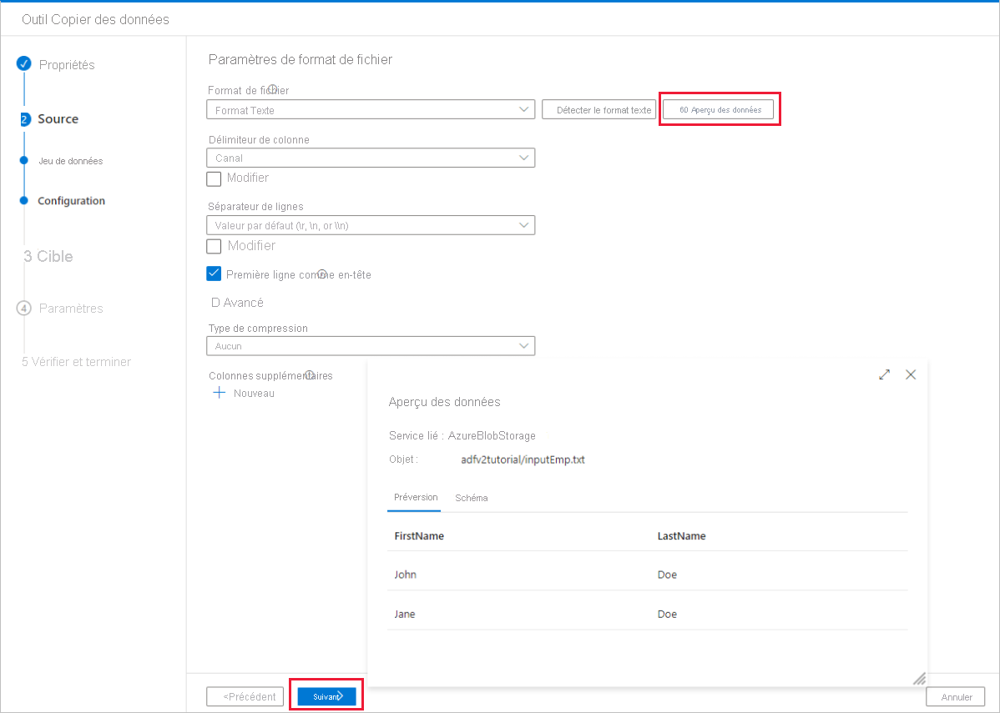
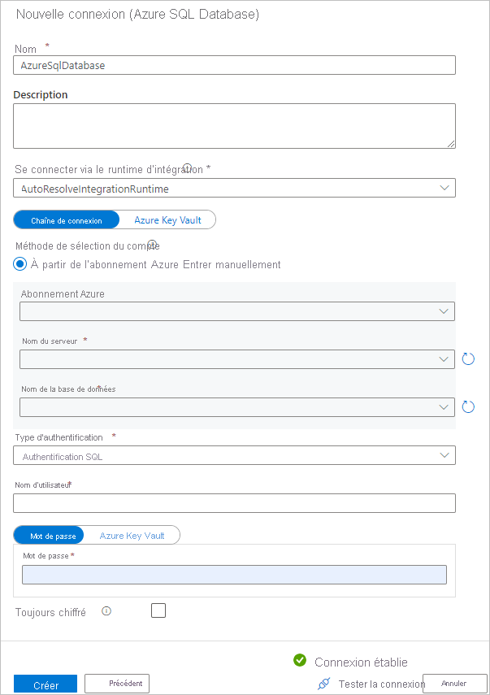
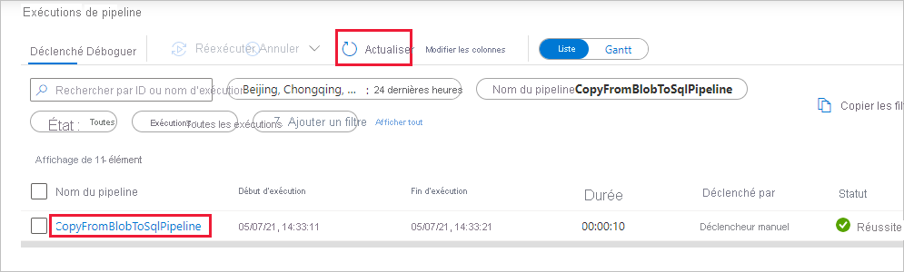
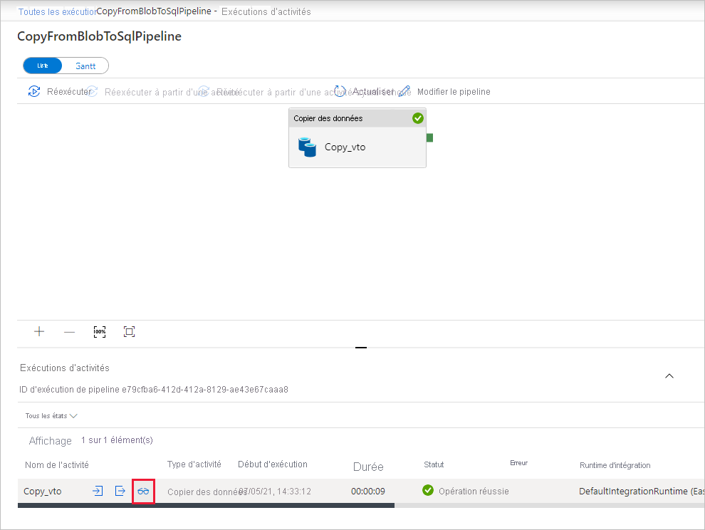
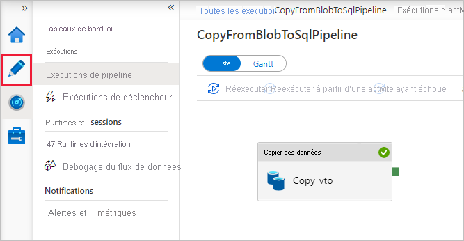

# <a name="copy-data-from-azure-blob-storage-to-a-sql-database-by-using-the-copy-data-tool"></a>Copier des données du stockage Blob Azure vers une base de données SQL Database en utilisant l’outil Copier les données

> [!div class="op_single_selector" title1="Sélectionnez la version du service Data Factory que vous utilisez :"]
> * [Version 1](v1/data-factory-copy-data-from-azure-blob-storage-to-sql-database.md)
> * [Version actuelle](tutorial-copy-data-tool.md)

[!INCLUDE[appliesto-adf-asa-md](includes/appliesto-adf-asa-md.md)]

Dans ce didacticiel, vous utilisez le portail Azure pour créer une fabrique de données. Vous utilisez ensuite l’outil Copier les données pour créer un pipeline qui copie des données du stockage Blob Azure vers une base de données SQL Database.

> [!NOTE]
> Si vous débutez avec Azure Data Factory, consultez [Présentation d’Azure Data Factory](introduction.md).

Dans ce tutoriel, vous effectuerez les étapes suivantes :
> [!div class="checklist"]
> * Créer une fabrique de données.
> * Utiliser l’outil Copier les données pour créer un pipeline.
> * Surveiller les exécutions de pipeline et d’activité.

## <a name="prerequisites"></a>Prérequis

* **Abonnement Azure** : Si vous n’avez pas d’abonnement Azure, créez un [compte gratuit](https://azure.microsoft.com/free/) avant de commencer.
* **Compte Stockage Azure** : Utilisez le stockage blob comme magasin de données _source_. Si vous n’avez pas de compte Stockage Azure, consultez les instructions dans [Créer un compte de stockage](../storage/common/storage-account-create.md).
* **Azure SQL Database** : Utilisez une base de données SQL Database comme magasin de données _récepteur_. Si vous n’avez pas de base de données SQL Database, consultez les instructions dans [Créer une base de données SQL Database](../azure-sql/database/single-database-create-quickstart.md).

### <a name="create-a-blob-and-a-sql-table"></a>Créer un objet blob et une table SQL

Préparez votre stockage Blob et votre base de données SQL Database pour ce tutoriel en effectuant ces étapes.

#### <a name="create-a-source-blob"></a>Créer un objet blob source

1. Lancez le **Bloc-notes**. Copiez le texte suivant et enregistrez-le dans un fichier nommé **inputEmp.txt** sur votre disque :

   ```text
   FirstName|LastName
   John|Doe
   Jane|Doe
   ```

1. Créez un conteneur nommé **adfv2tutorial** et chargez le fichier inputEmp.txt dedans. Vous pouvez utiliser le portail Azure ou différents outils, comme l’[Explorateur Stockage Azure](https://storageexplorer.com/) pour effectuer ces tâches.

#### <a name="create-a-sink-sql-table"></a>Créer une table SQL de récepteur

1. Utilisez le script SQL suivant pour créer une table nommée **dbo.emp** dans votre base de données SQL Database :

   ```sql
   CREATE TABLE dbo.emp
   (
       ID int IDENTITY(1,1) NOT NULL,
       FirstName varchar(50),
       LastName varchar(50)
   )
   GO
   CREATE CLUSTERED INDEX IX_emp_ID ON dbo.emp (ID);
   ```

2. Autorisez les services Azure à accéder au serveur SQL. Vérifiez que le paramètre **Autoriser les services et les ressources Azure à accéder à ce serveur** est activé pour votre serveur exécutant SQL Database. Ce paramètre permet à Data Factory d’écrire des données dans votre instance de base de données. Pour vérifier et activer ce paramètre, accédez au serveur SQL logique > Sécurité > Pare-feux et réseaux virtuels et définissez l’option **Autoriser les services et les ressources Azure à accéder à ce serveur** sur **Activé**.

   > [!NOTE]
   > L’option **Autoriser les services et les ressources Azure à accéder à ce serveur** permet d’activer l’accès réseau à votre serveur SQL Server à partir de n’importe quelle ressource Azure, pas seulement celles de votre abonnement. Pour plus d’informations, consultez [Règles de pare-feu Azure SQL Server](../azure-sql/database/firewall-configure.md). À la place, vous pouvez vous servir de [points de terminaison privés](../private-link/private-endpoint-overview.md) pour vous connecter aux services Azure PaaS sans utiliser d’IP publiques.

## <a name="create-a-data-factory"></a>Créer une fabrique de données

1. Dans le menu de gauche, sélectionnez **Créer une ressource** > **Intégration** > **Data Factory** :

   

1. Sur la page **Nouvelle fabrique de données**, entrez **ADFTutorialDataFactory** dans le champ **Nom**.

   Le nom de votre fabrique de données doit être un _nom global unique_. Vous pouvez recevoir le message d’erreur suivant :

   :::image type="content" source="./media/doc-common-process/name-not-available-error.png" alt-text="Nouveau message d’erreur de la fabrique de données pour le nom dupliqué.":::

   Si vous recevez un message d’erreur concernant la valeur du nom, saisissez un autre nom pour la fabrique de données. Par exemple, utilisez le nom _**votrenom**_**ADFTutorialDataFactory**. Pour savoir comment nommer les artefacts Data Factory, voir [Data Factory - Règles d’affectation des noms](naming-rules.md).

1. Sélectionnez l’**abonnement** Azure dans lequel vous créez la nouvelle fabrique de données.

1. Pour **Groupe de ressources**, réalisez l’une des opérations suivantes :

   a. Sélectionnez **Utiliser l’existant**, puis sélectionnez un groupe de ressources existant dans la liste déroulante.

   b. Sélectionnez **Créer**, puis entrez le nom d’un groupe de ressources.

   Pour plus d’informations sur les groupes de ressources, consultez [Utilisation des groupes de ressources pour gérer vos ressources Azure](../azure-resource-manager/management/overview.md).

1. Sous **Version**, sélectionnez **V2** pour la version.

1. Sous **Emplacement**, sélectionnez l’emplacement de la fabrique de données. Seuls les emplacements pris en charge sont affichés dans la liste déroulante. Les magasins de données (tels que le Stockage Azure et SQL Database) et les services de calcul (comme Azure HDInsight) utilisés par votre fabrique de données peuvent se trouver dans d’autres emplacements et régions.

1. Sélectionnez **Create** (Créer).

1. Une fois la création terminée, la page d’accueil **Data Factory** s’affiche.

   :::image type="content" source="./media/doc-common-process/data-factory-home-page.png" alt-text="Page d’accueil d’Azure Data Factory, avec la vignette Créer et superviser.":::

1. Pour lancer l’interface utilisateur d’Azure Data Factory dans un onglet séparé, cliquez sur la vignette **Créer et surveiller**.

## <a name="use-the-copy-data-tool-to-create-a-pipeline"></a>Utiliser l’outil Copier les données pour créer un pipeline

1. Sur la page **Prise en main**, sélectionnez la vignette **Copier des données** pour démarrer l’outil Copier des données.

   

1. Sur la page **Propriétés**, sous **Nom de la tâche**, saisissez **CopyFromBlobToSqlPipeline**. Sélectionnez ensuite **Suivant**. L’interface utilisateur de Data Factory crée un pipeline avec le nom spécifié.

   

1. Sur la page **Banque de données source**, procédez comme suit :

   a. Sélectionnez **+ Créer une connexion** pour ajouter une connexion

   b. Sélectionnez **Stockage Blob Azure** à partir de la galerie, puis sélectionnez **Continuer**.

   c. Dans la page **Nouveau service lié**, sélectionnez votre abonnement Azure et ensuite votre compte de stockage dans la liste **Nom du compte de stockage**. Testez la connexion, puis sélectionnez **Créer**.

   d. Sélectionnez le service lié qui vient d’être créé en tant que source, puis sélectionnez **Suivant**.

   

1. Sur la page **Choisir le fichier ou le dossier de sortie**, procédez comme suit :

   a. Sélectionnez **Parcourir** pour accéder au dossier **adfv2tutorial/input**, sélectionnez le fichier **inputEmp.txt**, puis sélectionnez **Choisir**.

   b. Sélectionnez **Suivant** pour passer à l’étape suivante.

1. Dans la page **Paramètres de format de fichier** , cochez la case *Première ligne comme en-tête*. Notez que l’outil détecte automatiquement les séparateurs de ligne et de colonne. Sélectionnez **Suivant**. Vous pouvez aussi prévisualiser les données et examiner le schéma des données d’entrée dans cette page.

   

1. Sur la page **Banque de données de destination**, procédez comme suit :

   a. Sélectionnez **+ Créer une connexion** pour ajouter une connexion

   b. Sélectionnez **Azure SQL Database** dans la galerie, puis sélectionnez **Continuer**.

   c. Dans la page **Nouveau service lié**, sélectionnez le nom de votre serveur et le nom de votre base de données dans la liste déroulante, spécifiez le nom d’utilisateur et le mot de passe, puis sélectionnez **Créer**.

      

   d. Sélectionnez le service lié qui vient d’être créé en tant que récepteur, puis sélectionnez **Suivant**.

1. Sur la page **Mappage de table**, sélectionnez la table **[dbo].[emp]** , puis sélectionnez **Suivant**.

1. Dans la page **Mappage de colonne**, notez que les deuxième et troisième colonnes du fichier d’entrée sont mappées aux colonnes **FirstName** et **LastName** de la table **emp**. Ajustez le mappage pour vérifier qu’il n’y a pas d’erreur, puis sélectionnez **Suivant**.

   

1. Sur la page **Paramètres**, cliquez sur **Suivant**.

1. Sur la page **Résumé**, vérifiez les paramètres, puis sélectionnez **Suivant**.

1. Sur la page **Déploiement**, sélectionnez **Surveiller** pour surveiller le pipeline (tâche).

   

1. Dans la page Exécutions de pipeline, sélectionnez **Actualiser** pour actualiser la liste. Sélectionnez le lien situé sous **NOM DU PIPELINE** pour voir les détails de l’exécution d’activité ou réexécuter le pipeline. 

   

1. Dans la page Exécutions de l’activité, sélectionnez le lien **Détails** (icône de lunettes) en dessous de la colonne **Nom de l’activité** pour plus d’informations sur l’opération de copie. Pour revenir à l’affichage Exécutions de pipeline, sélectionnez le lien **Toutes les exécutions de pipelines** dans le menu de navigation. Sélectionnez **Actualiser** pour actualiser l’affichage.

   

1. Vérifiez que les données sont insérées dans la table **dbo.emp** dans votre base de données SQL Database.

1. Sélectionnez l’onglet **Auteur** sur la gauche pour basculer en mode éditeur. Vous pouvez mettre à jour les services, jeux de données et pipelines liés créés par l’outil à l’aide de l’éditeur. Pour plus de détails sur la modification de ces entités dans l’interface utilisateur de Data Factory, consultez [la version du portail Azure de ce didacticiel](tutorial-copy-data-portal.md).

   

## <a name="next-steps"></a>Étapes suivantes
Le pipeline de cet exemple copie des données du stockage Blob vers une base de données SQL Database. Vous avez appris à :

> [!div class="checklist"]
> * Créer une fabrique de données.
> * Utiliser l’outil Copier les données pour créer un pipeline.
> * Surveiller les exécutions de pipeline et d’activité.

Passez au didacticiel suivant pour en savoir plus sur la copie des données locales vers le cloud :

>[!div class="nextstepaction"]
>[Copier des données locales vers le cloud](tutorial-hybrid-copy-data-tool.md)
