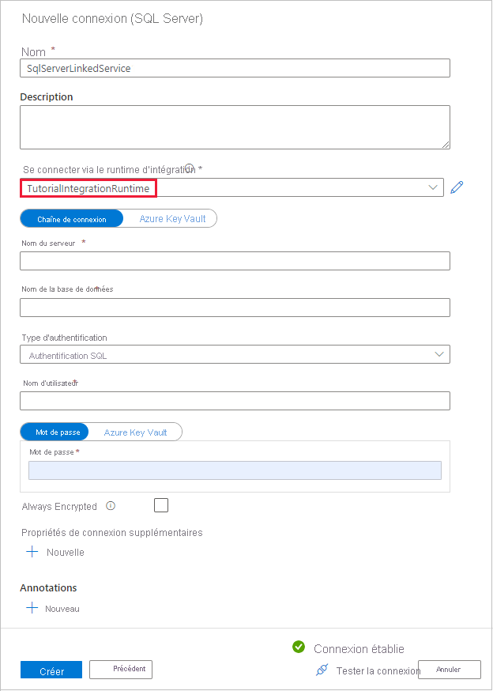
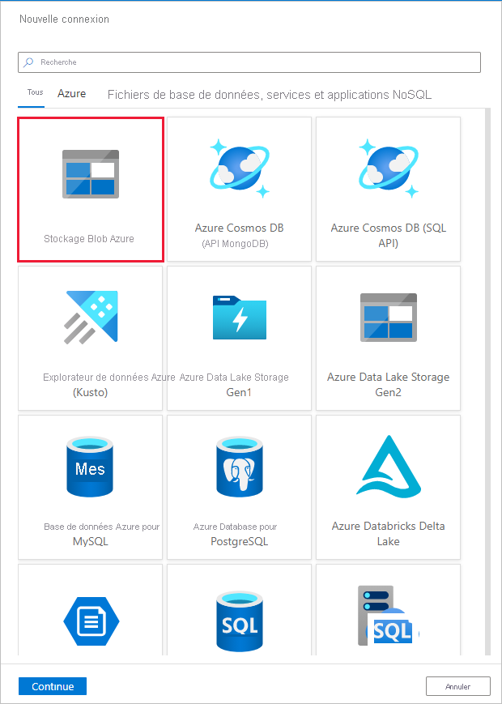

# <a name="copy-data-from-a-sql-server-database-to-azure-blob-storage-by-using-the-copy-data-tool"></a>Copier des données depuis une base de données SQL Server vers un stockage Blob Azure à l’aide de l’outil Copier les données
> [!div class="op_single_selector" title1="Sélectionnez la version du service Data Factory que vous utilisez :"]
> * [Version 1](v1/data-factory-copy-data-from-azure-blob-storage-to-sql-database.md)
> * [Version actuelle](tutorial-hybrid-copy-data-tool.md)

[!INCLUDE[appliesto-adf-xxx-md](includes/appliesto-adf-xxx-md.md)]

Dans ce didacticiel, vous utilisez le portail Azure pour créer une fabrique de données. Vous utilisez ensuite l’outil Copier les données pour créer un pipeline qui copie des données depuis une base de données SQL Server vers un stockage Blob Azure.

> [!NOTE]
> - Si vous débutez avec Azure Data Factory, consultez [Présentation d’Azure Data Factory](introduction.md).

Dans ce tutoriel, vous effectuerez les étapes suivantes :

> [!div class="checklist"]
> * Créer une fabrique de données.
> * Utiliser l’outil Copier les données pour créer un pipeline.
> * Surveiller les exécutions de pipeline et d’activité.

## <a name="prerequisites"></a>Prérequis
### <a name="azure-subscription"></a>Abonnement Azure
Si vous n’avez pas d’abonnement Azure, [créez un compte gratuit](https://azure.microsoft.com/free/) avant de commencer.

### <a name="azure-roles"></a>Rôles Azure
Pour créer des instances de fabrique de données, le compte d’utilisateur que vous utilisez pour vous connecter à Azure doit être un membre des rôles *contributeur* ou *propriétaire*, ou un *administrateur* de l’abonnement Azure.

Pour afficher les autorisations dont vous disposez dans l’abonnement, accédez au portail Azure. Dans l’angle supérieur droit, sélectionnez votre nom d’utilisateur, puis **Autorisations**. Si vous avez accès à plusieurs abonnements, sélectionnez l’abonnement approprié. Pour obtenir des exemples d’instructions sur l’ajout d’un utilisateur à un rôle, consultez [Ajouter ou supprimer des attributions de rôle Azure à l’aide du portail Azure](../role-based-access-control/role-assignments-portal.md).

### <a name="sql-server-2014-2016-and-2017"></a>SQL Server 2014, 2016 et 2017
Dans le cadre de ce tutoriel, vous allez utiliser une base de données SQL Server comme magasin de données *source*. Le pipeline de la fabrique de données que vous allez créer dans ce tutoriel copie les données de cette base de données SQL Server (source) dans un stockage Blob (récepteur). Créez ensuite un tableau nommé **emp** dans votre base de données SQL Server, puis insérez-y quelques exemples d’entrées.

1. Exécutez SQL Server Management Studio. S’il n’est pas déjà installé sur votre machine, accédez à [Télécharger SQL Server Management Studio](/sql/ssms/download-sql-server-management-studio-ssms).

1. Connectez-vous à votre instance SQL Server à l’aide de vos informations d’identification.

1. Créez un exemple de base de données. Dans l’arborescence, cliquez avec le bouton droit sur **Bases de données**, puis sur **Nouvelle base de données**.

1. Dans la fenêtre **Nouvelle base de données**, entrez un nom pour la base de données, puis cliquez sur **OK**.

1. Pour créer la table **emp** et y insérer quelques données d’exemple, exécutez le script de requête suivant sur la base de données. Dans l’arborescence, cliquez avec le bouton droit sur la base de données créée, puis sur **Nouvelle requête**.

    ```sql
    CREATE TABLE dbo.emp
    (
        ID int IDENTITY(1,1) NOT NULL,
        FirstName varchar(50),
        LastName varchar(50)
    )
    GO

    INSERT INTO emp (FirstName, LastName) VALUES ('John', 'Doe')
    INSERT INTO emp (FirstName, LastName) VALUES ('Jane', 'Doe')
    GO
    ```

### <a name="azure-storage-account"></a>Compte Azure Storage
Dans ce didacticiel, vous utilisez un compte de stockage Azure à usage général (stockage Blob plus spécifiquement) comme banque de données réceptrice/de destination. Si vous ne possédez pas de compte de stockage à usage général, consultez la section [Créer un compte de stockage](../storage/common/storage-account-create.md) pour savoir comment en créer un. Le pipeline de la fabrique de données que vous allez créer dans ce tutoriel copie les données de la base de données SQL Server (source) dans ce stockage Blob (récepteur). 

#### <a name="get-the-storage-account-name-and-account-key"></a>Obtenir le nom de compte de stockage et la clé de compte
Dans ce didacticiel, vous utilisez le nom et la clé de votre compte de stockage. Pour obtenir le nom et la clé de votre compte de stockage, procédez comme suit :

1. Connectez-vous au [portail Azure](https://portal.azure.com) avec votre nom d’utilisateur et votre mot de passe Azure.

1. Dans le volet gauche, sélectionnez **Tous les services**. Filtrez à l’aide du mot-clé **Stockage**, puis sélectionnez **Comptes de stockage**.

    

1. Dans la liste des comptes de stockage, appliquez un filtre pour votre compte de stockage (si nécessaire). Sélectionnez ensuite votre compte de stockage.

1. Dans la fenêtre **Compte de stockage**, sélectionnez **Clés d’accès**.


1. Dans les zones **Nom du compte de stockage** et **key1**, copiez les valeurs, puis collez-les dans le bloc-notes ou un autre éditeur pour une utilisation ultérieure dans le tutoriel.

#### <a name="create-the-adftutorial-container"></a>Créer le conteneur adftutorial
Dans cette section, vous allez créer un conteneur d’objets blob nommé **adftutorial** dans votre stockage Blob.

1. Dans la fenêtre **Compte de stockage**, basculez vers **Vue d’ensemble**, puis sélectionnez **Objets blob**.

1. Dans la fenêtre **Objets blob**, sélectionnez **+ Conteneur**.

1. Dans la fenêtre **Nouveau conteneur**, sous **Nom**, entrez **adftutorial**, puis sélectionnez **OK**.

1. Cliquez sur **adftutorial** dans la liste des conteneurs.


1. Gardez la fenêtre **Conteneur** de **adftutorial** ouverte. Elle vous permet de vérifier la sortie à la fin du tutoriel. Data Factory crée automatiquement le dossier de sortie de ce conteneur, de sorte que vous n’avez pas besoin d’en créer.


## <a name="create-a-data-factory"></a>Créer une fabrique de données

1. Dans le menu de gauche, sélectionnez **Créer une ressource** > **Intégration** > **Data Factory**.

   

1. Sur la page **Nouvelle fabrique de données**, entrez **ADFTutorialDataFactory** dans le champ **Nom**.

   Le nom de la fabrique de données doit être un *nom global unique*. Si le message d’erreur suivant s’affiche pour le champ du nom, modifiez le nom de la fabrique de données (par exemple, votrenomADFTutorialDataFactory). Consultez l’article [Azure Data Factory - Règles d’affectation des noms](naming-rules.md) pour savoir comment nommer les règles Data Factory.

   
1. Sélectionnez l’**abonnement** Azure dans lequel vous voulez créer la fabrique de données.
1. Pour **Groupe de ressources**, réalisez l’une des opérations suivantes :

   - Sélectionnez **Utiliser l’existant**, puis sélectionnez un groupe de ressources existant dans la liste déroulante.

   - Sélectionnez **Créer**, puis entrez le nom d’un groupe de ressources. 
        
     Pour plus d’informations sur les groupes de ressources, consultez [Utilisation des groupes de ressources pour gérer vos ressources Azure](../azure-resource-manager/management/overview.md).
1. Sous **Version**, sélectionnez **V2**.
1. Sous **Emplacement**, sélectionnez l’emplacement de la fabrique de données. Seuls les emplacements pris en charge sont affichés dans la liste déroulante. Les magasins de données (tels que le Stockage Azure et SQL Database) et les services de calcul (comme Azure HDInsight) utilisés par Data Factory peuvent se trouver dans d’autres emplacements/régions.
1. Sélectionnez **Create** (Créer).

1. Une fois la création terminée, la page **Data Factory** s’affiche comme sur l’image.

     
1. Sélectionnez **Créer et surveiller** pour lancer l’interface utilisateur de Data Factory dans un onglet séparé.

## <a name="use-the-copy-data-tool-to-create-a-pipeline"></a>Utiliser l’outil Copier les données pour créer un pipeline

1. Sur la page **Prise en main**, sélectionnez **Copier des données** pour lancer l’outil Copier des données.

   

1. Sur la page **Propriétés** de l’outil Copier les données, spécifiez **CopyFromOnPremSqlToAzureBlobPipeline** dans le champ **Nom de la tâche**. Sélectionnez ensuite **Suivant**. L’outil Copier les données crée un pipeline avec le nom que vous spécifiez dans ce champ.
  

1. Sur la page **Banque de données sources**, cliquez sur **+ Créer une connexion**.

1. Sous **Nouveau service lié**, recherchez **SQL Server**, puis sélectionnez **Continuer**.

1. Dans la boîte de dialogue **Nouveau service lié (SQL Server)** , sous **Nom**, entrez **SqlServerLinkedService**. Sélectionnez **+ Nouveau** sous **Se connecter via le runtime d’intégration**. Vous devez créer un runtime d’intégration auto-hébergé, le télécharger sur votre machine et l’inscrire auprès de Data Factory. Le runtime d’intégration auto-hébergé copie des données entre votre environnement local et le cloud.

1. Dans la boîte de dialogue **Configuration du runtime d’intégration**, sélectionnez **Auto-hébergé**. Sélectionnez **Continuer**.

   

1. Dans la boîte de dialogue **Configuration du runtime d’intégration**, sous **Nom**, entrez **TutorialIntegrationRuntime**. Sélectionnez ensuite **Créer**.

1. Dans la boîte de dialogue **Configuration du runtime d’intégration**, sélectionnez **Cliquez ici pour lancer l’installation rapide pour cet ordinateur**. Cette action installe le runtime d’intégration sur votre machine et l’inscrit auprès de Data Factory. Vous pouvez également utiliser l’option d’installation manuelle pour télécharger le fichier d’installation, l’exécuter et utiliser la clé pour inscrire le runtime d’intégration.

1. Exécutez l’application téléchargée. Vous pouvez voir l’état de l’installation rapide dans la fenêtre.

    

1. Dans la boîte de dialogue **Nouveau service lié (SQL Server)** , vérifiez que **TutorialIntegrationRuntime** est sélectionné dans le champ Runtime d’intégration. Ensuite, effectuez les étapes suivantes :

    a. Dans le champ **Nom**, entrez **SqlServerLinkedService**.

    b. Entrez le nom de votre instance SQL Server dans le champ **Nom du serveur**.

    c. Entrez le nom de votre base de données locale dans le champ **Nom de la base de données**.

    d. Sélectionnez l’authentification appropriée sous **Type d’authentification**.

    e. Entrez le nom d’utilisateur ayant accès au SQL Server dans le champ **Nom d’utilisateur**.

    f. Entrez le **mot de passe** correspondant à l’utilisateur.

    g. Testez la connexion et sélectionnez **Terminer**.

      

1. Dans la page **Magasin de données sources**, sélectionnez **Suivant**.

1. Sur la page **Sélectionner les tables à partir desquelles copier les données ou utiliser une requête personnalisée**, sélectionnez la table **[dbo].[emp]** dans la liste, puis sélectionnez **Suivant**. Vous pouvez sélectionner n’importe quelle autre table en fonction de votre base de données.

1. Sur la page **Banque de données de destination**, sélectionnez **Créer une connexion**


1. Dans **Nouveau service lié**, recherchez et sélectionnez **Objet blob Azure**, puis **Continuer**.

   

1. Dans la boîte de dialogue **New Linked Service (Azure Blob Storage)** (Nouveau service lié (Stockage Blob Azure)), procédez comme suit :

   a. Dans le champ **Nom**, entrez **AzureStorageLinkedService**.

   b. Sous **Se connecter via le runtime d’intégration**, sélectionnez **TutorialIntegrationRuntime**

   c. Sélectionnez votre compte de stockage dans la liste déroulante sous **Nom du compte de stockage**.

   d. Sélectionnez **Terminer**.

1. Dans la boîte de dialogue **Magasin de données de destination**, vérifiez que **Stockage Blob Azure** est sélectionné. Sélectionnez ensuite **Suivant**.

1. Dans la boîte de dialogue **Choisir le fichier ou le dossier de sortie**, sous **Chemin d’accès du dossier**, entrez **adftutorial/fromonprem**. Vous avez créé le conteneur **adftutorial** dans le cadre des conditions préalables. Si le dossier de sortie n’existe pas (ici **fromonprem**), Data Factory le crée automatiquement. Vous pouvez également utiliser le bouton **Parcourir** pour parcourir le stockage d’objets blob et ses conteneurs/dossiers. Si vous ne spécifiez pas de valeur sous **Nom de fichier**, le nom de la source est utilisé par défaut (ici **dbo.emp**).

   

1. Dans la boîte de dialogue **Paramètres de format de fichier**, sélectionnez **Suivant**.

1. Dans la boîte de dialogue **Paramètres**, sélectionnez **Suivant**.

1. Dans la boîte de dialogue **Résumé**, vérifiez la valeur de tous les paramètres, puis sélectionnez **Suivant**.

1. Sur la page **Déploiement**, sélectionnez **Surveiller** pour surveiller le pipeline (tâche). 

1. Une fois l’exécution du pipeline terminée, vous pouvez afficher l’état du pipeline que vous avez créé. 

1. Dans la page Exécutions de pipeline, sélectionnez **Actualiser** pour actualiser la liste. Cliquez sur le lien en dessous de **Nom du pipeline** pour afficher les détails de l’exécution de l’activité ou réexécuter le pipeline. 

1. Dans la page Exécutions de l’activité, sélectionnez le lien **Détails** (icône de lunettes) en dessous de la colonne **Nom de l’activité** pour plus d’informations sur l’opération de copie. Pour revenir à l’affichage Exécutions de pipeline, sélectionnez le lien **Toutes les exécutions de pipelines** dans le menu de navigation. Sélectionnez **Actualiser** pour actualiser l’affichage.

1. Vérifiez que le fichier de sortie apparaît bien dans le dossier **fromonprem** du conteneur **adftutorial**.

1. Sélectionnez l’onglet **Modifier** sur la gauche pour basculer en mode éditeur. Vous pouvez mettre à jour les services, jeux de données et pipelines liés créés par l’outil à l’aide de l’éditeur. Sélectionnez **Code** pour afficher le code JSON associé à l’entité ouverte dans l’éditeur. Pour plus de détails sur la modification de ces entités dans l’interface utilisateur de Data Factory, consultez [la version du portail Azure de ce didacticiel](tutorial-copy-data-portal.md).


## <a name="next-steps"></a>Étapes suivantes
Le pipeline dans cet exemple copie des données depuis une base de données SQL Server vers un stockage Blob. Vous avez appris à :

> [!div class="checklist"]
> * Créer une fabrique de données.
> * Utiliser l’outil Copier les données pour créer un pipeline.
> * Surveiller les exécutions de pipeline et d’activité.

Pour obtenir la liste des magasins de données pris en charge par Data Factory, consultez l’article sur les [magasins de données pris en charge](copy-activity-overview.md#supported-data-stores-and-formats).

Pour découvrir comment copier des données en bloc d’une source vers une destination, passez au didacticiel suivant :

> [!div class="nextstepaction"]
>[Copier des données en bloc](tutorial-bulk-copy-portal.md)
