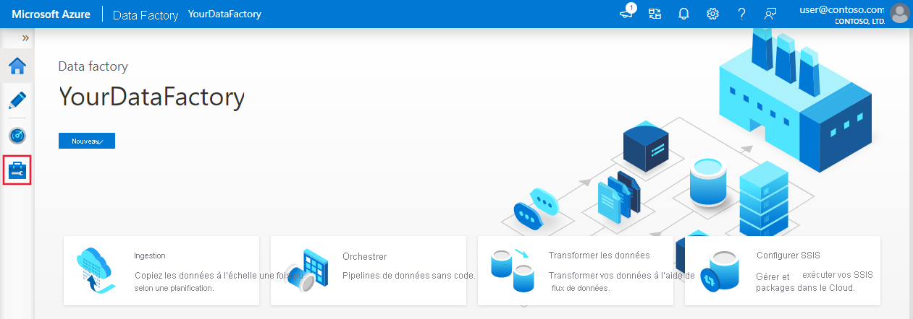

# <a name="incrementally-load-data-from-multiple-tables-in-sql-server-to-a-database-in-azure-sql-database-using-the-azure-portal"></a>Charger de façon incrémentielle les données de plusieurs tables dans SQL Server vers une base de données dans Azure SQL Database par le biais du portail Azure

[!INCLUDE[appliesto-adf-xxx-md](includes/appliesto-adf-xxx-md.md)]

Dans ce tutoriel, vous créez une fabrique de données Azure Data Factory avec un pipeline qui charge les données delta provenant de plusieurs tables d’une base de données SQL Server sur une base de données dans Azure SQL Database.    

Dans ce tutoriel, vous allez effectuer les étapes suivantes :

> [!div class="checklist"]
> * Préparer les magasins de données source et de destination.
> * Créer une fabrique de données.
> * Créez un runtime d’intégration auto-hébergé.
> * Installer le runtime d’intégration. 
> * créez des services liés. 
> * Créer des jeux de données source, récepteur et filigrane.
> * Créez, exécutez et surveillez un pipeline.
> * Passez en revue les résultats.
> * Ajouter ou mettre à jour des données dans les tables source.
> * Réexécuter et surveiller le pipeline.
> * Passer en revue les résultats finaux.

## <a name="overview"></a>Vue d’ensemble
Voici les étapes importantes à suivre pour créer cette solution : 

1. **Sélectionner la colonne de limite**.
    
    Sélectionnez une colonne pour chaque table du magasin de données sources, qui peut servir à identifier les enregistrements nouveaux ou mis à jour pour chaque exécution. Normalement, les données contenues dans cette colonne sélectionnée (par exemple, last_modify_time ou ID) continuent de croître à mesure que des lignes sont créées ou mises à jour. La valeur maximale de cette colonne est utilisée comme limite.

1. **Préparer un magasin de données pour stocker la valeur de limite**.   
    
    Dans ce tutoriel, la valeur de filigrane est stockée dans une base de données SQL.

1. **Créer un pipeline avec les activités suivantes** : 
    
    a. Créez une activité ForEach qui effectue une itération dans une liste de noms de table source qui est transmise en tant que paramètre au pipeline. Pour chaque table source, elle appelle les activités suivantes pour effectuer le chargement delta pour cette table.

    b. Créez deux activités de recherche. Servez-vous de la première activité de recherche pour récupérer la dernière valeur de filigrane. Utilisez la deuxième activité de recherche pour récupérer la nouvelle valeur de filigrane. Ces valeurs de filigrane sont transmises à l’activité de copie.

    c. Créez une activité de copie qui copie les lignes du magasin de données source dont la valeur de la colonne de filigrane est supérieure à l’ancienne valeur de filigrane et inférieure à la nouvelle. Elle copie ensuite les données delta du magasin de données source dans un stockage Blob Azure sous la forme d’un nouveau fichier.

    d. Créez une activité StoredProcedure qui met à jour la valeur de filigrane pour le pipeline s’exécutant la prochaine fois. 

    Voici le diagramme général de la solution : 

    


Si vous n’avez pas d’abonnement Azure, créez un compte [gratuit](https://azure.microsoft.com/free/) avant de commencer.

## <a name="prerequisites"></a>Prérequis
* **SQL Server**. Dans le cadre de ce tutoriel, vous allez utiliser une base de données SQL Server comme magasin de données source. 
* **Azure SQL Database**. Vous utilisez une base de données dans Azure SQL Database comme magasin de données récepteur. Si vous n’avez pas de base de données dans SQL Database, consultez [Créer une base de données dans Azure SQL Database](../azure-sql/database/single-database-create-quickstart.md) pour savoir comme en créer une. 

### <a name="create-source-tables-in-your-sql-server-database"></a>Créer des tables sources dans votre base de données SQL Server

1. Ouvrez SQL Server Management Studio, puis connectez-vous à votre base de données SQL Server.

1. Dans l’**Explorateur de serveurs**, cliquez avec le bouton droit sur la base de données et choisissez **Nouvelle requête**.

1. Exécutez la commande SQL suivante sur votre base de données pour créer des tables nommées `customer_table` et `project_table` :

    ```sql
    create table customer_table
    (
        PersonID int,
        Name varchar(255),
        LastModifytime datetime
    );
    
    create table project_table
    (
        Project varchar(255),
        Creationtime datetime
    );
        
    INSERT INTO customer_table
    (PersonID, Name, LastModifytime)
    VALUES
    (1, 'John','9/1/2017 12:56:00 AM'),
    (2, 'Mike','9/2/2017 5:23:00 AM'),
    (3, 'Alice','9/3/2017 2:36:00 AM'),
    (4, 'Andy','9/4/2017 3:21:00 AM'),
    (5, 'Anny','9/5/2017 8:06:00 AM');
    
    INSERT INTO project_table
    (Project, Creationtime)
    VALUES
    ('project1','1/1/2015 0:00:00 AM'),
    ('project2','2/2/2016 1:23:00 AM'),
    ('project3','3/4/2017 5:16:00 AM');
    
    ```

### <a name="create-destination-tables-in-your-database"></a>Créer des tables de destination dans votre base de données

1. Ouvrez SQL Server Management Studio, puis connectez-vous à votre base de données dans Azure SQL Database.

1. Dans l’**Explorateur de serveurs**, cliquez avec le bouton droit sur la base de données et choisissez **Nouvelle requête**.

1. Exécutez la commande SQL suivante sur votre base de données pour créer des tables nommées `customer_table` et `project_table` :  
    
    ```sql
    create table customer_table
    (
        PersonID int,
        Name varchar(255),
        LastModifytime datetime
    );
    
    create table project_table
    (
        Project varchar(255),
        Creationtime datetime
    );

    ```

### <a name="create-another-table-in-your-database-to-store-the-high-watermark-value"></a>Créer une autre table dans votre base de données pour stocker la valeur de filigrane supérieure

1. Exécutez la commande SQL suivante sur votre base de données pour créer une table sous le nom `watermarktable` et y stocker la valeur de limite supérieure : 
    
    ```sql
    create table watermarktable
    (
    
        TableName varchar(255),
        WatermarkValue datetime,
    );
    ```
1. Insérer des valeurs de limite supérieure initiale pour les deux tables source dans la table de limite supérieure.

    ```sql

    INSERT INTO watermarktable
    VALUES 
    ('customer_table','1/1/2010 12:00:00 AM'),
    ('project_table','1/1/2010 12:00:00 AM');
    
    ```

### <a name="create-a-stored-procedure-in-your-database"></a>Créer une procédure stockée dans votre base de données

Exécutez la commande suivante pour créer une procédure stockée dans votre base de données. Cette procédure stockée met à jour la valeur de filigrane après chaque exécution du pipeline. 

```sql
CREATE PROCEDURE usp_write_watermark @LastModifiedtime datetime, @TableName varchar(50)
AS

BEGIN

    UPDATE watermarktable
    SET [WatermarkValue] = @LastModifiedtime 
WHERE [TableName] = @TableName

END

```

### <a name="create-data-types-and-additional-stored-procedures-in-your-database"></a>Créer des types de données et des procédures stockées supplémentaires dans votre base de données

Exécutez la requête suivante pour créer deux procédures stockées et deux types de données dans votre base de données. Ils sont utilisés pour fusionner les données des tables source dans les tables de destination.

Afin de faciliter le démarrage du parcours, nous utilisons directement ces procédures stockées en passant les données delta par l’intermédiaire d’une variable de table, puis nous les fusionnons dans le magasin de destination. Faites attention qu’il ne s’attende pas à ce qu’un nombre « élevé » de lignes delta (plus de 100) soient stockées dans la variable de table.  

Si vous n’avez pas besoin de fusionner un grand nombre de lignes delta dans le magasin de destination, nous vous suggérons d’utiliser d’abord l’activité de copie pour copier toutes les données delta dans une table « temporaire » dans le magasin de destination, puis de créer votre propre procédure stockée sans utiliser la variable de table pour les fusionner de la table « temporaire » dans la table « finale ». 


```sql
CREATE TYPE DataTypeforCustomerTable AS TABLE(
    PersonID int,
    Name varchar(255),
    LastModifytime datetime
);

GO

CREATE PROCEDURE usp_upsert_customer_table @customer_table DataTypeforCustomerTable READONLY
AS

BEGIN
  MERGE customer_table AS target
  USING @customer_table AS source
  ON (target.PersonID = source.PersonID)
  WHEN MATCHED THEN
      UPDATE SET Name = source.Name,LastModifytime = source.LastModifytime
  WHEN NOT MATCHED THEN
      INSERT (PersonID, Name, LastModifytime)
      VALUES (source.PersonID, source.Name, source.LastModifytime);
END

GO

CREATE TYPE DataTypeforProjectTable AS TABLE(
    Project varchar(255),
    Creationtime datetime
);

GO

CREATE PROCEDURE usp_upsert_project_table @project_table DataTypeforProjectTable READONLY
AS

BEGIN
  MERGE project_table AS target
  USING @project_table AS source
  ON (target.Project = source.Project)
  WHEN MATCHED THEN
      UPDATE SET Creationtime = source.Creationtime
  WHEN NOT MATCHED THEN
      INSERT (Project, Creationtime)
      VALUES (source.Project, source.Creationtime);
END

```

## <a name="create-a-data-factory"></a>Créer une fabrique de données

1. Lancez le navigateur web **Microsoft Edge** ou **Google Chrome**. L’interface utilisateur de Data Factory n’est actuellement prise en charge que par les navigateurs web Microsoft Edge et Google Chrome.
2. Dans le menu de gauche, sélectionnez **Créer une ressource** > **Intégration** > **Data Factory** : 
   
   

3. Dans la page **Nouvelle fabrique de données**, entrez **ADFMultiIncCopyTutorialDF** dans le champ **Nom**. 
 
   Le nom de la fabrique de données Azure doit être un nom **global unique**. Si vous voyez un point d’exclamation rouge avec l’erreur suivante, changez le nom de la fabrique de données (par exemple, votrenomADFIncCopyTutorialDF), puis tentez de la recréer. Consultez l’article [Data Factory - Règles d’affectation des noms](naming-rules.md) pour savoir comment nommer les artefacts Data Factory.
  
   `Data factory name "ADFIncCopyTutorialDF" is not available`

4. Sélectionnez l’**abonnement** Azure dans lequel vous voulez créer la fabrique de données. 
5. Pour le **groupe de ressources**, effectuez l’une des opérations suivantes :
     
    - Sélectionnez **Utiliser l’existant**, puis sélectionnez un groupe de ressources existant dans la liste déroulante. 
    - Sélectionnez **Créer**, puis entrez le nom d’un groupe de ressources.   
    Pour plus d’informations sur les groupes de ressources, consultez [Utilisation des groupes de ressources pour gérer vos ressources Azure](../azure-resource-manager/management/overview.md).  
6. Sélectionnez **V2** pour la **version**.
7. Sélectionnez **l’emplacement** de la fabrique de données. Seuls les emplacements pris en charge sont affichés dans la liste déroulante. Les magasins de données (Stockage Azure, Azure SQL Database, etc.) et les services de calcul (HDInsight, etc.) utilisés par la fabrique de données peuvent être proposés dans d’autres régions.
8. Cliquez sur **Créer**.      
9. Une fois la création terminée, la page **Data Factory** s’affiche comme sur l’image.
   
   
10. Cliquez sur la vignette **Créer et surveiller** pour lancer l’interface utilisateur d’Azure Data Factory dans un onglet séparé.

## <a name="create-self-hosted-integration-runtime"></a>Créer un runtime d’intégration auto-hébergé
Lorsque vous déplacez des données d’un magasin de données d’un réseau privé (local) à un magasin de données Azure, installez un runtime d’intégration (IR) auto-hébergé dans votre environnement local. Le runtime d’intégration auto-hébergé déplace les données entre votre réseau privé et Azure. 

1. Dans la page **Prise en main** de l’interface utilisateur Azure Data Factory, sélectionnez l’[onglet Gérer](./author-management-hub.md) dans le volet le plus à gauche.

   

1. Sélectionnez **Runtimes d’intégration** dans le volet gauche, puis **+ Nouveau**.

   

1. Dans la fenêtre **Installation du runtime d’intégration**, sélectionnez **Effectuer des activités de déplacement et de distribution des données vers des ressources de calcul externes**, puis cliquez sur **Continuer**. 

1. Sélectionnez **Auto-hébergé**, puis cliquez sur **Continuer**. 
1. Entrez **MySelfHostedIR** pour le **Nom**, puis cliquez sur **Créer**. 

1. Cliquez sur **Cliquez ici pour lancer l’installation rapide pour cet ordinateur** dans la section **Option 1 : installation rapide**. 

   
1. Dans la fenêtre **Installation rapide du runtime d’intégration (auto-hébergé)** , cliquez sur **Fermer**. 

   
1. Dans la fenêtre **Installation du runtime d’intégration**, cliquez sur **Terminer**. 

 
1. Vérifiez que **MySelfHostedIR** figure dans la liste des runtimes d’intégration.

## <a name="create-linked-services"></a>Créez des services liés
Vous allez créer des services liés dans une fabrique de données pour lier vos magasins de données et vos services de calcul à la fabrique de données. Dans cette section, vous créez des services liés à votre base de données SQL Server et à votre base de données dans Azure SQL Database. 

### <a name="create-the-sql-server-linked-service"></a>Créer le service lié SQL Server
Dans cette étape, vous liez votre base de données SQL Server à la fabrique de données.

1. Dans la fenêtre **Connexions**, passez de l’onglet **Runtimes d’intégration** à l’onglet **Services liés**, puis cliquez sur **+ Nouveau**.

   
1. Dans la fenêtre **Nouveau service lié**, sélectionnez **SQL Server**, puis cliquez sur **Continuer**. 

1. Dans la fenêtre **Nouveau service lié**, procédez comme suit :

    1. Entrez **SqlServerLinkedService** comme **nom**. 
    1. Sélectionnez **MySelfHostedIR** pour **se connecter via le runtime d’intégration**. Il s’agit d’une étape **importante**. Le runtime d’intégration par défaut ne peut pas se connecter à un magasin de données local. Utilisez le runtime d’intégration auto-hébergé que vous avez créé précédemment. 
    1. Dans le champ **Nom du serveur**, entrez le nom de l’ordinateur sur lequel réside la base de données SQL Server.
    1. Dans le champ **Nom de la base de données**, entrez le nom de la base de données de votre serveur SQL Server qui contient les données sources. Vous avez créé une table et inséré des données dans cette base de données dans le cadre des conditions préalables. 
    1. Dans le champ **Type d’authentification**, sélectionnez le **type d’authentification** à utiliser pour vous connecter à la base de données. 
    1. Dans le champ **Nom d’utilisateur**, entrez le nom de l’utilisateur qui a accès à la base de données SQL Server. Si vous avez besoin d’utiliser une barre oblique (`\`) dans votre nom de serveur ou de compte d’utilisateur, utilisez le caractère d’échappement (`\`). par exemple `mydomain\\myuser`.
    1. Dans le champ **Mot de passe**, entrez le **mot de passe** de l’utilisateur. 
    1. Pour vérifier si Data Factory peut se connecter à votre base de données SQL Server, cliquez sur **Tester la connexion**. Corrigez les erreurs jusqu’à ce que la connexion soit établie. 
    1. Pour enregistrer le service lié, cliquez sur **Terminer**.

### <a name="create-the-azure-sql-database-linked-service"></a>Créer le service lié Azure SQL Database
Dans cette dernière étape, vous créez un service lié qui relie votre base de données SQL Server source à la fabrique de données. Dans cette étape, vous liez votre base de données de destination/récepteur à la fabrique de données. 

1. Dans la fenêtre **Connexions**, passez de l’onglet **Runtimes d’intégration** à l’onglet **Services liés**, puis cliquez sur **+ Nouveau**.
1. Dans la fenêtre **Nouveau service lié**, sélectionnez **Azure SQL Database**, puis cliquez sur **Continuer**. 
1. Dans la fenêtre **Nouveau service lié**, procédez comme suit :

    1. Entrez **AzureSqlDatabaseLinkedService** pour **Nom**. 
    1. Dans le champ **Nom du serveur**, sélectionnez le nom de votre serveur dans la liste déroulante. 
    1. Dans le champ **Nom de la base de données**, sélectionnez la base de données dans laquelle vous avez créé les tables customer_table et project_table dans le cadre des prérequis. 
    1. Dans **Nom d’utilisateur**, entrez le nom de l’utilisateur qui a accès à la base de données. 
    1. Dans le champ **Mot de passe**, entrez le **mot de passe** de l’utilisateur. 
    1. Pour vérifier si Data Factory peut se connecter à votre base de données SQL Server, cliquez sur **Tester la connexion**. Corrigez les erreurs jusqu’à ce que la connexion soit établie. 
    1. Pour enregistrer le service lié, cliquez sur **Terminer**.

1. Vérifiez que la liste contient deux services liés. 
   
     

## <a name="create-datasets"></a>Créez les jeux de données
Dans cette étape, vous créez des jeux de données pour représenter la source de données, la destination des données et l’emplacement de stockage du filigrane.

### <a name="create-a-source-dataset"></a>Créer un jeu de données source

1. Dans le volet gauche, cliquez sur **+ (plus)** , puis sur **Jeu de données**.

1. Dans la fenêtre **Nouveau jeu de données**, sélectionnez **SQL Server**, puis cliquez sur **Continuer**. 

1. Un nouvel onglet est ouvert dans le navigateur web et vous permet de configurer le jeu de données. Vous voyez aussi un jeu de données dans l’arborescence. Dans l’onglet **Général** de la fenêtre Propriétés située dans la partie inférieure, entrez **SourceDataset** dans le champ **Nom**. 

1. Passez dans l’onglet **Connexion** de la fenêtre Propriétés, puis sélectionnez **SqlServerLinkedService** dans la liste déroulante **Service lié**. Vous ne sélectionnez pas une table ici. L’activité de copie dans le pipeline utilise une requête SQL pour charger les données plutôt que de charger l’ensemble de la table.

   


### <a name="create-a-sink-dataset"></a>Créer un jeu de données récepteur
1. Dans le volet gauche, cliquez sur **+ (plus)** , puis sur **Jeu de données**.

1. Dans la fenêtre **Nouveau jeu de données**, sélectionnez **Azure SQL Database**, puis cliquez sur **Continuer**. 

1. Un nouvel onglet est ouvert dans le navigateur web et vous permet de configurer le jeu de données. Vous voyez aussi un jeu de données dans l’arborescence. Dans l’onglet **Général** de la fenêtre Propriétés située dans la partie inférieure, entrez **SinkDataset** dans le champ **Nom**.

1. Passez dans l’onglet **Paramètres** de la fenêtre Propriétés, et procédez comme suit : 

    1. Cliquez sur **Nouveau** dans la section **Créer/Mettre à jour des paramètres**. 
    1. Entrez **SinkTableName** dans le champ **Nom** et **Chaîne** dans le champ **Type**. Ce jeu de données utilise **SinkTableName** comme paramètre. Le paramètre SinkTableName est défini par le pipeline de manière dynamique lors de l’exécution. L’activité ForEach du pipeline effectue une itération dans une liste de noms de table et transmet le nom de table à ce jeu de données à chaque itération.
   
        
1. Passez à l’onglet **Connexion** de la fenêtre Propriétés, puis sélectionnez **AzureSqlDatabaseLinkedService** pour **Service lié**. Pour la propriété **Table**, cliquez sur **Ajouter du contenu dynamique**.   
    
1. Dans la fenêtre **Ajouter du contenu dynamique**, sélectionnez **SinkTableName** dans la section **Paramètres**. 
 
1. Après avoir cliqué sur **Terminer**, vous voyez « @dataset().SinkTableName » comme nom de table.

   

### <a name="create-a-dataset-for-a-watermark"></a>Créer un jeu de données pour un filigrane
Dans cette étape, vous allez créer un jeu de données pour stocker une valeur de limite supérieure. 

1. Dans le volet gauche, cliquez sur **+ (plus)** , puis sur **Jeu de données**.

1. Dans la fenêtre **Nouveau jeu de données**, sélectionnez **Azure SQL Database**, puis cliquez sur **Continuer**. 

1. Dans l’onglet **Général** de la fenêtre Propriétés située dans la partie inférieure, entrez **WatermarkDataset** comme **nom**.
1. Basculez vers l’onglet **Connexions**, et procédez comme suit : 

    1. Sélectionnez **AzureSqlDatabaseLinkedService** pour **Service lié**.
    1. Sélectionnez **[dbo].[ watermarktable]** comme **Table**.

        

## <a name="create-a-pipeline"></a>Créer un pipeline
Ce pipeline prend une liste de noms de tables comme paramètre. L’activité ForEach effectue une itération dans la liste de noms de table et effectue les opérations suivantes : 

1. Utilisez l’activité de recherche pour récupérer l’ancienne valeur de filigrane (valeur initiale ou valeur utilisée dans la dernière itération).

1. Utilisez l’activité de recherche pour récupérer la nouvelle valeur de filigrane (valeur maximale de la colonne de filigrane de la table source).

1. Utilisez l’activité de copie pour copier des données entre ces deux valeurs de filigrane depuis la base de données source vers la base de données de destination.

1. Utilisez l’activité StoredProcedure pour mettre à jour l’ancienne valeur de filigrane à utiliser au cours de la première étape de l’itération suivante. 

### <a name="create-the-pipeline"></a>Créer le pipeline

1. Dans le volet gauche, cliquez sur **+ (plus)** , puis cliquez sur **Pipeline**.

1. Dans le volet Général, sous **Propriétés**, spécifiez **IncrementalCopyPipeline** comme **Nom**. Réduisez ensuite le panneau en cliquant sur l’icône Propriétés en haut à droite.  

1. Dans l’onglet **Paramètres**, effectuez les étapes suivantes : 

    1. Cliquez sur **+ Nouveau**. 
    1. Entrez **tableList** pour le **nom** du paramètre. 
    1. Sélectionnez **Tableau** pour le **type** de paramètre.

1. Dans la boîte à outils **Activités**, développez **Iteration & Conditionals** (Itération et conditions), puis faites glisser et déposez l’activité **ForEach** sur la surface du concepteur de pipeline. Dans l’onglet **Général** de la fenêtre **Propriétés**, entrez **IterateSQLTables**. 

1. Basculez vers l’onglet **Paramètres**, et entrez `@pipeline().parameters.tableList` pour **Éléments**. L’activité ForEach parcourt une liste de tables et effectue l’opération de copie incrémentielle. 

    

1. Sélectionnez l’activité **ForEach** dans le pipeline si elle n’est pas déjà sélectionnée. Cliquez sur le bouton **Modifier (icône Crayon)** .

1. Dans la boîte à outils **Activités**, développez **Général** puis faites glisser et déposez l’activité **Recherche** sur la surface du concepteur de pipeline. Ensuite, saisissez **LookupOldWaterMarkActivity** dans **Nom**.

1. Passez dans l’onglet **Paramètres** de la fenêtre **Propriétés**, puis procédez comme suit : 

    1. Sélectionnez **WatermarkDataset** dans le champ **Jeu de données source**.
    1. Sélectionnez **Requête** pour **Utiliser la requête**. 
    1. Entrez la requête SQL suivante pour **Requête**. 

        ```sql
        select * from watermarktable where TableName  =  '@{item().TABLE_NAME}'
        ```

        
1. Glissez-déposez l’activité **Recherche** à partir de la boîte à outils **Activités**, puis entrez **LookupNewWaterMarkActivity** dans le champ **Nom**.
        
1. Basculez vers l’onglet **Paramètres** .

    1. Sélectionnez **SourceDataset** pour **Jeu de données source**. 
    1. Sélectionnez **Requête** pour **Utiliser la requête**.
    1. Entrez la requête SQL suivante pour **Requête**.

        ```sql    
        select MAX(@{item().WaterMark_Column}) as NewWatermarkvalue from @{item().TABLE_NAME}
        ```
    
        
1. Glissez-déposez l’activité **Copie** à partir de la boîte à outils **Activités**, puis entrez **IncrementalCopyActivity** dans le champ **Nom**. 

1. Connectez une à une les activités **Recherche** à l’activité **Copie**. Pour ce faire, faites glisser la case **verte** attachée à l’activité **Recherche**, puis déposez-la sur l’activité **Copie**. Relâchez le bouton de la souris lorsque la couleur de bordure de l’activité Copie devient **bleue**.

    
1. Sélectionnez l’activité **Copie** dans le pipeline. Passez dans l’onglet **Source** de la fenêtre **Propriétés**. 

    1. Sélectionnez **SourceDataset** pour **Jeu de données source**. 
    1. Sélectionnez **Requête** pour **Utiliser la requête**. 
    1. Entrez la requête SQL suivante pour **Requête**.

        ```sql
        select * from @{item().TABLE_NAME} where @{item().WaterMark_Column} > '@{activity('LookupOldWaterMarkActivity').output.firstRow.WatermarkValue}' and @{item().WaterMark_Column} <= '@{activity('LookupNewWaterMarkActivity').output.firstRow.NewWatermarkvalue}'        
        ```

        
1. Passez dans l’onglet **Récepteur**, puis sélectionnez **SinkDataset** dans le champ **Jeu de données récepteur**. 
        
1. Procédez comme suit :

    1. Dans les **Propriétés du dataset**, pour le paramètre **SinkTableName**, entrez `@{item().TABLE_NAME}`.
    1. Pour la propriété **Nom de procédure stockée**, entrez `@{item().StoredProcedureNameForMergeOperation}`.
    1. Pour la propriété **Type de table**, entrez `@{item().TableType}`.
    1. Pour **Nom du paramètre Type de table**, entrez `@{item().TABLE_NAME}`.

        
1. Glissez-déposez l’activité **Procédure stockée** de la boîte à outils **Activités** vers la surface du concepteur de pipeline. Connectez l’activité **Copie** à l’activité **Procédure stockée**. 

1. Sélectionnez l’activité **Procédure stockée** dans le pipeline, puis entrez **StoredProceduretoWriteWatermarkActivity** dans le champ **Nom** de l’onglet **Général** de la fenêtre **Propriétés**. 

1. Passez dans l’onglet **Compte SQL** et sélectionnez **AzureSqlDatabaseLinkedService** dans la liste déroulante **Service lié**.

    
1. Basculez vers l’onglet **Procédure stockée**, et procédez comme suit :

    1. Pour **Nom de la procédure stockée**, sélectionnez `[dbo].[usp_write_watermark]`. 
    1. Sélectionnez **Import parameter** (Paramètre d’importation). 
    1. Indiquez les valeurs suivantes pour les paramètres : 

        | Nom | Type | Valeur | 
        | ---- | ---- | ----- |
        | LastModifiedtime | DateTime | `@{activity('LookupNewWaterMarkActivity').output.firstRow.NewWatermarkvalue}` |
        | TableName | String | `@{activity('LookupOldWaterMarkActivity').output.firstRow.TableName}` |
    
        
1. Sélectionnez **Publier tout** pour publier les entités que vous avez créées pour le service Data Factory. 

1. Patientez jusqu’à voir le message **Publication réussie**. Pour afficher les notifications, cliquez sur le lien **Afficher les notifications**. Fermez la fenêtre de notifications en cliquant sur le **X**.

 
## <a name="run-the-pipeline"></a>Exécuter le pipeline

1. Dans la barre d’outils du pipeline, cliquez sur **Ajouter un déclencheur**, puis sur **Déclencher maintenant**.     

1. Dans la fenêtre **Pipeline Run** (Exécution du pipeline), entrez la valeur suivante pour le paramètre **tableList**, puis cliquez sur **Terminer**. 

    ```
    [
        {
            "TABLE_NAME": "customer_table",
            "WaterMark_Column": "LastModifytime",
            "TableType": "DataTypeforCustomerTable",
            "StoredProcedureNameForMergeOperation": "usp_upsert_customer_table"
        },
        {
            "TABLE_NAME": "project_table",
            "WaterMark_Column": "Creationtime",
            "TableType": "DataTypeforProjectTable",
            "StoredProcedureNameForMergeOperation": "usp_upsert_project_table"
        }
    ]
    ```

    

## <a name="monitor-the-pipeline"></a>Surveiller le pipeline

1. Basculez vers l’onglet **Surveiller** sur la gauche. Vous observez l’exécution du pipeline activée par le **déclencheur manuel**. Vous pouvez utiliser les liens sous la colonne **NOM DU PIPELINE** pour voir les détails de l’activité et réexécuter le pipeline.

1. Pour voir les exécutions d’activités associées à l’exécution du pipeline, sélectionnez le lien sous la colonne **NOM DU PIPELINE**. Pour plus de détails sur les exécutions d’activités, sélectionnez le lien **Détails** (icône en forme de lunettes) dans la colonne **NOM DE L’ACTIVITÉ**. 

1. Sélectionnez **Toutes les exécutions de pipelines** en haut pour revenir à la vue Exécutions de pipelines. Sélectionnez **Actualiser** pour actualiser l’affichage.


## <a name="review-the-results"></a>Passer en revue les résultats.
Dans SQL Server Management Studio, exécutez les requêtes suivantes sur la base de données SQL cible pour vérifier que les données ont été copiées à partir des tables source vers les tables de destination : 

**Requête** 
```sql
select * from customer_table
```

**Sortie**
```
===========================================
PersonID    Name    LastModifytime
===========================================
1           John    2017-09-01 00:56:00.000
2           Mike    2017-09-02 05:23:00.000
3           Alice   2017-09-03 02:36:00.000
4           Andy    2017-09-04 03:21:00.000
5           Anny    2017-09-05 08:06:00.000
```

**Requête**

```sql
select * from project_table
```

**Sortie**

```
===================================
Project     Creationtime
===================================
project1    2015-01-01 00:00:00.000
project2    2016-02-02 01:23:00.000
project3    2017-03-04 05:16:00.000
```

**Requête**

```sql
select * from watermarktable
```

**Sortie**

```
======================================
TableName       WatermarkValue
======================================
customer_table  2017-09-05 08:06:00.000
project_table   2017-03-04 05:16:00.000
```

Notez que les valeurs de filigrane des deux tables ont été mises à jour. 

## <a name="add-more-data-to-the-source-tables"></a>Ajouter plus de données aux tables sources

Exécutez la requête suivante sur la base de données SQL Server source pour mettre à jour une ligne existante dans customer_table. Insérez une nouvelle ligne dans project_table. 

```sql
UPDATE customer_table
SET [LastModifytime] = '2017-09-08T00:00:00Z', [name]='NewName' where [PersonID] = 3

INSERT INTO project_table
(Project, Creationtime)
VALUES
('NewProject','10/1/2017 0:00:00 AM');
``` 

## <a name="rerun-the-pipeline"></a>Exécutez à nouveau le pipeline
1. Dans la fenêtre du navigateur web, passez dans l’onglet **Modifier** sur la gauche. 
1. Dans la barre d’outils du pipeline, cliquez sur **Ajouter un déclencheur**, puis sur **Déclencher maintenant**.   
1. Dans la fenêtre **Pipeline Run** (Exécution du pipeline), entrez la valeur suivante pour le paramètre **tableList**, puis cliquez sur **Terminer**. 

    ```
    [
        {
            "TABLE_NAME": "customer_table",
            "WaterMark_Column": "LastModifytime",
            "TableType": "DataTypeforCustomerTable",
            "StoredProcedureNameForMergeOperation": "usp_upsert_customer_table"
        },
        {
            "TABLE_NAME": "project_table",
            "WaterMark_Column": "Creationtime",
            "TableType": "DataTypeforProjectTable",
            "StoredProcedureNameForMergeOperation": "usp_upsert_project_table"
        }
    ]
    ```

## <a name="monitor-the-pipeline-again"></a>Surveiller à nouveau le pipeline

1. Basculez vers l’onglet **Surveiller** sur la gauche. Vous observez l’exécution du pipeline activée par le **déclencheur manuel**. Vous pouvez utiliser les liens sous la colonne **NOM DU PIPELINE** pour voir les détails de l’activité et réexécuter le pipeline.

1. Pour voir les exécutions d’activités associées à l’exécution du pipeline, sélectionnez le lien sous la colonne **NOM DU PIPELINE**. Pour plus de détails sur les exécutions d’activités, sélectionnez le lien **Détails** (icône en forme de lunettes) dans la colonne **NOM DE L’ACTIVITÉ**. 

1. Sélectionnez **Toutes les exécutions de pipelines** en haut pour revenir à la vue Exécutions de pipelines. Sélectionnez **Actualiser** pour actualiser l’affichage.

## <a name="review-the-final-results"></a>Passer en revue les résultats finaux
Dans SQL Server Management Studio, exécutez les requêtes suivantes sur la base de données SQL cible pour vérifier que les données nouvelles/mises à jour ont été copiées depuis les tables sources vers les tables de destination. 

**Requête** 
```sql
select * from customer_table
```

**Sortie**
```
===========================================
PersonID    Name    LastModifytime
===========================================
1           John    2017-09-01 00:56:00.000
2           Mike    2017-09-02 05:23:00.000
3           NewName 2017-09-08 00:00:00.000
4           Andy    2017-09-04 03:21:00.000
5           Anny    2017-09-05 08:06:00.000
```

Notez les nouvelles valeurs de **Name** et **LastModifytime** pour le **PersonID** du numéro 3. 

**Requête**

```sql
select * from project_table
```

**Sortie**

```
===================================
Project     Creationtime
===================================
project1    2015-01-01 00:00:00.000
project2    2016-02-02 01:23:00.000
project3    2017-03-04 05:16:00.000
NewProject  2017-10-01 00:00:00.000
```

Notez que l’entrée **NewProject** a été ajoutée à project_table. 

**Requête**

```sql
select * from watermarktable
```

**Sortie**

```
======================================
TableName       WatermarkValue
======================================
customer_table  2017-09-08 00:00:00.000
project_table   2017-10-01 00:00:00.000
```

Notez que les valeurs de filigrane des deux tables ont été mises à jour.
     
## <a name="next-steps"></a>Étapes suivantes
Dans ce tutoriel, vous avez effectué les étapes suivantes : 

> [!div class="checklist"]
> * Préparer les magasins de données source et de destination.
> * Créer une fabrique de données.
> * Créer un runtime d’intégration auto-hébergé (IR).
> * Installer le runtime d’intégration.
> * créez des services liés. 
> * Créer des jeux de données source, récepteur et filigrane.
> * Créez, exécutez et surveillez un pipeline.
> * Passez en revue les résultats.
> * Ajouter ou mettre à jour des données dans les tables source.
> * Réexécuter et surveiller le pipeline.
> * Passer en revue les résultats finaux.

Passez au tutoriel suivant pour en savoir plus sur la transformation des données en utilisant un cluster Spark sur Azure :

> [!div class="nextstepaction"]
>[Charger de façon incrémentielle des données d’Azure SQL Database dans le stockage Blob Azure à l’aide de la technologie Change Tracking](tutorial-incremental-copy-change-tracking-feature-portal.md)