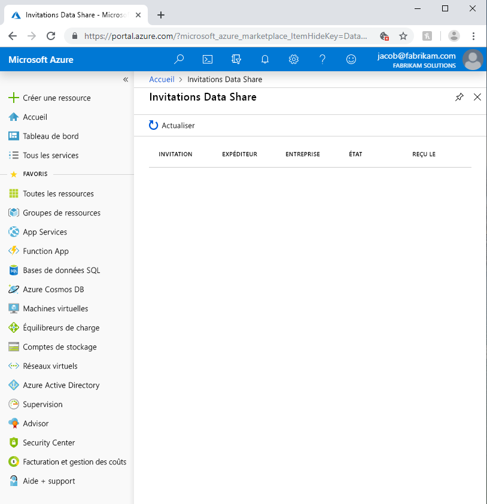

# Résoudre les problèmes courants dans Azure Data Share 

Cet article explique comment résoudre les problèmes courants pour Azure Data Share. 

## Invitations Azure Data Share 

Dans certains cas, quand un nouvel utilisateur clique sur **Accepter l’invitation** à partir de l’invitation par e-mail qui a été envoyée, une liste vide d’invitations peut lui être présentée. 

Cela peut être dû aux raisons suivantes :

* **Le service Azure Data Share n’est pas inscrit en tant que fournisseur de ressources d’un abonnement Azure dans le locataire Azure.** Vous rencontrerez ce problème si votre locataire Azure ne contient aucune ressource Data Share. Lorsque vous créez une ressource Azure Data Share, celle-ci inscrit automatiquement le fournisseur de ressources dans votre abonnement Azure. Vous pouvez également inscrire manuellement le service Data Share en procédant comme suit. Vous devez disposer du rôle de contributeur Azure pour effectuer ces étapes.

    1. Dans le portail Azure, accédez à **Abonnements**
    1. Sélectionner l’abonnement que vous souhaitez utiliser pour créer une ressource Azure Data Share
    1. Cliquez sur **Fournisseurs de ressources**
    1. Recherchez **Microsoft.DataShare**
    1. Cliquez sur **S’inscrire** 

    Vous devez disposer du [rôle Contributeur Azure](../role-based-access-control/built-in-roles.md#contributor) sur l’abonnement Azure pour effectuer ces étapes. 

* **L’invitation est envoyée à votre alias de messagerie au lieu de votre e-mail de connexion Azure.** Si vous avez enregistré le service Azure Data Share ou si vous avez déjà créé une ressource Data Share dans le locataire Azure, mais que vous ne voyez toujours pas l’invitation, cela peut être dû au fait que le fournisseur a entré votre alias de messagerie en tant que destinataire au lieu de votre adresse e-mail de connexion Azure. Contactez votre fournisseur de données et assurez-vous qu’il a bien envoyée l’invitation à votre adresse e-mail de connexion Azure et non à votre alias de messagerie.

* **L’invitation a déjà été acceptée.** Le lien inclut dans l’e-mail vous amène à la page Invitation Data Share dans le Portail Azure, qui répertorie uniquement les invitations en attente. Si vous avez déjà accepté l’invitation, elle n’apparaît plus dans la page Invitation Data Share. Accédez à la ressource Data Share dans laquelle vous avez accepté l’invitation pour afficher les partages de fichiers reçus et configurer votre paramètre de cluster Azure Data Explorer cible.

## Erreur lors de la création ou de la réception d’un nouveau partage de fichiers

« Échec de l’ajout de jeux de données »

« Échec du mappage des jeux de données »

« Impossible d’accorder à la ressource Data Share x l’accès à y »

« Vous ne disposez pas des autorisations appropriées sur x »

« Nous n’avons pas pu ajouter d’autorisations d’écriture pour le compte Azure Data Share à une ou plusieurs de vos ressources sélectionnées »

Si vous rencontrez l’une des erreurs ci-dessus lors de la création d’un nouveau partage de fichiers ou du mappage de jeux de données, cela peut être dû à des autorisations insuffisantes pour le magasin de données Azure. Consultez [Rôles et conditions requises](concepts-roles-permissions.md) pour obtenir les autorisations requises. 

Vous avez besoin d’une autorisation d’écriture pour partager ou recevoir des données à partir d’un magasin de données Azure, qui existe généralement dans le rôle Contributeur. 

S’il s’agit de la première fois que vous partagez ou recevez des données à partir du magasin de données Azure, vous devez également obtenir l’autorisation *Microsoft.Authorization/role assignments/write* , qui existe généralement dans le rôle Propriétaire. Même si vous avez créé la ressource de magasin de données Azure, cela ne fait PAS automatiquement de vous le propriétaire de la ressource. Avec l’autorisation appropriée, le service Azure Data Share accorde automatiquement à l’identité managée de la ressource de partage de données l’accès au magasin de données. La prise d’effet de ce processus peut prendre quelques minutes. Si vous rencontrez un problème en raison de ce délai, réessayez après quelques minutes.

Le partage basé sur SQL nécessite des autorisations supplémentaires. Consultez la liste détaillée des prérequis dans l’article [Partager à partir de sources SQL](how-to-share-from-sql.md).

## Échec de la capture instantanée
La capture instantanée peut échouer pour différentes raisons. Vous trouverez un message d’erreur détaillé en cliquant sur l’heure de début de la capture instantanée, puis sur l’état de chaque jeu de données. Voici les raisons courantes pour lesquelles l’instantané peut échouer :

* Data Share n’est pas autorisé à lire à partir du magasin de données source ou à écrire au magasin de données cible. Consultez la liste détaillée des autorisations requises dans l’article [Rôles et conditions requises](concepts-roles-permissions.md). Si c’est la première fois que vous prenez une capture instantanée, il peut falloir quelques minutes pour que la ressource Data Share soit autorisée à accéder au magasin de données Azure. Patientez quelques minutes et réessayez.
* La connexion de Data Share au magasin de données source ou cible est bloquée par le pare-feu.
* Le jeu de données partagé, ou le magasin de données source ou cible, est supprimé.

Pour les sources SQL, les autres causes des échecs d’instantanés sont les suivantes. 

* Le script SQL source ou cible pour accorder l’autorisation de partage de données n’est pas exécuté ou est exécuté à l’aide de l’authentification SQL au lieu de l’authentification Azure Active Directory.  
* Le magasin de données SQL source ou cible est interrompu.
* Les types de données SQL ne sont pas pris en charge par le processus d’instantané ou le magasin de données cible. Pour plus d’informations, consultez [Partager à partir de sources SQL](how-to-share-from-sql.md#supported-data-types).
* Le magasin de données SQL source ou cible est verrouillé par d’autres processus. Azure Data Share n’applique pas de verrous aux magasins de données SQL source et cible. Toutefois, les verrous existants sur les magasins de données SQL source et cible entraînent un échec de l’instantané.
* La table SQL cible est référencée par une contrainte de clé étrangère. Pendant l’instantané, si une table cible portant le même nom existe, Azure Data Share supprime la table et en crée une nouvelle. Si la table SQL cible est référencée par une contrainte de clé étrangère, elle ne peut pas être supprimée.
* Le fichier CSV cible est généré, mais les données ne peuvent pas être lues dans Excel. Cela peut se produire lorsque la table SQL source contient des données avec des caractères non anglais. Dans Excel, sélectionnez l’onglet « Obtenir les données » et choisissez le fichier CSV, puis sélectionnez l’origine du fichier 65001 : Unicode (UTF-8) et chargez les données.

## Étapes suivantes

Pour découvrir comment commencer à partager des données, passez au tutoriel [Partager vos données](share-your-data.md). 

Pour savoir comment recevoir des données, passez au didacticiel [Accepter et recevoir des données](subscribe-to-data-share.md).