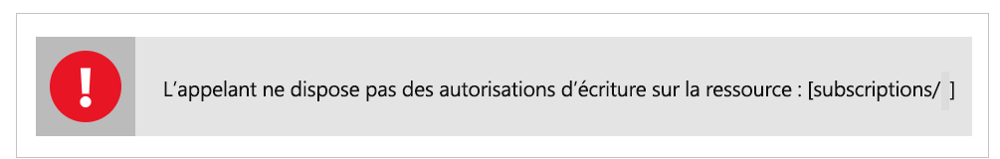

# Résoudre les problèmes courants dans Azure Data Share Preview

Cet article explique comment résoudre les problèmes courants pour Azure Data Share Preview. 

## Invitations Azure Data Share 

Dans certains cas, quand un nouvel utilisateur clique sur **Accepter l’invitation** à partir de l’invitation par e-mail qui a été envoyée, une liste vide d’invitations peut lui être présentée. 

L’erreur ci-dessus est un problème connu avec le service et est actuellement en cours de résolution. Pour une solution de contournement, suivez les étapes ci-dessous. 

1. Dans le portail Azure, accédez à **Abonnements**
1. Sélectionnez l’abonnement que vous utilisez pour Azure Data Share
1. Cliquez sur **Fournisseurs de ressources**
1. Recherchez Microsoft.DataShare
1. Cliquez sur **S’inscrire**

Vous devez disposer du [rôle RBAC de contributeur Azure](https://docs.microsoft.com/azure/role-based-access-control/built-in-roles#contributor) pour effectuer ces étapes. 

Si vous ne parvenez toujours pas à voir une invitation de partage de données, contactez votre fournisseur de données et assurez-vous qu’il l’a bien envoyée à votre adresse e-mail de connexion Azure et *pas* à votre alias de messagerie. 

> [!IMPORTANT]
> Si vous avez déjà accepté une invitation Azure Data Share et que vous avez quitté le service avant de configurer le stockage, suivez les instructions détaillées du guide de procédure [Configurer un mappage de jeu de données](how-to-configure-mapping.md) pour savoir comment terminer la configuration de votre partage de données reçues et commencer à recevoir des données. 

## Erreur lors de la création ou de la réception d’un nouveau partage de données

« Erreur : L’opération a retourné un code d’état non valide "BadRequest" »

« Erreur : AuthorizationFailed »

« Erreur : Attribution de rôle au compte de stockage »

Si vous recevez une des erreurs ci-dessus lors de la création d’un nouveau partage de données ou lors de la réception d’un nouveau partage de données, la raison en est que les autorisations sont insuffisantes pour le compte de stockage. L’autorisation requise est *Microsoft.Authorization/attributions de rôle/écrire*, qui existe dans le rôle de propriétaire du stockage ou qui peut être attribuée à un rôle personnalisé. Même si vous avez créé le compte de stockage, cela ne fait PAS automatiquement de vous le propriétaire du compte de stockage. Suivez ces étapes pour vous accorder à vous-même la propriété du compte de stockage. Une autre possibilité est de créer un rôle personnalisé avec cette autorisation et de vous y ajouter vous-même.  

1. Accéder à un compte de stockage dans le portail Azure
1. Sélectionnez **Contrôle d’accès (IAM)**
1. Cliquez sur **Ajouter**.
1. Ajoutez-vous en tant que propriétaire.

## Étapes suivantes

Pour découvrir comment commencer à partager des données, passez au tutoriel [Partager vos données](share-your-data.md).

