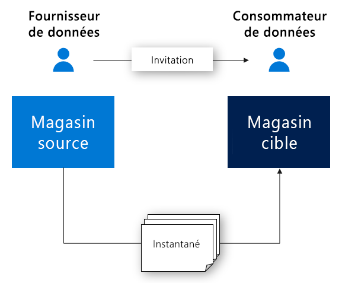

# Qu’est-ce qu’Azure Data Share ?

Dans le monde d’aujourd’hui, les données sont vues comme un atout stratégique et essentiel, que les organisations doivent partager de façon simple et sécurisée avec leurs clients et leurs partenaires. À l’heure actuelle, il existe de nombreuses façons de partager des données. Nous pouvons citer comme exemples les sites FTP, les e-mails ou les API. Il est facile pour une entreprise d’oublier avec qui elle a partagé des données. Le fait de partager des données via FTP ou par le biais d’une infrastructure d’API conçue spécialement à cet effet peut se révéler coûteux à provisionner et à administrer. À grande échelle, l’utilisation de ces méthodes de partage entraîne des frais de gestion importants. 

La plupart des organisations doivent rendre des comptes concernant les données qu’elles ont partagées. De plus, elles souhaitent souvent pouvoir contrôler, gérer et superviser tous leurs partages de données de façon simple. Dans le monde d’aujourd’hui où les données augmentent de façon exponentielle, les organisations ont besoin d’un moyen simple pour partager des données volumineuses. Les clients exigent des données les plus récentes possible afin d’obtenir les insights dont ils ont besoin en temps voulu.

Azure Data Share permet aux organisations de partager leurs données avec plusieurs clients et partenaires, et ce, de façon simple et sécurisée. En seulement quelques clics, vous pouvez provisionner un compte de partage de données, y ajouter des jeux de données et inviter vos clients et partenaires à accéder au partage. Les fournisseurs de données gardent toujours le contrôle sur ce qu’ils ont partagé. Azure Data Share permet de gérer et de superviser plus facilement qui peut accéder à vos données, à quel moment vos données ont été partagées et par qui. 

Pour contrôler la façon dont ses données sont utilisées, le fournisseur de données doit spécifier des conditions d’utilisation. Le consommateur de données doit accepter ces conditions pour recevoir les données. Les fournisseurs de données peuvent spécifier la fréquence à laquelle les consommateurs de leurs données doivent recevoir des mises à jour. Le fournisseur de données peut à tout moment révoquer l’accès aux nouvelles mises à jour. 

Azure Data Share améliore l’obtention d’insights en permettant la combinaison de données tierces dans le but d’enrichir les scénarios d’analytique et d’intelligence artificielle. Les outils d’analytique Azure sont faciles à utiliser et permettent de préparer, de traiter et d’analyser les données partagées à l’aide d’Azure Data Share. 

Le fournisseur de données et le consommateur de données doivent avoir un abonnement Azure pour partager et recevoir des données. Si vous n’avez pas d’abonnement Azure, créez un [compte gratuit](https://azure.microsoft.com/free/).

## Scénarios relatifs à Azure Data Share

Azure Data Share peut être utile dans différents secteurs d’activité. Par exemple, un détaillant peut avoir besoin de partager avec ses fournisseurs des données récentes concernant ses points de vente. Avec Azure Data Share, un détaillant peut configurer un partage contenant des données sur ses points de ventes, en vue d’en permettre l’accès à tous ses fournisseurs. Il peut aussi choisir de partager ses données de ventes à une fréquence horaire ou quotidienne. 

Azure Data Share peut également servir à établir une place de marché de données pour un secteur spécifique. C’est le cas, par exemple, d’un organisme public ou d’un institut de recherche qui partageraient régulièrement des données anonymes d’ordre démographique avec des tierces parties. 

Un autre cas d’usage pour Azure Data Share serait l’établissement d’un consortium de données. Par exemple, plusieurs instituts de recherche peuvent partager des données avec un seul organisme approuvé. Les données sont analysées, agrégées ou traitées à l’aide des outils d’analytique Azure, puis elles sont partagées avec les parties intéressées. 

## Fonctionnement

Azure Data Share propose actuellement un partage basé sur des instantanés et un partage sur place. 

Dans le partage basé sur des instantanés, les données sont déplacées de l’abonnement Azure du fournisseur de données vers celui du consommateur de données. En qualité de fournisseur de données, vous provisionnez un partage de données et invitez des destinataires à y accéder. Les consommateurs de données reçoivent une invitation de partage par e-mail. Lorsqu’un consommateur de données accepte l’invitation, il peut déclencher un instantané complet des données partagées avec lui. Ces données arrivent dans le compte de stockage des consommateurs de données. Les consommateurs de données peuvent recevoir des mises à jour régulières et incrémentielles pour les données qui ont été partagées avec eux. De cette façon, ils disposent toujours de la dernière version des données. 

Les fournisseurs de données peuvent fournir aux consommateurs des mises à jour incrémentielles pour les données qu’ils ont partagées, suivant une planification de captures instantanées. Les captures instantanées sont effectuées toutes les heures ou tous les jours. Lorsqu’un consommateur de données accepte et configure un partage de données, il peut s’abonner à une planification de captures instantanées. Cela s’avère utile dans les scénarios où les données partagées sont mises à jour régulièrement, et lorsque le consommateur de données a besoin de la toute dernière version des données. 

Quand un consommateur de données accepte un partage de données, il peut choisir le magasin de données où doivent arriver les données. Par exemple, si le fournisseur de données partage des données à l’aide du stockage Blob Azure, le consommateur de données peut recevoir ces données dans Azure Data Lake Store. De même, si le fournisseur de données partage des données à partir d’Azure Synapse Analytics (anciennement SQL Data Warehouse), le consommateur de données peut choisir s’il souhaite recevoir les données dans Azure Data Lake Store, Azure SQL Database ou Azure Synapse Analytics. Dans le cas d’un partage à partir de sources SQL, le consommateur de données peut également choisir de recevoir des données au format Parquet ou CSV. 

Avec le partage sur place, les fournisseurs de données peuvent partager des données où elles résident sans les copier. Une fois la relation de partage établie par le biais du flux d’invitation, un lien symbolique est créé entre le magasin de données source du fournisseur de données et le magasin de données cible du consommateur de données. Le consommateur de données peut lire et interroger les données en temps réel à l’aide de son propre magasin de données. Les modifications apportées au magasin de données source sont immédiatement disponibles pour le consommateur de données. Le partage sur place est en préversion pour Azure Data Explorer.

## Fonctionnalités clés

Avec Azure Data Share, les fournisseurs de données peuvent :

* Partager des données depuis la liste des [magasins de données pris en charge](supported-data-stores.md) avec les clients et partenaires en dehors de votre organisation

* Effectuer le suivi des personnes avec qui vous avez partagé vos données

* Choix du partage basé sur des instantanés ou du partage sur place

* La fréquence à laquelle les consommateurs de données reçoivent les mises à jour de vos données

* Permettre aux clients de tirer (pull) la dernière version de vos données en fonction de leurs besoins, ou leur permettre de recevoir automatiquement les modifications incrémentielles à un intervalle que vous aurez défini

Avec Azure Data Share, les consommateurs de données peuvent : 

* Afficher la description du type des données partagées

* Afficher les conditions d’utilisation des données

* Accepter ou rejeter une invitation Azure Data Share

* Acceptez les données partagées avec vous dans un [magasin de données pris en charge](supported-data-stores.md).

* Déclencher un instantané complet ou incrémentiel d’un partage de données qu’une organisation a partagé avec eux

* S’abonner à un partage de données afin de recevoir la dernière version des données via un instantané incrémentiel

Toutes ces fonctionnalités sont disponibles par le biais du portail Azure ou des API REST. Pour plus d’informations sur l’utilisation d’Azure Data Share via les API REST, consultez notre documentation de référence. 

## Régions prises en charge

Pour obtenir la liste des régions Azure où Azure Data Share est disponible, reportez-vous à la page [Produits disponibles par région](https://azure.microsoft.com/global-infrastructure/services/?products=data-share) et recherchez Azure Data Share. 

Azure Data Share ne stocke pas une copie des données. Les données sont stockées dans le magasin de données sous-jacent qui est partagé. Par exemple, si un producteur de données stocke ses données dans un compte Azure Data Lake Store situé dans la région USA Ouest, c’est là que les données seront stockées. S’il partage des données avec un compte de stockage Azure situé dans la région Europe Ouest par le biais d’un instantané, les données sont en règle générale transférées directement vers le compte de stockage Azure situé dans la région Europe Ouest.

Il n’est pas nécessaire que le service Azure Data Share soit disponible dans votre région pour que vous puissiez l’utiliser. Par exemple, si vous avez des données stockées dans un compte de stockage Azure situé dans une région où Azure Data Share n’est pas encore disponible, vous pouvez malgré tout utiliser le service pour partager vos données. 

## Étapes suivantes

Pour découvrir comment commencer à partager des données, passez au tutoriel [Partager vos données](share-your-data.md).
