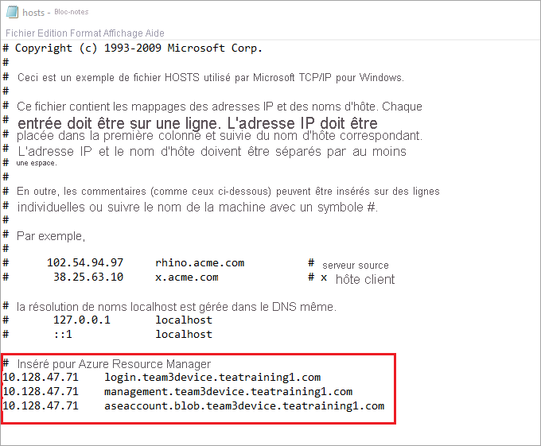

# <a name="deploy-vms-on-your-azure-stack-edge-pro-gpu-device-via-azure-powershell-script"></a>Déployer des machines virtuelles sur votre appareil avec GPU Azure Stack Edge Pro via un script Azure PowerShell

<!--[!INCLUDE [applies-to-skus](../../includes/azure-stack-edge-applies-to-all-sku.md)]-->

Ce tutoriel explique comment créer et gérer une machine virtuelle sur votre appareil Azure Stack Edge Pro à l’aide d’un script Azure PowerShell.

## <a name="prerequisites"></a>Prérequis

Avant de commencer à créer et à gérer une machine virtuelle sur votre appareil Azure Stack Edge Pro à l’aide de ce script, assurez-vous d’avoir effectué les étapes suivantes :

### <a name="for-azure-stack-edge-pro-device-via-the-local-web-ui"></a>Pour un appareil Azure Stack Edge Pro via l’interface utilisateur web locale

1. Vous avez appliqué les paramètres réseau sur votre appareil Azure Stack Edge Pro comme décrit dans [Étape 1 : Configurer l’appareil Azure Stack Edge Pro](azure-stack-edge-j-series-connect-resource-manager.md#step-1-configure-azure-stack-edge-pro-device).

2. Vous avez activé une interface réseau pour le calcul. Cette adresse IP d’interface réseau sert à créer un commutateur virtuel pour le déploiement de la machine virtuelle. Les étapes suivantes expliquent comment procéder :

    1. Accédez aux **paramètres de calcul**. Sélectionnez l’interface réseau que vous utiliserez pour créer un commutateur virtuel.

        > [!IMPORTANT] 
        > Vous ne pouvez configurer qu’un seul port pour le calcul.

    2. Activez le calcul sur l’interface réseau. Azure Stack Edge Pro crée et gère un commutateur virtuel correspondant à cette interface réseau.

3. Vous avez créé et installé tous les certificats sur votre appareil Azure Stack Edge Pro et dans le magasin racine approuvé de votre client. Appliquez la procédure décrite dans [Étape 2 : Créer et installer des certificats](azure-stack-edge-j-series-connect-resource-manager.md#step-2-create-and-install-certificates).

### <a name="for-your-windows-client"></a>Pour votre client Windows

1. Vous avez défini le protocole Internet virtuel (VIP) des services cohérents avec Azure dans votre page **Réseau** de l’interface utilisateur web locale de l’appareil. Vous devez ajouter ce VIP :

    - Au fichier hosts sur le client, ou
    - À la configuration du serveur DNS.
    
    > [!IMPORTANT]
    > Nous vous recommandons de modifier la configuration du serveur DNS pour la résolution des noms de points de terminaison.

    1. Démarrez le **Bloc-notes** en tant qu’administrateur (des privilèges d’administrateur sont nécessaires pour enregistrer le fichier), puis ouvrez le fichier **hosts** qui se trouve dans `C:\Windows\System32\Drivers\etc`.
    
        
    
    2. Ajoutez les entrées suivantes à votre fichier **hosts**, en les remplaçant par les valeurs appropriées pour votre appareil :
    
        ```
        <Azure consistent services VIP> login.<appliance name>.<DNS domain>
        <Azure consistent services VIP> management.<appliance name>.<DNS domain>
        <Azure consistent services VIP> <storage name>.blob.<appliance name>.<DNS domain>
        ```
        Pour le compte de stockage, vous pouvez fournir un nom que vous souhaitez que le script utilise ultérieurement pour créer un nouveau compte de stockage. Le script ne vérifie pas si ce compte de stockage existe.

    3. Utilisez l’image suivante pour référence. Enregistrez le fichier **hosts**.

        

2. [Téléchargez le script PowerShell](https://aka.ms/ase-vm-powershell) utilisé dans cette procédure.

3. Assurez-vous que votre client Windows exécute PowerShell 5.0 ou une version ultérieure.

4. Assurez-vous que `Azure.Storage Module version 4.5.0` est installé sur votre système. Vous pouvez vous procurer ce module à partir de [PowerShell Gallery](https://www.powershellgallery.com/packages/Azure.Storage/4.5.0). Pour installer ce module, saisissez :

    `Install-Module -Name Azure.Storage -RequiredVersion 4.5.0`

    Pour vérifier la version du module installé, saisissez :

    `Get-InstalledModule -name Azure.Storage`

    Pour désinstaller toute autre version du module, saisissez :

    `Uninstall-Module -Name Azure.Storage`

5. [Téléchargez AzCopy 10](https://docs.microsoft.com/azure/storage/common/storage-use-azcopy-v10#download-azcopy) sur votre client Windows. Prenez note de cet emplacement, car vous le transmettrez en tant que paramètre lors de l’exécution du script.

6. Assurez-vous que votre client Windows exécute TLS 1.2 ou une version ultérieure.


## <a name="create-a-vm"></a>Créer une machine virtuelle

1. Exécutez PowerShell ISE en tant qu’administrateur.
2. Accédez au dossier dans lequel vous avez téléchargé le script sur votre client.  
3. Utilisez la commande suivante pour exécuter le script :
 
    `.\ArmPowershellClient.ps1 -VNetAddressSpace <AddressSpace> -NicPrivateIp <Private IP> -VHDPath <Path> -VHDFile <VHD File, with extension> -StorageAccountName <Name> -OS <Windows/Linux> -VMSize <Supported VM Size> -VMUserName <UserName to be used to login into VM> -VMPassword <Password for the VM login> --AzCopy10Path <Absolute Path>`

    Voici quelques exemples d’exécution du script pour créer une machine virtuelle Windows et une machine virtuelle Linux.

    **Pour une machine virtuelle Windows :**

    `.\ArmPowershellClient.ps1 -VNetAddressSpace 5.5.0.0/16 -NicPrivateIp 5.5.168.73 -VHDPath \\intel01\d$\vm_vhds\AzureWindowsVMmode -VHDFile WindowsServer2016Datacenter.vhd -StorageAccountName teaaccount1 -OS Windows -VMSize Standard_D1_v2 -VMUserName Administrator -VMPassword Password1 -AzCopy10Path C:\azcopy10\azcopy.exe`

    **Pour une machine virtuelle Linux :**

    `.\ArmPowershellClient.ps1 -VNetAddressSpace 5.5.0.0/16 -NicPrivateIp 5.5.168.83 -VHDPath \\intel01\d$\vm_vhds\AzurestackLinux -VHDFile ubuntu13.vhd -StorageAccountName sa2 -OS Linux -VMSize Standard_D1_v2 -VMUserName Administrator -VMPassword Password1 -AzCopy10Path C:\azcopy10\azcopy.exe`
    
4. Pour nettoyer les ressources créées par le script, utilisez les commandes suivantes :
    
    ```powershell
    Get-AzureRmVM | Remove-AzureRmVM -Force
    Get-AzureRmNetworkInterface | Remove-AzureRmNetworkInterface -Force
    Get-AzureRmResource | Remove-AzureRmResource -f
    Get-AzureRmResourceGroup | Remove-AzureRmResourceGroup -f
    ```


## <a name="next-steps"></a>Étapes suivantes

[Déployer des machines virtuelles à l’aide de cmdlets Azure PowerShell](azure-stack-edge-j-series-deploy-virtual-machine-powershell.md)
