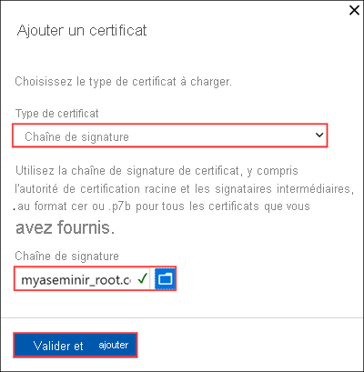
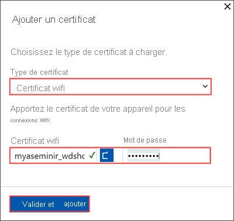

# Tutoriel : Configurer le réseau pour Azure Stack Edge Mini R

Ce tutoriel explique comment configurer le réseau pour votre appareil Azure Stack Edge Mini R avec GPU intégré à l’aide de l’interface utilisateur web locale.

Le processus de connexion peut prendre environ 20 minutes.

Ce tutoriel vous fournira des informations sur :

> [!div class="checklist"]
>
> * Prérequis
> * Configurer le réseau
> * Activer le réseau de calcul
> * Configurer le proxy web

## Prérequis

Avant de configurer et d’activer votre appareil Azure Stack Edge Mini R, vérifiez que :

* Vous avez installé l’appareil physique, comme indiqué dans [Installer Azure Stack Edge Mini R](azure-stack-edge-gpu-deploy-install.md).
* Vous vous êtes connecté à l’interface utilisateur web locale de l’appareil, comme indiqué dans [Se connecter à Azure Stack Edge Mini R](azure-stack-edge-mini-r-deploy-connect.md).

## Configurer le réseau

La page **Bien démarrer** comprend les différents paramètres nécessaires à la configuration et à l’inscription de l’appareil physique auprès du service Azure Stack Edge. 

Procédez comme suit pour configurer le réseau de votre appareil.

1. Accédez à la page **Bien démarrer** de l’interface utilisateur web locale de votre appareil. 

2. Si une mise à jour est nécessaire, vous pouvez la faire ici en configurant un port de données avec une connexion câblée. Pour plus d’informations sur la manière de configurer une connexion câblée pour cet appareil, consultez [Raccordement de l’appareil](azure-stack-edge-mini-r-deploy-install.md#cable-the-device). Une fois la mise à jour terminée, vous pouvez supprimer la connexion câblée.

3. Créez des certificats pour le Wi-Fi et la chaîne de signature. La chaîne de signature et les certificats Wi-Fi doivent être au format DER avec une extension de fichier *.cer*. Pour obtenir des instructions, consultez [Créer des certificats](azure-stack-edge-j-series-manage-certificates.md).

4. Dans l’interface utilisateur web locale, accédez à **Démarrer**. Dans la vignette **Sécurité**, sélectionnez **Certificats**, puis **Configurer**. 

    

    1. Sélectionnez **+ Ajouter un certificat**. 
    
        

    2. Chargez la chaîne de signature et sélectionnez **Appliquer**.

        

    3. Répétez la procédure avec le certificat Wi-Fi. 

        

    4. Les nouveaux certificats doivent apparaître dans la page **Certificats**. 
    
        

    5. Revenez à **Démarrer**.

3. Dans la vignette **Réseau**, sélectionnez **Configurer**.  
    
    Votre appareil physique comporte cinq interfaces réseau. Le PORT 1 et le PORT 2 sont des interfaces réseau de 1 Gbit/s. Le PORT 3 et le PORT 4 sont des interfaces réseau de 10 Gbit/s. Le cinquième port est le port Wi-Fi. 

        
    
    Sélectionnez le port Wi-Fi et configurez les paramètres du port. 
    
    > [!IMPORTANT]
    > Nous vous recommandons vivement de configurer une adresse IP statique pour le port Wi-Fi.  

    

    La page **Réseau** se met à jour une fois que vous avez appliqué les paramètres du port Wi-Fi.

    
   
4. Sélectionnez **Ajouter un profil Wi-Fi** et chargez votre profil Wi-Fi. 

    
    
    Un profil réseau sans fil contient le SSID (nom du réseau), la clé de mot de passe et les informations de sécurité qui permettent de se connecter à un réseau sans fil. Vous pouvez obtenir le profil Wi-Fi de votre environnement auprès de votre administrateur réseau.

    

    Une fois le profil ajouté, la liste des profils Wi-Fi se met à jour pour refléter le nouveau profil. Le profil doit indiquer l’**état de la connexion** **Déconnecté**. 

    

5. Une fois que le profil réseau sans fil est correctement chargé, connectez-vous à ce profil. Sélectionnez **Se connecter à un profil Wi-Fi**. 

    

6. Sélectionnez le profil Wi-Fi que vous avez ajouté à l’étape précédente, puis sélectionnez **Appliquer**. 

    

    L’**état de la connexion** doit se mettre à jour vers **Connecté**. La force de signal se met à jour pour indiquer la qualité du signal. 

    

    > [!NOTE]
    > Pour transférer de grandes quantités de données, nous vous recommandons d’utiliser une connexion câblée au lieu du réseau sans fil. 

6. Déconnectez de l’ordinateur portable le PORT 1 de l’appareil. 

7. Lorsque vous configurez les paramètres réseau, gardez à l’esprit :

   - Si le protocole DHCP est activé dans votre environnement, les interfaces réseau sont configurées automatiquement. Une adresse IP, un sous-réseau, une passerelle et un DNS sont automatiquement attribués.
   - Si le protocole DHCP n’est pas activé, vous pouvez, le cas échéant, attribuer des adresses IP statiques.
   - Vous pouvez configurer votre interface réseau sur IPv4.
   - L’association de cartes d’interface réseau et l’agrégation de liens ne sont pas prises en charge avec Azure Stack Edge.
   - Le numéro de série d’un port correspond au numéro de série du nœud. Pour un appareil de la série K, un seul numéro de série apparaît.

     >[!NOTE] 
     > Nous vous recommandons de ne pas remplacer Statique par DHCP pour l’adresse IP locale de l’interface réseau, sauf si vous disposez d’une autre adresse IP pour vous connecter à l’appareil. Si vous utilisez une seule interface réseau et que vous passez à DHCP, il n’y a aucun moyen de déterminer l’adresse DHCP. Si vous voulez passer à une adresse DHCP, attendez que l’appareil se soit inscrit auprès du service, puis faites la modification. Vous pouvez ensuite voir les adresses IP de tous les adaptateurs dans les **propriétés de l’appareil** dans le portail Azure pour votre service.

Après avoir configuré et appliqué les paramètres réseau, sélectionnez **Suivant : Calcul** pour configurer le réseau de calcul.

## Activer le réseau de calcul

Procédez comme suit pour activer le calcul et configurer le réseau de calcul. 

1. Dans la page **Calcul**, sélectionnez une interface réseau que vous souhaitez activer pour le calcul. 

    

1. Dans la boîte de dialogue **Paramètres réseau**, sélectionnez **Activer**. Lorsque vous activez le calcul, un commutateur virtuel est créé sur votre appareil sur cette interface réseau. Le commutateur virtuel est utilisé pour l’infrastructure de calcul sur l’appareil. 
    
1. Affectez des **adresses IP aux nœuds Kubernetes**. Ces adresses IP statiques sont destinées à la machine virtuelle de calcul.  

    Pour un appareil à *n* nœuds, une plage contiguë d’au moins *n+1* adresses IPv4 (ou plus) est fournie pour la machine virtuelle de calcul en utilisant les adresses IP de début et de fin. Étant donné que Azure Stack Edge est un appareil à 1 nœud, un minimum de 2 adresses IPv4 contiguës sont fournies.

    > [!IMPORTANT]
    > Kubernetes sur Azure Stack Edge utilise le sous-réseau 172.27.0.0/16 pour le pod, et le sous-réseau 172.28.0.0/16 pour le service. Vérifiez qu’ils ne sont pas actuellement utilisés sur votre réseau. Si ces sous-réseaux sont déjà utilisés sur votre réseau, vous pouvez modifier ces sous-réseaux en exécutant l’applet de commande `Set-HcsKubeClusterNetworkInfo` à partir de l’interface PowerShell de l’appareil. Pour plus d’informations, consultez [Modifier les sous-réseaux du pod et du service Kubernetes](azure-stack-edge-gpu-connect-powershell-interface.md#change-kubernetes-pod-and-service-subnets).

1. Affectez des **adresses IP des services externes Kubernetes**. Il s’agit également des adresses IP d’équilibrage de charge. Ces adresses IP contiguës sont destinées aux services que vous souhaitez exposer en dehors du cluster Kubernetes, et vous spécifiez la plage d’adresses IP statiques en fonction du nombre de services exposés. 
    
    > [!IMPORTANT]
    > Nous vous recommandons vivement de spécifier au moins 1 adresse IP pour le service Hub Azure Stack Edge Mini R afin d’avoir accès aux modules de calcul. Vous pouvez ensuite éventuellement spécifier des adresses IP supplémentaires pour d’autres services/modules IoT Edge (1 par service/module) qui doivent être accessibles à partir de l’extérieur du cluster. Les adresses IP du service peuvent être mises à jour ultérieurement. 
    
1. Sélectionnez **Appliquer**.

    

1. Quelques minutes sont nécessaires pour appliquer la configuration, et une actualisation du navigateur peut être requise. Vous pouvez constater que le port spécifié est activé pour le calcul. 
 
    

    Sélectionnez **Suivant : Proxy web** pour configurer le proxy web.  

  
## Configurer le proxy web

Cette configuration est facultative.

> [!IMPORTANT]
> * Si vous activez le calcul et utilisez le module IoT Edge sur votre appareil Azure Stack Edge Mini R, nous vous recommandons de définir l’authentification du proxy web sur **Aucune**. NTLM n’est pas pris en charge.
>* Les fichiers PAC ne sont pas pris en charge. Un fichier PAC définit la manière dont les navigateurs web et les autres agents utilisateurs peuvent choisir automatiquement le serveur proxy approprié (méthode d’accès) pour récupérer une URL donnée. Les proxys qui tentent d’intercepter et de lire tout le trafic (puis de tout resigner avec leur propre certification) ne sont pas compatibles, car le certificat du proxy n’est pas approuvé. En général, les proxys transparents fonctionnent bien avec Azure Stack Edge Mini R, alors que les proxys web non transparents ne sont pas pris en charge.

1. Dans la page **Paramètres du proxy web**, procédez comme suit :

    1. Dans la zone **URL de proxy Web**, entrez l’URL dans ce format : `http://host-IP address or FQDN:Port number`. Les URL HTTPS ne sont pas prises en charge.

    2. Sous **Authentification**, sélectionnez **Aucune** ou **NTLM**. Si vous activez le calcul et utilisez le module IoT Edge sur votre appareil Azure Stack Edge Mini R, nous vous recommandons de définir l’authentification du proxy web sur **Aucune**. **NTLM** n’est pas pris en charge.

    3. Si vous utilisez une authentification, entrez un nom d’utilisateur et un mot de passe.

    4. Cliquez sur **Appliquer** pour valider et appliquer les paramètres du proxy web que vous avez configurés.
    
   

2. Une fois les paramètres appliqués, sélectionnez **Suivant : Appareil**.

## Étapes suivantes

Ce didacticiel vous à présenté les point suivants :

> [!div class="checklist"]
> * Prérequis
> * Configurer le réseau
> * Activer le réseau de calcul
> * Configurer le proxy web

Pour savoir comment configurer votre appareil Azure Stack Edge Mini R, consultez :

> [!div class="nextstepaction"]
> [Configurer les paramètres des appareils](./azure-stack-edge-mini-r-deploy-set-up-device-update-time.md)
