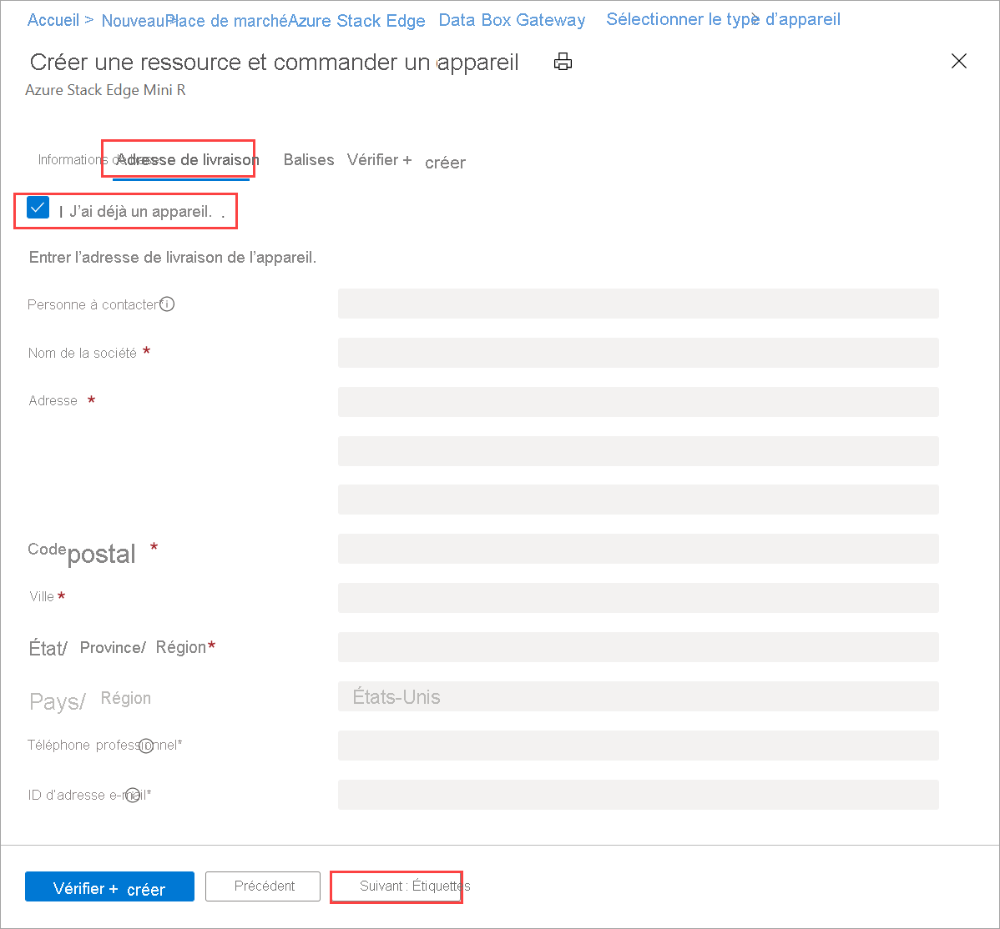

# Tutoriel : Préparer le déploiement d’Azure Stack Edge Mini R

Ce tutoriel est le premier d’une série de tutoriels permettant de déployer entièrement un appareil Azure Stack Edge Mini R. Il explique comment préparer le portail Azure pour déployer une ressource Azure Stack Edge.

Vous avez besoin de privilèges d’administrateur pour terminer le processus d’installation et de configuration. La préparation du portail prend moins de 10 minutes.

Dans ce tutoriel, vous allez apprendre à :

> [!div class="checklist"]
> * Créer une nouvelle ressource
> * Obtenir la clé d'activation

### Bien démarrer

Pour déployer Azure Stack Edge Mini R, consultez les tutoriels suivants dans l’ordre indiqué.

| Étape | Description |
| --- | --- |
| **Préparation** |Ces étapes doivent être effectuées en préparation du déploiement à venir. |
| **[Liste de contrôle de la configuration du déploiement](#deployment-configuration-checklist)** |Utilisez cette liste de contrôle pour rassembler et enregistrer des informations avant et pendant le déploiement. |
| **[Conditions préalables au déploiement](#prerequisites)** |Ces prérequis attestent que l’environnement est prêt pour le déploiement. |
|  | |
|**Didacticiels de déploiement** |Ces tutoriels sont nécessaires pour déployer votre appareil Azure Stack Edge Mini R en production. |
|**[1. Préparer le portail Azure pour l’appareil](azure-stack-edge-mini-r-deploy-prep.md)** |Créez et configurez votre ressource Azure Stack Edge avant d’installer l’appareil physique. |
|**[2. Installer l’appareil](azure-stack-edge-mini-r-deploy-install.md)**|Inspectez, puis branchez votre appareil physique.  |
|**[3. Se connecter à l’appareil](azure-stack-edge-mini-r-deploy-connect.md)** |Une fois l’appareil installé, connectez-vous à l’interface utilisateur web locale de l’appareil.  |
|**[4. Configurer les paramètres réseau](azure-stack-edge-mini-r-deploy-configure-network-compute-web-proxy.md)** |Configurez le réseau, y compris les paramètres de réseau de calcul et de proxy web pour votre appareil.   |
|**[5. Configurer les paramètres de l’appareil](azure-stack-edge-mini-r-deploy-set-up-device-update-time.md)** |Attribuez un nom d’appareil et un domaine DNS, configurez le serveur de mise à jour et l’heure de l’appareil. |
|**[6. Configurer les paramètres de sécurité](azure-stack-edge-mini-r-deploy-configure-certificates-vpn-encryption.md)** |Configurez des certificats en utilisant les vôtres, configurez un VPN et configurez un chiffrement au repos pour votre appareil.   |
|**[7. Activer l’appareil](azure-stack-edge-mini-r-deploy-activate.md)** |Utilisez la clé d’activation du service pour activer l’appareil. L’appareil est prêt à configurer des partages SMB ou NFS ou à se connecter via REST. |
|**[8. Configurer le calcul](azure-stack-edge-gpu-deploy-configure-compute.md)** |Configurez le rôle de calcul sur votre appareil. Un cluster Kubernetes est également créé. |

Vous pouvez maintenant commencer à configurer le portail Azure.

## Liste de contrôle de la configuration du déploiement

Avant de déployer votre appareil, vous devez collecter des informations pour configurer le logiciel sur votre appareil Azure Stack Edge Mini R. L’étude préalable d’une partie de ces informations simplifie le déploiement de l’appareil Azure Stack Edge dans votre environnement. Utilisez la [check-list de la configuration du déploiement d’Azure Stack Edge Mini R](azure-stack-edge-mini-r-deploy-checklist.md) pour noter les détails de configuration lors du déploiement de votre appareil.

## Prérequis

Voici les prérequis relatifs à la configuration de votre ressource Azure Stack Edge, de votre appareil Azure Stack Edge et du réseau du centre de données.

### Pour la ressource Azure Stack Edge

[!INCLUDE [Azure Stack Edge resource prerequisites](../../includes/azure-stack-edge-gateway-resource-prerequisites.md)]

### Pour votre appareil Azure Stack Edge

Avant de déployer un appareil physique, assurez-vous que :

- Vous avez consulté les informations de sécurité données pour cet appareil dans la page [Consignes de sécurité pour votre appareil Azure Stack Edge](azure-stack-edge-mini-r-safety.md).
[!INCLUDE [Azure Stack Edge device prerequisites](../../includes/azure-stack-edge-gateway-device-prerequisites.md)] 

### Pour le réseau du centre de données

Avant de commencer, assurez-vous que :

- Le réseau de votre centre de données est configuré conformément à la configuration réseau nécessaire pour votre appareil Azure Stack Edge. Pour plus d’informations, consultez [Configuration système nécessaire pour Azure Stack Edge Mini R](azure-stack-edge-mini-r-system-requirements.md).

- Pour utiliser votre appareil Azure Stack Edge dans des conditions normales, vous avez :

    - Une bande passante de chargement de minimum 10 Mbits/s pour s’assurer que l’appareil reste à jour.
    - Une bande passante de chargement et de téléchargement de minimum 20 Mbits/s dédiée pour transférer des fichiers.

## Créer une nouvelle ressource

Si vous disposez d’une ressource Azure Stack Edge existante pour gérer votre appareil physique, ignorez cette étape et passez à la section [Obtenir la clé d’activation](#get-the-activation-key).

Pour créer une ressource Azure Stack Edge, suivez ces étapes dans le portail Azure.

1. Utilisez vos informations d’identification Microsoft Azure pour vous connecter au portail Azure en suivant cette URL : [https://portal.azure.com](https://portal.azure.com).

2. Dans le volet de gauche, sélectionnez **+ Créer une ressource**. Recherchez et sélectionnez **Azure Stack Edge / Data Box Gateway**. Sélectionnez **Create** (Créer). 

3. Sélectionnez l'abonnement que vous souhaitez utiliser pour l'appareil Azure Stack Edge Pro. Sélectionnez le pays où vous souhaitez expédier cet appareil physique. Sélectionnez **Afficher les appareils**.

    

4. Sélectionnez le type d'appareil. Sous **Azure Stack Edge**, choisissez **Azure Stack Edge Mini R**, puis **Sélectionner**. Si vous rencontrez des problèmes ou si vous ne parvenez pas à sélectionner le type d'appareil, accédez à [Résoudre les problèmes de commandes](azure-stack-edge-troubleshoot-ordering.md).

    

5. Sous l’onglet **Bases**, entrez ou sélectionnez les **détails du projet** suivants.
    
    |Paramètre  |Valeur  |
    |---------|---------|
    |Abonnement    |L’abonnement est automatiquement renseigné en fonction de la sélection antérieure. L’abonnement est lié à votre compte de facturation. |
    |Resource group  |Sélectionnez un groupe existant ou créez-en un. Obtenez plus d’informations sur les [groupes de ressources Azure](../azure-resource-manager/management/overview.md).     |

6. Entrez ou sélectionnez les **détails de l’instance** suivants.

    |Paramètre  |Valeur  |
    |---------|---------|
    |Nom   | Entrez un nom reconnaissable pour identifier la ressource. Le nom peut comporter entre 2 et 50 caractères, dont des lettres, des chiffres et des traits d’union.  Le nom doit commencer et se terminer par une lettre ou un chiffre.        |
    |Région     |Pour obtenir la liste complète des régions où la ressource Azure Stack Edge est disponible, consultez [Disponibilité des produits Azure par région](https://azure.microsoft.com/global-infrastructure/services/?products=databox&regions=all). Si vous utilisez Azure Government, toutes les régions administratives sont disponibles, comme indiqué dans [Régions Azure](https://azure.microsoft.com/global-infrastructure/regions/).  Choisissez l’emplacement le plus proche de la région géographique dans laquelle vous souhaitez déployer votre appareil.|

    

7. Sélectionnez **Suivant : Adresse de livraison**.

   - Si vous disposez déjà d’un appareil, cochez la case **J’ai déjà un appareil**.

     

   - Si vous commandez un nouvel appareil, entrez le nom du contact, la société, l’adresse de livraison de l’appareil et les informations de contact.

     

8. Sélectionnez **Suivant : Balises**. Si vous le souhaitez, vous pouvez fournir des balises pour catégoriser les ressources et centraliser la facturation. Sélectionnez **Suivant : Vérifier + créer**.

9. Sous l’onglet **Vérifier + créer**, passez en revue les **Détails de la tarification**, les **Conditions d’utilisation** et les détails de votre ressource. Cochez la case **J’ai pris connaissance des conditions de confidentialité**.

    

    Vous êtes également informé qu’une identité MSI (Managed Service Identity) est activée pendant la création de la ressource qui vous permet de vous authentifier auprès des services cloud. Cette identité existe aussi longtemps que la ressource existe.

10. Sélectionnez **Create** (Créer).

    La création de la ressource prend quelques minutes. Une identité MSI est également créée pour permettre à l’appareil Azure Stack Edge de communiquer avec le fournisseur de ressources dans Azure.
    
    Un message vous informe que la ressource a été créée et déployée. Sélectionnez **Accéder à la ressource**.
    
    
    
Une fois la commande passée, Microsoft l’examine et vous communique (par e-mail) les détails de l’expédition.

> [!NOTE]
> Si vous souhaitez créer plusieurs commandes à la fois ou cloner une commande existante, vous pouvez utiliser les [scripts dans les exemples Azure](https://github.com/Azure-Samples/azure-stack-edge-order). Pour plus d’informations, consultez le fichier README.

Si vous rencontrez des problèmes pendant le processus de commande, consultez [Résoudre les problèmes de commande](azure-stack-edge-troubleshoot-ordering.md).

## Obtenir la clé d'activation

Une fois que la ressource Azure Stack Edge est active et en cours d’exécution, vous devez obtenir la clé d’activation. Cette clé sert à activer votre appareil Azure Stack Edge Mini R et à le connecter à la ressource. Vous pouvez obtenir cette clé maintenant, lorsque vous vous trouvez dans le Portail Azure.

1. Sélectionnez la ressource que vous avez créée, puis **Vue d’ensemble**.

   

2. Sur la vignette **Activer**, attribuez un nom au coffre de clés Azure ou acceptez le nom par défaut. Le nom du coffre de clés peut contenir entre 3 et 24 caractères. 

    Un coffre de clés est créé pour chaque ressource Azure Stack Edge activée avec votre appareil. Le coffre de clés vous permet de stocker des secrets et d’y accéder. Par exemple, la clé d’intégrité de canal (CIK) pour le service est stockée dans le coffre de clés.

    Une fois que vous avez spécifié un nom de coffre de clés, sélectionnez **Générer la clé d’activation** pour créer une clé d’activation.

    

    Attendez quelques minutes le temps que le coffre de clés et la clé d’activation soient créés. Sélectionnez l’icône de copie pour copier la clé et l’enregistrer pour une utilisation ultérieure.

> [!IMPORTANT]
> - La clé d’activation expire 3 jours après sa création.
> - Si la clé expire, générez une nouvelle clé. L’ancienne clé n'est plus valide.

## Étapes suivantes

Dans ce tutoriel, vous avez approfondi vos connaissances sur Azure Stack Edge et avez notamment appris à :

> [!div class="checklist"]
> * Créer une nouvelle ressource
> * Obtenir la clé d'activation

Passez au tutoriel suivant pour apprendre à installer Azure Stack Edge.

> [!div class="nextstepaction"]
> [Installer Azure Stack Edge](./azure-stack-edge-mini-r-deploy-install.md)
