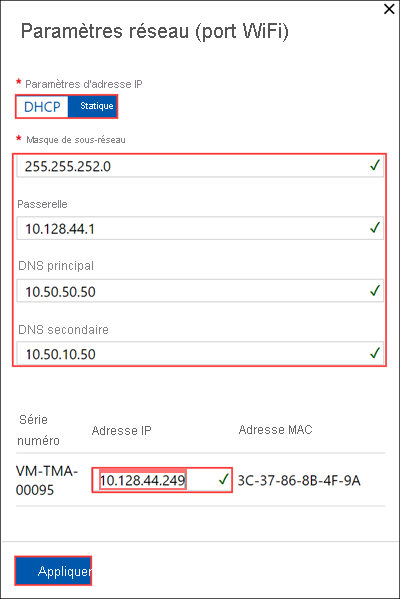
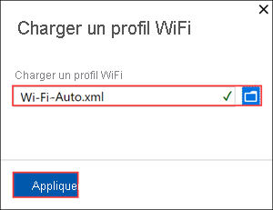
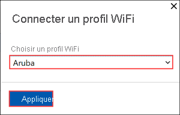

# <a name="use-the-local-web-ui-to-manage-wireless-connectivity-on-your-azure-stack-edge-mini-r"></a>Utiliser l’interface utilisateur web locale pour gérer la connectivité sans fil de votre appareil Azure Stack Edge Mini R

Cet article explique comment gérer la connectivité de réseau sans fil sur votre appareil Azure Stack Edge Mini R. Vous pouvez utiliser l’interface utilisateur web locale sur votre appareil Azure Stack Edge Mini R pour ajouter/supprimer des profils Wi-Fi ou vous connecter à ces derniers.

## <a name="about-wi-fi"></a>À propos du Wi-Fi

Votre appareil Azure Stack Edge Mini R peut fonctionner à la fois en étant câblé au réseau ou via un réseau sans fil. L’appareil dispose d’un port Wi-Fi qui doit être activé pour permettre à l’appareil de se connecter à un réseau sans fil. 

Votre appareil a cinq ports, le PORT 1 jusqu’au PORT 4 et un cinquième port Wi-Fi. Voici un diagramme de l’arrière d’un appareil Mini R lorsqu’il est connecté à un réseau sans fil.


## <a name="add-connect-to-wi-fi-profile"></a>Ajouter un profil Wi-Fi et s’y connecter

Effectuez les étapes suivantes dans l’interface utilisateur locale de votre appareil pour ajouter un profil Wi-Fi et vous y connecter.

1. Accédez à la page **Bien démarrer** de l’interface utilisateur web locale de votre appareil. Dans la vignette **Réseau**, sélectionnez **Configurer**.  
    
    Votre appareil physique comporte cinq interfaces réseau. Le PORT 1 et le PORT 2 sont des interfaces réseau de 1 Gbit/s. Le PORT 3 et le PORT 4 sont des interfaces réseau de 10 Gbit/s. Le cinquième port est le port Wi-Fi. 

    [](./media/azure-stack-edge-mini-r-deploy-configure-network-compute-web-proxy/configure-wifi-1.png#lightbox)  
    
    Sélectionnez le port Wi-Fi et configurez les paramètres du port. 
    
    > [!IMPORTANT]
    > Nous vous recommandons vivement de configurer une adresse IP statique pour le port Wi-Fi.  

    

    La page **Réseau** se met à jour une fois que vous avez appliqué les paramètres du port Wi-Fi.

    

   
2. Sélectionnez **Ajouter un profil Wi-Fi** et chargez votre profil Wi-Fi. 

    
    
    Un profil réseau sans fil contient le SSID (nom du réseau), la clé de mot de passe et les informations de sécurité qui permettent de se connecter à un réseau sans fil. Vous pouvez obtenir le profil Wi-Fi de votre environnement auprès de votre administrateur réseau.

    Pour plus d’informations sur la préparation de vos profils de Wi-Fi, consultez [Utiliser des profils de Wi-Fi avec des appareils Azure Stack Edge Mini R](azure-stack-edge-mini-r-use-wifi-profiles.md).

    

    Une fois le profil ajouté, la liste des profils Wi-Fi se met à jour pour refléter le nouveau profil. Le profil doit indiquer l’**état de la connexion** **Déconnecté**. 

    
    
3. Une fois que le profil réseau sans fil est correctement chargé, connectez-vous à ce profil. Sélectionnez **Se connecter à un profil Wi-Fi**. 

    

4. Sélectionnez le profil Wi-Fi que vous avez ajouté à l’étape précédente et sélectionnez **Appliquer**. 

    

    L’**état de la connexion** doit se mettre à jour vers **Connecté**. La force de signal se met à jour pour indiquer la qualité du signal. 

    

    > [!NOTE]
    > Pour transférer de grandes quantités de données, nous vous recommandons d’utiliser une connexion câblée au lieu du réseau sans fil. 


## <a name="download-wi-fi-profile"></a>Télécharger le profil Wi-Fi

Vous pouvez télécharger un profil Wi-Fi que vous utilisez pour la connectivité au réseau sans fil.

1. Dans l’interface utilisateur web locale de votre appareil, accédez à **Configuration > Réseau**. 

2. Sous les paramètres du profil Wi-Fi, sélectionnez **Télécharger le profil**. Cela doit télécharger le profil Wi-Fi que vous utilisez actuellement.


## <a name="delete-wi-fi-profile"></a>Supprimer un profil Wi-Fi

Vous pouvez supprimer un profil Wi-Fi que vous utilisez pour la connectivité au réseau sans fil.


1. Dans l’interface utilisateur web locale de votre appareil, accédez à **Configuration > Réseau**. 

2. Sous les paramètres du profil Wi-Fi, sélectionnez **Supprimer le profil Wi-Fi**.

3. Dans le panneau **Supprimer le profil Wi-Fi**, choisissez le profil que vous souhaitez supprimer. Sélectionnez **Appliquer**.


## <a name="configure-cisco-wi-fi-profile"></a>Configurer le profil Wi-Fi Cisco

Voici quelques conseils sur la façon de gérer et de configurer un contrôleur et un point d’accès sans fil Cisco sur votre appareil. 

### <a name="dhcp-bridging-mode"></a>Mode de pontage DHCP

Pour utiliser un contrôleur sans fil Cisco pour votre appareil, vous devez activer le mode de pontage DHCP (Dynamic Host Configuration Protocol) sur le contrôleur LAN sans fil.

Pour en savoir plus, consultez [Mode de pontage DHCP](https://www.cisco.com/c/en/us/support/docs/wireless/4400-series-wireless-lan-controllers/110865-dhcp-wlc.html#anc9).

#### <a name="bridging-configuration-example"></a>Exemple de configuration du pontage

Pour activer la fonctionnalité de pontage DHCP sur le contrôleur, vous devez désactiver la fonctionnalité de proxy DHCP sur le contrôleur. Pour activer le pontage DHCP à l’aide de la ligne de commande :

```powershell
(Cisco Controller) > config dhcp proxy disable
(Cisco Controller) > show dhcp proxy
DHCP Proxy Behaviour: disabled
```

Si le serveur DHCP n’existe pas sur le même réseau de couche 2 que le client, la diffusion doit être transférée au serveur DHCP au niveau de la passerelle cliente à l’aide d’un programme d’assistance IP. Voici un exemple de cette configuration :

```powershell
Switch#conf t
Switch(config)#interface vlan <client vlan #>
Switch(config-if)#ip helper-address <dhcp server IP>
```

La fonctionnalité de pontage DHCP étant un paramètre global, elle affecte toutes les transactions DHCP au sein du contrôleur. Vous devez ajouter des instructions d’assistance IP dans l’infrastructure câblée pour tous les réseaux locaux virtuels (VLAN) nécessaires sur le contrôleur.

### <a name="enable-the-passive-client-for-wlan"></a>Activer le client passif pour WLAN

Pour activer la fonctionnalité de client passif pour réseau local sans fil sur un contrôleur sans fil Cisco :

* L’interface associée au réseau local sans fil doit avoir un marquage VLAN activé.
* Le VLAN de multidiffusion doit être activé pour le réseau local sans fil.
* Le transfert GARP doit être activé sur le contrôleur LAN sans fil.

Pour plus d’informations, consultez la page sur l’[optimisation de la multidiffusion](https://www.cisco.com/c/en/us/td/docs/wireless/controller/8-5/config-guide/b_cg85/wlan_interfaces.html).

### <a name="troubleshoot"></a>Dépanner

Si vous rencontrez des problèmes avec les allocations d’adresses IP sur des machines virtuelles qui s’exécutent sur un appareil Azure Stack Edge Mini R, les paramètres de configuration ci-dessus de votre environnement réseau doivent être validés.

## <a name="next-steps"></a>Étapes suivantes

- Découvrez comment [déployer des appareils Azure Stack Edge Mini R](azure-stack-edge-mini-r-deploy-prep.md).
