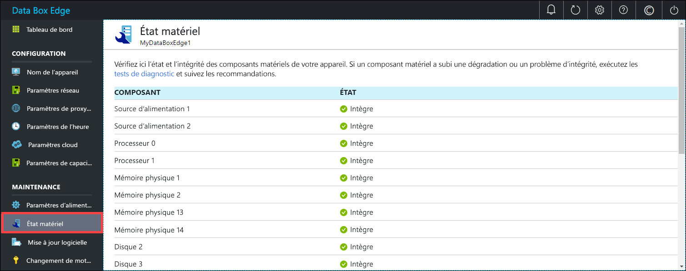

# Superviser votre appareil Azure Data Box Edge

Cet article explique comment superviser votre appareil Azure Data Box Edge. Pour ce faire, vous pouvez utiliser le portail Azure ou l’interface utilisateur web locale. Utilisez le portail Azure pour voir les événements de l’appareil, configurer et gérer les alertes et voir les métriques. Utilisez l’interface utilisateur web locale sur votre appareil physique pour voir l’état des différents composants matériels de l’appareil.

Dans cet article, vous apprendrez comment :

> [!div class="checklist"]
> * Afficher les événements de l’appareil et les alertes correspondantes
> * Afficher l’état des composants matériels de l’appareil
> * Afficher les métriques de capacité et de transaction de votre appareil
> * Configurer et gérer les alertes

## Afficher les événements de l’appareil

[!INCLUDE [Supported OS for clients connected to device](../../includes/data-box-edge-gateway-view-device-events.md)]

## Afficher l’état de matériel

Effectuez les étapes suivantes dans l’interface utilisateur web locale pour afficher l’état des composants matériel de votre appareil.

1. Connectez-vous à l’interface utilisateur web locale de votre appareil.
2. Allez dans **Maintenance > État du matériel**. Vous pouvez afficher l’intégrité des différents composants de l’appareil.

    

## Afficher les mesures

[!INCLUDE [Supported OS for clients connected to device](../../includes/data-box-edge-gateway-view-metrics.md)]

## Gérer les alertes

[!INCLUDE [Supported OS for clients connected to device](../../includes/data-box-edge-gateway-manage-alerts.md)]

## Étapes suivantes 

Découvrez comment [gérer la bande passante](data-box-edge-manage-bandwidth-schedules.md).