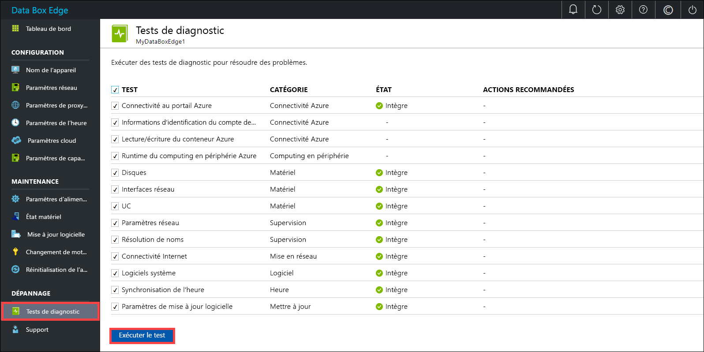
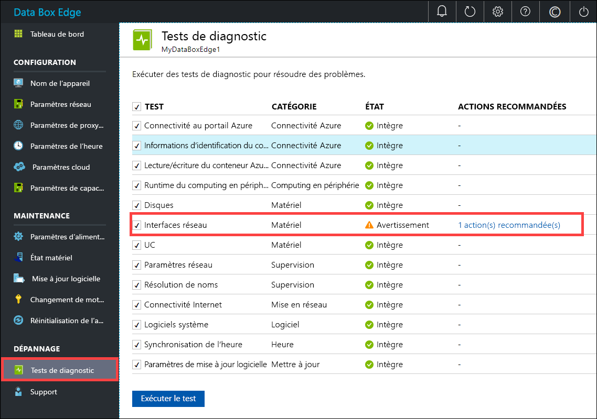
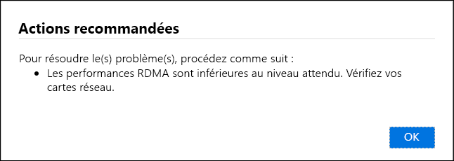
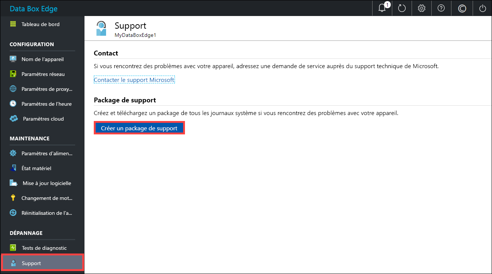
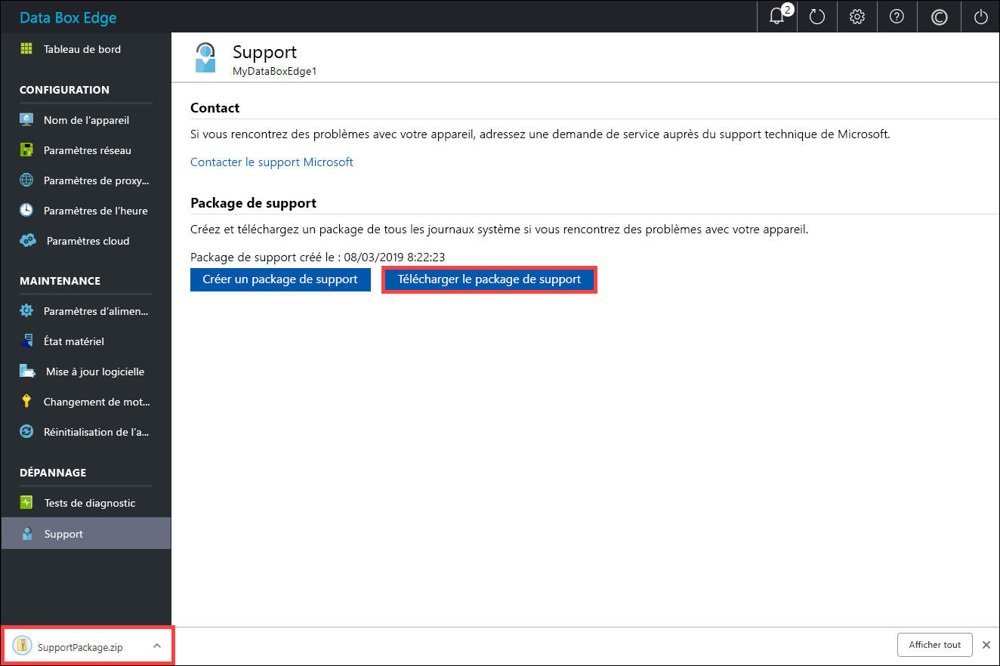
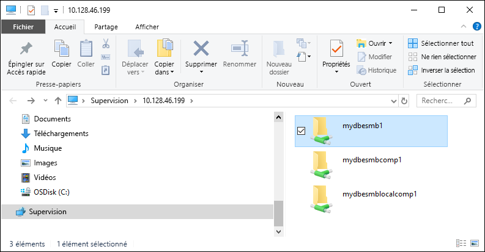

# <a name="troubleshoot-your-azure-data-box-edge-issues"></a>Résoudre les problèmes d’Azure Data Box Edge 

Cet article explique comment résoudre les problèmes de votre solution Azure Data Box Edge. 

Dans cet article, vous apprendrez comment :

> [!div class="checklist"]
> * Exécuter les diagnostics
> * Collecter un package de support
> * Utiliser les journaux d’activité pour résoudre les problèmes


## <a name="run-diagnostics"></a>Exécuter les diagnostics

Pour diagnostiquer et corriger les erreurs d’appareil, vous pouvez exécuter les tests de diagnostics. Pour exécuter ces tests, procédez comme suit dans l’interface utilisateur web locale de votre appareil.

1. Dans l’interface utilisateur web locale, accédez à **Dépannage > Tests de diagnostic**. Sélectionnez le test que vous souhaitez exécuter, puis cliquez sur **Exécuter le test**. Cette opération exécute les tests pour diagnostiquer les éventuels problèmes sur votre réseau, appareil, proxy web, horodatage ou paramètres cloud. Vous êtes averti que des tests sont en cours d’exécution sur l’appareil.

    
 
2. Une fois les tests terminés, les résultats correspondants s’affichent. 

    

    Si un test échoue, l’URL de l’action recommandée vous est présentée. Vous pouvez cliquer sur cette URL pour visualiser l’action recommandée.
 
    


## <a name="collect-support-package"></a>Collecter un package de support

Un package de journaux d’activité contient tous les journaux d’activité pertinents qui peuvent aider l’équipe du Support Microsoft à résoudre les problèmes des appareils. Vous pouvez générer un package de journaux par le biais de l’interface utilisateur web locale.

Pour collecter un package de support, procédez comme suit. 

1. Dans l’interface utilisateur web locale, accédez à **Dépannage > Support**. Cliquez sur **Créer un package de support**. Le système commence à collecter le package de support. La collection du package peut nécessiter plusieurs minutes.

    
 
2. Une fois le package de support créé, cliquez sur **Télécharger le package de support**. Un package compressé est téléchargé dans le chemin d’accès que vous avez choisi. Vous pouvez décompresser le package et visualiser les fichiers journaux système.

    

## <a name="use-logs-to-troubleshoot"></a>Utiliser les journaux d’activité pour résoudre les problèmes

Toutes les erreurs rencontrées lors des processus de chargement et d’actualisation figurent dans les fichiers d’erreurs correspondants.

1. Pour visualiser les fichiers d’erreurs, accédez à votre partage, puis cliquez sur ce dernier pour afficher le contenu. 

      

2. Cliquez sur le _dossier Microsoft Data Box Edge_. Ce dossier comporte deux sous-dossiers :

    - dossier Upload contenant les fichiers journaux des erreurs de chargement ;
    - dossier Refresh stockant les fichiers journaux des erreurs d’actualisation.

    Voici un exemple de fichier journal d’actualisation.

    ```
    <root container="test1" machine="VM15BS020663" timestamp="03/18/2019 00:11:10" />
    <file item="test.txt" local="False" remote="True" error="16001" />
    <summary runtime="00:00:00.0945320" errors="1" creates="2" deletes="0" insync="3" replaces="0" pending="9" />
    ``` 

3. Lorsque ce fichier signale une erreur (présentée dans cet exemple), notez le code de l’erreur, 16001 dans le cas présent. Recherchez ci-après la description de ce code d’erreur en fonction de la référence de l’erreur.

    [!INCLUDE [data-box-edge-edge-upload-error-reference](../../includes/data-box-edge-gateway-upload-error-reference.md)]


## <a name="next-steps"></a>Étapes suivantes

- Apprenez-en davantage sur les [problèmes connus de cette version](data-box-gateway-release-notes.md).
