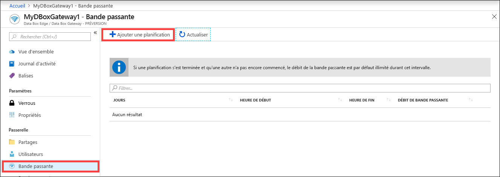
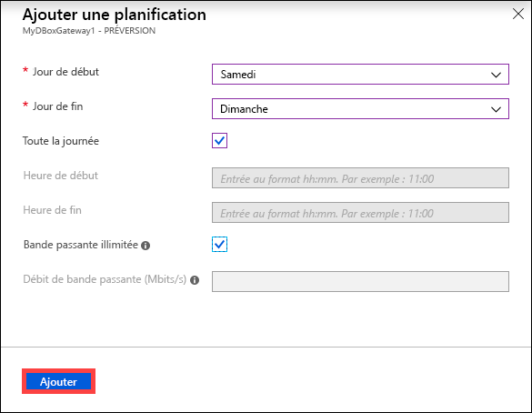
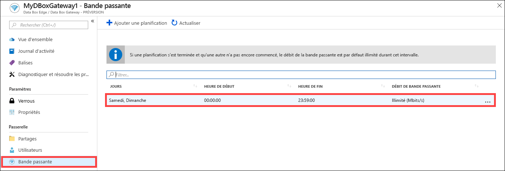
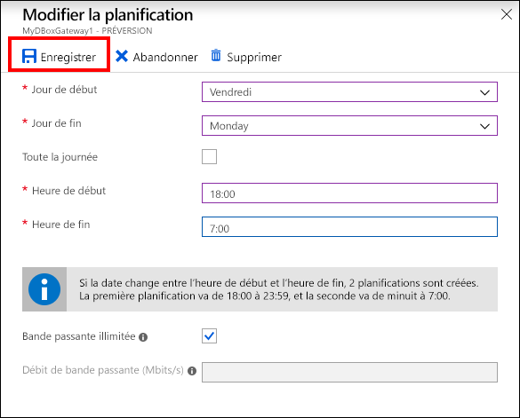
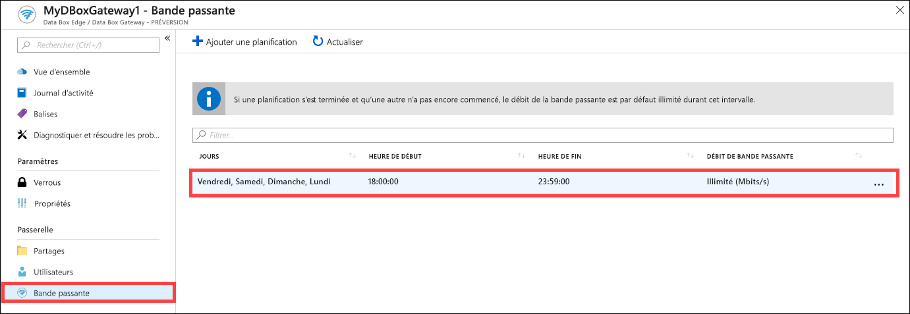
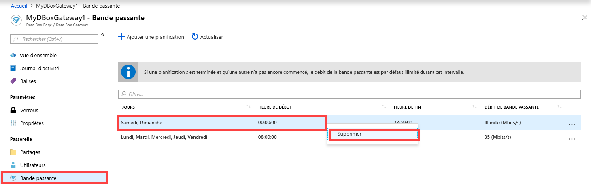

# Utiliser le Portail Azure pour gérer les planifications de bande passante sur votre ressource Azure Data Box Gateway  

Cet article explique comment gérer les planifications de bande passante sur votre ressource Azure Data Box Gateway. Les planifications de bande passante vous permettent de configurer l’utilisation de la bande passante réseau sur plusieurs planifications selon le moment de la journée. Ces planifications sont applicables aux opérations de chargement et de téléchargement entre votre appareil et le cloud.

Vous pouvez ajouter, modifier ou supprimer des planifications de bande passante pour votre ressource Data Box Gateway par le biais du Portail Azure.

Dans cet article, vous apprendrez comment :

> [!div class="checklist"]
>
> * Ajouter une planification
> * Modifier une planification
> * Supprimer une planification

## Ajouter une planification

Pour ajouter une planification, procédez comme suit dans le Portail Azure.

1. Dans le Portail Azure, accédez à votre ressource Data Box Gateway, puis accédez à **Bande passante**.
2. Dans le volet droit, cliquez sur **+ Ajouter une planification**.

    

3. Dans le volet **Ajouter une planification** : 

   1. Renseignez les champs **Jour de début**, **Jour de fin**, **Heure de début** et **Heure de fin** de la planification. 
   2. Si cette planification doit s’exécuter sur la journée entière, vous pouvez sélectionner l’option **Toute la journée**. 
   3. Le champ **Débit de bande passante** indique la bande passante en mégabits par seconde (Mbits/s) utilisée par votre appareil dans les opérations impliquant le cloud (à la fois pour les chargements et pour les téléchargements). Fournissez un nombre compris entre 1 et 1 000 pour ce champ. 
   4. Si vous ne souhaitez pas limiter le chargement et le téléchargement de données, cochez la case **Bande passante illimitée**. 
   5. Cliquez sur **Add**.

      

3. Une planification est créée avec les paramètres spécifiés. Le portail affiche alors cette planification dans la liste des planifications de bande passante.

## Modifier une planification

Pour modifier une planification de bande passante, procédez comme suit. 

1. Dans le Portail Azure, accédez à votre ressource Data Box Gateway, puis accédez à Bande passante. 
2. Dans la liste des planifications de bande passante, sélectionnez la planification que vous souhaitez modifier.
    

3. Apportez les modifications souhaitées, puis enregistrez les modifications.

    

4. Une fois la planification modifiée, la liste des planifications est mise à jour pour refléter cette modification.

    

## Supprimer une planification

Pour supprimer une planification de bande passante associée à votre appareil Data Box Gateway, procédez comme suit.

1. Dans le Portail Azure, accédez à votre ressource Data Box Gateway, puis accédez à **Bande passante**.  

2. Dans la liste des planifications de bande passante, sélectionnez la planification que vous souhaitez supprimer. Cliquez avec le bouton droit pour afficher le menu contextuel, puis cliquez sur **Supprimer**. 

   

3.  Une fois la planification supprimée, la liste des planifications est mise à jour.

## Étapes suivantes

- Découvrez comment [gérer la bande passante](data-box-gateway-manage-bandwidth-schedules.md). 
