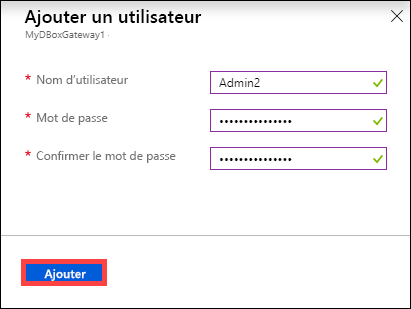
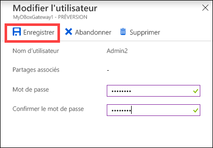
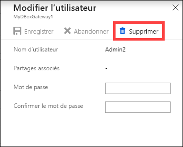
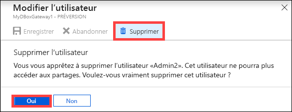
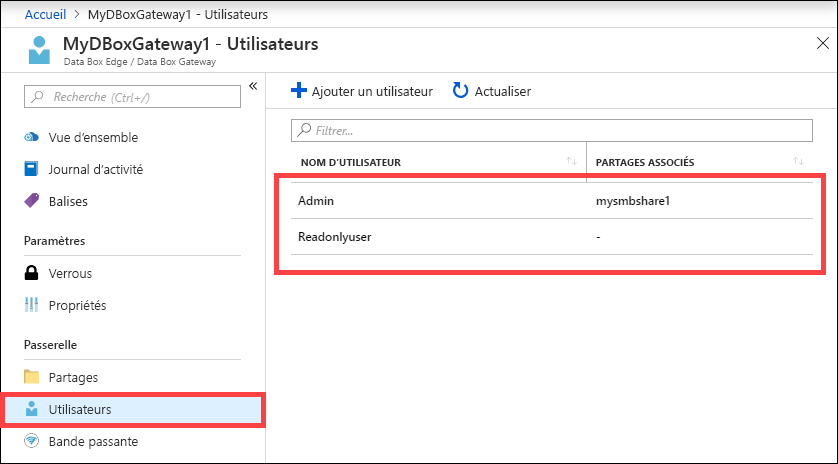

# Utilisation du Portail Azure pour gérer les utilisateurs de votre Azure Data Box Gateway

Cet article explique comment gérer les planifications de bande passante sur votre ressource Azure Data Box Gateway. Vous pouvez gérer le service Azure Data Box Gateway via le Portail Azure ou via l’interface utilisateur web locale. Utilisez le Portail Azure pour ajouter, modifier ou supprimer des utilisateurs. 

Dans cet article, vous apprendrez comment :

> [!div class="checklist"]
> * Ajouter un utilisateur
> * Modification d’une planification
> * Supprimer un utilisateur

## À propos des utilisateurs

Les utilisateurs peuvent être en lecture seule ou disposer de toutes les autorisations. Comme indiqué par les noms, les utilisateurs en lecture seule ne peuvent consulter que les données partagées. Les utilisateurs disposant de toutes les autorisations peuvent consulter les données de partage, écrire dessus, et les modifier ou les supprimer.

 - **Utilisateur disposant de toutes les autorisations** - Utilisateur local disposant de tous les droits d’accès.
 - **Utilisateur en lecture seule** - Utilisateur local disposant d’un accès en lecture seule. Ces utilisateurs sont associés à des partages permettant des opérations en lecture seule.

Les autorisations des utilisateurs sont d’abord définies à la création de l’utilisateur lors de la création du partage. La modification des autorisations au niveau du partage n’est actuellement pas prise en charge.

## Ajouter un utilisateur

Pour ajouter une planification, procédez comme suit dans le Portail Azure.

1. Dans le Portail Azure, accédez à votre ressource Data Box Gateway, puis accédez à **Vue d’ensemble**. Cliquez sur **+ Ajouter un utilisateur** dans la barre de commandes.

    

2. Indiquez le nom d’utilisateur et le mot de passe de l’utilisateur que vous souhaitez ajouter. Confirmez le mot de passe et cliquez sur **Ajouter**.

    

    > [!IMPORTANT] 
    > Ces utilisateurs sont réservés par le système et ne doivent pas être utilisés : Administrator, EdgeUser, EdgeSupport, HcsSetupUser, WDAGUtilityAccount, CLIUSR, DefaultAccount, Guest.  

3. Vous êtes averti lorsque la création de l’utilisateur commence et se termine. Une fois que l’utilisateur est créé, dans la barre de commandes, cliquez sur **Actualiser** pour afficher la liste actualisée des utilisateurs.

## Modification d’une planification

Vous pouvez modifier le mot de passe associé à un utilisateur une fois l’utilisateur créé. Sélectionnez et cliquez dans la liste des utilisateurs. Entrez et confirmez le nouveau mot de passe. Enregistrez les modifications.
 

## Supprimer un utilisateur

Pour supprimer un utilisateur, effectuez les étapes suivantes dans le Portail Azure.

1. Sélectionnez et cliquez sur un utilisateur dans la liste des utilisateurs, puis cliquez sur **Supprimer**.  

   

2. Quand vous y êtes invité, confirmez la suppression. 

   

La liste des utilisateurs est actualisée afin de tenir compte de la suppression de l’utilisateur.

## Étapes suivantes

- Découvrez comment [gérer la bande passante](data-box-gateway-manage-bandwidth-schedules.md).
