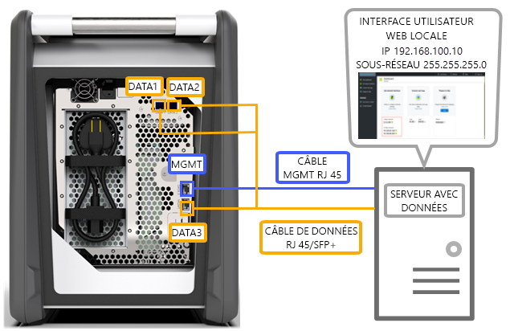
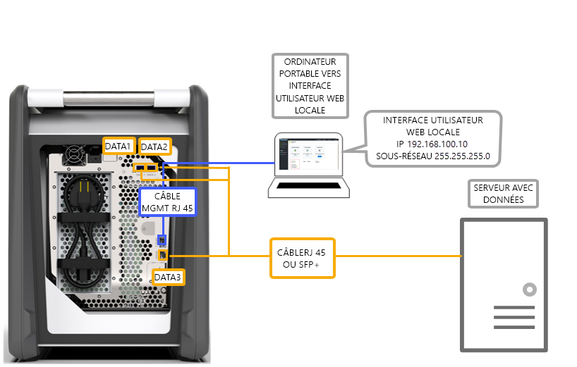
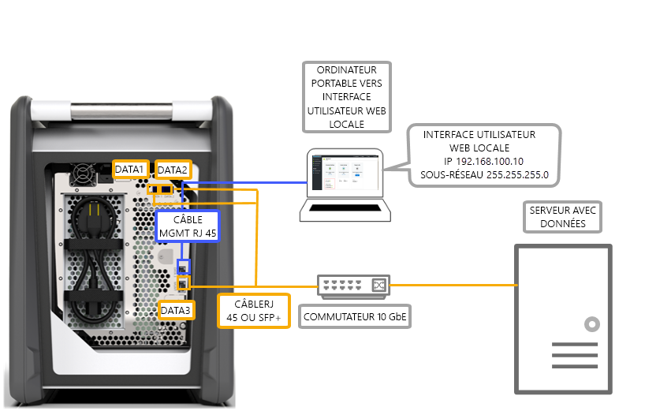
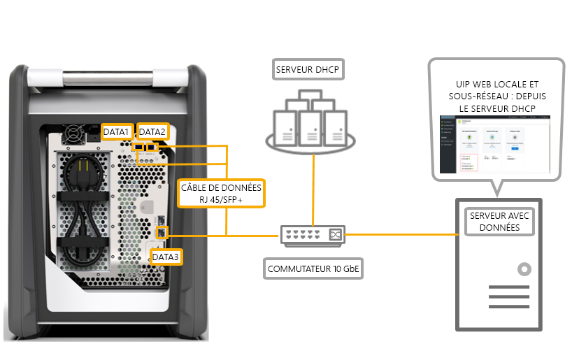

# Options de câblage de votre Azure Data Box

Cet article décrit les différentes méthodes de branchement des câbles de votre Azure Data Box pour le transfert de données.

## Transfert via le port de gestion

Cette option est la configuration minimale absolue de votre Data Box. Vous pouvez configurer le port de gestion pour la gestion et les données uniquement.

Avant de commencer, assurez-vous que vous disposez  des éléments suivants :

- Un câble Ethernet RJ45 pour la gestion.
- Une source de données exécutant un [système d’exploitation pris en charge](data-box-system-requirements.md#supported-operating-systems-for-clients).

Procédez comme suit pour brancher les câbles de l’appareil.

1. Utilisez un câble RJ45 pour connecter le port de gestion au serveur contenant les données.

    

2. Sur le serveur, définissez :

    - **Adresse IP** sur 192.168.100.5
    - **Sous-réseau** sur 255.255.255.0

3. Accédez à l’interface utilisateur web locale de l’appareil à l’adresse : 192.168.100.10. Connectez-vous et déverrouillez le Data Box à l’aide du mot de passe de déverrouillage du portail Azure.

## Transfert via un port DATA avec des adresses IP statiques

Vous pouvez configurer deux ports pour votre Data Box : le port de gestion pour gérer le trafic et un des ports de données pour les données. Les ports de données peuvent être DATA 1, DATA 2 ou DATA 3.

Nous recommandons vivement, si vous ne configurez qu’un seul port de données, qu’il s’agisse d’un port 10 GbE comme DATA 1 ou DATA 2. Un port 1 GbE augmenterait considérablement la durée nécessaire au transfert de données.

Avant de commencer, assurez-vous que vous disposez  des éléments suivants :

- Un câble Ethernet RJ45 pour la gestion.
- Un câble en cuivre SFP+ Twinax 10 GbE pour chaque port de données 10 GbE que vous souhaitez connecter.
- Une ou plusieurs sources de données exécutant un [système d’exploitation pris en charge](data-box-system-requirements.md#supported-operating-systems-for-clients).

### Option 1 - Configuration initiale via un serveur

Procédez comme suit pour brancher les câbles de l’appareil.

1. Utilisez un câble Ethernet RJ45 du serveur directement au port de gestion pour la configuration.
2. Utilisez un câble RJ45 pour DATA 3 ou SFP+ pour connecter DATA 1 ou DATA 2 au serveur servant de source de données. Pour des bonnes performances, nous vous recommandons d’utiliser le port 10 GbE DATA 1 ou DATA 2.
3. Sur le serveur, définissez :

   - **Adresse IP** sur 192.168.100.5
   - **Sous-réseau** sur 255.255.255.0

     

3. Accédez à l’interface utilisateur web locale de l’appareil à l’adresse : 192.168.100.10. Connectez-vous et déverrouillez le Data Box à l’aide du mot de passe de déverrouillage du portail Azure.
4. Assignez des adresses IP statiques aux ports de données que vous avez configurés.

### Option 2 - Configuration initiale via un ordinateur distinct

Procédez comme suit pour brancher les câbles de l’appareil.

1. Utilisez un câble Ethernet RJ45 entre l’ordinateur séparé et le port de gestion pour la configuration.
2. Utilisez un câble RJ45 pour DATA 3 ou SFP+ pour connecter DATA 1 ou DATA 2 au serveur. Pour des bonnes performances, nous vous recommandons d’utiliser le port 10 GbE DATA 1 ou DATA 2. Les ports de données sont connectés au serveur contenant des données via un commutateur 10 GbE.
3. Configurez la carte Ethernet sur l’ordinateur portable que vous utilisez pour vous connecter à l’appareil avec :

   - **Adresse IP** 192.168.100.5
   - **Sous-réseau** 255.255.255.0.
  
   

3. Accédez à l’interface utilisateur web locale de l’appareil à l’adresse : 192.168.100.10. Connectez-vous et déverrouillez le Data Box à l’aide du mot de passe de déverrouillage du portail Azure.
4. Identifiez les adresses IP assignées au serveur DHCP.

## Transfert via un port DATA avec des adresses IP statiques à l’aide d’un commutateur 

Utilisez cette configuration pour plusieurs sources de données sur des réseaux 1 GbE et 10 GbE.

Avant de commencer, assurez-vous que vous disposez  des éléments suivants :

- Un câble Ethernet RJ45 pour la gestion.
- Un câble en cuivre SFP+ Twinax 10 GbE pour chaque port de données 10 GbE que vous souhaitez connecter.
- Une ou plusieurs sources de données exécutant un [système d’exploitation pris en charge](data-box-system-requirements.md#supported-operating-systems-for-clients). Ces sources de données peuvent se trouver dans différents réseaux, tels que des réseau 1 GbE ou 10 GbE.

Procédez comme suit pour brancher les câbles de l’appareil.

1. Utilisez un câble Ethernet RJ45 du serveur directement au port de gestion pour la configuration.
2. Utilisez un câble RJ45 pour DATA 3 ou SFP+ pour connecter DATA 1 ou DATA 2 au serveur. Pour des bonnes performances, nous vous recommandons d’utiliser le port 10 GbE DATA 1 ou DATA 2.
3. Configurez la carte Ethernet sur l’ordinateur portable que vous utilisez pour vous connecter à l’appareil avec :

   - **Adresse IP** 192.168.100.5
   - **Sous-réseau** 255.255.255.0.

     

3. Accédez à l’interface utilisateur web locale de l’appareil à l’adresse : 192.168.100.10. Connectez-vous et déverrouillez le Data Box à l’aide du mot de passe de déverrouillage du portail Azure.
4. Assignez des adresses IP statiques aux ports de données que vous avez configurés.

## Transfert via un port DATA dans un environnement DHCP

Utilisez cette configuration si votre appareil se trouvera dans un environnement DHCP.

Avant de commencer, assurez-vous que vous disposez  des éléments suivants :

- Un câble RJ45 si vous souhaitez connecter DATA 1.
- Un câble en cuivre SFP+ Twinax 10 GbE pour chaque port de données 10 GbE que vous souhaitez connecter.
- Une ou plusieurs sources de données exécutant un [système d’exploitation pris en charge](data-box-system-requirements.md#supported-operating-systems-for-clients). Ces sources de données peuvent se trouver dans différents réseaux, tels que des réseau 1 GbE ou 10 GbE.

Procédez comme suit pour brancher les câbles de l’appareil.

1. Utilisez un câble RJ45 ou SFP+ via un commutateur (où le serveur DHCP est accessible) sur le serveur.

    

2. Utilisez un serveur DHCP ou un serveur DNS pour identifier l’adresse IP.
3. À partir d’un serveur sur le même réseau, accédez à l’interface utilisateur web locale de l’appareil à l’aide de l’adresse IP assignée par le serveur DHCP. Connectez-vous et déverrouillez le Data Box à l’aide du mot de passe de déverrouillage du portail Azure.

## Étapes suivantes

- Une fois les câbles de l’appareil branchés, accédez à [Copier des données sur votre Azure Data Box](data-box-deploy-copy-data.md).
