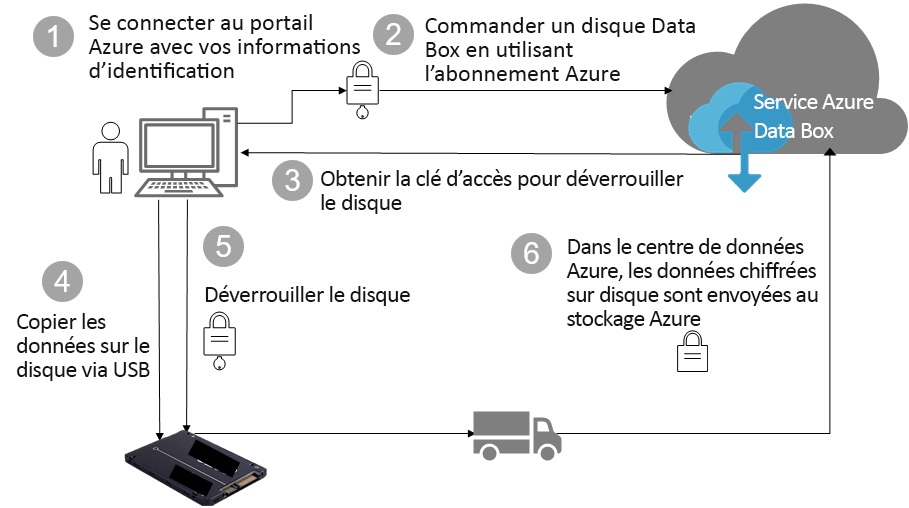

# Protection des données et sécurité Azure Data Box Disk

Cet article décrit les fonctionnalités de sécurité du disque Azure Data Box Disk qui permettent de protéger chacun des composants de la solution Data Box et les données stockées sur ces derniers. 

## Flux de données via des composants

La solution Microsoft Azure Data Box repose sur l’interaction de quatre composants principaux :

- **Service Azure Data Box hébergé dans Azure** : le service de gestion qui vous permet de créer la commande des disques, de configurer les disques et de suivre la commande jusqu'à son achèvement.
- **Disques Data Box**  : les disques physiques qui vous sont livrés pour importer vos données locales dans Azure. 
- **Les clients/hôtes connectés aux disques** : les clients de votre infrastructure se connectant au disque Data Box via USB et contenant des données devant être protégées.
- **Le stockage cloud** : emplacement dans le cloud Azure où les données sont stockées. Il s’agit généralement du compte de stockage lié à la ressource Azure Data Box que vous avez créée.

Le diagramme suivant indique le flux de données à travers la solution Azure Data Box Disk de l’environnement local vers Azure.

## Fonctionnalités de sécurité

Data Box Disk fournit une solution sécurisée pour la protection des données en veillant à ce que seules les entités autorisées affichent, modifient ou suppriment vos données. Les fonctionnalités de sécurité de cette solution pour le disque et le service associé, garantissent la sécurité des données stockées sur ces derniers.

### Protection du disque Data Box

Le disque Data Box est protégé par les fonctionnalités suivantes :

- Chiffrement BitLocker AES-128 bits pour le disque à tout moment.
- Sécurisez la fonctionnalité de mise à jour des disques.
- Les disques sont expédiés dans un état verrouillé et ne peuvent être déverrouillés que grâce à un outil de déverrouillage Data Box Disk. L’outil de déverrouillage est disponible dans le portail de service de Data Box Disk.

### Protection des données du disque Data Box

Les données qui circulent vers et depuis le disque Data Box sont protégées par les fonctionnalités suivantes :

- Chiffrement BitLocker des données à tout moment.
- Effacement sécurisé des données du disque une fois le chargement des données vers Azure terminé. L’effacement des données est conforme aux normes NIST 800-88r1.

### Protection du service Data Box

Le service Data Box est protégé par les fonctionnalités suivantes.

- L’accès au service Data Box Disk requiert que votre organisation dispose d’un abonnement Azure incluant Data Box Disk. Votre abonnement régit les fonctionnalités auxquelles vous pouvez accéder dans le portail Azure.
- Étant donné que le service Data Box est hébergé dans Azure, il est protégé par les fonctionnalités de sécurité Azure. Pour plus d’informations sur les fonctionnalités de sécurité fournies par Microsoft Azure, accédez au [Centre de confidentialité Microsoft Azure](https://www.microsoft.com/TrustCenter/Security/default.aspx).
- Le disque Data Box stocke la clé d’accès du disque utilisée pour déverrouiller le disque dans le service. 
- Le service Data Box Disk stocke les détails de la commande et l’état dans le service. Ces informations sont supprimées en même temps que la commande.

## Gestion des données personnelles

[!INCLUDE [GDPR-related guidance](../../includes/gdpr-intro-sentence.md)]

Azure Data Box Disk collecte et affiche des informations personnelles dans les instances principales suivantes dans le service :

- **Paramètres de notification** : quand vous créez une commande, vous configurez l’adresse e-mail des utilisateurs sous Paramètres de notification. Ces informations peuvent être affichées par l’administrateur. Ces informations sont supprimées par le service lorsque la tâche atteint l’état terminal, ou lorsque vous supprimez la commande.

- **Détails de la commande** : une fois la commande créée, l’adresse de livraison, l’adresse e-mail, et les informations de contact des utilisateurs sont stockées dans le portail Azure. Les informations enregistrées incluent :

  - Nom du contact
  - Numéro de téléphone
  - E-mail
  - Adresse postale
  - City
  - Code postal
  - State
  - Pays/Province/Région
  - ID de lecteur de disque
  - Numéro de compte du transporteur
  - Numéro de suivi d’expédition

    Les détails de la commande sont supprimés par le service Data Box lorsque la tâche est terminée ou quand vous supprimez la commande.

- **Adresse de livraison** : une fois la commande passée, le service Data Box fournit l’adresse de livraison aux transporteurs tiers tels que UPS ou DHL. 

Pour plus d’informations, consultez la [Politique de confidentialité Microsoft sur le Centre de gestion de la confidentialité](https://www.microsoft.com/trustcenter).

## Étapes suivantes

- Consultez les [Conditions requises pour le système Data Box Disk](data-box-disk-system-requirements.md).
- Prenez connaissance des [limites de Data Box Disk](data-box-disk-limits.md).
- Déployez rapidement [Azure Data Box Disk](data-box-disk-quickstart-portal.md) sur le portail Azure.
