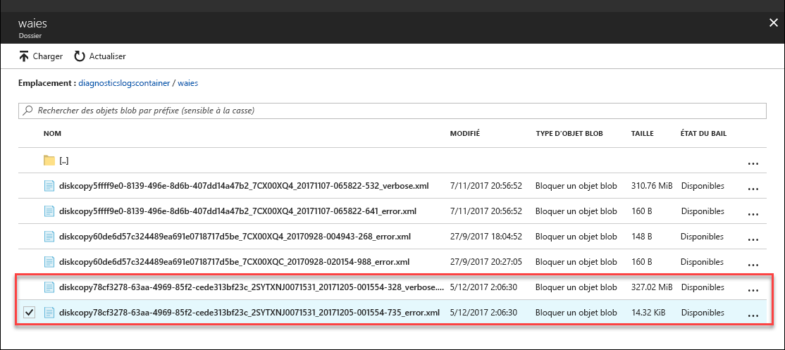

# <a name="understand-logs-to-troubleshoot-data-upload-issues-in-azure-data-box-disk"></a>Comprendre les journaux pour résoudre les problèmes liés au chargement des données dans Azure Data Box Disk

Cet article s’applique à Microsoft Azure Data Box Disk et décrit les problèmes que vous rencontrez lors du chargement des données dans Azure.

## <a name="data-upload-logs"></a>Journaux sur le chargement des données

Lorsque les données sont chargées sur un centre de données dans Azure, les fichiers `_error.xml` et `_verbose.xml` sont générés. Ces journaux sont chargés sur le même compte de stockage utilisé pour charger des données. Voici un exemple de `_error.xml` obtenue.
    
```xml
 <?xml version="1.0" encoding="utf-8"?>
    <DriveLog Version="2018-10-01">
      <DriveId>18041C582D7E</DriveId>
      <Summary>
     <!--Summary for validation and data copy to Azure -->
        <ValidationErrors>
          <None Count="8" />
        </ValidationErrors>
        <CopyErrors>
          <Completed Count="5" Description="No errors encountered" />
          <ContainerRenamed Count="3" Description="Renamed the container as the original container name does not follow Azure conventions." />
        </CopyErrors>
      </Summary>
    <!--List of renamed containers with the new names, new file path in Azure, original invalid file path, and size -->
      <Blob Status="ContainerRenamed">
        <BlobPath>databox-c2073fd1cc379d83e03d6b7acce23a6cf29d1eef/private.vhd</BlobPath>
        <OriginalFilePath>\PageBlob\pageblob test\private.vhd</OriginalFilePath>
        <SizeInBytes>10490880</SizeInBytes>
      </Blob>
      <Blob Status="ContainerRenamed">
        <BlobPath>databox-c2073fd1cc379d83e03d6b7acce23a6cf29d1eef/resource.vhd</BlobPath>
        <OriginalFilePath>\PageBlob\pageblob test\resource.vhd</OriginalFilePath>
        <SizeInBytes>71528448</SizeInBytes>
      </Blob>
      <Blob Status="ContainerRenamed">
        <BlobPath>databox-c2073fd1cc379d83e03d6b7acce23a6cf29d1eef/role.vhd</BlobPath>
        <OriginalFilePath>\PageBlob\pageblob test\role.vhd</OriginalFilePath>
        <SizeInBytes>10490880</SizeInBytes>
      </Blob>
      <Status>CompletedWithErrors</Status>
    </DriveLog>
```

## <a name="download-logs"></a>Télécharger les journaux d’activité

Il y a deux façons de localiser et de télécharger des journaux de diagnostic.

- Si des erreurs se produisent lors du chargement des données dans Azure, le portail affiche un chemin d’accès au dossier dans lequel se trouvent les journaux de diagnostic.

    

- Accédez au compte de stockage associé à votre commande Data Box. Accédez à **Service BLOB > Parcourir les objets blob** et recherchez l’objet blob correspondant au compte de stockage. Accédez à **waies**.

    

Dans chaque cas, vous voyez les journaux d’activité d’erreurs et les journaux d’activité détaillés. Sélectionnez chaque journal et téléchargez une copie locale.


## <a name="data-upload-errors"></a>Erreurs de chargement des données

Les erreurs générées lors du chargement des données dans Azure sont résumées dans le tableau suivant.

| Code d'erreur | Description                        |
|-------------|------------------------------|
|`None` |  Opération réussie.           |
|`Renamed` | Objet blob renommé avec succès.  |                                                            |
|`CompletedWithErrors` | Chargement terminé avec des erreurs. Les détails des fichiers de l’erreur sont inclus dans le fichier journal.  |
|`Corrupted`|Le CRC calculé au cours de l’ingestion de données ne correspond pas au CRC calculé lors du chargement.  |  
|`StorageRequestFailed` | Échec de la demande de stockage Azure.   |     |
|`LeasePresent` | Cet élément est loué et est utilisé par un autre utilisateur. |
|`StorageRequestForbidden` |Échec du chargement en raison de problèmes d’authentification. |
|`ManagedDiskCreationTerminalFailure` | Échec du chargement en tant que disques managés. Les fichiers sont disponibles dans le compte de stockage intermédiaire en tant qu’objets blob de pages. Vous pouvez convertir manuellement des objets blob de pages en disques managés.  |
|`DiskConversionNotStartedTierInfoMissing` | Dans la mesure où le fichier de disque dur virtuel a été copié hors des dossiers de niveau précréés, un disque managé n’a pas été créé. Le fichier est téléchargé en tant qu’objet blob de pages pour le compte de stockage intermédiaire tel que spécifié lors de la création de l’ordre. Vous pouvez le convertir manuellement en un disque managé.|
|`InvalidWorkitem` | Impossible de charger les données car elles ne sont pas conformes aux normes de nomination et de limites Azure.|
|`InvalidPageBlobUploadAsBlockBlob` | Téléchargés comme objets blob de blocs dans un conteneur avec le préfixe `databoxdisk-invalid-pb-`.|
|`InvalidAzureFileUploadAsBlockBlob` | Téléchargés comme objets blob de blocs dans un conteneur avec le préfixe `databoxdisk-invalid-af`-.|
|`InvalidManagedDiskUploadAsBlockBlob` | Téléchargés comme objets blob de blocs dans un conteneur avec le préfixe `databoxdisk-invalid-md`-.|
|`InvalidManagedDiskUploadAsPageBlob` |Téléchargés comme objets blob de pages dans un conteneur avec le préfixe `databoxdisk-invalid-md-`. |
|`MovedToOverflowShare` |Téléchargement des fichiers dans un nouveau partage car le partage d’origine a dépassé la limite de taille maximale d’Azure. Le nouveau nom du partage de fichier comprend le nom original avec le suffixe `-2`.   |
|`MovedToDefaultAzureShare` |Téléchargement des fichiers qui ne faisaient partie d’aucun dossier dans un partage par défaut. Le nom du partage commence par `databox-`. |
|`ContainerRenamed` |Le conteneur de ces fichiers n’était pas conforme aux conventions d’affectation de noms d’Azure et a été renommé. Le nouveau nom commence par `databox-` et est suivi du suffixe SHA1 du nom d’origine |
|`ShareRenamed` |Le partage de ces fichiers n’était pas conforme aux conventions d’affectation de noms d’Azure et a été renommé. Le nouveau nom commence par `databox-` et est suivi du suffixe SHA1 du nom d’origine. |
|`BlobRenamed` |Ces fichiers n’étaient pas conformes aux conventions d’affectation de noms d’Azure et ont été renommés. Vérifiez le nouveau nom dans le champ `BlobPath`. |
|`FileRenamed` |Ces fichiers n’étaient pas conformes aux conventions d’affectation de noms d’Azure et ont été renommés. Vérifiez le nouveau nom dans le champ `FileStoragePath`. |
|`DiskRenamed` |Ces fichiers n’étaient pas conformes aux conventions d’affectation de noms d’Azure et ont été renommés. Vérifiez le nouveau nom dans le champ `BlobPath`. |


## <a name="next-steps"></a>Étapes suivantes

- [Ouvrir un ticket de support concernant les problèmes Data Box Disk](data-box-disk-contact-microsoft-support.md).
