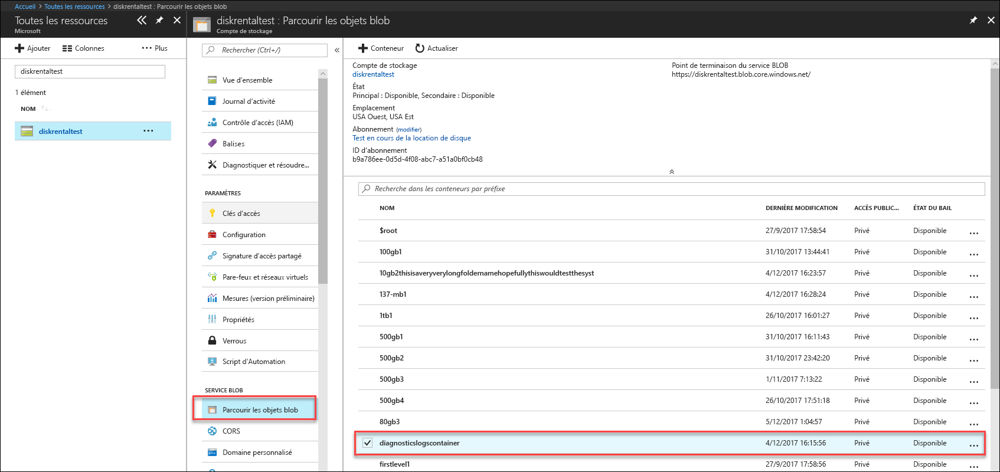

# Résoudre les problèmes rencontrés dans Azure Data Box Disk (préversion)

Cet article s’applique à Microsoft Azure Data Box exécutant une préversion. Cet article décrit certains des flux de travail et tâches de gestion complexes qui peuvent être effectués sur Data Box et Data Box Disk. 

Vous pouvez gérer Data Box à l’aide de l’interface utilisateur du service Data Box (également appelée interface utilisateur du portail) et de l’interface utilisateur web locale de l’appareil. Data Box Disk ne peut être géré que via le portail Azure. Cet article se concentre sur les tâches que vous pouvez effectuer à l’aide du portail Azure. Utilisez le portail Azure pour gérer les commandes et les appareils, et suivre l’état des commandes lorsqu’elles passent à l’étape terminale.

Cet article inclut les didacticiels suivants :

- Télécharger les journaux de diagnostic
- Interroger les journaux d’activité

> [!IMPORTANT]
> Data Box est disponible en préversion. Veuillez lire les [conditions d’utilisation de la préversion Azure](https://azure.microsoft.com/support/legal/preview-supplemental-terms/) avant de déployer cette solution.

## Télécharger les journaux de diagnostic

Si des erreurs se produisent pendant le processus de copie des données, le portail affiche un chemin d’accès au dossier dans lequel se trouvent les journaux de diagnostic. 

Les journaux de diagnostic peuvent être :
- Des journaux d’erreurs
- Des journaux détaillés  

Pour accéder au chemin d’accès du journal de copie, accédez au compte de stockage associé à votre commande Data Box. 

1.  Accédez à **Général > Détails de la commande** et prenez note du compte de stockage associé à votre commande.
 

2.  Accédez à **Toutes les ressources** et recherchez le compte de stockage identifié à l’étape précédente. Sélectionnez le compte de stockage et cliquez dessus.

    

3.  Accédez à **Service BLOB > Parcourir les objets blob** et recherchez l’objet blob correspondant au compte de stockage. Accédez à **diagnosticslogcontainer > waies**. 

    

    Vous devez voir les journaux d’erreurs et les journaux détaillés pour la copie des données. Sélectionnez chaque fichier et cliquez dessus, puis téléchargez une copie locale.

## Interroger les journaux d’activité

Utilisez les journaux d’activité pour rechercher une erreur lors de la résolution de problèmes ou pour surveiller la manière dont un utilisateur de votre organisation a modifié une ressource. Les journaux d’activité vous permettent de déterminer :

- Les opérations qui ont été effectuées sur les ressources de votre abonnement.
- Ce qui a initié l’opération. 
- Le moment où a eu lieu l’opération.
- L’état de l’opération.
- Les valeurs d’autres propriétés qui peuvent vous aider à effectuer des recherches sur l’opération.

Le journal d’activité contient toutes les opérations d’écriture (par exemple PUT, POST, DELETE) effectuées sur vos ressources, mais pas les opérations de lecture (comme GET). 

Les journaux d’activité sont conservés pendant 90 jours. Vous pouvez interroger une plage quelconque de dates, pour autant que la date de début ne remonte pas à plus de 90 jours dans le passé. Vous pouvez également filtrer le contenu en fonction d’une des requêtes intégrées dans Insights. Par exemple, cliquez sur une erreur, puis sélectionnez des échecs spécifiques et cliquez dessus pour comprendre la cause racine.

## Erreurs de l’outil de déverrouillage de Data Box Disk

| Message d’erreur/Comportement de l’outil      | Recommandations                                                                                               |
|-------------------------------------------------------------------------------------------------------------------------------------|------------------------------------------------------------------------------------------------------|
| Aucun  L’outil de déverrouillage de Data Box Disk se bloque.                                                                            | Le composant BitLocker n’est pas installé. Veillez à ce que BitLocker soit installé sur l’ordinateur hôte qui exécute l’outil de déverrouillage de Data Box Disk.                                                                            |
| Le composant .NET Framework actuel n’est pas pris en charge. Les versions prises en charge sont les versions 4.5 et ultérieures.  L’outil se ferme avec un message.  | .NET 4.5 n’est pas installé. Installez .NET 4.5 ou ultérieur sur l’ordinateur hôte qui exécute l’outil de déverrouillage de Data Box Disk.                                                                            |
| Impossible de déverrouiller ou de vérifier des volumes. Contactez le Support Microsoft.    L’outil ne parvient pas à déverrouiller ni à vérifier les lecteurs verrouillés. | L’outil n’a pas pu déverrouiller l’un des lecteurs verrouillés avec la clé d’accès fournie. Contactez le Support Microsoft pour les étapes suivantes.                                                |
| Les volumes suivants sont déverrouillés et vérifiés.  Lettre de lecteur du volume : E: Impossible de déverrouiller les volumes avec les clés d’accès suivantes : werwerqomnf, qwerwerqwdfda   L’outil déverrouille certains lecteurs et répertorie les lettres de lecteur ayant réussi ou échoué.| Réussite partielle. Impossible de déverrouiller certains lecteurs avec la clé d’accès fournie. Contactez le Support Microsoft pour les étapes suivantes. |
| Les volumes verrouillés sont introuvables. Vérifiez que le disque envoyé par Microsoft est connecté correctement et qu’il se trouve à l’état verrouillé.          | L’outil ne parvient pas à trouver de lecteurs verrouillés. Soit les lecteurs sont déjà déverrouillés, soit ils ne sont pas détectés. Assurez-vous que les lecteurs sont connectés et verrouillés.                                                           |
| Erreur irrécupérable : paramètre non valide Nom de paramètre : invalid_arg UTILISATION : DataBoxDiskUnlock /PassKeys:<liste_clés_accès_séparées_par_points_virgules>  Exemple : DataBoxDiskUnlock /PassKeys:passkey1;passkey2;passkey3 Exemple : DataBoxDiskUnlock /SystemCheck Exemple : DataBoxDiskUnlock /Help  /PassKeys : permet d’obtenir cette clé d’accès à partir de la commande Azure Data Box Disk. La clé d’accès déverrouille vos disques. / Help : cette option fournit une aide sur l’utilisation et les exemples de cmdlet. / SystemCheck : cette option vérifie si votre système répond à la configuration requise pour l’exécution de l’outil.  Appuyez sur une touche pour quitter. | Paramètre non valide entré. Les seuls paramètres autorisés sont les suivants : /SystemCheck, /PassKey et /Help.                                                                            |
## Étapes suivantes

- Découvrez comment [gérer Data Box Disk via le portail Azure](data-box-portal-ui-admin.md).
