# <a name="use-the-local-web-ui-to-administer-your-data-box-and-data-box-heavy"></a>Utiliser l’interface utilisateur web locale pour gérer vos appareils Data Box et Data Box Heavy

Cet article explique certaines des tâches de gestion et de configuration qui peuvent être effectuées sur les appareils Data Box et Data Box Heavy. Vous pouvez gérer les appareils Data Box et Data Box Heavy via l’interface utilisateur du portail Azure et l’interface utilisateur web locale de l’appareil. Cet article se concentre sur les tâches que vous pouvez effectuer à l'aide de l'interface utilisateur web locale.

L’interface utilisateur web locale de Data Box et Data Box Heavy est utilisée pour la configuration initiale de l’appareil. Vous pouvez également utiliser l’interface utilisateur web locale pour arrêter ou redémarrer l’appareil, exécuter des tests de diagnostic, mettre à jour les logiciels, afficher les journaux d’activité de copie et générer un package de journaux d’activité destiné au support Microsoft. Sur un appareil Data Box Heavy avec deux nœuds indépendants, vous pouvez accéder à deux interfaces utilisateur web locales distinctes correspondant aux deux différents nœuds de l’appareil.

Cet article inclut les didacticiels suivants :

- Générer un package de support
- Arrêter ou redémarrer votre appareil
- Télécharger les fichiers manifeste ou de nomenclature
- Afficher la capacité disponible sur l’appareil
- Ignorer la validation de la somme de contrôle

[!INCLUDE [Data Box feature is in preview](../../includes/data-box-feature-is-preview-info.md)]

## <a name="generate-support-package"></a>Générer un package de support

Si vous rencontrez des problèmes avec l’appareil, vous pouvez créer un package de support dans les journaux d’activité système. Le support Microsoft utilise ce package pour résoudre le problème. Pour générer un package de support, suivez les étapes ci-dessous :

1. Dans l’interface utilisateur web locale, accédez à **Contacter le support technique**, puis cliquez sur **Générer un package de support**.

    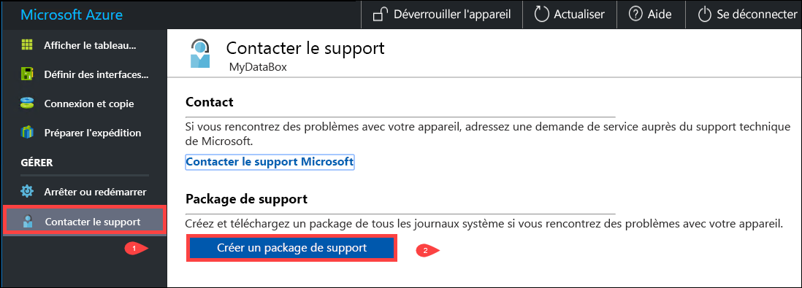

2. Un package de support est collecté. Cette opération prend quelques minutes.

    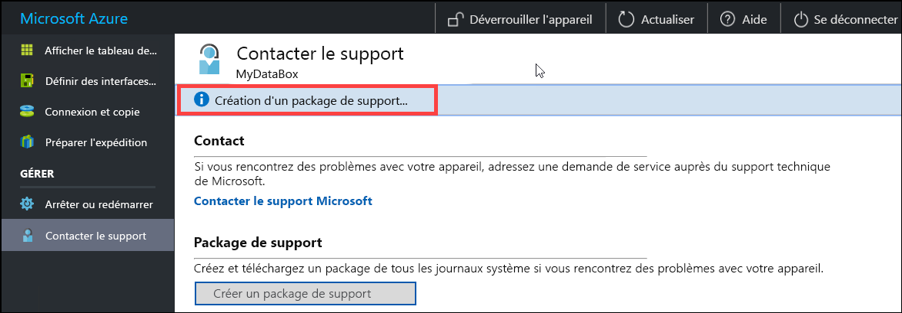

3. Une fois le package de support créé, cliquez sur **Télécharger le package de support**. 

    

4. Recherchez puis choisissez le dossier de téléchargement. Ouvrez le dossier pour afficher le contenu.

    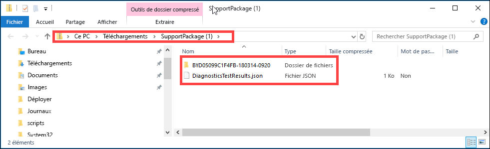


## <a name="shut-down-or-restart-your-device"></a>Arrêter ou redémarrer votre appareil

Vous pouvez arrêter ou redémarrer votre appareil à l'aide de l'interface utilisateur web locale. Avant de redémarrer, nous vous recommandons de mettre les partages hors connexion sur l’ordinateur hôte. Vous réduisez ainsi toute possibilité d’altération des données. Vérifiez que la copie des données n’est pas en cours lorsque vous arrêtez l’appareil.

Pour arrêter votre appareil, effectuez les étapes suivantes.

1. Dans l’interface utilisateur web locale, accédez à **Arrêter ou redémarrer**.
2. Cliquez sur **Arrêter**.

    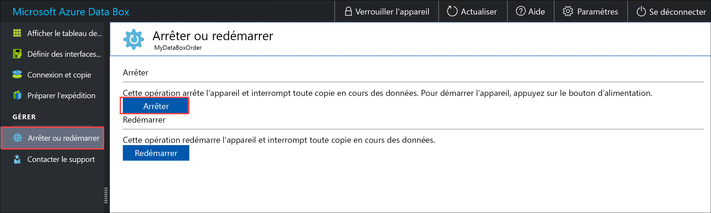

3. Lorsque vous êtes invité à confirmer l’opération, cliquez sur **OK** pour continuer.

    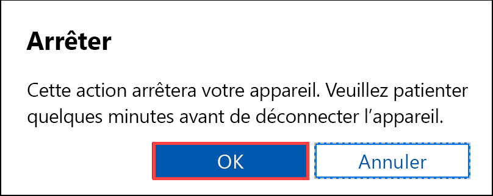

Une fois l’appareil arrêté, utilisez le bouton d’alimentation sur le panneau avant pour allumer l’appareil.

Pour redémarrer votre Data Box, suivez les étapes ci-dessous.

1. Dans l’interface utilisateur web locale, accédez à **Arrêter ou redémarrer**.
2. Cliquez sur **Restart (Redémarrer)** .

    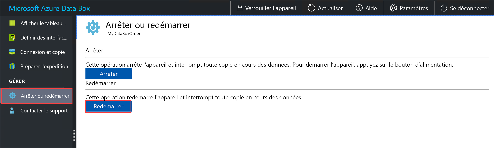

3. Lorsque vous êtes invité à confirmer l’opération, cliquez sur **OK** pour continuer.

   L’appareil s’arrête puis redémarre.

## <a name="download-bom-or-manifest-files"></a>Télécharger les fichiers manifeste ou de nomenclature

Les fichiers manifeste ou de nomenclature contiennent la liste des fichiers copiés dans Data Box ou Data Box Heavy. Ces fichiers sont générés pour un ordre d’importation quand vous préparez l’appareil pour l’expédition.

Avant de commencer, vérifiez que l’étape **Préparer l’expédition** est terminée pour votre appareil. Pour télécharger les fichiers manifeste ou de nomenclature pour votre ordre d’importation, effectuez les étapes suivantes :

1. Accédez à l’interface utilisateur web locale de votre appareil. Vous pouvez voir que la préparation de l’expédition est terminée pour l’appareil. Au terme de la préparation de l’appareil, son état passe à **Prêt pour l’expédition**.

    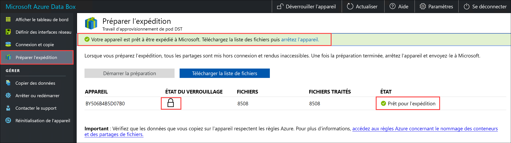

2. Cliquez sur **Télécharger la liste de fichiers** pour télécharger la liste des fichiers qui ont été copiés dans votre Data Box.

    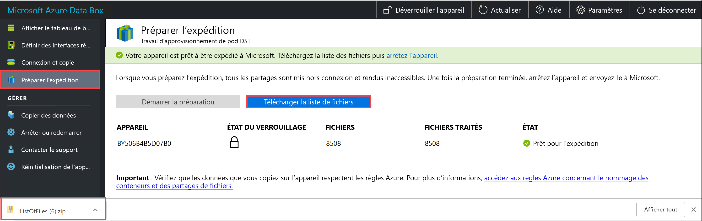

3. Dans l’Explorateur de fichiers, vous pouvez voir que des listes distinctes de fichiers sont générées en fonction du protocole utilisé pour se connecter à l’appareil et du type de stockage Azure utilisé.

    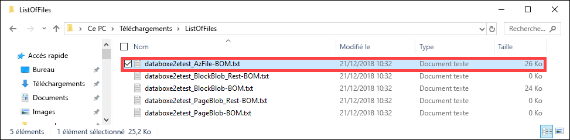

   Le tableau suivant mappe les noms de fichiers au type de stockage Azure et au protocole de connexion utilisés.

    |Nom de fichier  |Type de stockage Azure  |Protocole de connexion utilisé |
    |---------|---------|---------|
    |databoxe2etest_BlockBlob.txt     |Objets blob de blocs         |SMB/NFS         |
    |databoxe2etest_PageBlob.txt     |Objets blob de pages         |SMB/NFS         |
    |databoxe2etest_AzFile-BOM.txt    |Azure Files         |SMB/NFS         |
    |databoxe2etest_PageBlock_Rest-BOM.txt     |Objets blob de pages         |REST        |
    |databoxe2etest_BlockBlock_Rest-BOM.txt    |Objets blob de blocs         |REST         |
    |mydbmdrg1_MDisk-BOM.txt    |Disque managé         |SMB/NFS         |
    |mydbmdrg2_MDisk-BOM.txt     |Disque managé         |SMB/NFS         |

Utilisez cette liste pour vérifier les fichiers chargés dans le compte de stockage Azure une fois la Data Box renvoyée au centre de données Azure. Vous trouverez ci-dessous un exemple de fichier manifeste.

> [!NOTE]
> Sur un Data Box Heavy, deux ensembles de listes de fichiers (fichiers BOM) sont présents qui correspondent aux deux nœuds sur l’appareil.

```xml
<file size="52689" crc64="0x95a62e3f2095181e">\databox\media\data-box-deploy-copy-data\prepare-to-ship2.png</file>
<file size="22117" crc64="0x9b160c2c43ab6869">\databox\media\data-box-deploy-copy-data\connect-shares-file-explorer2.png</file>
<file size="57159" crc64="0x1caa82004e0053a4">\databox\media\data-box-deploy-copy-data\verify-used-space-dashboard.png</file>
<file size="24777" crc64="0x3e0db0cd1ad438e0">\databox\media\data-box-deploy-copy-data\prepare-to-ship5.png</file>
<file size="162006" crc64="0x9ceacb612ecb59d6">\databox\media\data-box-cable-options\cabling-dhcp-data-only.png</file>
<file size="155066" crc64="0x051a08d36980f5bc">\databox\media\data-box-cable-options\cabling-2-port-setup.png</file>
<file size="150399" crc64="0x66c5894ff328c0b1">\databox\media\data-box-cable-options\cabling-with-switch-static-ip.png</file>
<file size="158082" crc64="0xbd4b4c5103a783ea">\databox\media\data-box-cable-options\cabling-mgmt-only.png</file>
<file size="148456" crc64="0xa461ad24c8e4344a">\databox\media\data-box-cable-options\cabling-with-static-ip.png</file>
<file size="40417" crc64="0x637f59dd10d032b3">\databox\media\data-box-portal-admin\delete-order1.png</file>
<file size="33704" crc64="0x388546569ea9a29f">\databox\media\data-box-portal-admin\clone-order1.png</file>
<file size="5757" crc64="0x9979df75ee9be91e">\databox\media\data-box-safety\japan.png</file>
<file size="998" crc64="0xc10c5a1863c5f88f">\databox\media\data-box-safety\overload_tip_hazard_icon.png</file>
<file size="5870" crc64="0x4aec2377bb16136d">\databox\media\data-box-safety\south-korea.png</file>
<file size="16572" crc64="0x05b13500a1385a87">\databox\media\data-box-safety\taiwan.png</file>
<file size="999" crc64="0x3f3f1c5c596a4920">\databox\media\data-box-safety\warning_icon.png</file>
<file size="1054" crc64="0x24911140d7487311">\databox\media\data-box-safety\read_safety_and_health_information_icon.png</file>
<file size="1258" crc64="0xc00a2d5480f4fcec">\databox\media\data-box-safety\heavy_weight_hazard_icon.png</file>
<file size="1672" crc64="0x4ae5cfa67c0e895a">\databox\media\data-box-safety\no_user_serviceable_parts_icon.png</file>
<file size="3577" crc64="0x99e3d9df341b62eb">\databox\media\data-box-safety\battery_disposal_icon.png</file>
<file size="993" crc64="0x5a1a78a399840a17">\databox\media\data-box-safety\tip_hazard_icon.png</file>
<file size="1028" crc64="0xffe332400278f013">\databox\media\data-box-safety\electrical_shock_hazard_icon.png</file>
<file size="58699" crc64="0x2c411d5202c78a95">\databox\media\data-box-deploy-ordered\data-box-ordered.png</file>
<file size="46816" crc64="0x31e48aa9ca76bd05">\databox\media\data-box-deploy-ordered\search-azure-data-box1.png</file>
<file size="24160" crc64="0x978fc0c6e0c4c16d">\databox\media\data-box-deploy-ordered\select-data-box-option1.png</file>
<file size="115954" crc64="0x0b42449312086227">\databox\media\data-box-disk-deploy-copy-data\data-box-disk-validation-tool-output.png</file>
<file size="6093" crc64="0xadb61d0d7c6d4deb">\databox\data-box-cable-options.md</file>
<file size="6499" crc64="0x080add29add367d9">\databox\data-box-deploy-copy-data-via-nfs.md</file>
<file size="11089" crc64="0xc3ce6b13a4fe3001">\databox\data-box-deploy-copy-data-via-rest.md</file>
<file size="9126" crc64="0x820856b5a54321ad">\databox\data-box-overview.md</file>
<file size="10963" crc64="0x5e9a14f9f4784fd8">\databox\data-box-safety.md</file>
<file size="5941" crc64="0x8631d62fbc038760">\databox\data-box-security.md</file>
<file size="12536" crc64="0x8c8ff93e73d665ec">\databox\data-box-system-requirements-rest.md</file>
<file size="3220" crc64="0x7257a263c434839a">\databox\data-box-system-requirements.md</file>
<file size="2823" crc64="0x63db1ada6fcdc672">\databox\index.yml</file>
<file size="4364" crc64="0x62b5710f58f00b8b">\databox\data-box-local-web-ui-admin.md</file>
<file size="3603" crc64="0x7e34c25d5606693f">\databox\TOC.yml</file>
```

Ce fichier contient la liste de tous les fichiers copiés sur l’appareil Data Box ou Data Box Heavy. Dans ce fichier, la valeur *crc64* est liée à la somme de contrôle générée pour le fichier correspondant.

## <a name="view-available-capacity-of-the-device"></a>Afficher la capacité disponible sur l’appareil

Vous pouvez utiliser le tableau de bord de l’appareil pour afficher la capacité disponible et la capacité utilisée de l’appareil.

1. Dans l’interface utilisateur web locale, accédez à **Afficher le tableau de bord**.
2. La fenêtre **Connexion et copie** affiche l’espace libre et l’espace utilisé sur l’appareil.

    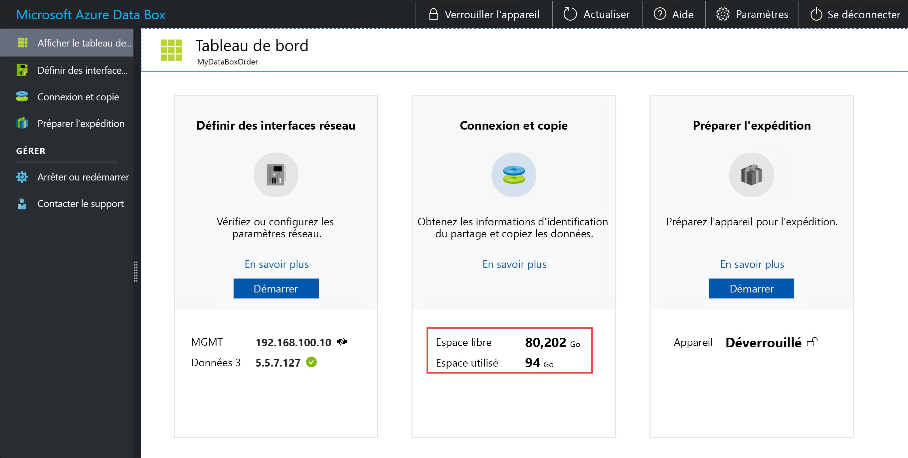

## <a name="skip-checksum-validation"></a>Ignorer la validation de la somme de contrôle

Par défaut, des sommes de contrôle sont générées pour vos données quand vous préparez l’expédition. Dans de rares cas, selon le type de données (fichiers de petite taille), les performances peuvent diminuer. Dans ces cas, vous pouvez ignorer la somme de contrôle.

Le calcul de la somme de contrôle pendant la préparation de l’expédition est effectué uniquement pour les commandes d’importation, et non pour les ordres d’exportation. 

Nous vous recommandons vivement de ne pas désactiver la somme de contrôle, sauf si les performances sont fortement affectées.

1. En haut à droite de l’interface utilisateur web locale de votre appareil, accédez à **Paramètres**.

    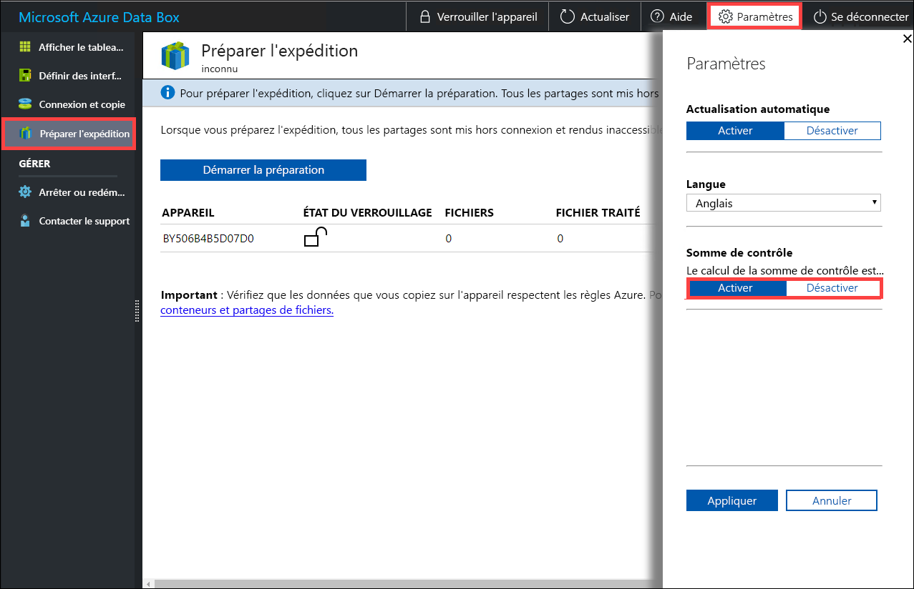

2. **Désactiver** la validation de la somme de contrôle
3. Cliquez sur **Appliquer**.

> [!NOTE]
> L’option de calcul ignorer la somme de contrôle n’est disponible que lorsque Azure Data Box est déverrouillé. Vous ne verrez pas cette option lorsque l’appareil est verrouillé.

- Découvrez comment [gérer Data Box et Data Box Heavy via le portail Azure](data-box-portal-admin.md).

