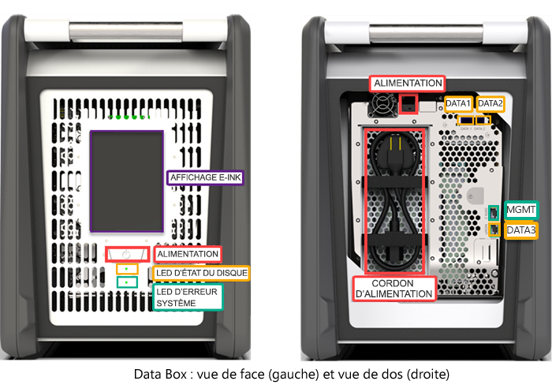
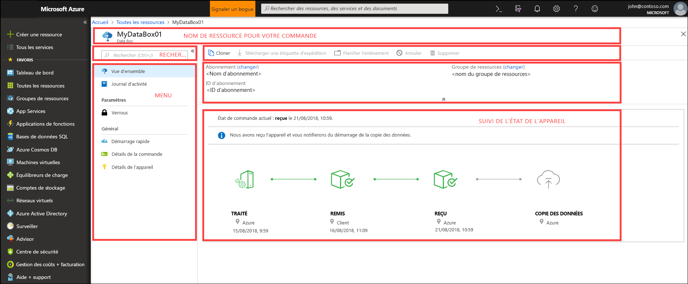
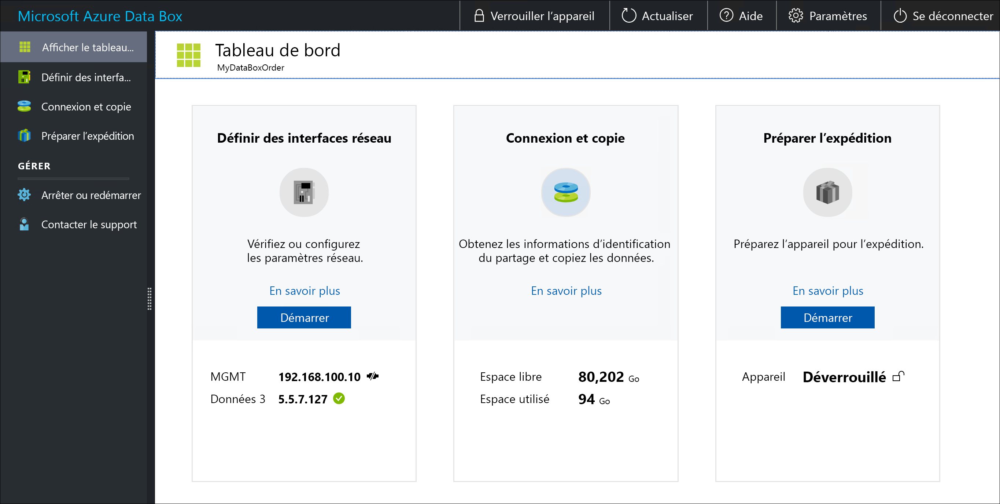

# Qu’est-ce qu’Azure Data Box ?

La solution cloud Microsoft Azure Data Box permet d’envoyer plusieurs téraoctets de données vers Azure de façon rapide, économique et fiable. Le transfert de données sécurisé est accéléré par l’envoi à votre adresse d’un appareil de stockage Data Box propriétaire. Chaque appareil de stockage dispose d’une capacité de stockage maximum utile de 80 To, et est acheminé vers votre centre de données via un transporteur régional. L’appareil dispose d’un caisson robuste afin de protéger et de sécuriser les données au cours du transport.

Vous pouvez commander l’appareil Data Box via le portail Azure. Une fois l’appareil reçu, vous pouvez rapidement le configurer à l’aide de l’interface utilisateur web locale. Copiez les données à partir de vos serveurs vers l’appareil et réexpédiez l’appareil à Azure. Dans le centre de données Azure, vos données sont automatiquement chargées de l’appareil vers Azure. L’ensemble du processus est suivi de bout en bout par le service Data Box dans le portail Azure.

## Cas d'utilisation

Data Box est parfaitement adapté au transfert de tailles de données supérieures à 40 To dans les scénarios où la connectivité réseau est limitée ou nulle. Il peut s’agir d’un déplacement de données à usage unique, périodique, ou d’un transfert de données en bloc initial suivi de transferts périodiques. Voici les différents scénarios où le service Data Box peut être utilisé pour le transfert de données.

 - **Migration unique** - lorsque de grandes quantités de données locales sont transférées vers Azure. 
     - Déplacement d’une bibliothèque multimédia à partir de bandes hors connexion dans Azure pour créer une bibliothèque multimédia en ligne.
     - Migration de votre batterie de machines virtuelles, de SQL Server et d’applications vers Azure
     - Déplacement des données historiques vers Azure pour une analyse et un compte rendu approfondis à l’aide de HDInsight

 - **Transfert en bloc initial** : lorsqu’un transfert en bloc initial est effectué à l’aide de Data Box (seed) suivi de transferts incrémentiels sur le réseau. 
     - Par exemple, les partenaires de solutions de sauvegarde tels que Commvault et Data Box sont utilisés pour déplacer d’importantes sauvegardes initiales de données historiques vers Azure. Une fois l’opération terminée, les données incrémentielles sont transférées via le réseau vers le stockage Azure.

- **Chargements périodiques** - lorsqu’une grande quantité de données est générée régulièrement et doit être déplacée vers Azure. Par exemple, dans le secteur de la production d’énergie, où du contenu vidéo est généré sur des plateformes pétrolières et dans des parcs éoliens.      

## Avantages

Data Box est conçu pour déplacer de grandes quantités de données vers Azure avec peu ou aucun impact sur le réseau. La solution offre les avantages suivants :

- **Vitesse** : Data Box utilise des interfaces réseau 1 Gbit/s ou 10 Gbit/s pour déplacer jusqu'à 80 To de données vers Azure.

- **Sécurité** : Data Box intègre des protections de sécurité pour l’appareil, les données et le service.
  - L’appareil est fourni dans une caisse robuste sécurisée par des vis et des autocollants inviolables. 
  - Les données sur l’appareil sont sécurisées en permanence à l’aide d’un chiffrement AES 256 bits.
  - L’appareil peut uniquement être déverrouillé à l’aide d’un mot de passe fourni dans le portail Azure.
  - Le service est protégé par les fonctionnalités de sécurité Azure.
  - Une fois que vos données sont chargées dans Azure, les disques sur l’appareil sont nettoyés, conformément aux normes NIST 800-88r1.
    
    Pour plus d’informations, accédez à [Azure Data Box security and data protection](data-box-security.md) (Protection des données et sécurité Azure Data Box).

## Fonctionnalités et spécifications

Dans cette version, l’appareil Data Box affiche les caractéristiques suivantes.

| Spécifications                                          | Description              |
|---------------------------------------------------------|--------------------------|
| Poids                                                  | < 50 lbs.                |
| Dimensions                                              | Appareil : Largeur : 309 mm Hauteur : 430,4 mm Profondeur : 502 mm |            
| Espace en rack                                              | 7 U lorsque l’appareil est placé sur le côté dans le rack (ne peut pas être monté en rack)|
| Câbles requis                                         | 1 câble d’alimentation (inclus)   2 câbles RJ45   2 câbles en cuivre Twinax SFP+|
| Capacité de stockage                                        | L’appareil de 100 To dispose d’une capacité utile de 80 To après protection RAID 5|
| Puissance nominale                                            | Le bloc d’alimentation est évalué à 700 W.   En règle générale, il consomme 375 W.|
| Interfaces réseau                                      | 2 interfaces 1 GbE : MGMT, DATA 3.   MGMT : pour la gestion, non configurable par l’utilisateur, utilisée pour l’installation initiale   DATA 3 : pour les données, configurable par l’utilisateur, dynamique par défaut   MGMT et DATA 3 peuvent également fonctionner en tant qu’interface 10 GbE   2 interfaces 10 GbE : DATA 1, DATA 2   Ces deux interfaces sont dédiées aux données et peuvent être configurées en mode dynamique (par défaut) ou statique |
| Support de transfert des données                                     | RJ45, SFP+ en cuivre 10 GbE Ethernet  |
| Sécurité                                                | Boîtier robuste avec vis personnalisées indévissables   Autocollants inviolables placés au bas de l’appareil|
| Vitesse de transfert de données                                      | Jusqu’à 80 To par jour via une interface réseau 10 GbE        |
| Gestion                                              | Interface utilisateur web locale : installation et configuration initiales en une seule étape   Portail Azure : gestion quotidienne des appareils        |

## Composants Data Box

La Data Box inclut les composants suivants :

* **Appareil Data Box** : un appareil physique qui offre un stockage principal, gère la communication avec le stockage cloud et contribue à garantir la sécurité et la confidentialité de toutes les données stockées sur l’appareil. L’appareil Data Box a une capacité de stockage utile de 80 To. 

    

    
* **Service Data Box** : extension du portail Azure, qui vous permet de gérer un appareil Data Box à partir d’une interface web accessible depuis divers emplacements géographiques. Utilisez le service Data Box pour effectuer l’administration quotidienne de votre appareil Data Box. Les tâches de service incluent la création et la gestion de commandes, l’affichage et la gestion des alertes ainsi que la gestion des partages.  

    

    Pour plus d’informations, consultez [Utiliser le service Data Box pour gérer votre appareil Data Box](data-box-portal-ui-admin.md).

* **Interface utilisateur web locale** : interface utilisateur web qui est utilisée pour configurer l’appareil afin qu’il puisse se connecter au réseau local, puis pour inscrire l’appareil auprès du service Data Box. Utilisez l’interface utilisateur web locale pour arrêter et redémarrer l’appareil Data Box, afficher les journaux d’activité de copie et contactez le Support Microsoft pour créer une demande de service.

    

    Pour plus d’informations sur l’utilisation de l’interface utilisateur basée sur le web, voir [Utiliser l’interface utilisateur basée sur le web pour gérer votre Data Box](data-box-portal-ui-admin.md).

## Workflow

Un flux type inclut les étapes suivantes :

1. **Commande** - Créez une commande dans le portail Azure et indiquez les informations d’expédition et le compte de stockage de destination Azure de vos données. Si l’appareil est disponible, Azure le prépare et l’expédie avec un ID de suivi d’expédition.

2. **Réception** : une fois l’appareil livré, connectez-le au réseau et à l’alimentation à l’aide des câbles spécifiés. Mettez l’appareil sous tension et connectez-vous à l’appareil. Configurez le réseau de l’appareil et montez les partages sur l’ordinateur hôte à l’emplacement à partir duquel vous souhaitez copier les données.

3. **Copie des données** : copiez les données vers les partages Data Box.

4. **Retour** : préparez l’appareil, mettez-le hors tension et retournez l’appareil au centre de données Azure.

5. **Chargement** : les données sont automatiquement copiées de l’appareil vers Azure. Les disques de l’appareil sont effacés en toute sécurité conformément aux instructions du National Institute of Standards and Technology (NIST).

Tout au long de ce processus, vous êtes averti par courrier électronique de toutes les modifications d’état. Pour plus d’informations sur le flux détaillé, accédez à [Deploy Data Box in Azure portal](data-box-deploy-ordered.md) (Déployer Data Box dans le portail Azure).

## Disponibilité des régions

Data Box peut transférer des données en fonction de la région dans laquelle le service est déployé, du pays/de la région où l’appareil est livré et du compte de stockage Azure cible vers lequel vous transférez les données. 

- **Disponibilité du service** - Pour plus d’informations sur la disponibilité régionale, accédez à [Disponibilité des produits Azure par région](https://azure.microsoft.com/global-infrastructure/services/?products=databox&regions=all). Vous pouvez aussi déployer Data Box Disk dans le cloud Azure Government. Pour plus d’informations, consultez [Présentation d’Azure Government](https://docs.microsoft.com/azure/azure-government/documentation-government-welcome).

- **Comptes de stockage de destination** : les comptes de stockage qui stockent les données sont disponibles dans toutes les régions Azure où le service est disponible.  

## Étapes suivantes

- Relire les [Conditions requises pour le système Data Box](data-box-system-requirements.md).
- Comprendre les limites de [Data Box](data-box-limits.md).
- Déployez rapidement [Azure Data Box](data-box-quickstart-portal.md) sur le portail Azure.

