# <a name="use-the-azure-portal-to-administer-your-data-box"></a>Utiliser le portail Azure pour administrer votre Data Box

Cet article décrit certains des flux de travail et tâches de gestion complexes qui peuvent être effectués sur la Data Box. Vous pouvez gérer la Data Box via le portail Azure ou via l’interface utilisateur web locale. 

Cet article se concentre sur les tâches que vous pouvez effectuer à l’aide du portail Azure. Utilisez le portail Azure pour gérer les commandes et Data Box, et suivre l’état des commandes jusqu’à l’étape terminale.


## <a name="cancel-an-order"></a>Annuler une commande

Il peut vous arriver de devoir annuler, pour diverses raisons, une commande que vous avez passée. Vous pouvez uniquement annuler la commande tant qu’elle n’a pas été traitée. Une fois la commande traitée et la Data Box préparée, il n’est plus possible d’annuler la commande. 

Pour annuler une commande, procédez comme suit.

1.  Accédez à **Vue d’ensemble > Annuler**. 

    

2.  Indiquez un motif d’annulation de la commande.  

    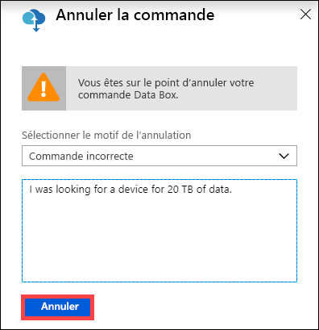

3.  Une fois que la commande est annulée, le portail met à jour l’état de la commande et l’affiche en tant que **Annulée**. 

## <a name="clone-an-order"></a>Cloner une commande

Le clonage est utile dans certaines situations. Par exemple, un utilisateur a utilisé Data Box pour transférer des données. À mesure qu’il génère de nouvelles données, il a besoin d’une autre Data Box pour transférer ces données vers Azure. Dans ce cas, la commande initiale peut simplement être clonée.

Effectuez les opérations suivantes pour cloner une commande.

1.  Accédez à **Vue d’ensemble > Cloner**. 

    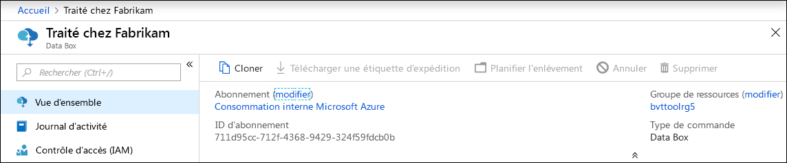

2.  Tous les détails de la commande restent inchangés. Le nom de la commande est le nom de la commande d’origine, suivi de *-Clone*. Cochez la case pour confirmer que vous avez lu les informations sur la confidentialité des données. Cliquez sur **Créer**.

Le clone est créé en quelques minutes et le portail est actualisé pour afficher la nouvelle commande.


## <a name="delete-order"></a>Supprimer une commande

Il peut arriver que vous souhaitiez supprimer une commande lorsque celle-ci est terminée. La commande contient vos données personnelles telles que votre nom, votre adresse et vos informations de contact. Ces informations personnelles sont supprimées en même temps que la commande.

Vous pouvez uniquement supprimer des commandes qui sont terminées ou annulées. Pour supprimer une commande, procédez comme suit.

1. Sélectionnez **Toutes les ressources**. Recherchez votre commande.

2. Cliquez sur la commande que vous souhaitez supprimer et accédez à **Vue d’ensemble**. Dans la barre de commandes, cliquez sur **Supprimer**.

    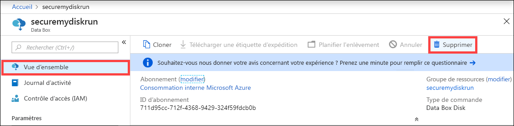

3. Entrez le nom de la commande lorsque vous êtes invité à confirmer la suppression de la commande. Cliquez sur **Supprimer**.

## <a name="download-shipping-label"></a>Télécharger une étiquette d’expédition

Vous devrez peut-être télécharger l’étiquette d’expédition si l’écran E-ink de votre Data Box ne fonctionne pas et n’affiche pas l’étiquette de retour. 

Procédez comme suit pour télécharger une étiquette d’expédition.

1.  Accédez à **Vue d’ensemble > Télécharger une étiquette d’expédition**. Cette option est disponible uniquement une fois que l’appareil a été expédié. 

    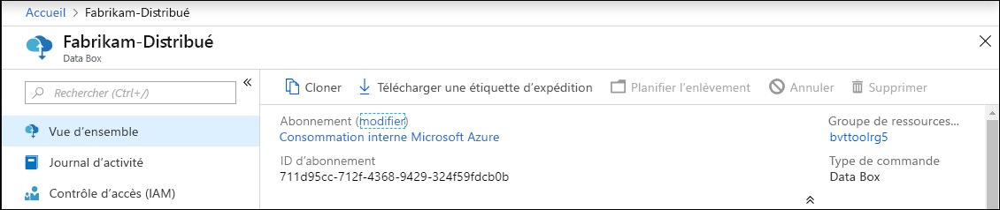

2.  L’étiquette de retour suivante est alors téléchargée. Enregistrez puis imprimez l’étiquette. Pliez et insérez l’étiquette dans la pochette transparente accolée à l’appareil. Vérifiez que l’étiquette est visible. Retirez les éventuels autocollants qui ont été accolés à l’appareil lors de la précédente expédition.

    

## <a name="edit-shipping-address"></a>Modifier l’adresse de livraison

Il peut arriver que vous deviez modifier l’adresse de livraison une fois la commande passée. Cela est possible uniquement avant l’envoi de l’appareil. Une fois l’appareil expédié, vous ne pouvez plus modifier l’adresse de livraison.

Pour modifier la commande, procédez comme suit.

1. Accédez à **Détails de la commande > Modifier l’adresse de livraison**.

    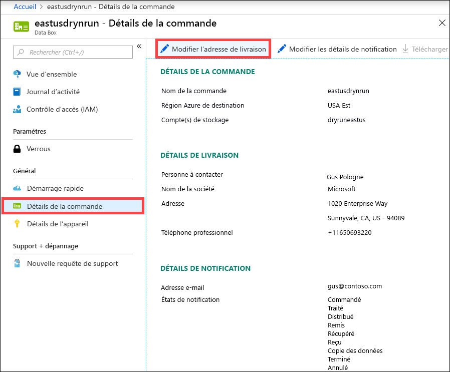

2. Modifiez et validez l’adresse de livraison, puis enregistrez les modifications.

    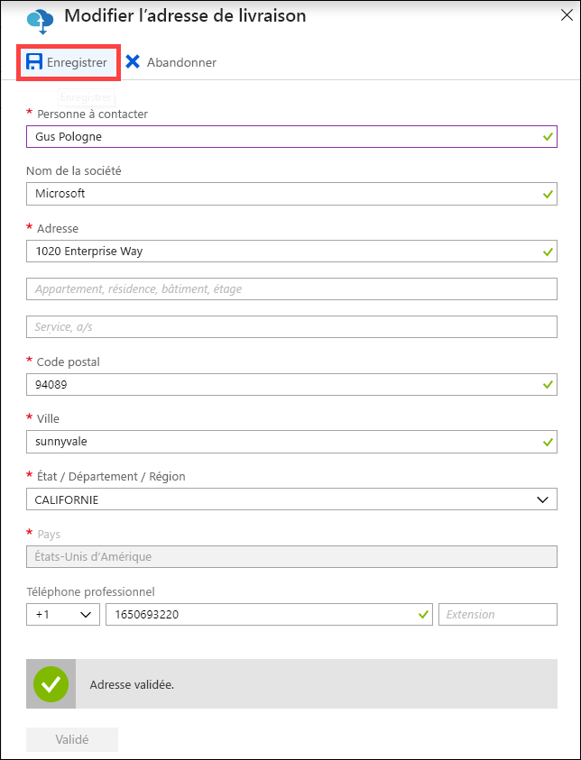

## <a name="edit-notification-details"></a>Modifier les détails de notification

Vous devrez peut-être modifier les utilisateurs qui recevront les e-mails indiquant l’état de la commande. Par exemple, un utilisateur doit être informé dès que l’appareil est livré ou récupéré. Un autre utilisateur doit quant à lui être informé lorsque la copie des données est terminée afin qu’il puisse vérifier que les données se trouvent bien dans le compte de stockage Azure avant de les supprimer de la source. Dans ce cas, vous pouvez modifier les détails de notification.

Pour modifier les détails de modification, procédez comme suit.

1. Accédez à **Détails de la commande > Modifier les détails de notification**.

    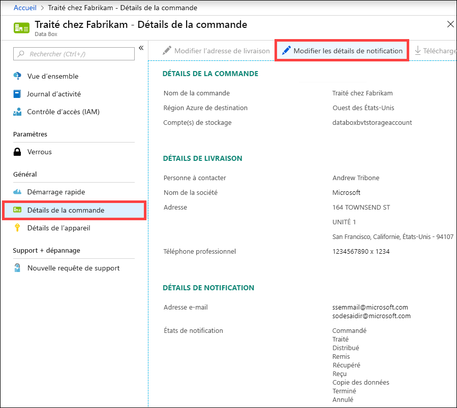

2. Vous pouvez maintenant modifier les détails de notification et enregistrer les modifications.
 
    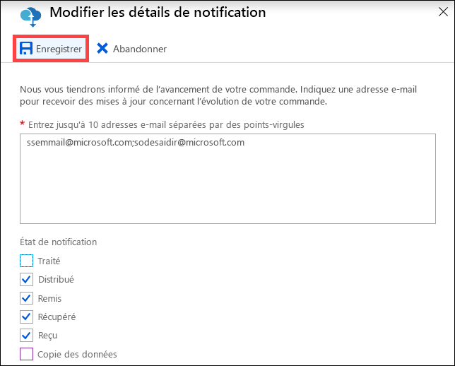


## <a name="download-order-history"></a>Télécharger l’historique des commandes

Une fois que la commande Data Box est terminée, les données sur les disques de l’appareil sont effacées. Lorsque le nettoyage de l’appareil est terminé, vous pouvez télécharger l’historique des commandes dans le portail Azure.

Procédez comme suit pour télécharger l’historique des commandes.

1. Dans votre commande Data Box, accédez à **Vue d’ensemble**. Vérifiez que la commande est terminée. Si la commande est terminée ainsi que le nettoyage de l’appareil, accédez à **Order details** (Détails de la commande). L’option **Download order history** (Télécharger l’historique des commandes) est disponible.

    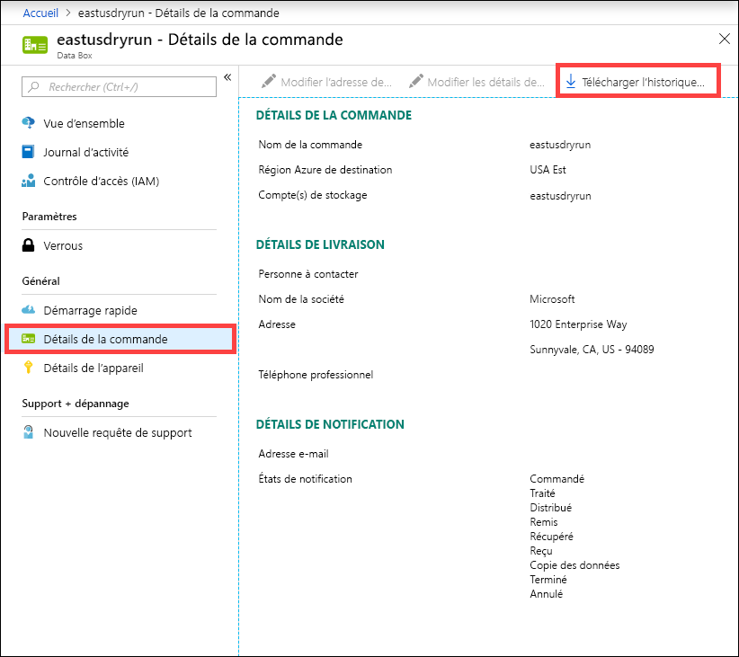

2. Cliquez sur **Télécharger l’historique des commandes**. Dans l’historique téléchargé, vous verrez un enregistrement des journaux d’activité de suivi de l’opérateur. Si vous faites défiler jusqu’en bas de ce journal, vous pouvez voir des liens vers :
    
   - **Copier les journaux** - affiche la liste des fichiers en erreur pendant la copie des données entre la zone de données et votre compte de stockage Azure.
   - **Journaux d’audit** - contiennent des informations sur la mise sous tension et l’accès au partage sur la Data Box lorsqu’elle est hors du centre de données Azure.
   - **Fichiers de nomenclature** - obtenez la liste des fichiers (également connue sous le nom de manifeste de fichier) que vous pouvez télécharger pendant **Préparer l’expédition** et qui comporte les noms, les tailles et les sommes de contrôle des fichiers.

       ```
       -------------------------------
       Microsoft Data Box Order Report
       -------------------------------
        
       Name                                               : eastusdryrun                                      
       StartTime(UTC)                                     : 9/6/2018 12:54:47 PM +00:00                       
       DeviceType                                         : ImolaPod                                          
        
       -------------------
       Data Box Activities
       -------------------
        
       Time(UTC)             | Activity                       | Status          | Description                                                                                                                                           
        
       9/6/2018 12:54:51 PM  | OrderCreated         | Completed  |                                                                                                                              
       9/11/2018 8:57:38 PM  | DevicePrepared       | Completed  |                                                                                                                                                       
       9/12/2018 7:28:15 PM  | ShippingToCustomer   | InProgress | Pickup Scan. Local Time : 9/12/2018 2:52:31 PM at Chantilly                                                                                           
       9/13/2018 2:33:04 AM  | ShippingToCustomer   | InProgress | Departure Scan. Local Time : 9/12/2018 9:00:00 PM at Chantilly                                                                                                                                                                                                                                                              
       9/13/2018 12:40:31 PM | ShippingToCustomer   | InProgress | Arrival Scan. Local Time : 9/13/2018 5:00:00 AM at Oakland                                                                                            
       9/13/2018 2:42:10 PM  | ShippingToCustomer   | InProgress | Departure Scan. Local Time : 9/13/2018 6:08:00 AM at Oakland                                                                                          
       9/13/2018 3:42:12 PM  | ShippingToCustomer   | InProgress | Destination Scan. Local Time : 9/13/2018 8:14:08 AM at Sunnyvale                                                                                      
       9/13/2018 4:43:05 PM  | ShippingToCustomer   | InProgress | Destination Scan. Local Time : 9/13/2018 8:56:54 AM at Sunnyvale                                                                                      
       9/13/2018 4:43:05 PM  | ShippingToCustomer   | InProgress | Out For Delivery Today. Local Time : 9/13/2018 9:11:21 AM at Sunnyvale                                                                                
       9/13/2018 5:43:07 PM  | ShippingToCustomer   | Completed  | Delivered. Local Time : 9/13/2018 9:44:17 AM at SUNNYVALE                                                                                             
       9/14/2018 11:48:35 PM | ShippingToDataCenter | InProgress | Pickup Scan. Local Time : 9/14/2018 3:55:37 PM at Sunnyvale                                                                                                                                                                                 
       9/15/2018 1:52:35 AM  | ShippingToDataCenter | InProgress | Arrival Scan. Local Time : 9/14/2018 6:31:00 PM at San Jose                                                                                           
       9/15/2018 2:52:39 AM  | ShippingToDataCenter | InProgress | Departure Scan. Local Time : 9/14/2018 7:17:00 PM at San Jose                                                                                                                                                                             
       9/17/2018 8:23:31 AM  | ShippingToDataCenter | InProgress | Destination Scan. Local Time : 9/17/2018 4:14:37 AM at Chantilly                                                                                      
       9/17/2018 12:24:42 PM | ShippingToDataCenter | InProgress | Loaded on Delivery Vehicle. Local Time : 9/17/2018 7:45:36 AM at Chantilly                                                                            
       9/17/2018 1:25:11 PM  | ShippingToDataCenter | InProgress | Out For Delivery Today. Local Time : 9/17/2018 8:27:11 AM at Chantilly                                                                                
       9/17/2018 2:25:51 PM  | ShippingToDataCenter | Completed | Delivered. Local Time : 9/17/2018 9:56:32 AM at STERLING                                                                                              
       9/18/2018 9:55:41 PM  | DeviceBoot           | Completed | Appliance booted up successfully                                                                                                                      
       9/18/2018 11:00:25 PM | DataCopy             | Started   |                                                                                                                                                       
       9/18/2018 11:01:33 PM | DataCopy             | Completed | Copy Completed.                                                                                                                                       
       9/18/2018 11:20:58 PM | SecureErase          | Started   |                                                                                                                                                       
       9/18/2018 11:28:46 PM | SecureErase          | Completed | Azure Data Box:BY506B4B616700 has been sanitized according to NIST 800 -88 Rev 1.                                                                     
        
       ----------------------
       Data Box Job Log Links
       ----------------------
        
       Account Name         : eastusdryrun                                         
       Copy Logs Path       : copylog/copylogd695869a2a294396b7b903296c208388.xml                                                                                                                                                     
       Audit Logs Path      : azuredatabox-chainofcustodylogs\3b4cf163-f1af-475c-a391-f8afea3fa327\by506b4b616700                                                                                                                     
       BOM Files Path       : azuredatabox-chainofcustodylogs\3b4cf163-f1af-475c-a391-f8afea3fa327\by506b4b616700
       ```
     Vous pouvez ensuite accéder à votre compte de stockage, puis afficher les journaux d’activité de copie.

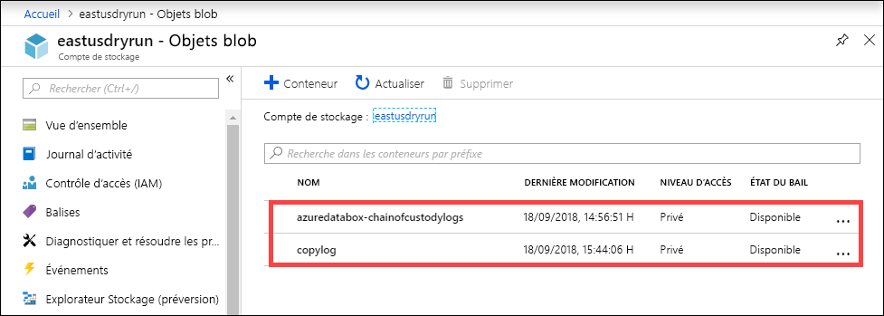

Vous pouvez également afficher les journaux d’activité de chaîne de responsabilité qui incluent les journaux d’audit et les fichiers de nomenclature.

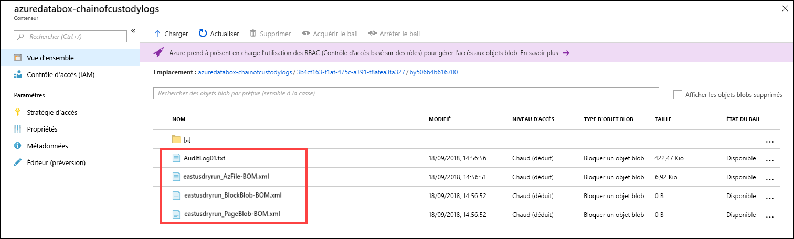

## <a name="view-order-status"></a>Afficher l’état de la commande

Vous êtes informé par courrier électronique dès que l’état de l’appareil change dans le portail.

|État de la commande |Description |
|---------|---------|
|Ordered (Validée)     | La commande a été validée. <br>Si l’appareil est disponible, Microsoft identifie l’appareil à expédier et le prépare. <br> Si l’appareil n’est pas disponible immédiatement, la commande sera traitée lorsque l’appareil devient disponible. Le traitement de la commande peut prendre quelques jours à deux mois. Si elle ne peut pas être traitée sous 90 jours, la commande est annulée et vous en êtes informé.         |
|Processed (Traitée)     | La commande a été traitée. Conformément à votre commande, l’appareil est prêt pour expédition dans le centre de données.         |
|Dispatched (Distribuée)     | La commande a été expédiée. Utilisez l’ID de suivi affiché sur votre commande dans le portail pour effectuer le suivi de l’expédition.        |
|Delivered (Livrée)     | Le colis a été livré à l’adresse spécifiée dans la commande.        |
|Picked up (Récupérée)     |Le colis de retour a été récupéré et scanné par le transporteur.         |
|Reçu     | Votre appareil a été reçu et scanné au centre de données Azure. <br> Une fois le colis inspecté, le téléchargement de l’appareil commencera.      |
|Copie de données     | La copie des données est en cours. Suivez la progression de la copie de votre commande sur le portail Azure. <br> Attendez que la copie des données se termine. |
|Completed       |La commande a été terminée avec succès.<br> Vérifiez que vos données se trouvent bien dans Azure avant de supprimer les données locales des serveurs.         |
|Completed with errors (Terminée avec des erreurs)| La copie des données a été effectuée mais des erreurs se sont produites pendant l’opération. <br> Consultez les journaux d’activité de copie en utilisant le chemin d’accès spécifié dans le portail Azure.   |
|Canceled            |La commande a été annulée. <br> Soit vous avez annulé la commande, soit une erreur s’est produite et le service a annulé la commande. Si elle ne peut pas être traitée sous 90 jours, la commande est également annulée et vous en êtes informé.     |
|Nettoyer | Les données sur les disques de l’appareil sont effacées. Le nettoyage de l’appareil est considéré comme terminé lorsque l’historique de la commande est disponible au téléchargement dans le portail Azure.|


## <a name="next-steps"></a>Étapes suivantes

- Découvrez comment [résoudre les problèmes relatifs à Data Box](data-box-faq.md).
