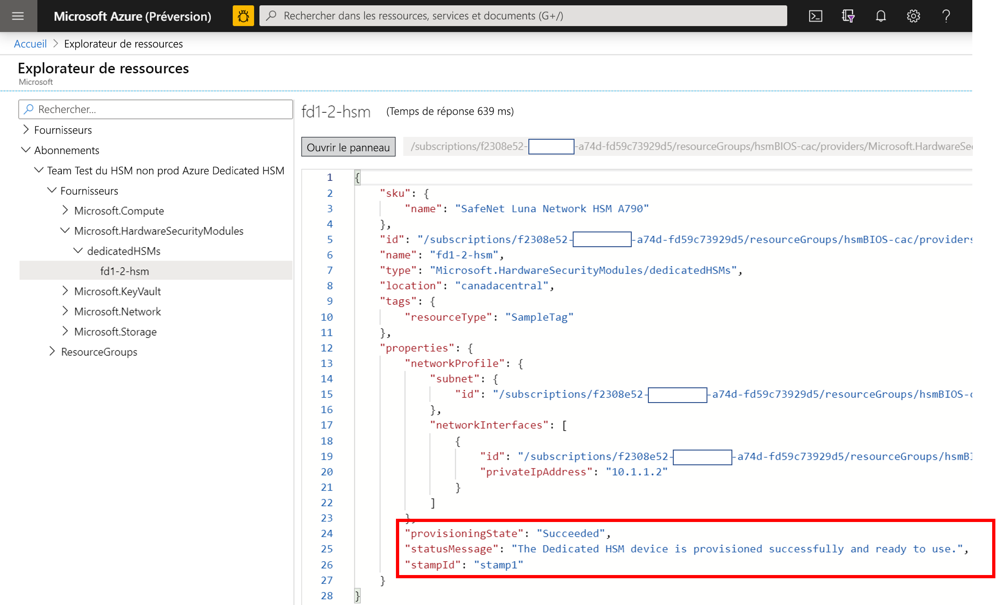
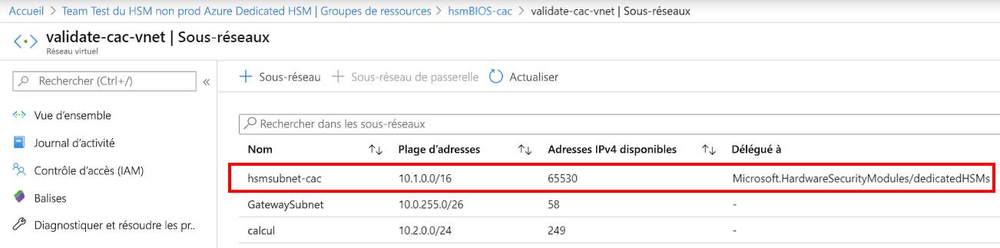
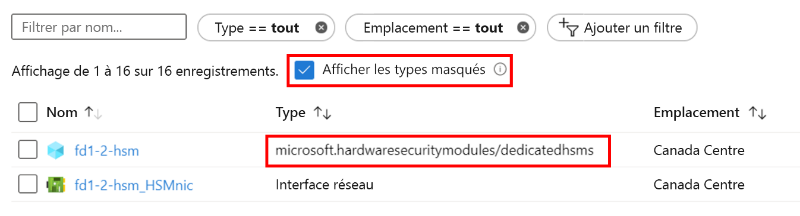

# <a name="troubleshooting-the-azure-dedicated-hsm-service"></a>Résolution des problèmes du service Azure Dedicated HSM

Le service Azure Dedicated HSM remplit deux fonctions distinctes : d’une part, l’inscription et le déploiement dans Azure des appareils HSM avec leurs composants réseau sous-jacents et, d’autre part, la configuration des appareils HSM en vue de leur utilisation/intégration avec une charge de travail ou une application donnée. Bien que les appareils HSM Thales Luna Network dans Azure soient les mêmes que ceux que vous pouvez acheter directement auprès de Thales, le fait qu’ils constituent une ressource dans Azure crée des considérations uniques. Ces considérations ainsi que les bonnes pratiques et insights en matière de dépannage sont documentés ici pour garantir la bonne visibilité des informations critiques et l’accès à celles-ci. Une fois le service en place, des informations définitives sont disponibles par le biais de demandes de support adressées directement à Microsoft ou à Thales. 

> [!NOTE]
> Il convient de noter qu’avant d’effectuer toute configuration sur un appareil HSM nouvellement déployé, vous devez le mettre à jour avec les correctifs appropriés. [KB0019789](https://supportportal.gemalto.com/csm?id=kb_article_view&sys_kb_id=19a81c8bdb9a1fc8d298728dae96197d&sysparm_article=KB0019789) est un correctif obligatoire disponible sur le portail de support Thales qui permet de résoudre un problème qui empêche le système de répondre pendant le redémarrage.

## <a name="hsm-registration"></a>Inscription auprès de HSM

Dedicated HSM n’est pas disponible gratuitement, car il fournit des ressources matérielles dans le cloud et constitue donc une ressource précieuse qui doit être protégée. Nous utilisons donc un processus de mise en liste verte par le biais de l’adresse e-mail HSMrequest@microsoft.com. 

### <a name="getting-access-to-dedicated-hsm"></a>Accès à Dedicated HSM

Si vous pensez que Dedicated HSM répond à vos besoins de stockage de clés, envoyez un e-mail à HSMrequest@microsoft.com pour demander à pouvoir y accéder. Décrivez votre application, les régions dans lesquelles vous souhaitez utiliser des HSM et le volume de HSM qui vous intéresse. Si vous travaillez avec un représentant Microsoft comme un responsable de compte ou un architecte de solutions cloud, pensez à l’inclure dans toute demande.

## <a name="hsm-provisioning"></a>Provisionnement de HSM

Vous pouvez provisionner un appareil HSM dans Azure par le biais de l’interface CLI ou de PowerShell. Au moment de l’inscription au service, vous recevez un exemple de modèle Resource Manager et de l’aide pour effectuer la personnalisation initiale. 

### <a name="hsm-deployment-failure-information"></a>Informations sur l’échec du déploiement HSM

Dedicated HSM prend en charge l’interface CLI et PowerShell pour le déploiement. Les informations en rapport aux erreurs basées sur le portail sont donc limitées et ne sont pas détaillées. Vous trouverez des informations plus détaillées dans l’Explorateur de ressources. La page d’accueil du portail propose une icône à cette fin ainsi que des informations d’erreur plus détaillées. Vous pouvez notamment les coller dans une demande de support relative à des problèmes de déploiement.



### <a name="hsm-subnet-delegation"></a>Délégation de sous-réseau HSM
La principale cause de l’échec d’un déploiement est l’oubli de définir la délégation appropriée pour le sous-réseau défini par le client sur lequel les HSM seront provisionnés. La définition de cette délégation fait partie des prérequis pour le déploiement des réseaux virtuels et des sous-réseaux. Vous trouverez plus de détails à ce sujet dans les tutoriels.



### <a name="hsm-deployment-race-condition"></a>Condition de concurrence d’un déploiement HSM

Le modèle Resource Manager standard fourni pour le déploiement comprend des ressources liées aux passerelles HSM et ExpressRoute. Les ressources réseau constituent une dépendance pour un déploiement HSM réussi, et le timing peut être crucial.  Il arrive parfois que des problèmes de dépendance aboutissent à des échecs de déploiement. La réexécution du déploiement permet souvent de résoudre souvent le problème. Si ce n’est pas le cas, vous pouvez souvent parvenir à vos fins en supprimant des ressources et en réexécutant le déploiement. Si le problème persiste après ces tentatives de résolution, créez une demande de support dans le portail Azure et sélectionnez « Problèmes de configuration de l’installation d’Azure » comme type de problème.

### <a name="hsm-deployment-using-terraform"></a>Déploiement de HSM avec Terraform

Quelques clients ont utilisé Terraform comme environnement d’automatisation à la place des modèles Resource Manager fournis lors de l’inscription à ce service. Contrairement aux ressources réseau dépendantes, les HSM ne peuvent pas être déployés de cette façon. Terraform a un module permettant d’appeler un modèle Resource Manager minimal comprenant uniquement le déploiement HSM.  Dans ce cas, veillez à ce que les ressources réseau telles que la passerelle ExpressRoute obligatoire soient entièrement déployées avant de déployer les HSM. Vous pouvez utiliser la commande CLI suivante pour tester le déploiement terminé et l’intégrer selon les besoins. Remplacez les espaces réservés entre crochets par vos noms spécifiques. Vous devriez obtenir « provisioningState is Succeeded ».

```azurecli
az resource show --ids /subscriptions/<subid>/resourceGroups/<myresourcegroup>/providers/Microsoft.Network/virtualNetworkGateways/<myergateway>
```

### <a name="deployment-failure-based-on-quota"></a>Échec de déploiement basé sur le quota
Les déploiements peuvent échouer si vous dépassez 2 HSM par tampon et 4 HSM par région. Pour éviter cela, veillez à supprimer les ressources des déploiements ayant précédemment échoué avant de procéder à un nouveau déploiement. Consultez « Comment voir les HSM » ci-dessous pour vérifier les ressources. Si vous pensez que vous devez dépasser ce quota, qui est en fait un dispositif de protection, envoyez un e-mail détaillé à HSMrequest@microsoft.com.

### <a name="deployment-failure-based-on-capacity"></a>Échec de déploiement basé sur la capacité
Quand un tampon ou une région spécifique arrive à saturation, c’est-à-dire que presque tous les HSM gratuits sont provisionnés, des échecs de déploiement peuvent se produire. Chaque tampon met à disposition des clients 11 HSM, soit 22 par région. Il y a également 3 appareils de secours et 1 appareil de test dans chaque tampon. Si vous pensez avoir atteint une limite, envoyez un e-mail à HSMrequest@microsoft.com pour obtenir des informations sur le niveau de remplissage de tampons spécifiques.

###  <a name="how-do-i-see-hsms-when-provisioned"></a>Comment voir les HSM après provisionnement
Dedicated HSM étant un service sur liste verte, il est considéré comme un « type masqué » dans le portail Azure. Pour voir les ressources HSM, vous devez cocher la case « Afficher les types masqués » comme indiqué ci-dessous. Étant donné que la ressource de carte réseau suit toujours le HSM, il s’agit d’un bon endroit pour trouver l’adresse IP du HSM avant d’utiliser SSH pour établir la connexion.



## <a name="networking-resources"></a>Ressources réseau

Le déploiement de Dedicated HSM a une dépendance vis-à-vis des ressources réseau et nécessite la prise en compte de certaines limitations.

### <a name="provisioning-expressroute"></a>Provisionnement d’ExpressRoute

Dedicated HSM utilise la passerelle ExpressRoute comme « tunnel » pour la communication entre l’espace d’adressage IP privé du client et le HSM physique dans un centre de donnes Azure.  Compte tenu de la restriction d’une passerelle par réseau virtuel, les clients nécessitant une connexion à leurs ressources locales par le biais d’ExpressRoute doivent utiliser un autre réseau virtuel pour cette connexion.  

### <a name="hsm-private-ip-address"></a>Adresse IP privée du HSM

Les exemples de modèles fournis pour Dedicated HSM supposent que l’adresse IP de HSM est automatiquement extraite d’une plage de sous-réseau donnée. Vous pouvez spécifier une adresse IP explicite pour le HSM par le biais d’un attribut « NetworkInterfaces » dans le modèle Resource Manager. 


## <a name="hsm-initialization"></a>Initialisation du HSM

L’initialisation prépare un nouveau HSM ou un HSM existant dans le but de l’utiliser pour la première fois ou de le réutiliser. Vous devez attendre la fin de l’initialisation du HSM pour pouvoir générer ou stocker des objets, autoriser les clients à se connecter ou effectuer des opérations de chiffrement.

### <a name="lost-credentials"></a>Informations d’identification perdues

La perte du mot de passe de l’administrateur du shell entraîne la perte des éléments de clé HSM. Vous devez faire une demande de support pour réinitialiser le HSM.
Au moment de l’initialisation du HSM, stockez les informations d’identification de manière sécurisée. Les informations d’identification relatives au shell et à HSM doivent être conservées conformément aux politiques de votre entreprise.

### <a name="failed-logins"></a>Échecs de connexion

La saisie d’informations d’identification incorrectes dans les HSM peut avoir des conséquences destructrices. Voici les comportements par défaut des rôles HSM.

| Role | Seuil (nombre de tentatives) | Résultat d’un trop grand nombre de tentatives de connexion incorrectes | Récupération |
|--|--|--|--|
| HSM SO | 3 |  Le HSM est mis à zéro (toutes les identités d’objets HSM et toutes les partitions sont perdues).  |  Le HSM doit être réinitialisé. Le contenu peut être restauré à partir d’une ou plusieurs sauvegardes. | 
| Partition SO | 10 |  La partition est mise à zéro. |  La partition doit être réinitialisée. Le contenu peut être restauré à partir d’une sauvegarde. |  
| Audit | 10 | Verrouillage. | Déverrouillé automatiquement après 10 minutes. |  
| Crypto Officer | 10 (ou moins) | Si la stratégie HSM 15 : Enable SO reset of partition PIN a la valeur 1 (activé), les rôles CO et CU sont verrouillés.<br>Si la stratégie HSM 15 : Enable SO reset of partition PIN a la valeur 0 (désactivé), les rôles CO et CU sont définitivement verrouillés et le contenu de la partition n’est plus accessible. Il s'agit du paramètre par défaut. | Le rôle CO doit être déverrouillé et les informations d’identification doivent être réinitialisées par le rôle Partition SO avec `role resetpw -name co`.<br>La partition doit être réinitialisée et les éléments de clé doivent être restaurés à partir d’une unité de sauvegarde. |  

## <a name="hsm-configuration"></a>Configuration de HSM 

Voici des situations où les erreurs de configuration sont courantes ou ont un impact qui mérite d’être signalé :

### <a name="hsm-documentation-and-software"></a>Documentation et logiciels HSM
Les logiciels et la documentation pour les appareils HSM Thales SafeNet Luna 7 ne sont pas disponibles sur le site de Microsoft. Téléchargez-les directement sur le site de Thales. Vous devez vous authentifier au moyen de l’ID client Thales reçu pendant le processus d’inscription. Les appareils, fournis par Microsoft, sont équipés de la version 7.2 du logiciel et de la version 7.0.3 du microprogramme. Début 2020, Thales a mis à la disposition du public sa documentation que vous pouvez trouver [ici](https://thalesdocs.com/gphsm/luna/7.2/docs/network/Content/Home_network.htm).  

### <a name="hsm-networking-configuration"></a>Configuration du réseau dans le HSM

Soyez prudent quand vous configurez le réseau dans le HSM.  Le HSM a une connexion qui passe par la passerelle ExpressRoute pour aller de l’espace d’adressage IP privé du client directement au HSM.  Ce canal de communication est destiné uniquement à la communication avec le client. Microsoft n’y a pas accès. Si le HSM est configuré d’une façon qui impacte ce chemin réseau, toutes les communications avec le HSM sont supprimées.  Dans cette situation, la seule option consiste à créer une demande de support Microsoft par le biais du portail Azure pour réinitialiser l’appareil. Cette procédure de réinitialisation rétablit l’état initial du HSM, ce qui signifie que la configuration et les éléments de clé sont perdus.  Vous devez recréer la configuration. Ensuite, quand l’appareil rejoint le groupe HA, il récupère les éléments de clé répliqués.  

### <a name="hsm-device-reboot"></a>Redémarrage de l’appareil HSM

Certaines modifications de configuration nécessitent le redémarrage ou la mise hors tension puis sous tension du HSM. Les tests réalisés par Microsoft sur le HSM dans Azure ont déterminé que le redémarrage peut parfois se bloquer. Une demande de support doit alors être créée dans le portail Azure pour demander un redémarrage forcé. Comme il s’agit d’un processus manuel dans un centre de données Azure, cette opération peut prendre jusqu’à 48 heures.  Pour éviter cela, veillez à déployer directement le correctif de redémarrage disponible sur le site de Thales. Consultez l’article [KB0019789](https://supportportal.gemalto.com/csm?sys_kb_id=d66911e2db4ffbc0d298728dae9619b0&id=kb_article_view&sysparm_rank=1&sysparm_tsqueryId=d568c35bdb9a4850d6b31f3b4b96199e&sysparm_article=KB0019789) dans la page des téléchargements de Thales Luna Network HSM 7.2 pour obtenir un correctif recommandé pour un problème qui empêche le système de répondre pendant le redémarrage (Remarque : vous devez vous être inscrit sur le portail de support Thales pour pouvoir télécharger le correctif).

### <a name="ntls-certificates-out-of-sync"></a>Certificats NTLS non synchronisés
Un client peut perdre la connectivité à un HSM quand un certificat expire ou quand celui-ci est remplacé à la suite de mises à jour de configuration. La configuration du client d’échange de certificats doit être réappliquée avec chaque HSM.
Exemple de journalisation NTLS avec un certificat non valide :

> NTLS[8508]: info : 0 : Incoming connection request... : 192.168.50.2/59415 NTLS[8508]: Error message from SSLAccept is : error:14094418:SSL routines:ssl3_read_bytes:tlsv1 alert unknown ca NTLS[8508]: Error during SSL accept ( RC_SSL_ERROR ) NTLS[8508]: info : 0xc0000711 : Fail to establish a secure channel with client : 192.168.50.2/59415 : RC_SSL_FAILED_HANDSHAKE NTLS[8508]: info : 0 : NTLS Client "Unknown host name" Connection instance removed : 192.168.50.2/59415

### <a name="failed-tcp-communication"></a>Échec de la communication TCP

La communication de l’installation du client Luna au HSM nécessite au minimum le port TCP 1792. Tenez-en compte, car toutes les configurations réseau sont modifiées dans l’environnement.

### <a name="failed-ha-group-member-doesnt-recover"></a>Impossible de récupérer un membre de groupe HA ayant échoué

Si un membre de groupe HA ayant échoué n’est pas récupéré, vous devez le récupérer manuellement à partir du client Luna à l’aide de la commande hagroup recover.
Il est nécessaire de configurer un nombre de nouvelles tentatives pour un groupe HA afin d’activer la récupération automatique. Par défaut, un groupe HA ne tente pas de récupérer un membre HA dans le groupe lors de la récupération.

### <a name="ha-group-doesnt-sync"></a>Le groupe HA n’est pas synchronisé

Dans le cas où les partitions membres n’ont pas le même domaine de clonage, la commande ha synchronize affiche ce qui suit : Avertissement : La synchronisation peut échouer.  Les membres dans l’emplacement 0 et l’emplacement 1 ont des paramètres en conflit pour le clonage de la clé privée.
Vous devez ajouter une nouvelle partition avec le domaine de clonage approprié au groupe HA, puis supprimer la partition mal configurée.

## <a name="hsm-deprovisioning"></a>Déprovisionnement d’un HSM 

Le déprovisionnement d’un HSM ne peut se faire que si vous avez entièrement terminé avec celui-ci. Microsoft se charge alors de le réinitialiser et de le renvoyer à un pool gratuit. 

### <a name="how-to-delete-an-hsm-resource"></a>Comment supprimer une ressource HSM

La ressource Azure pour un HSM ne peut pas être supprimée, sauf si le HSM est dans un état « mis à zéro ».  Vous devez donc supprimer tous les éléments de clé avant d’essayer de supprimer la ressource. La méthode de mise à zéro la plus rapide consiste à entrer un mot de passe d’administrateur HSM incorrect à trois reprises. Remarque : Il s’agit bien de l’administrateur HSM, et non de l’administrateur de l’appliance. Le shell Luna propose une commande de mise à zéro (`hsm -factoryreset`), mais elle ne peut être exécutée que par le biais de la console sur le port série auquel les clients n’ont pas accès.

## <a name="next-steps"></a>Étapes suivantes

Cet article a fourni des insights sur le cycle de vie du déploiement de HSM, celui-ci pouvant présenter des problèmes ou nécessiter un dépannage ou un examen attentif. Nous espérons que cet article vous aidera à éviter les délais et les frustrations inutiles. Si vous avez des choses à ajouter ou des modifications à apporter, envoyez une demande de support à Microsoft. 
