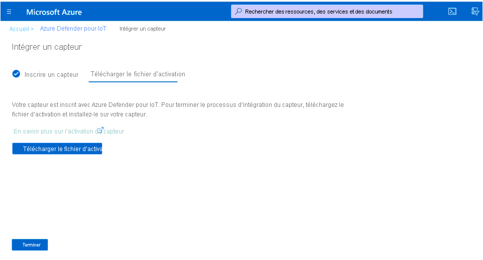
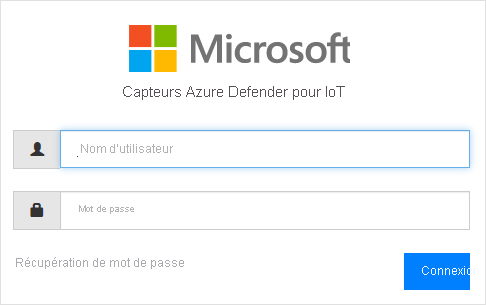
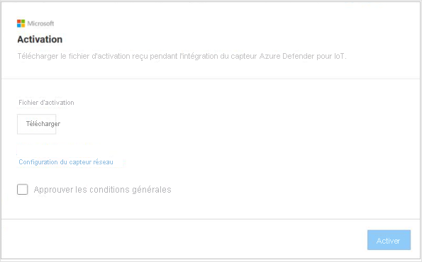
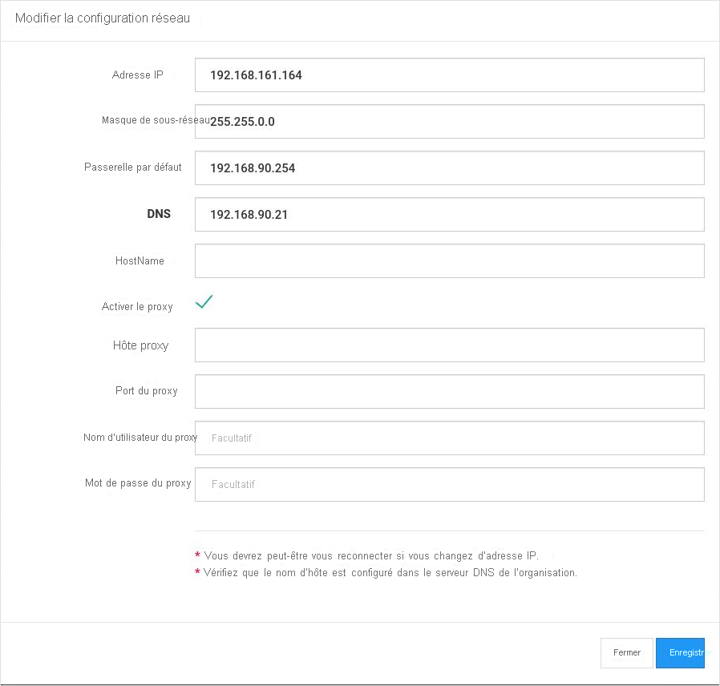

# Démarrage rapide : Déployer et intégrer un capteur

Cet article fournit une vue d’ensemble du processus de déploiement de capteurs. Les capteurs doivent être intégrés au portail Azure Defender pour IoT.

Ce processus nécessite l’acquisition d’un capteur préconfiguré ou l’acquisition d’une appliance de capteur certifiée et l’installation du logiciel de capteur par vos soins.

Si vous utilisez une appliance de capteur certifiée, nous vous recommandons de consulter le [guide des spécifications matérielles d’Azure Defender pour IoT](https://aka.ms/AzureDefenderforIoTBareMetalAppliance) avant de commencer.

> [!NOTE]
> La console de gestion locale d’Azure Defender pour IoT n’a pas besoin d’être intégrée.

L’intégration de capteurs vous permet d’effectuer les opérations suivantes :

|||
|------ | ----------- |
| **Définir un nom de capteur** | Nommez le capteur que vous intégrez et associez-le à un hub IoT ou à un abonnement.  Pour plus d’informations, consultez **Intégrer des capteurs** .|
|**Choisir un abonnement et un nombre d’appareils validés**|Sélectionnez un abonnement et le nombre d’appareils couverts par l’abonnement. Entrez le nombre par incréments de 1000.|
| **Définir un mode de gestion du capteur** | Définissez où doivent s’afficher les informations détectées par le capteur, telles que celles relatives aux ressources et aux alertes. Cela dépend du **mode de gestion du capteur** que vous définissez.  **Mode de gestion locale**  : les informations détectées par le capteur s’affichent dans la console du capteur. Les informations de détection sont également partagées avec la console de gestion locale si le capteur y est connecté.  **Mode de gestion dans le cloud**  : les informations détectées par le capteur s’affichent dans la console du capteur. En outre, les informations sur les alertes sont transmises par le biais d’un hub IoT et peuvent être partagées avec d’autres services Azure, par exemple Azure Sentinel. Pour plus d’informations, consultez **Intégrer des capteurs** . |
| **Acquérir un fichier d’activation de capteur** | Pour les capteurs **gérés localement** , un fichier d’activation est utilisé pour gérer les périodes d’activation de capteur autorisées.  Pour les capteurs **gérés dans le cloud** , un fichier d’activation est utilisé comme connexion entre le capteur et un hub IoT. Pour plus d’informations, consultez **Intégrer des capteurs** . |
| **Charger un fichier d’activation sur votre capteur** | Les fichiers d’activation doivent être chargés sur vos capteurs d’entreprise. La supervision du réseau et l’accès aux fonctionnalités de la console du capteur ne sont disponibles qu’une fois le fichier d’activation chargé. Pour plus d’informations, consultez **Charger des fichiers d’activation de capteur** . |
| **Mettre à jour les paramètres réseau du capteur avant l’activation** | Mettez à jour les paramètres définis lors de l’installation du capteur. Pour plus d’informations, consultez **Erreur ! Source de la référence introuvable** .|

**Pour déployer un capteur :**

1. Accédez à Azure Defender pour IoT à partir du portail Azure.

2. Sélectionnez **Bien démarrer** .

3. Dans la section **Découvrir votre réseau** , sélectionnez **Configurer** .

   

4. Sélectionnez une option pour acquérir un capteur.

   

  - **Acheter un capteur préconfiguré**  : Microsoft et Arrow se sont associés pour fournir des capteurs préconfigurés. Pour acheter un capteur préconfiguré, contactez Arrow à l’adresse suivante : <hardware.sales@arrow.com>. Le capteur est livré sur votre site. La version la plus récente est installée.

  - **Apporter votre propre appliance (installation ISO)**  : la solution s’exécute sur des appliances certifiées. Utilisez le [guide des spécifications matérielles d’Azure Defender pour IoT](https://aka.ms/AzureDefenderforIoTBareMetalAppliance) comme référence lors de l’achat de votre appliance certifiée.

    - Sélectionnez une version dans le menu **Sélectionner une version** .

    - Sélectionnez **Télécharger** et enregistrez le fichier. Pour plus d’informations sur le téléchargement de l’image ISO et sur l’installation du logiciel de capteur, reportez-vous au **guide d’installation d’Azure Defender pour IoT** .

5. Après avoir installé le logiciel sur votre capteur ou reçu un capteur préconfiguré, effectuez les tâches de configuration du réseau. Pour plus d’informations, consultez le [guide de configuration du réseau](https://aka.ms/AzureDefenderForIoTNetworkSetup).

## Intégrer un capteur

Les capteurs doivent être intégrés au portail Azure Defender pour IoT. L’intégration comprend deux phases :

1. Inscrivez le capteur auprès du portail Azure Defender pour IoT.

2. Téléchargez un fichier d’activation pour le capteur. Le fichier sera ensuite chargé sur votre capteur.

**Pour accéder à la page d’intégration :**

1. Accédez à la page **Bien démarrer** de Microsoft Azure Defender pour IoT.

2. Sélectionnez **Intégrer** à partir d’Azure Defender pour IoT.

   

3. La page **Intégrer un capteur** s’ouvre. Elle fournit des options pour inscrire le capteur et télécharger le fichier d’activation.

   

**Pour inscrire le capteur :**

1. Choisissez un nom de capteur. Pour les capteurs gérés dans le cloud, le nom défini ici est le nom qui s’affiche dans la console de capteur : ce nom ne peut pas être changé à partir de la console. Pour les capteurs gérés localement, le nom appliqué ici est stocké dans Azure, mais peut être mis à jour dans la console du capteur. Nous vous recommandons d’inclure dans le nom l’adresse IP du capteur que vous avez installé ou d’utiliser un nom facilement identifiable. Cela facilite le suivi et la cohérence du nommage entre le nom d’inscription dans le portail Azure Defender pour IoT et l’adresse IP du capteur déployé affiché dans la console de capteur.

2. Sélectionnez un abonnement dans la liste déroulante des abonnements.
3. Dans le champ **Appareils validés** , entrez le nombre d’appareils couverts par l’abonnement. Vous devez entrer à nouveau ce numéro pour chaque capteur que vous intégrez et qui est associé au même abonnement.  Par exemple, si l’abonnement « A » est associé à 6 000 appareils, entrez 6000 pour chaque capteur associé à l’abonnement « A ».   
4. Choisissez un mode de gestion du capteur à l’aide du bouton bascule **Connecté au cloud** . Si le bouton bascule est activé, le capteur est **géré dans le cloud** . Si le bouton bascule est désactivé, le capteur est **géré localement** .

| Mode d’administration du capteur | Description                                                |
| ---------------------- | ---------------------------------------------------------  |
| **Géré dans le cloud**          | Les informations détectées par le capteur s’affichent dans la console du capteur. De plus, les informations sur les alertes sont transmises par le biais d’un hub IoT et peuvent être partagées avec d’autres services Azure, par exemple Azure Sentinel.  Choisissez un hub IoT à associer à ce capteur.  Vous devez charger un fichier d’activation de capteur géré dans le cloud sur les capteurs gérés dans le cloud.  Pour plus d’informations, consultez **Charger des fichiers d’activation de capteur** . |
| **Géré localement**        | Les informations détectées par les capteurs gérés localement s’affichent dans la console de capteur. Si vous travaillez sur un réseau hermétique et que vous souhaitez une vue unifiée de toutes les informations détectées par plusieurs capteurs gérés localement, utilisez la console de gestion locale.  Les capteurs *gérés localement* sont associés à un abonnement Azure et contiennent des instructions sur la période d’expiration de l’activation des capteurs.  Choisissez un abonnement à associer à ce capteur.  Vous devez charger un fichier d’activation de capteur géré localement sur chaque capteur. Pour plus d’informations, consultez **Charger des fichiers d’activation de capteur** . |

5. Sélectionnez **Inscription** .

6. Dans la page Télécharger le fichier d’activation, sélectionnez **Télécharger le fichier d’activation** .

   

7. Enregistrez le fichier. Le format du nom de fichier est : `<hub_name>_<sensor_name>`. Le nom du capteur fait référence au nom que vous avez défini plus haut.

8. Sélectionnez **Terminer** .

9. Pour terminer le processus d’intégration du capteur, chargez le fichier sur votre capteur à partir de la console Azure Defender pour IoT.
 
## Charger un fichier d’activation de capteur

Cet article explique comment charger un fichier d’activation sur le capteur. Vous devez avoir reçu le fichier lors de l’intégration du capteur.

**Fichiers d’activation de capteur géré localement**

Les capteurs gérés localement sont associés à un abonnement Azure.  Le fichier d’activation de vos capteurs gérés localement contient une date d’expiration. Un mois avant cette date, un message d’avertissement s’affiche en haut de la console de capteur. L’avertissement reste jusqu’à ce que vous ayez mis à jour le fichier d’activation.

Vous pouvez continuer à utiliser les fonctionnalités d’Azure Defender pour IoT après l’expiration du fichier d’activation.

**Fichiers d’activation de capteur géré dans le cloud**

Les capteurs gérés dans le cloud sont associés à un hub IoT Azure. Ces capteurs ne sont pas limités par des périodes de validité du fichier d’activation. Le fichier d’activation pour les capteurs gérés dans le cloud est utilisé pour garantir la connexion au hub IoT.

Pour plus d’informations sur les hubs IoT, consultez [À propos d’IoT Hub](../iot-hub/about-iot-hub.md).

**Pour charger le fichier d’activation :**

1. Veillez à disposer des éléments suivants :

   - Adresse IP du capteur, définie lors de l’installation

   - Informations d’identification de connexion de l’utilisateur requises pour le capteur

2. Accédez à la console Azure Defender pour IoT à partir de votre navigateur à l’aide de l’adresse IP de ce capteur.

3. Connectez-vous à la console de capteur Azure Defender pour IoT.

   

4. Une fois la connexion établie, l’écran Activation s’ouvre. Sélectionnez Charger et choisissez le fichier d’activation que vous avez enregistré.

   

5. Approuvez les conditions générales.

6. Sélectionnez **Activer** . Les paramètres de configuration réseau du capteur ont été définis lors de l’installation du logiciel ou de l’achat d’un capteur préconfiguré. Les paramètres suivants ont été définis :
   - Adresse IP
   - DNS  
   - Passerelle par défaut
   - Masque de sous-réseau
   - Nom de l’hôte
 
   Vous souhaiterez peut-être mettre à jour ces informations avant d’activer le capteur pour les raisons suivantes :
   - Vous devez changer les paramètres préconfigurés définis.  
   - Vous souhaitez reconfigurer les paramètres réseau après l’installation. Vous pouvez également définir des paramètres de proxy avant d’activer votre capteur.

7. Sélectionnez le lien **Configuration réseau du capteur** dans la boîte de dialogue Activation.  

   

8. Les paramètres définis lors de l’installation s’affichent. Une option est également disponible pour définir des paramètres de proxy. Effectuez les mises à jour nécessaires, puis sélectionnez **Enregistrer** .
 
 
## Étapes suivantes

Dans cet article, vous avez appris à déployer et à intégrer des capteurs. Pour en savoir plus sur la façon de bien démarrer, consultez l’article suivant :

- [Bien démarrer](getting-started.md)