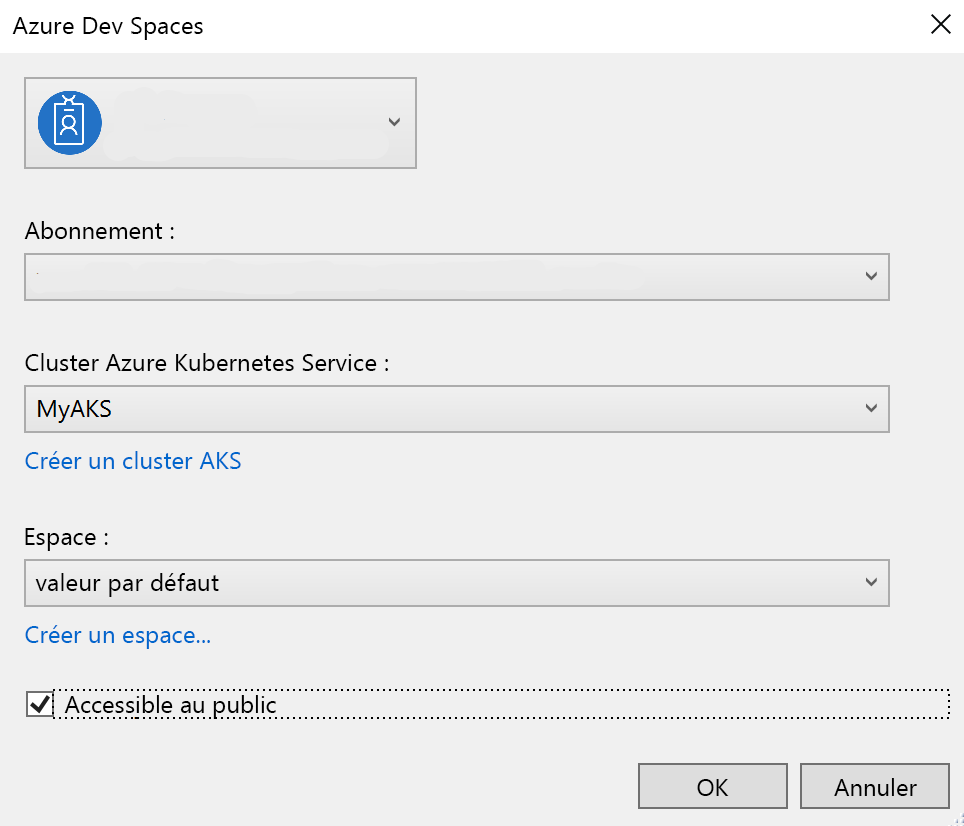
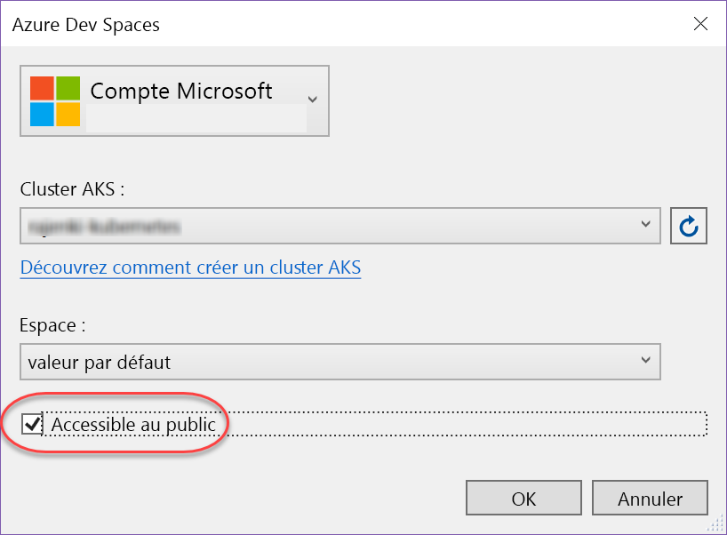
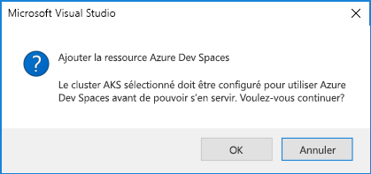
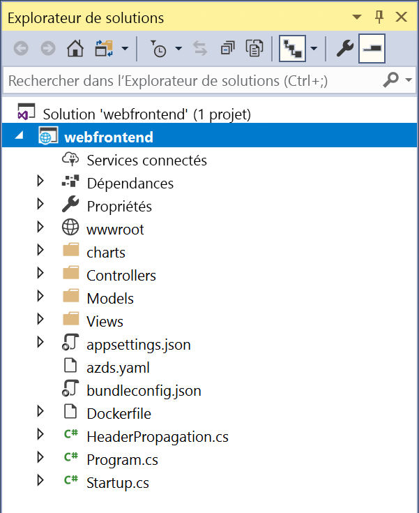

# <a name="create-a-kubernetes-dev-space-visual-studio-and-net-core-with-azure-dev-spaces"></a>Créer un espace de développement Kubernetes : Visual Studio et .NET Core avec Azure Dev Spaces

Dans ce guide, vous allez apprendre à :

- Configurer Azure Dev Spaces avec un cluster Kubernetes géré dans Azure.
- Développer du code de façon itérative dans des conteneurs à l’aide de Visual Studio.
- Développer indépendamment deux services distincts et utiliser la découverte des services DNS de Kubernetes pour appeler un autre service.
- Développer et tester votre code de façon productive dans un environnement d’équipe.

> [!NOTE]
> **Si vous êtes bloqué**, consultez la section [Résolution des problèmes](troubleshooting.md).

## <a name="install-the-azure-cli"></a>Installer l’interface de ligne de commande Microsoft Azure
Azure Dev Spaces requiert une configuration d’ordinateur local minimale. La majeure partie de la configuration de votre espace de développement est stockée dans le cloud et peut être partagée avec d’autres utilisateurs. Commencez par télécharger et exécuter [l’interface de ligne de commande Azure (Azure CLI)](/cli/azure/install-azure-cli?view=azure-cli-latest).

### <a name="sign-in-to-azure-cli"></a>Connectez-vous à Azure CLI
Connectez-vous à Azure. Saisissez la commande suivante dans une fenêtre de terminal :

```azurecli
az login
```

> [!NOTE]
> Si vous n’avez pas d’abonnement Azure, vous pouvez créer un [compte gratuit](https://azure.microsoft.com/free).

#### <a name="if-you-have-multiple-azure-subscriptions"></a>Si vous avez plusieurs abonnements Azure...
Vous pouvez afficher vos abonnements en exécutant : 

```azurecli
az account list --output table
```

Recherchez l’abonnement qui a la valeur *True* pour *IsDefault*.
Si ce n’est pas l’abonnement que vous souhaitez utiliser, vous pouvez modifier l’abonnement par défaut :

```azurecli
az account set --subscription <subscription ID>
```

## <a name="create-a-kubernetes-cluster-enabled-for-azure-dev-spaces"></a>Créer un cluster Kubernetes activé pour Azure Dev Spaces

À l’invite de commandes, créez le groupe de ressources dans une [région qui prend en charge Azure Dev Spaces][supported-regions].

```azurecli
az group create --name MyResourceGroup --location <region>
```

Créez un cluster Kubernetes avec la commande suivante :

```azurecli
az aks create -g MyResourceGroup -n MyAKS --location <region> --generate-ssh-keys
```

La création du cluster ne prend que quelques minutes.

### <a name="configure-your-aks-cluster-to-use-azure-dev-spaces"></a>Configurer votre cluster AKS pour utiliser Azure Dev Spaces

Entrez la commande Azure CLI suivante en utilisant le groupe de ressources qui contient votre cluster AKS et le nom du cluster AKS. La commande configure votre cluster avec la prise en charge d’Azure Dev Spaces.

   ```azurecli
   az aks use-dev-spaces -g MyResourceGroup -n MyAKS
   ```
   
> [!IMPORTANT]
> Le processus de configuration d’Azure Dev Spaces supprime l’espace de noms `azds` dans le cluster, s’il existe.

## <a name="get-the-visual-studio-tools"></a>Obtenir les outils Visual Studio
Installez la dernière version de [Visual Studio 2019](https://www.visualstudio.com/vs/) sur Windows avec la charge de travail Développement Azure.

## <a name="create-a-web-app-running-in-a-container"></a>Créer une application web s’exécutant dans un conteneur

Dans cette section, vous allez apprendre à créer une application web ASP.NET Core et à l’exécuter dans un conteneur dans Kubernetes.

### <a name="create-an-aspnet-web-app"></a>Créez une application web ASP.NET

Dans Visual Studio, créez un projet. Actuellement, le projet doit correspondre à **Application web ASP.NET Core**. Nommez le projet « **webfrontend** ».


Sélectionnez le modèle **Application Web (Model-View-Controller)** et assurez-vous que vous ciblez **.NET Core** et **ASP.NET Core 2.0** dans les deux menus déroulants au sommet de la boîte de dialogue. Cliquez sur **OK** pour créer le projet.


### <a name="enable-dev-spaces-for-an-aks-cluster"></a>Activer Dev Spaces pour un cluster AKS

Ouvrez le projet que vous venez de créer, puis sélectionnez **Azure Dev Spaces** dans la liste déroulante des paramètres de lancement, comme indiqué ci-dessous.


Dans la boîte de dialogue qui s’affiche ensuite, assurez-vous que vous êtes connecté avec le compte approprié, puis sélectionnez un cluster Kubernetes existant.



Laissez l’option de la liste déroulante **Space** (Espace) sur `default` pour l’instant. Vous en apprendrez davantage sur cette option un peu plus tard. Cochez la case **Publicly Accessible** (Accessible publiquement) pour que l’application web soit accessible par le biais d’un point de terminaison public. Ce paramètre n’est pas obligatoire, mais il servira à illustrer certains concepts dans la suite de cette procédure pas à pas. Dans les deux cas, vous serez en mesure de déboguer votre site web avec Visual Studio.



Cliquez sur **OK** pour sélectionner ou créer le cluster.

Si vous choisissez un cluster qui n’a pas été activé pour travailler avec Azure Dev Spaces, vous verrez un message qui vous demande si vous souhaitez le configurer.



Choisissez **OK**.

> [!IMPORTANT]
> Le processus de configuration d’Azure Dev Spaces supprime l’espace de noms `azds` dans le cluster, s’il existe.

 Une tâche en arrière-plan démarre alors pour effectuer cette opération. L’exécution de cette tâche nécessite quelques minutes. Pour voir si la création est toujours en cours, placez votre pointeur sur l’icône **Tâches en arrière-plan** dans le coin inférieur gauche de la barre d’état, comme illustré ci-après.


> [!NOTE]
> Vous ne pouvez pas déboguer votre application avant la fin de la création de l’espace de développement.

### <a name="look-at-the-files-added-to-project"></a>Examiner les fichiers ajoutés au projet
En attendant la création de l’espace de développement, examinez les fichiers qui ont été ajoutés à votre projet quand vous avez choisi d’utiliser un espace de développement.

Tout d’abord, vous pouvez voir qu’un dossier nommé `charts` a été ajouté et que dans ce dossier, un [graphique Helm](https://docs.helm.sh) a été structuré pour votre application. Ces fichiers sont utilisés pour déployer votre application dans l’environnement de développement.

Vous verrez qu’un fichier nommé `Dockerfile` a été ajouté. Ce fichier contient les informations nécessaires pour empaqueter votre application au format Docker standard.

Enfin, vous verrez un fichier nommé `azds.yaml` qui contient la configuration au moment du développement nécessaire à l’espace de développement.



## <a name="debug-a-container-in-kubernetes"></a>Déboguer un conteneur dans Kubernetes
Une fois l’espace de développement créé, vous pouvez déboguer votre application. Définissez un point d’arrêt dans le code, par exemple à la ligne 20 du fichier `HomeController.cs` où la variable `Message` est définie. Cliquez sur **F5** pour démarrer le débogage. 

Visual Studio communique avec l’espace de développement pour générer et déployer l’application, puis ouvre un navigateur avec l’application web en cours d’exécution. Le conteneur a l’air de s’exécuter en local, mais en réalité, il s’exécute dans l’espace de développement dans Azure. La présence de l’adresse localhost est due à Azure Dev Spaces qui crée un tunnel SSH temporaire jusqu’au conteneur en cours d’exécution dans AKS.

Cliquez sur le lien **À propos de** en haut de la page pour déclencher le point d’arrêt. Vous avez un accès complet aux informations pour le débogage, comme si le code s’exécutait en local, y compris à la pile des appels, aux variables locales, aux informations sur les exceptions, etc.

## <a name="iteratively-develop-code"></a>Développer du code de façon itérative

Azure Dev Spaces vous permet non seulement d’obtenir un code s’exécutant dans Kubernetes, mais également de visualiser rapidement et de façon itérative la prise en compte des modifications de votre code dans un environnement Kubernetes dans le cloud.

### <a name="update-a-content-file"></a>Mettre à jour un fichier de contenu


1. Recherchez le fichier `./Views/Home/Index.cshtml` et procédez à une modification du code HTML. Par exemple, remplacez la [ligne 73 indiquant `<h2>Application uses</h2>`](https://github.com/Azure/dev-spaces/blob/master/samples/dotnetcore/getting-started/webfrontend/Views/Home/Index.cshtml#L73) par une chaîne telle que : 
  
    ```html
    <h2>Hello k8s in Azure!</h2>`
    ```

2. Enregistrez le fichier .
3. Accédez à votre navigateur et actualisez la page. La page web doit afficher le code HTML mis à jour.

Que s’est-il passé ? Les modifications des fichiers de contenu, comme HTML et CSS, ne nécessitent aucune recompilation dans une application web .NET Core. Une session F5 active synchronise donc automatiquement tous les fichiers de contenu modifiés dans le conteneur en cours d’exécution dans AKS, ce qui vous permet de visualiser immédiatement les modifications du contenu.

### <a name="update-a-code-file"></a>Mettre à jour un fichier de code
La mise à jour des fichiers de code nécessite un peu plus de travail, car une application .NET Core doit régénérer et produire les fichiers binaires d’application mis à jour.

1. Arrêtez le débogueur dans Visual Studio.
1. Ouvrez le fichier de code nommé `Controllers/HomeController.cs`, puis modifiez le message qui doit s’afficher sur la page À propos de : `ViewData["Message"] = "Your application description page.";`
1. Enregistrez le fichier .
1. Appuyez sur **F5** pour redémarrer le débogage. 

Plutôt que de régénérer et redéployer une image conteneur chaque fois que des modifications de code sont effectuées, cette opération nécessitant généralement un temps considérable, Azure Dev Spaces recompile le code de manière incrémentielle au sein du conteneur existant afin d’accélérer la boucle de modification/débogage.

Actualisez l’application web dans le navigateur, puis accédez à la page À propos de. Votre message personnalisé doit apparaître dans l’interface utilisateur.

## <a name="next-steps"></a>Étapes suivantes

> [!div class="nextstepaction"]
> [En savoir plus sur le développement multiservice](multi-service-netcore-visualstudio.md)


[supported-regions]: https://azure.microsoft.com/global-infrastructure/services/?products=kubernetes-service