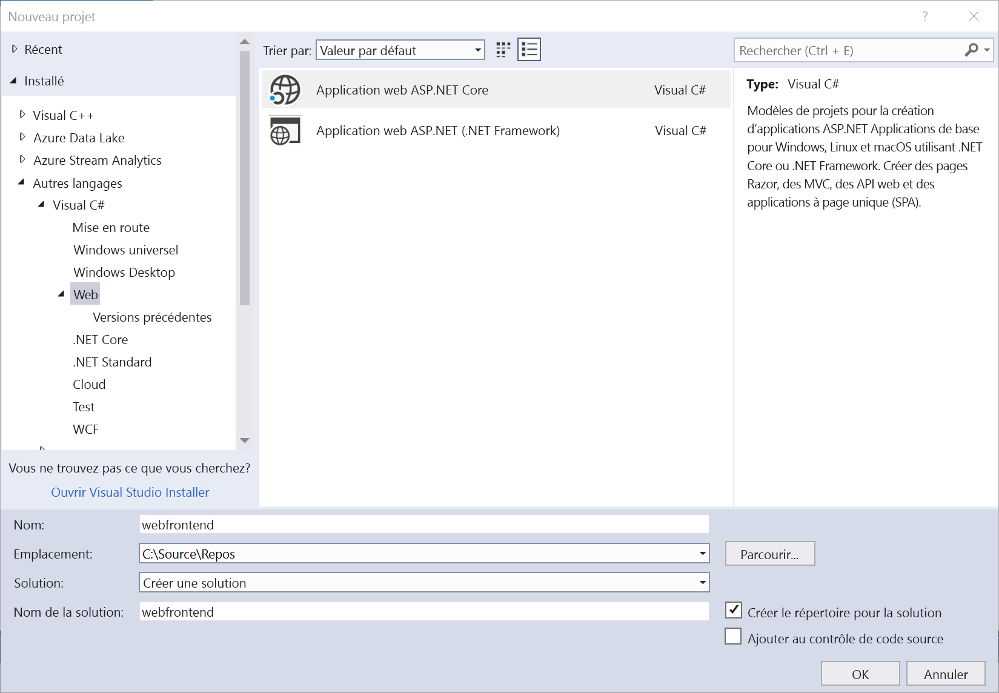
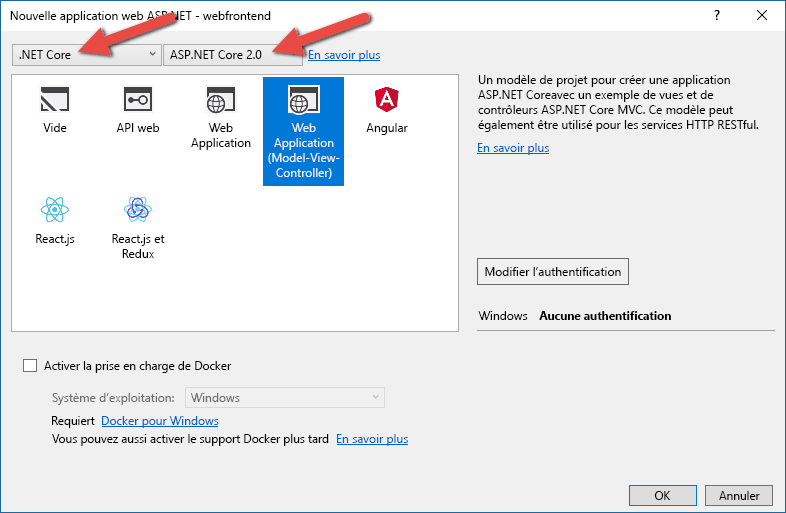

# Prise en main sur Azure Dev Spaces avec .NET Core et Visual Studio

Dans ce guide, vous allez apprendre à :

- Configurer Azure Dev Spaces avec un cluster Kubernetes géré dans Azure.
- Développer du code de façon itérative dans des conteneurs à l’aide de Visual Studio.
- Développer indépendamment deux services distincts et utiliser la découverte des services DNS de Kubernetes pour appeler un autre service.
- Développer et tester votre code de façon productive dans un environnement d’équipe.

> [!Note]
> **Si vous êtes bloqué**, consultez la section [Résolution des problèmes](troubleshooting.md) ou postez un commentaire sur cette page.

## Créer un cluster Kubernetes activé pour Azure Dev Spaces

1. Connectez-vous au portail Azure sur http://portal.azure.com.
1. Choisissez **Créer une ressource** > recherchez **Kubernetes** > sélectionnez **Kubernetes Service** > **Créer**.

   Suivez les étapes sous chaque en-tête du formulaire Créer un cluster AKS.

    - **DÉTAILS DU PROJET** : sélectionnez un abonnement Azure et un groupe de ressources Azure (nouveau ou existant).
    - **DÉTAILS DU CLUSTER** : entrez un nom une région (actuellement, vous devez choisir EastUS, CentralUS, WestEurope, WestUS2, Canadacentral ou CanadaEast), une version et un préfixe de nom DNS pour le cluster AKS.
    - **ÉCHELLE** : sélectionnez une taille de machine virtuelle pour les nœuds de l’agent AKS et le nombre de nœuds. Si vous débutez avec Azure Dev Spaces, un nœud est suffisant pour explorer toutes les fonctionnalités. Une fois le cluster déployé, il est facile d’ajuster le nombre de nœuds. Notez que la taille de la machine virtuelle ne peut pas être changée une fois le cluster AKS créé. Toutefois, une fois qu’un cluster AKS a été déployé, vous pouvez facilement créer un nouveau cluster AKS avec des machines virtuelles plus volumineuses et utiliser Dev Spaces pour effectuer un nouveau déploiement sur ce cluster plus grand si vous avez besoin de monter en puissance.

   Prenez soin de choisir la version 1.9.6 de Kubernetes ou une version ultérieure.

   

   Sélectionnez **Suivant : authentification** lorsque vous avez terminé.

1. Choisissez votre paramètre souhaité pour le contrôle d’accès en fonction du rôle (RBAC). Azure Dev Spaces prend en charge les clusters avec le paramètre RBAC activé ou désactivé.

    

1. Vérifiez que le routage d’applications HTTP est activé.

   

    > [!Note]
    > Pour activer le [routage d’applications HTTP](/azure/aks/http-application-routing) sur un cluster existant, utilisez la commande suivante : `az aks enable-addons --resource-group myResourceGroup --name myAKSCluster --addons http_application_routing`

1. Sélectionnez **Vérifier + créer**, puis **Créer** lorsque vous avez terminé.

## Obtenir les outils Visual Studio
1. Installez la dernière version de [Visual Studio 2017](https://www.visualstudio.com/vs/).
1. Dans le programme d’installation de Visual Studio, vérifiez que la charge de travail suivante est sélectionnée :
    * Développement web et ASP.NET
1. Installer [Visual Studio Tools pour Kubernetes](https://aka.ms/get-azds-visualstudio)

## Créer une application web s’exécutant dans un conteneur

Dans cette section, vous allez apprendre à créer une application web ASP.NET Core et à l’exécuter dans un conteneur dans Kubernetes.

### Créez une application web ASP.NET

Dans Visual Studio 2017, créez un projet. Actuellement, le projet doit correspondre à **Application web ASP.NET Core**. Nommez le projet « **webfrontend** ».

Sélectionnez le modèle **Application Web (Model-View-Controller)** et assurez-vous que vous ciblez **.NET Core** et **ASP.NET Core 2.0** dans les deux menus déroulants au sommet de la boîte de dialogue. Cliquez sur **OK** pour créer le projet.

### Activer Dev Spaces pour un cluster AKS

Ouvrez le projet que vous venez de créer, puis sélectionnez **Azure Dev Spaces** dans la liste déroulante des paramètres de lancement, comme indiqué ci-dessous.

Dans la boîte de dialogue qui s’affiche ensuite, assurez-vous que vous êtes connecté avec le compte approprié, puis sélectionnez un cluster Kubernetes existant.

Laissez l’option de la liste déroulante **Space** (Espace) sur `default` pour l’instant. Vous en apprendrez davantage sur cette option un peu plus tard. Cochez la case **Publicly Accessible** (Accessible publiquement) pour que l’application web soit accessible par le biais d’un point de terminaison public. Ce paramètre n’est pas obligatoire, mais il servira à illustrer certains concepts dans la suite de cette procédure pas à pas. Dans les deux cas, vous serez en mesure de déboguer votre site web avec Visual Studio.

Cliquez sur **OK** pour sélectionner ou créer le cluster.

Si vous choisissez un cluster qui n’a pas été activé pour travailler avec Azure Dev Spaces, vous verrez un message qui vous demande si vous souhaitez le configurer.

Choisissez **OK**.

 Une tâche en arrière-plan démarre alors pour effectuer cette opération. L’exécution de cette tâche nécessite quelques minutes. Pour voir si la création est toujours en cours, placez votre pointeur sur l’icône **Tâches en arrière-plan** dans le coin inférieur gauche de la barre d’état, comme illustré ci-après.

> [!Note]
> Vous ne pouvez pas déboguer votre application avant la fin de la création de l’espace de développement.

### Examiner les fichiers ajoutés au projet
En attendant la création de l’espace de développement, examinez les fichiers qui ont été ajoutés à votre projet quand vous avez choisi d’utiliser un espace de développement.

Tout d’abord, vous pouvez voir qu’un dossier nommé `charts` a été ajouté et que dans ce dossier, un [graphique Helm](https://docs.helm.sh) a été structuré pour votre application. Ces fichiers sont utilisés pour déployer votre application dans l’environnement de développement.

Vous verrez qu’un fichier nommé `Dockerfile` a été ajouté. Ce fichier contient les informations nécessaires pour empaqueter votre application au format Docker standard.

Enfin, vous verrez un fichier nommé `azds.yaml` qui contient la configuration au moment du développement nécessaire à l’espace de développement.

## Déboguer un conteneur dans Kubernetes
Une fois l’espace de développement créé, vous pouvez déboguer votre application. Définissez un point d’arrêt dans le code, par exemple à la ligne 20 du fichier `HomeController.cs` où la variable `Message` est définie. Cliquez sur **F5** pour démarrer le débogage. 

Visual Studio communique avec l’espace de développement pour générer et déployer l’application, puis ouvre un navigateur avec l’application web en cours d’exécution. Le conteneur a l’air de s’exécuter en local, mais en réalité, il s’exécute dans l’espace de développement dans Azure. La présence de l’adresse localhost est due à Azure Dev Spaces qui crée un tunnel SSH temporaire jusqu’au conteneur en cours d’exécution dans AKS.

Cliquez sur le lien **À propos de** en haut de la page pour déclencher le point d’arrêt. Vous avez un accès complet aux informations pour le débogage, comme si le code s’exécutait en local, y compris à la pile des appels, aux variables locales, aux informations sur les exceptions, etc.

## Développer du code de façon itérative

Azure Dev Spaces vous permet non seulement d’obtenir un code s’exécutant dans Kubernetes, mais également de visualiser rapidement et de façon itérative la prise en compte des modifications de votre code dans un environnement Kubernetes dans le cloud.

### Mettre à jour un fichier de contenu
1. Recherchez le fichier `./Views/Home/Index.cshtml` et procédez à une modification du code HTML. Par exemple, remplacez la ligne 70 indiquant `<h2>Application uses</h2>` par une chaîne telle que : `<h2>Hello k8s in Azure!</h2>`
1. Enregistrez le fichier .
1. Accédez à votre navigateur et actualisez la page. La page web doit afficher le code HTML mis à jour.

Que s’est-il passé ? Les modifications des fichiers de contenu, comme HTML et CSS, ne nécessitent aucune recompilation dans une application web .NET Core. Une session F5 active synchronise donc automatiquement tous les fichiers de contenu modifiés dans le conteneur en cours d’exécution dans AKS, ce qui vous permet de visualiser immédiatement les modifications du contenu.

### Mettre à jour un fichier de code
La mise à jour des fichiers de code nécessite un peu plus de travail, car une application .NET Core doit régénérer et produire les fichiers binaires d’application mis à jour.

1. Arrêtez le débogueur dans Visual Studio.
1. Ouvrez le fichier de code nommé `Controllers/HomeController.cs`, puis modifiez le message qui doit s’afficher sur la page À propos de : `ViewData["Message"] = "Your application description page.";`
1. Enregistrez le fichier .
1. Appuyez sur **F5** pour redémarrer le débogage. 

Plutôt que de régénérer et redéployer une image conteneur chaque fois que des modifications de code sont effectuées, cette opération nécessitant généralement un temps considérable, Azure Dev Spaces recompile le code de manière incrémentielle au sein du conteneur existant afin d’accélérer la boucle de modification/débogage.

Actualisez l’application web dans le navigateur, puis accédez à la page À propos de. Votre message personnalisé doit apparaître dans l’interface utilisateur.

## Étapes suivantes

> [!div class="nextstepaction"]
> [Découvrir le développement en équipe](team-development-netcore-visualstudio.md)
