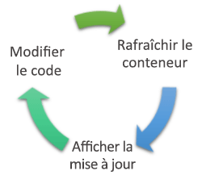
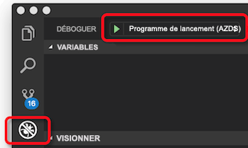
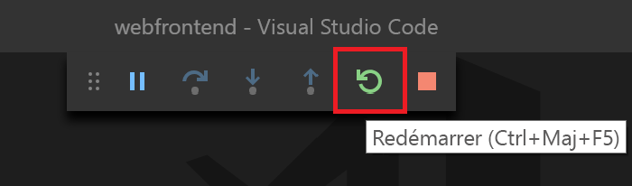

# <a name="create-a-kubernetes-dev-space-visual-studio-code-and-nodejs-with-azure-dev-spaces"></a>Créer un espace de développement Kubernetes : Visual Studio Code et Node.js avec Azure Dev Spaces

Dans ce guide, vous allez apprendre à :

- Créer un environnement Kubernetes dans Azure optimisé pour le développement : un _espace de développement_.
- Développer du code de façon itérative dans des conteneurs en utilisant VS Code et la ligne de commande.
- Développer et tester votre code de façon productive dans un environnement d’équipe.

> [!Note]
> **Si vous êtes bloqué**, consultez la section [Résolution des problèmes](troubleshooting.md).

## <a name="install-the-azure-cli"></a>Installer l’interface de ligne de commande Microsoft Azure
Azure Dev Spaces requiert une configuration d’ordinateur local minimale. La majeure partie de la configuration de votre espace de développement est stockée dans le cloud et peut être partagée avec d’autres utilisateurs. Commencez par télécharger et exécuter [l’interface de ligne de commande Azure (Azure CLI)](/cli/azure/install-azure-cli?view=azure-cli-latest).

### <a name="sign-in-to-azure-cli"></a>Connectez-vous à Azure CLI
Connectez-vous à Azure. Saisissez la commande suivante dans une fenêtre de terminal :

```cmd
az login
```

> [!Note]
> Si vous n’avez pas d’abonnement Azure, vous pouvez créer un [compte gratuit](https://azure.microsoft.com/free).

#### <a name="if-you-have-multiple-azure-subscriptions"></a>Si vous avez plusieurs abonnements Azure...
Vous pouvez afficher vos abonnements en exécutant : 

```cmd
az account list --output table
```

Recherchez l’abonnement qui a la valeur *True* pour *IsDefault*.
Si ce n’est pas l’abonnement que vous souhaitez utiliser, vous pouvez modifier l’abonnement par défaut :

```cmd
az account set --subscription <subscription ID>
```

## <a name="create-a-kubernetes-cluster-enabled-for-azure-dev-spaces"></a>Créer un cluster Kubernetes activé pour Azure Dev Spaces

À l’invite de commandes, créez le groupe de ressources dans une [région qui prend en charge Azure Dev Spaces][supported-regions].

```cmd
az group create --name MyResourceGroup --location <region>
```

Créez un cluster Kubernetes avec la commande suivante :

```cmd
az aks create -g MyResourceGroup -n MyAKS --location <region> --disable-rbac --generate-ssh-keys
```

La création du cluster ne prend que quelques minutes.

### <a name="configure-your-aks-cluster-to-use-azure-dev-spaces"></a>Configurer votre cluster AKS pour utiliser Azure Dev Spaces

Entrez la commande Azure CLI suivante en utilisant le groupe de ressources qui contient votre cluster AKS et le nom du cluster AKS. La commande configure votre cluster avec la prise en charge d’Azure Dev Spaces.

   ```cmd
   az aks use-dev-spaces -g MyResourceGroup -n MyAKS
   ```

> [!IMPORTANT]
> Le processus de configuration d’Azure Dev Spaces supprime l’espace de noms `azds` dans le cluster, s’il existe.

## <a name="get-kubernetes-debugging-for-vs-code"></a>Obtenir un débogage Kubernetes pour VS Code
Des fonctionnalités puissantes comme le débogage Kubernetes sont disponibles pour les développeurs .NET Core et Node.js à l’aide de VS Code.

1. Installez [VS Code](https://code.visualstudio.com/Download) si vous ne l’avez pas encore fait.
1. Téléchargez et installez l’[extension VS Azure Dev Spaces](https://marketplace.visualstudio.com/items?itemName=azuredevspaces.azds). Cliquez sur Installer une fois sur la page Place de marché de l’extension, puis à nouveau dans VS Code. 

## <a name="create-a-nodejs-container-in-kubernetes"></a>Créer un conteneur Node.js dans Kubernetes

Dans cette section, vous allez créer une application web Node.js et l’exécuter dans un conteneur dans Kubernetes.

### <a name="create-a-nodejs-web-app"></a>Créer une application web Node.js
Téléchargez du code à partir de GitHub en accédant à https://github.com/Azure/dev-spaces, puis sélectionnez **Cloner ou télécharger** pour télécharger le référentiel GitHub dans votre environnement local. Le code de ce guide est disponible dans `samples/nodejs/getting-started/webfrontend`.

## <a name="prepare-code-for-docker-and-kubernetes-development"></a>Préparer du code pour le développement Docker et Kubernetes
Pour l’heure, vous disposez d’une application web de base qui peut s’exécuter localement. Vous allez maintenant la mettre en conteneur en créant des ressources qui définissent le conteneur de l’application et la façon dont il sera déployé dans Kubernetes. Azure Dev Spaces permet d’effectuer facilement cette tâche : 

1. Lancez VS Code et ouvrez le dossier `webfrontend`. (Vous pouvez ignorer les invites par défaut qui vous demandent d’ajouter des ressources de débogage ou de restaurer le projet.)
1. Ouvrez le terminal intégré dans VS Code (à partir du menu **Affichage > Terminal intégré**).
1. Exécutez cette commande (vérifiez que **webfrontend** est bien votre dossier actuel) :

    ```cmd
    azds prep --public
    ```

La commande `azds prep` d’Azure CLI génère des ressources Docker et Kubernetes avec les paramètres par défaut :
* `./Dockerfile` décrit l’image du conteneur de l’application et la façon dont le code source est généré et s’exécute dans le conteneur.
* Un [graphique Helm](https://docs.helm.sh) sous `./charts/webfrontend` décrit la façon dont le conteneur est déployé dans Kubernetes.

> [!TIP]
> Le [Dockerfile et le chart Helm](how-dev-spaces-works.md#prepare-your-code) de votre projet sont utilisés par Azure Dev Spaces pour générer et exécuter votre code. Toutefois, vous pouvez modifier ces fichiers si vous souhaitez changer la façon dont le projet est généré et exécuté.

Pour l’instant, il n’est pas nécessaire de comprendre l’ensemble du contenu de ces fichiers. Il est cependant important de noter que **les mêmes ressources de configuration en tant que code Kubernetes et Docker peuvent être utilisées du développement jusqu’à la production, ce qui assure une meilleure cohérence dans les différents environnements.**
 
Un fichier nommé `./azds.yaml` est aussi généré par la commande `prep` ; il s’agit du fichier de configuration pour Azure Dev Spaces. Il complète les artefacts Docker et Kubernetes avec une configuration supplémentaire qui offre une expérience de développement itératif dans Azure.

## <a name="build-and-run-code-in-kubernetes"></a>Générer et exécuter du code dans Kubernetes
À présent, exécutons notre code. Dans la fenêtre de terminal, exécutez la commande ci-après à partir du **dossier de code racine**, webfrontend :

```cmd
azds up
```

En surveillant la sortie de la commande pendant que celle-ci s’exécute, vous remarquerez plusieurs choses :
- Le code source est synchronisé avec l’espace de développement dans Azure.
- Une image conteneur est créée dans Azure, comme spécifié par les ressources Docker dans votre dossier de code.
- La commande crée des objets Kubernetes qui utilisent l’image conteneur, comme spécifié par le graphique Helm dans votre dossier de code.
- Des informations relatives aux points de terminaison du conteneur s’affichent. Dans notre cas, nous attendons une URL HTTP publique.
- En supposant que les étapes ci-dessus se sont correctement déroulées, vous devriez commencer à voir la sortie `stdout` (et `stderr`) lorsque le conteneur démarre.

> [!Note]
> Ces étapes nécessitent davantage de temps lors de la première exécution de la commande `up` ; les exécutions suivantes s’effectuent plus rapidement.

### <a name="test-the-web-app"></a>Tester l’application web
Analysez la sortie de la console pour y rechercher les informations concernant l’URL publique qui a été créée par la commande `up`. Ces informations se présentent sous la forme suivante : 

```
(pending registration) Service 'webfrontend' port 'http' will be available at <url>
Service 'webfrontend' port 'http' is available at http://webfrontend.1234567890abcdef1234.eus.azds.io/
Service 'webfrontend' port 80 (TCP) is available at 'http://localhost:<port>'
```

Identifiez l’URL publique pour le service dans la sortie de la commande `up`. Elle se termine par `.azds.io`. Dans l’exemple ci-dessus, l’URL publique est `http://webfrontend.1234567890abcdef1234.eus.azds.io/`.

Pour voir votre application web, ouvrez l’URL publique dans un navigateur. En outre, notez que la sortie de `stdout` et `stderr` est diffusée dans la fenêtre de terminal *azds trace* lorsque vous interagissez avec votre application web. Vous verrez également des informations de suivi pour les requêtes HTTP lorsqu’elles passent par le système. Cela facilite le suivi des appels multiservice complexes pendant le développement. L’instrumentation ajoutée par Dev Spaces fournit ce suivi des requêtes.

> [!Note]
> En plus de l’URL publique, vous pouvez utiliser en guise d’alternative l’URL `http://localhost:<portnumber>` affichée dans la sortie de la console. Si vous utilisez l’URL localhost, le conteneur semble s’exécuter en local. En réalité, il s’exécute dans Azure. Azure Dev Spaces utilise la fonctionnalité de *redirection des ports* de Kubernetes pour mapper le port localhost sur le conteneur en cours d’exécution dans AKS. Cela facilite l’interaction avec le service à partir de votre machine locale.

### <a name="update-a-content-file"></a>Mettre à jour un fichier de contenu
Azure Dev Spaces vous permet non seulement d’obtenir un code s’exécutant dans Kubernetes, mais également de visualiser rapidement et de façon itérative la prise en compte des modifications de votre code dans un environnement Kubernetes dans le cloud.

1. Recherchez le fichier `./public/index.html` et procédez à une modification du code HTML. Par exemple, remplacez la couleur d’arrière-plan de la page par une nuance de bleu [à la ligne 15](https://github.com/Azure/dev-spaces/blob/master/samples/nodejs/getting-started/webfrontend/public/index.html#L15) :

    ```html
    <body style="background-color: #95B9C7; margin-left:10px; margin-right:10px;">
    ```

1. Enregistrez le fichier . Quelques instants plus tard, la fenêtre de terminal affiche un message indiquant qu’un fichier du conteneur en cours d’exécution a été mis à jour.
1. Accédez à votre navigateur et actualisez la page. La couleur doit avoir été mise à jour.

Que s’est-il passé ? Les modifications des fichiers de contenu, comme HTML et CSS, ne nécessitent aucun redémarrage du processus Node.js. Par conséquent, une commande `azds up` active synchronise automatiquement tous les fichiers de contenu modifiés directement dans le conteneur en cours d’exécution dans Azure, ce qui vous permet de visualiser rapidement les modifications du contenu.

### <a name="test-from-a-mobile-device"></a>Tester l’application à partir d’un appareil mobile
Ouvrez l’application web sur un appareil mobile à l’aide de l’URL publique pour webfrontend. Nous vous suggérons de copier l’URL sur votre poste de travail et de l’envoyer à votre appareil pour ne pas avoir à entrer la grande adresse. Quand l’application web se charge sur votre appareil mobile, notez que l’interface utilisateur ne s’affiche pas correctement sur un petit appareil.

Pour résoudre ce problème, vous allez ajouter une balise META `viewport` :
1. Ouvrez le fichier `./public/index.html`.
1. Ajoutez une balise META `viewport` dans l’élément `head` existant qui commence à la [ligne 6](https://github.com/Azure/dev-spaces/blob/master/samples/nodejs/getting-started/webfrontend/public/index.html#L6) :

    ```html
    <head>
        <!-- Add this line -->
        <meta name="viewport" content="width=device-width, initial-scale=1">
    </head>
    ```

1. Enregistrez le fichier .
1. Actualisez le navigateur de votre appareil. L’application web doit désormais s’afficher correctement. 

Cet exemple montre que certains problèmes sont indécelables tant que vous ne testez pas vos applications sur les appareils auxquels elles sont destinées. Grâce à Azure Dev Spaces, vous pouvez rapidement itérer sur votre code et valider les modifications sur les appareils cibles.

### <a name="update-a-code-file"></a>Mettre à jour un fichier de code
La mise à jour des fichiers de code côté serveur nécessite un peu plus de travail, car elle requiert le redémarrage d’une application Node.js.

1. Dans la fenêtre de terminal, appuyez sur `Ctrl+C` (pour arrêter `azds up`).
1. Ouvrez le fichier de code nommé `server.js`, puis modifiez le message Hello du service : 

    ```javascript
    res.send('Hello from webfrontend running in Azure!');
    ```

3. Enregistrez le fichier .
1. Exécutez `azds up` dans la fenêtre de terminal. 

Cette commande régénère l’image conteneur et redéploie le graphique Helm. Rechargez la page du navigateur pour visualiser la prise en compte de vos modifications de code.

Toutefois, vous allez découvrir à la section suivante une *méthode encore plus rapide* pour développer du code. 

## <a name="debug-a-container-in-kubernetes"></a>Déboguer un conteneur dans Kubernetes

Dans cette section, vous utiliserez VS Code pour déboguer directement notre conteneur exécuté dans Azure. Vous apprendrez aussi à obtenir une boucle modification-exécution-test plus rapide.



> [!Note]
> **Si vous êtes bloqué**, consultez la section [Résolution des problèmes](troubleshooting.md) ou postez un commentaire sur cette page.

### <a name="initialize-debug-assets-with-the-vs-code-extension"></a>Initialiser des ressources de débogage avec l’extension VS Code
Vous devez avant tout configurer votre projet de code pour permettre à VS Code de communiquer avec notre espace de développement dans Azure. L’extension VS Code pour Azure Dev Spaces fournit une commande d’assistance pour définir la configuration de débogage. 

Ouvrez la **Palette de commandes** (à partir du menu **Affichage | Palette de commandes**) et utilisez la saisie semi-automatique pour taper et sélectionnez cette commande : `Azure Dev Spaces: Prepare configuration files for Azure Dev Spaces`. 

Celle-ci ajoute la configuration de débogage pour Azure Dev Spaces sous le dossier `.vscode`. Cette commande ne doit pas être confondue avec la commande `azds prep`, qui configure le projet pour le déploiement.


### <a name="select-the-azds-debug-configuration"></a>Sélectionner la configuration de débogage AZDS
1. Pour ouvrir l’affichage de débogage, cliquez sur l’icône Débogage dans la **barre d’activités** située sur le côté de VS Code.
1. Sélectionnez **Lancer le programme (AZDS)** comme configuration de débogage active.



> [!Note]
> Si la palette de commandes ne présente aucune commande Azure Dev Spaces, vérifiez que vous avez [installé l’extension VS Code pour Azure Dev Spaces](get-started-nodejs.md#get-kubernetes-debugging-for-vs-code).

### <a name="debug-the-container-in-kubernetes"></a>Déboguer le conteneur dans Kubernetes
Pour déboguer votre code dans Kubernetes, appuyez sur **F5**.

Comme avec la commande `up`, le code est synchronisé avec l’environnement de développement lorsque vous démarrez le débogage, et un conteneur est créé et déployé dans Kubernetes. Cette fois-ci, le débogueur est joint au conteneur distant.

> [!Tip]
> La barre d’état VS Code devient orange, indiquant que le débogueur est attaché. Elle affiche également une URL interactive, que vous pouvez utiliser pour ouvrir rapidement votre site.


Définissez un point d’arrêt dans un fichier de code côté serveur, par exemple dans la fonction `app.get('/api'...` à la [ligne 13 de`server.js`](https://github.com/Azure/dev-spaces/blob/master/samples/nodejs/getting-started/webfrontend/server.js#L13). 

    ```javascript
    app.get('/api', function (req, res) {
        res.send('Hello from webfrontend');
    });
    ```

Actualisez la page de navigateur ou appuyez sur le bouton *Say It Again* (Répéter), ce qui doit vous permettre d’atteindre le point d’arrêt et d’exécuter le code pas à pas.

Vous disposez d’un accès complet aux informations de débogage, exactement comme si le code s’exécutait en local, notamment à la pile des appels, aux variables locales, aux informations sur les exceptions, etc.

### <a name="edit-code-and-refresh-the-debug-session"></a>Modifier le code et actualiser la session de débogage
Lorsque le débogueur est actif, apportez une modification au code ; par exemple, modifiez de nouveau le message Hello à la [ligne 13 de `server.js`](https://github.com/Azure/dev-spaces/blob/master/samples/nodejs/getting-started/webfrontend/server.js#L13) :

```javascript
app.get('/api', function (req, res) {
    res.send('**** Hello from webfrontend running in Azure! ****');
});
```

Enregistrez le fichier, puis dans le **volet Actions de débogage**, cliquez sur le bouton **Redémarrer**. 



Plutôt que de régénérer et redéployer une nouvelle image conteneur chaque fois que des modifications de code sont effectuées, cette opération nécessitant généralement un temps considérable, Azure Dev Spaces redémarre le processus Node.js entre les sessions de débogage afin d’accélérer la boucle de modification/débogage.

Actualisez l’application web dans le navigateur, ou appuyez sur le bouton *Say It Again* (Répéter). Votre message personnalisé doit apparaître dans l’interface utilisateur.

### <a name="use-nodemon-to-develop-even-faster"></a>Accélérer le développement grâce à nodemon
Les développeurs Node.js ont fréquemment recours à l’outil *nodemon* pour développer des applications rapidement. Plutôt que de redémarrer manuellement le processus Node chaque fois qu’une modification de code côté serveur est effectuée, les développeurs configurent souvent leur projet Node pour que l’outil *nodemon* surveille les modifications de fichier et redémarre automatiquement le processus serveur. Dans ce type d’approche, le développeur se contente d’actualiser son navigateur après avoir apporté une modification au code.

Avec Azure Dev Spaces, vous pouvez exploiter la plupart des workflows de développement que vous utilisez dans le cadre de vos opérations de développement en local. Pour illustrer ce point, l’exemple de projet `webfrontend` a été configuré de manière à utiliser *nodemon* (configuré en tant que dépendance de développement dans `package.json`).

Essayez les étapes suivantes :
1. Arrêtez le débogueur VS Code.
1. Cliquez sur l’icône Débogage dans la **barre d’activités** située sur le côté de VS Code. 
1. Sélectionnez **Attacher (AZDS)** comme configuration de débogage active.
1. Appuyez sur F5.

Dans cette configuration, le conteneur est configuré pour démarrer *nodemon*. Lorsque vous modifiez le code du serveur, *nodemon* redémarre automatiquement le processus Node, exactement comme lors du développement en local. 
1. Modifiez de nouveau le message Hello dans `server.js`, puis enregistrez le fichier.
1. Actualisez le navigateur ou cliquez sur le bouton *Say It Again* (Répéter) pour visualiser la prise en compte de vos modifications.

**Vous disposez désormais d’une méthode d’itération rapide sur le code et de débogage directement dans Kubernetes.** Ensuite, vous verrez comment créer et appeler un second conteneur.

## <a name="next-steps"></a>Étapes suivantes

> [!div class="nextstepaction"]
> [En savoir plus sur le développement multiservice](multi-service-nodejs.md)


[supported-regions]: https://azure.microsoft.com/global-infrastructure/services/?products=kubernetes-service