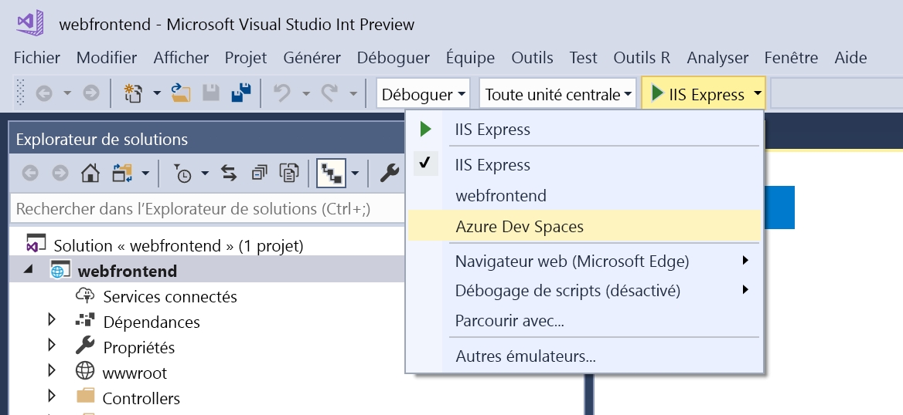

# Partager des espaces Azure Dev Spaces

Avec Azure Dev Spaces, vous pouvez partager votre espace de développement avec les autres membres de votre équipe. Chaque développeur peut travailler dans son propre espace sans craindre de compromettre le travail des autres. Par ailleurs, en collaborant dans un espace commun, vous pouvez tester du code de bout en bout sans avoir à créer des objets fictifs ou à simuler des dépendances. Pour plus d’informations, consultez le guide [Découvrir le développement en équipe](../team-development-nodejs.md).

## Configurer un espace de développement pour plusieurs développeurs

1. Créez un espace de développement dans Azure. Choisissez [.NET Core et VS Code](../get-started-netcore.md), [.NET Core et Visual Studio](../get-started-netcore-visualstudio.md) ou [Node.js et VS Code](../get-started-nodejs.md). Vous devez disposer d’un accès Propriétaire ou Contributeur pour pouvoir accéder à l’abonnement Azure sélectionné.
1. Configurez le **groupe de ressources** de l’espace Azure Dev Spaces de façon à [accorder un accès Contributeur](/azure/active-directory/role-based-access-control-configure) à chaque membre de l’équipe. Vous pouvez vérifier le groupe de ressources d’un espace de développement en exécutant cette commande : `azds list-up`.
1. Demandez aux membres de l’équipe de **sélectionner l’espace de développement** pour pouvoir y travailler.
   * **Ligne de commande ou VS Code** : Pour voir les espaces Azure Dev Spaces existants auxquels vous avez accès : `azds space list`. Pour sélectionner un espace de développement : `azds space select`.
   * **IDE Visual Studio** : Ouvrez un projet dans Visual Studio, sélectionnez **Azure Dev Spaces** dans la liste déroulante des paramètres de lancement. Dans la boîte de dialogue qui s’ouvre, sélectionnez un cluster existant.

     

## Étapes suivantes

Pour plus d’informations, consultez le guide [Découvrir le développement en équipe](../team-development-nodejs.md).
