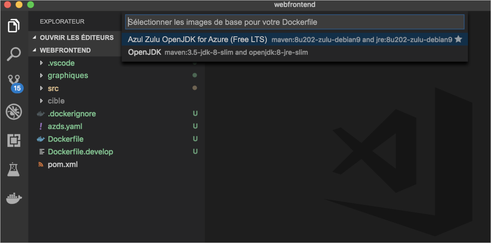
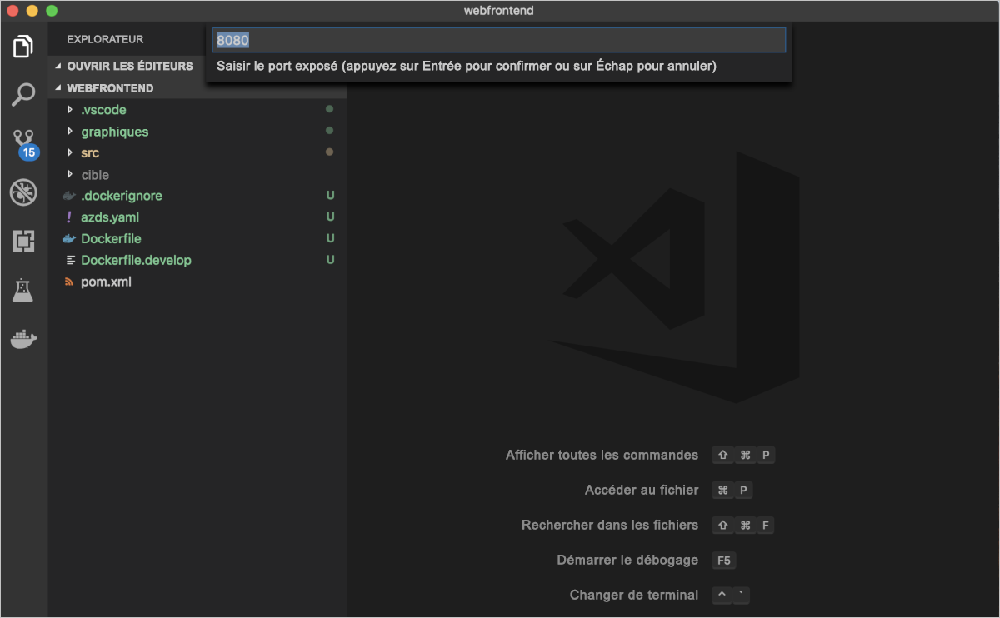
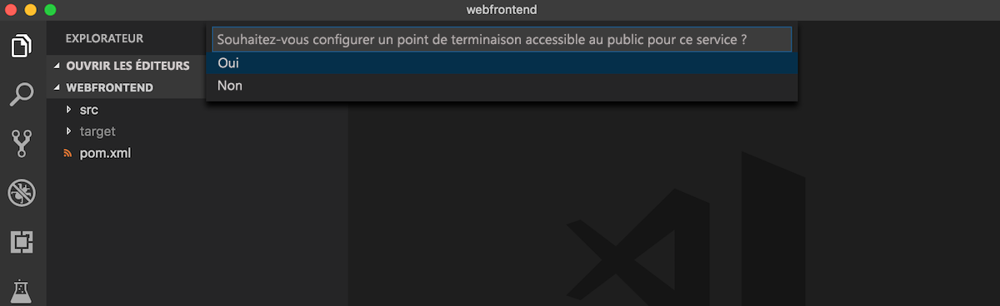
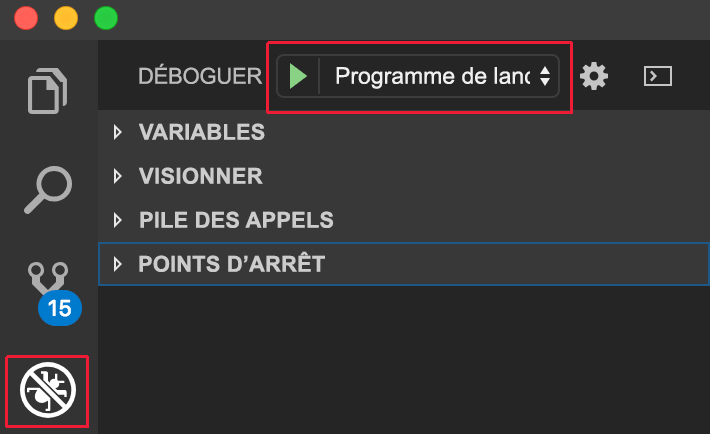

# <a name="quickstart-debug-and-iterate-on-kubernetes-with-visual-studio-code-and-java---azure-dev-spaces"></a>Démarrage rapide : Déboguer et itérer dans Kubernetes avec Visual Studio Code et Java - Azure Dev Spaces

Dans ce guide de démarrage rapide, vous configurez Azure Dev Spaces avec un cluster Kubernetes managés et utilisez une application Java dans Visual Studio Code pour développer et déboguer de manière itérative du code dans des conteneurs. Azure Dev Spaces vous permet de tester et déboguer tous les composants de votre application dans AKS (Azure Kubernetes Service) avec une configuration minimale de machine de développement. 

## <a name="prerequisites"></a>Prérequis

- Compte Azure avec un abonnement actif. [Créez un compte gratuitement](https://azure.microsoft.com/free/?ref=microsoft.com&utm_source=microsoft.com&utm_medium=docs&utm_campaign=visualstudio). 
- [Kit de développement Java (JDK) 1.8.0+](https://aka.ms/azure-jdks)
- [Maven 3.5.0+](https://maven.apache.org/download.cgi).
- [Visual Studio Code](https://code.visualstudio.com/download).
- Les extensions [Azure Dev Spaces](https://marketplace.visualstudio.com/items?itemName=azuredevspaces.azds) et [Débogueur Java pour Azure Dev Spaces](https://marketplace.visualstudio.com/items?itemName=vscjava.vscode-java-debugger-azds) pour Visual Studio Code.
- [Azure CLI](/cli/azure/install-azure-cli?view=azure-cli-latest).
- [Git](https://www.git-scm.com/downloads).

## <a name="create-an-azure-kubernetes-service-cluster"></a>Créer un cluster Azure Kubernetes Service

Vous devez créer un cluster AKS dans une [région prise en charge][supported-regions]. Les commandes suivantes créent un groupe de ressources nommé *MyResourceGroup* et un cluster AKS nommé *MyAKS*.

```cmd
az group create --name MyResourceGroup --location eastus
az aks create -g MyResourceGroup -n MyAKS --location eastus --generate-ssh-keys
```

## <a name="enable-azure-dev-spaces-on-your-aks-cluster"></a>Activer Azure Dev Spaces sur votre cluster AKS

Utilisez la commande `use-dev-spaces` pour activer Dev Spaces sur votre cluster AKS et suivez les invites. La commande suivante active Dev Spaces sur le cluster *MyAKS* dans le groupe *MyResourceGroup* et crée un espace de développement *par défaut*.

> [!NOTE]
> La commande `use-dev-spaces` installe également l’interface CLI Azure Dev Spaces si celle-ci n’est pas déjà installée. Vous ne pouvez pas installer l’interface CLI d’Azure Dev Spaces dans Azure Cloud Shell.

```cmd
$ az aks use-dev-spaces -g MyResourceGroup -n MyAKS


'An Azure Dev Spaces Controller' will be created that targets resource 'MyAKS' in resource group 'MyResourceGroup'. Continue? (y/N): y

Creating and selecting Azure Dev Spaces Controller 'MyAKS' in resource group 'MyResourceGroup' that targets resource 'MyAKS' in resource group 'MyResourceGroup'...2m 24s

Select a dev space or Kubernetes namespace to use as a dev space.
 [1] default
Type a number or a new name: 1

Kubernetes namespace 'default' will be configured as a dev space. This will enable Azure Dev Spaces instrumentation for new workloads in the namespace. Continue? (Y/n): Y

Configuring and selecting dev space 'default'...3s

Managed Kubernetes cluster 'MyAKS' in resource group 'MyResourceGroup' is ready for development in dev space 'default'. Type `azds prep` to prepare a source directory for use with Azure Dev Spaces and `azds up` to run.
```

## <a name="get-sample-application-code"></a>Obtenir l’exemple de code d’application

Dans cet article, vous utilisez l’[exemple d’application Azure Dev Spaces](https://github.com/Azure/dev-spaces) pour illustrer l’utilisation d’Azure Dev Spaces.

Clonez l’application à partir de GitHub.

```cmd
git clone https://github.com/Azure/dev-spaces
```

## <a name="prepare-the-sample-application-in-visual-studio-code"></a>Préparer l’exemple d’application dans Visual Studio Code

Ouvrez Visual Studio Code, sélectionnez **Fichier** puis **Ouvrir**, accédez au répertoire *dev-spaces/samples/java/getting-started/webfrontend*, puis sélectionnez **Ouvrir**.

Vous avez maintenant le projet *webfrontend* ouvert dans Visual Studio Code. Pour exécuter l’application dans votre espace de développement, générez les ressources de graphique Docker et Helm à l’aide de l’extension Azure Dev Spaces dans la palette de commandes.

Pour ouvrir la palette de commandes dans Visual Studio Code, sélectionnez **Afficher**, puis **Palette de commandes**. Commencez à taper `Azure Dev Spaces` et sélectionnez **Azure Dev Spaces : Préparer les fichiers de configuration pour Azure Dev Spaces**.


Quand Visual Studio Code vous inviter aussi à configurer vos images de base, le port exposé et le point de terminaison public, choisissez `Azul Zulu OpenJDK for Azure (Free LTS)` pour l’image de base, `8080` pour le port exposé et `Yes` pour le point de terminaison public.







Cette commande prépare votre projet à s’exécuter dans Azure Dev Spaces en générant un chart Dockerfile et Helm. Il génère également un répertoire *.vscode* avec la configuration de débogage à la racine de votre projet.

> [!TIP]
> Le [Dockerfile et le chart Helm](how-dev-spaces-works.md#prepare-your-code) de votre projet sont utilisés par Azure Dev Spaces pour générer et exécuter votre code. Toutefois, vous pouvez modifier ces fichiers si vous souhaitez changer la façon dont le projet est généré et exécuté.

## <a name="build-and-run-code-in-kubernetes-from-visual-studio-code"></a>Générer et exécuter du code dans Kubernetes à partir de Visual Studio Code

Sélectionnez l’icône **Déboguer** sur la gauche, puis **Lancer le programme Java (AZDS)** en haut.



Cette commande génère et exécute votre service dans Azure Dev Spaces. La fenêtre **Terminal** dans le bas montre la sortie de la génération et les URL pour votre service exécutant Azure Dev Spaces. La **Console de débogage** montre la sortie du journal.

> [!Note]
> Si la **palette de commandes** ne montre aucune commande Azure Dev Spaces, vérifiez que vous avez installé l’[extension Visual Studio Code pour Azure Dev Spaces](https://marketplace.visualstudio.com/items?itemName=azuredevspaces.azds). Vérifiez également que vous avez ouvert le répertoire *dev-spaces/samples/java/getting-started/webfrontend* dans Visual Studio Code.

Vous pouvez voir le service s’exécuter en ouvrant l’URL publique.

Sélectionnez **Déboguer**, puis **Arrêter le débogage** pour arrêter le débogueur.

## <a name="update-code"></a>Mettre à jour le code

Pour déployer une version mise à jour de votre service, vous pouvez mettre à jour n’importe quel fichier de votre projet, puis réexécuter la commande **Lancer le programme Java (AZDS)** . Par exemple :

1. Si votre application est toujours en cours d’exécution, sélectionnez **Déboguer**, puis **Arrêter le débogage** pour l’arrêter.
1. Mettez à jour la [ligne 19 in `src/main/java/com/ms/sample/webfrontend/Application.java`](https://github.com/Azure/dev-spaces/blob/master/samples/java/getting-started/webfrontend/src/main/java/com/ms/sample/webfrontend/Application.java#L19) vers :
    
    ```java
    return "Hello from webfrontend in Azure!";
    ```

1. Enregistrez vos modifications.
1. Réexécutez **Lancer le programme Java (AZDS)** .
1. Accédez à votre service en cours d’exécution et observez vos modifications.
1. Sélectionnez **Déboguer**, puis **Arrêter le débogage** pour arrêter votre application.

## <a name="setting-and-using-breakpoints-for-debugging"></a>Définition et utilisation de points d’arrêt pour le débogage

Démarrez votre service avec l’option **Lancer le programme Java (AZDS)** . Cette technologie exécute également votre service en mode débogage.

Revenez à la vue **Explorer** en sélectionnant **Afficher**, puis **Explorer**. Ouvrez *src/main/java/com/ms/sample/webfrontend/Application.java* et cliquez n’importe où sur la ligne 19 pour y placer votre curseur. Pour définir un point d’arrêt, appuyez sur **F9** ou sélectionnez **Déboguer**, puis **Activer/désactiver le point d’arrêt**.

Ouvrez votre service dans un navigateur ; notez qu’aucun message n’est affiché. Revenez à Visual Studio Code et notez que la ligne 19 est mise en surbrillance. Le point d’arrêt que vous avez défini a suspendu le service à la ligne 19. Pour reprendre le service, appuyez sur **F5** ou sélectionnez **Déboguer**, puis **Continuer**. Revenez à votre navigateur et notez que le message est maintenant affiché.

Quand vous exécutez votre service dans Kubernetes avec un débogueur attaché, vous avez un accès total aux informations de débogage, comme la pile des appels, les variables locales et les informations sur les exceptions.

Supprimez le point d’arrêt en plaçant votre curseur sur la ligne 19 dans *src/main/java/com/ms/sample/webfrontend/Application.java* et en appuyant sur **F9**.

## <a name="update-code-from-visual-studio-code"></a>Mettre à jour le code à partir de Visual Studio Code

Pendant que le service s’exécute en mode débogage, mettez à jour la ligne 19 dans *src/main/java/com/ms/sample/webfrontend/Application.java*. Par exemple :
```java
return "Hello from webfrontend in Azure while debugging!";
```

Enregistrez le fichier . Sélectionnez **Déboguer**, puis **Redémarrer le débogage** ou, dans la **barre d’outils de débogage**, sélectionnez le bouton **Redémarrer le débogage**.


Ouvrez votre service dans un navigateur et notez que votre message mis à jour est affiché.

Au lieu de regénérer et de redéployer une nouvelle image conteneur chaque fois que des modifications de code sont effectuées, Azure Dev Spaces recompile le code de façon incrémentielle dans le conteneur existant afin d’accélérer la boucle de modification/débogage.

## <a name="clean-up-your-azure-resources"></a>Nettoyer vos ressources Azure

```cmd
az group delete --name MyResourceGroup --yes --no-wait
```

## <a name="next-steps"></a>Étapes suivantes

Découvrez comment Azure Dev Spaces vous aide à développer des applications plus complexes sur plusieurs conteneurs, et comment vous pouvez simplifier le développement collaboratif en utilisant différentes versions ou branches de votre code dans différents espaces.

> [!div class="nextstepaction"]
> [Utilisation de plusieurs conteneurs et développement en équipe](multi-service-java.md)


[supported-regions]: https://azure.microsoft.com/global-infrastructure/services/?products=kubernetes-service
