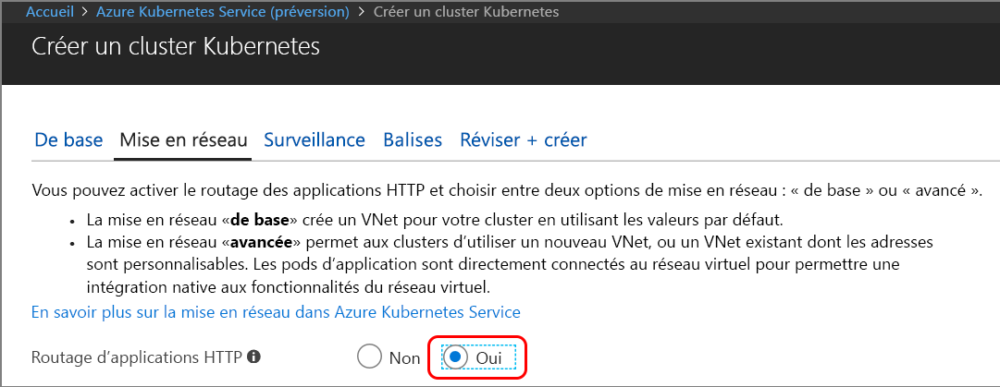

# <a name="quickstart-create-a-kubernetes-dev-space-with-azure-dev-spaces-nodejs"></a>Guide de démarrage rapide : créer un espace de développement Kubernetes avec Azure Dev Spaces (Node.js)

Dans ce guide, vous allez apprendre à :

- Configurez Azure Dev Spaces avec un cluster Kubernetes géré dans Azure.
- Développer du code de façon itérative dans des conteneurs en utilisant VS Code et la ligne de commande.
- Déboguez le code exécuté dans votre cluster.

> [!Note]
> **Si vous êtes bloqué**, consultez la section [Résolution des problèmes](troubleshooting.md) ou postez un commentaire sur cette page. Vous pouvez aussi essayer ce [didacticiel](get-started-nodejs.md) plus détaillé.

## <a name="prerequisites"></a>Prérequis

- Un abonnement Azure. Si vous n’avez pas d’abonnement Azure, vous pouvez créer un [compte gratuit](https://azure.microsoft.com/free).
- Un [cluster Kubernetes](https://ms.portal.azure.com/#create/microsoft.aks), qui exécute Kubernetes 1.9.6 dans les régions EastUS, WestEurope ou CanadaEast, avec le **routage d’application HTTP** activé.

  

- Visual Studio Code, que vous pouvez télécharger [ici](https://code.visualstudio.com/download).

## <a name="set-up-azure-dev-spaces"></a>Configurer Azure Dev Spaces

1. Installez [Azure CLI](/cli/azure/install-azure-cli?view=azure-cli-latest), version 2.0.33 ou ultérieure.
1. Configurez Dev Spaces sur votre cluster AKS : `az aks use-dev-spaces -g MyResourceGroup -n MyAKS`
1. Téléchargez l’[extension Azure Dev Spaces](https://aka.ms/get-azds-code) pour VS Code.
1. Installer l’extension : `code --install-extension path-to-downloaded-extension/azds-0.1.1.vsix`

## <a name="build-and-run-code-in-kubernetes"></a>Générer et exécuter du code dans Kubernetes

1. Téléchargez l’exemple de code à partir de GitHub : [https://github.com/Azure/dev-spaces](https://github.com/Azure/dev-spaces) 
1. Remplacez le répertoire par le dossier webfrontend : `cd dev-spaces/samples/nodejs/getting-started/webfrontend`
1. Générez des ressources de graphiques Docker et Helm : `azds prep --public`
1. Créez votre espace de développement dans AKS. Dans la fenêtre de terminal, exécutez la commande ci-après à partir du **dossier de code racine**, webfrontend : `azds up`
1. Analysez la sortie de la console pour y rechercher les informations concernant l’URL qui a été créée par la commande `up`. Ces informations se présentent sous la forme suivante : 

   `Service 'webfrontend' port 'http' is available at <url>` 

   Ouvrez cette URL dans une fenêtre de navigateur. Vous devriez alors voir l’application web se charger. 

### <a name="update-a-content-file"></a>Mettre à jour un fichier de contenu
Azure Dev Spaces vous permet non seulement d’obtenir un code s’exécutant dans Kubernetes, mais également de visualiser rapidement et de façon itérative la prise en compte des modifications de votre code dans un environnement Kubernetes dans le cloud.

1. Recherchez le fichier `./public/index.html` et procédez à une modification du code HTML. Par exemple, remplacez la couleur d’arrière-plan de la page par une nuance de bleu :

    ```html
    <body style="background-color: #95B9C7; margin-left:10px; margin-right:10px;">
    ```

1. Enregistrez le fichier . Quelques instants plus tard, la fenêtre de terminal affiche un message indiquant qu’un fichier du conteneur en cours d’exécution a été mis à jour.
1. Accédez à votre navigateur et actualisez la page. La couleur doit avoir été mise à jour.

Que s’est-il passé ? Les modifications des fichiers de contenu, comme HTML et CSS, ne nécessitent aucun redémarrage du processus Node.js. Par conséquent, une commande `azds up` active synchronise automatiquement tous les fichiers de contenu modifiés directement dans le conteneur en cours d’exécution dans Azure, ce qui vous permet de visualiser rapidement les modifications du contenu.

### <a name="test-from-a-mobile-device"></a>Tester l’application à partir d’un appareil mobile
Si vous ouvrez l’application web sur un appareil mobile, vous remarquerez que l’interface utilisateur ne s’affiche pas correctement sur un appareil de petite taille.

Pour résoudre ce problème, vous allez ajouter une balise META `viewport` :
1. Ouvrez le fichier `./public/index.html`.
1. Ajoutez une balise META `viewport` dans l’élément `head` existant :

    ```html
    <head>
        <!-- Add this line -->
        <meta name="viewport" content="width=device-width, initial-scale=1">
    </head>
    ```

1. Enregistrez le fichier .
1. Actualisez le navigateur de votre appareil. L’application web doit désormais s’afficher correctement. 

Cet exemple illustre le fait que certains problèmes sont indécelables tant que vous ne testez pas vos applications sur les appareils auxquels elles sont destinées. Grâce à Azure Dev Spaces, vous pouvez rapidement itérer sur votre code et valider les modifications sur les appareils cibles.

### <a name="update-a-code-file"></a>Mettre à jour un fichier de code
La mise à jour des fichiers de code côté serveur nécessite un peu plus de travail, car elle requiert le redémarrage d’une application Node.js.

1. Dans la fenêtre de terminal, appuyez sur `Ctrl+C` (pour arrêter `azds up`).
1. Ouvrez le fichier de code nommé `server.js`, puis modifiez le message Hello du service : 

    ```javascript
    res.send('Hello from webfrontend running in Azure!');
    ```

3. Enregistrez le fichier .
1. Exécutez `azds up` dans la fenêtre de terminal. 

Cette procédure régénère l’image conteneur et redéploie le graphique Helm. Rechargez la page du navigateur pour visualiser la prise en compte de vos modifications de code.

Toutefois, vous allez découvrir à la section suivante une *méthode encore plus rapide* pour développer du code. 

## <a name="debug-a-container-in-kubernetes"></a>Déboguer un conteneur dans Kubernetes

Dans cette section, vous utiliserez VS Code pour déboguer directement notre conteneur exécuté dans Azure. Vous apprendrez aussi à obtenir une boucle modification-exécution-test plus rapide.


### <a name="initialize-debug-assets-with-the-vs-code-extension"></a>Initialiser des ressources de débogage avec l’extension VS Code
Vous devez avant tout configurer votre projet de code pour permettre à VS Code de communiquer avec notre espace de développement dans Azure. L’extension VS Code pour Azure Dev Spaces fournit une commande d’assistance pour définir la configuration de débogage. 

Ouvrez la **Palette de commandes** (à partir du menu **Affichage | Palette de commandes**) et utilisez la saisie semi-automatique pour taper et sélectionnez cette commande : `Azure Dev Spaces: Create configuration files for connected development`. 

Celle-ci ajoute la configuration de débogage pour Azure Dev Spaces sous le dossier `.vscode`.


### <a name="select-the-azds-debug-configuration"></a>Sélectionner la configuration de débogage AZDS
1. Pour ouvrir l’affichage de débogage, cliquez sur l’icône Débogage dans la **barre d’activités** située sur le côté de VS Code.
1. Sélectionnez **Lancer le programme (AZDS)** comme configuration de débogage active.


> [!Note]
> Si la palette de commandes ne présente aucune commande Azure Dev Spaces, vérifiez que vous avez installé l’extension VS Code pour Azure Dev Spaces.

### <a name="debug-the-container-in-kubernetes"></a>Déboguer le conteneur dans Kubernetes
Pour déboguer votre code dans Kubernetes, appuyez sur **F5**.

Comme avec la commande `up`, le code est synchronisé avec l’espace de développement lorsque vous démarrez le débogage, et un conteneur est créé et déployé dans Kubernetes. Cette fois-ci, le débogueur est joint au conteneur distant.

> [!Tip]
> La barre d’état VS Code affichera une URL interactive.

Définissez un point d’arrêt dans un fichier de code côté serveur, par exemple dans la fonction `app.get('/api'...` du fichier `server.js`. Actualisez la page de navigateur ou appuyez sur le bouton « Say It Again » (Répéter), ce qui doit vous permettre d’atteindre le point d’arrêt et d’exécuter le code pas à pas.

Vous disposez d’un accès complet aux informations de débogage, exactement comme si le code s’exécutait en local, notamment à la pile des appels, aux variables locales, aux informations sur les exceptions, etc.

### <a name="edit-code-and-refresh-the-debug-session"></a>Modifier le code et actualiser la session de débogage
Lorsque le débogueur est actif, apportez une modification au code ; par exemple, modifiez de nouveau le message Hello :

```javascript
app.get('/api', function (req, res) {
    res.send('**** Hello from webfrontend running in Azure! ****');
});
```

Enregistrez le fichier, puis dans le **volet Actions de débogage**, cliquez sur le bouton **Actualiser**. 


Plutôt que de régénérer et redéployer une nouvelle image conteneur chaque fois que des modifications de code sont effectuées, cette opération nécessitant généralement un temps considérable, Azure Dev Spaces redémarre le processus Node.js entre les sessions de débogage afin d’accélérer la boucle de modification/débogage.

Actualisez l’application web dans le navigateur, ou appuyez sur le bouton *Say It Again* (Répéter). Votre message personnalisé doit apparaître dans l’interface utilisateur.

### <a name="use-nodemon-to-develop-even-faster"></a>Accélérer le développement grâce à nodemon

L’exemple `webfrontend` projet a été configuré pour utiliser [nodemon](https://nodemon.io/), un outil populaire permettant d’accélérer le développement de Node.js qui est entièrement compatible avec Azure Dev Spaces.

Essayez les étapes suivantes :
1. Arrêtez le débogueur VS Code.
1. Cliquez sur l’icône Débogage dans la **barre d’activités** située sur le côté de VS Code. 
1. Sélectionnez **Attacher (AZDS)** comme configuration de débogage active.
1. Appuyez sur F5.

Dans cette configuration, le conteneur est configuré pour démarrer *nodemon*. Lorsque vous modifiez le code du serveur, *nodemon* redémarre automatiquement le processus Node, exactement comme lors du développement en local. 
1. Modifiez de nouveau le message Hello dans `server.js`, puis enregistrez le fichier.
1. Actualisez le navigateur ou cliquez sur le bouton *Say It Again* (Répéter) pour visualiser la prise en compte de vos modifications.

**Vous disposez désormais d’une méthode d’itération rapide sur le code et de débogage directement dans Kubernetes.**

## <a name="next-steps"></a>Étapes suivantes

> [!div class="nextstepaction"]
> [Utilisation de plusieurs conteneurs et développement en équipe](get-started-nodejs.md#call-a-service-running-in-a-separate-container)