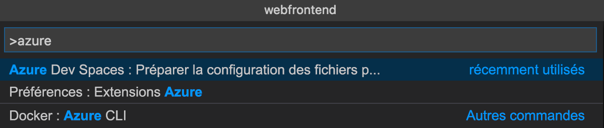
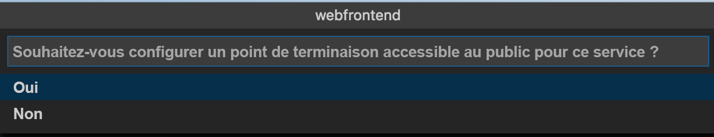
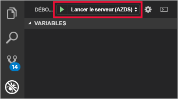
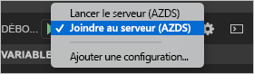

# <a name="quickstart-debug-and-iterate-on-kubernetes-with-visual-studio-code-and-nodejs---azure-dev-spaces"></a>Démarrage rapide : Déboguer et itérer dans Kubernetes avec Visual Studio Code et Node.js - Azure Dev Spaces

Dans ce guide, vous allez apprendre à :

- Configurer Azure Dev Spaces avec un cluster Kubernetes géré dans Azure.
- Développez du code de façon itérative dans des conteneurs avec Visual Studio Code.
- Déboguez le code dans votre espace de développement à partir de Visual Studio Code.

Azure Dev Spaces vous permet également de déboguer et d’itérer à l’aide de :
- [Java et Visual Studio Code](quickstart-java.md)
- [.NET Core et Visual Studio Code](quickstart-netcore.md)
- [.NET Core et Visual Studio](quickstart-netcore-visualstudio.md)

## <a name="prerequisites"></a>Conditions préalables requises

- Un abonnement Azure. Si vous n’avez pas d’abonnement Azure, vous pouvez créer un [compte gratuit](https://azure.microsoft.com/free).
- [Visual Studio Code installé](https://code.visualstudio.com/download).
- L’extension [Azure Dev Spaces](https://marketplace.visualstudio.com/items?itemName=azuredevspaces.azds) pour Visual Studio Code installée.
- [Azure CLI](/cli/azure/install-azure-cli?view=azure-cli-latest).

## <a name="create-an-azure-kubernetes-service-cluster"></a>Créer un cluster Azure Kubernetes Service

Vous devez créer un cluster AKS dans une [région prise en charge][supported-regions]. Les commandes ci-dessous créent un groupe de ressources nommé *MyResourceGroup* et un cluster AKS nommé *MyAKS*.

```cmd
az group create --name MyResourceGroup --location eastus
az aks create -g MyResourceGroup -n MyAKS --location eastus --disable-rbac --generate-ssh-keys
```

## <a name="enable-azure-dev-spaces-on-your-aks-cluster"></a>Activer Azure Dev Spaces sur votre cluster AKS

Utilisez la commande `use-dev-spaces` pour activer Dev Spaces sur votre cluster AKS et suivez les invites. La commande ci-dessous active Dev Spaces sur le cluster *MyAKS* dans le groupe *MyResourceGroup* et crée un espace de développement *par défaut*.

> [!NOTE]
> La commande `use-dev-spaces` installe également l’interface CLI Azure Dev Spaces si celle-ci n’est pas déjà installée. Vous ne pouvez pas installer l’interface CLI d’Azure Dev Spaces dans Azure Cloud Shell.

```cmd
$ az aks use-dev-spaces -g MyResourceGroup -n MyAKS

'An Azure Dev Spaces Controller' will be created that targets resource 'MyAKS' in resource group 'MyResourceGroup'. Continue? (y/N): y

Creating and selecting Azure Dev Spaces Controller 'MyAKS' in resource group 'MyResourceGroup' that targets resource 'MyAKS' in resource group 'MyResourceGroup'...2m 24s

Select a dev space or Kubernetes namespace to use as a dev space.
 [1] default
Type a number or a new name: 1

Kubernetes namespace 'default' will be configured as a dev space. This will enable Azure Dev Spaces instrumentation for new workloads in the namespace. Continue? (Y/n): Y

Configuring and selecting dev space 'default'...3s

Managed Kubernetes cluster 'MyAKS' in resource group 'MyResourceGroup' is ready for development in dev space 'default'. Type `azds prep` to prepare a source directory for use with Azure Dev Spaces and `azds up` to run.
```

## <a name="get-sample-application-code"></a>Obtenir l’exemple de code d’application

Dans cet article, vous utilisez l’[exemple d’application Azure Dev Spaces](https://github.com/Azure/dev-spaces) pour illustrer l’utilisation d’Azure Dev Spaces.

Clonez l’application à partir de GitHub.

```cmd
git clone https://github.com/Azure/dev-spaces
```

## <a name="prepare-the-sample-application-in-visual-studio-code"></a>Préparer l’exemple d’application dans Visual Studio Code

Ouvrez Visual Studio Code, cliquez sur *Fichier* puis sur *Ouvrir...* , accédez au répertoire *dev-spaces/samples/nodejs/getting-started/webfrontend*, puis cliquez sur *Ouvrir*.

Vous avez maintenant le projet *webfrontend* ouvert dans Visual Studio Code. Pour exécuter l’application dans votre espace de développement, générez les ressources de graphique Docker et Helm à l’aide de l’extension Azure Dev Spaces dans la palette de commandes.

Pour ouvrir la palette de commandes dans Visual Studio Code, cliquez sur *Afficher*, puis sur *Palette de commandes*. Commencez à taper `Azure Dev Spaces`, puis cliquez sur `Azure Dev Spaces: Prepare configuration files for Azure Dev Spaces`.



Quand Visual Studio Code vous invite également à configurer votre point de terminaison public, choisissez `Yes` pour activer un point de terminaison public.



Cette commande prépare votre projet à s’exécuter dans Azure Dev Spaces en générant un chart Dockerfile et Helm. Il génère également un répertoire *.vscode* avec la configuration de débogage à la racine de votre projet.

> [!TIP]
> Le [Dockerfile et le chart Helm](how-dev-spaces-works.md#prepare-your-code) de votre projet sont utilisés par Azure Dev Spaces pour générer et exécuter votre code. Toutefois, vous pouvez modifier ces fichiers si vous souhaitez changer la façon dont le projet est généré et exécuté.

## <a name="build-and-run-code-in-kubernetes-from-visual-studio-code"></a>Générer et exécuter du code dans Kubernetes à partir de Visual Studio Code

Cliquez sur l’icône *Déboguer* sur la gauche, puis sur *Lancer le serveur (AZDS)* en haut.



Cette commande génère et exécute votre service dans Azure Dev Spaces. La fenêtre *Terminal* dans le bas montre la sortie de la génération et les URL pour votre service exécutant Azure Dev Spaces. La *Console de débogage* montre la sortie du journal.

> [!Note]
> Si la *palette de commandes* ne montre aucune commande Azure Dev Spaces, vérifiez que vous avez installé l’[extension Visual Studio Code pour Azure Dev Spaces](https://marketplace.visualstudio.com/items?itemName=azuredevspaces.azds). Vérifiez également que vous avez ouvert le répertoire *dev-spaces/samples/nodejs/getting-started/webfrontend* dans Visual Studio Code.

Vous pouvez voir le service s’exécuter en ouvrant l’URL publique.

Cliquez sur *Déboguer*, puis sur *Arrêter le débogage* pour arrêter le débogueur.

## <a name="update-code"></a>Mettre à jour le code

Pour déployer une version mise à jour de votre service, vous pouvez mettre à jour n’importe quel fichier de votre projet, puis réexécuter la commande *Lancer le serveur*. Par exemple :

1. Si votre application est toujours en cours d’exécution, cliquez sur *Déboguer*, puis sur *Arrêter le débogage* pour l’arrêter.
1. Changez la [ligne 13 de `server.js`](https://github.com/Azure/dev-spaces/blob/master/samples/nodejs/getting-started/webfrontend/server.js#L13) en :
    
    ```javascript
        res.send('Hello from webfrontend in Azure');
    ```

1. Enregistrez vos modifications.
1. Réexécutez *Lancer le serveur*.
1. Accédez à votre service en cours d’exécution et observez vos modifications.
1. Cliquez sur *Déboguer*, puis sur *Arrêter le débogage* pour arrêter votre application.

## <a name="setting-and-using-breakpoints-for-debugging"></a>Définition et utilisation de points d’arrêt pour le débogage

Démarrez votre service en utilisant *Lancer le serveur (AZDS)* .

Revenez à la vue *Explorer* en cliquant sur *Afficher*, puis sur *Explorer*. Ouvrez `server.js`, puis cliquez quelque part sur la ligne 13 pour y placer votre curseur. Pour définir un point d’arrêt, appuyez sur *F9* ou cliquez sur *Déboguer*, puis sur *Activer/désactiver le point d’arrêt*.

Ouvrez votre service dans un navigateur ; notez qu’aucun message n’est affiché. Revenez à Visual Studio Code et notez que la ligne 13 est mise en surbrillance. Le point d’arrêt que vous avez défini a suspendu le service à la ligne 13. Pour reprendre le service, appuyez sur *F5* ou cliquez sur *Déboguer*, puis sur *Continuer*. Revenez à votre navigateur et notez que le message est maintenant affiché.

Quand vous exécutez votre service dans Kubernetes avec un débogueur attaché, vous avez un accès total aux informations de débogage, comme la pile des appels, les variables locales et les informations sur les exceptions.

Supprimez le point d’arrêt en plaçant votre curseur sur la ligne 13 dans `server.js` et en appuyant sur *F9*.

Cliquez sur *Déboguer*, puis sur *Arrêter le débogage* pour arrêter le débogueur.

## <a name="update-code-from-visual-studio-code"></a>Mettre à jour le code à partir de Visual Studio Code

Changez le mode de débogage en *Attacher à un serveur (AZDS)* et démarrez le service :



Cette commande génère et exécute votre service dans Azure Dev Spaces. Elle démarre également un processus [nodemon](https://nodemon.io) dans le conteneur de votre service et y attache VS Code. Le processus *nodemon* permet les redémarrages automatiques quand des modifications sont apportées au code source, permettant ainsi un développement plus rapide de la boucle interne, similaire au développement sur votre machine locale.

Une fois le service démarré, accédez-y avec votre navigateur et interagissez avec lui.

Avec le service en cours d’exécution, revenez à Visual Studio Code et mettez à jour la ligne 13 dans `server.js`. Par exemple :
```javascript
    res.send('Hello from webfrontend in Azure while debugging!');
```

Enregistrez le fichier et revenez à votre service dans un navigateur. Interagissez avec votre service et notez que votre message mis à jour est affiché.

Pendant l’exécution de *nodemon*, le processus du nœud est redémarré automatiquement dès que des modifications du code sont détectées. Ce processus de redémarrage automatique est similaire à l’expérience de modification et de redémarrage de votre service sur votre machine locale, fournissant une expérience de développement de la boucle interne.

## <a name="clean-up-your-azure-resources"></a>Nettoyer vos ressources Azure

```cmd
az group delete --name MyResourceGroup --yes --no-wait
```

## <a name="next-steps"></a>Étapes suivantes

Découvrez comment Azure Dev Spaces vous aide à développer des applications plus complexes sur plusieurs conteneurs, et comment vous pouvez simplifier le développement collaboratif en utilisant différentes versions ou branches de votre code dans différents espaces.

> [!div class="nextstepaction"]
> [Utilisation de plusieurs conteneurs et développement en équipe](multi-service-nodejs.md)


[supported-regions]: https://azure.microsoft.com/global-infrastructure/services/?products=kubernetes-service
