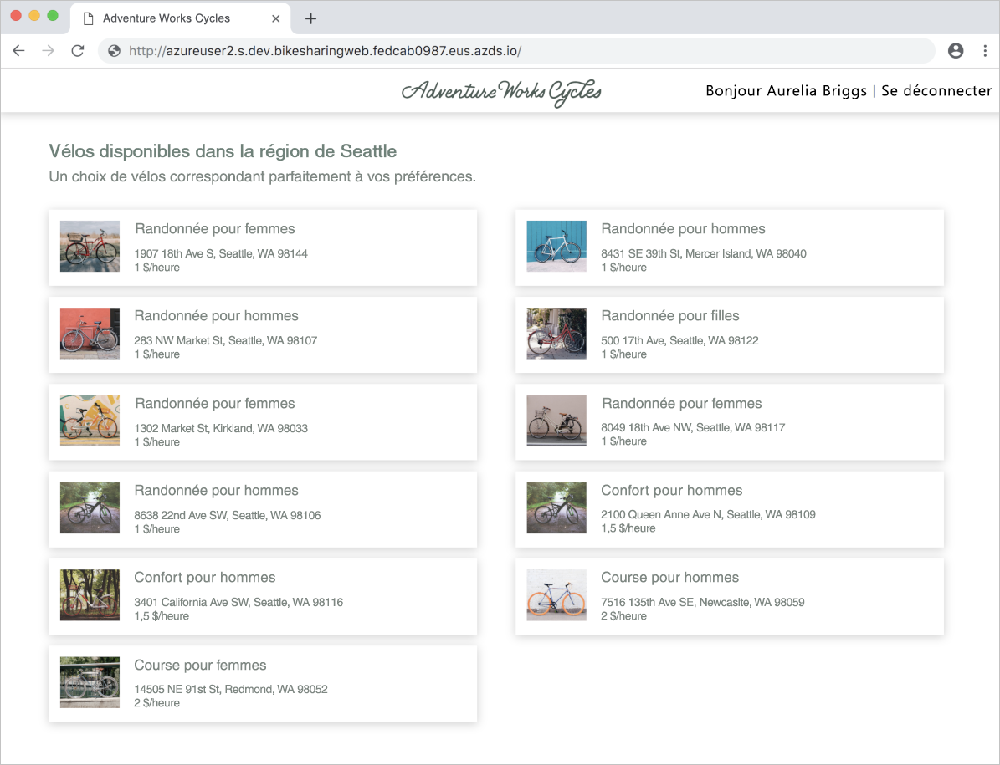

# <a name="quickstart-team-development-on-kubernetes---azure-dev-spaces"></a>Démarrage rapide : Développement en équipe dans Kubernetes avec Azure Dev Spaces

Dans ce guide, vous allez apprendre à :

- Configurer Azure Dev Spaces sur un cluster Kubernetes managé dans Azure.
- Déployer une vaste application avec plusieurs microservices dans un espace de développement.
- Tester un microservice unique dans un espace de développement isolé dans le contexte de l’application complète.


## <a name="prerequisites"></a>Conditions préalables requises

- Un abonnement Azure. Si vous n’avez pas d’abonnement Azure, vous pouvez créer un [compte gratuit](https://azure.microsoft.com/free).
- [Azure CLI](/cli/azure/install-azure-cli?view=azure-cli-latest).
- [Helm 2.13 à 2.16 installé][helm-installed].

## <a name="create-an-azure-kubernetes-service-cluster"></a>Créer un cluster Azure Kubernetes Service

Vous devez créer un cluster AKS dans une [région prise en charge][supported-regions]. Les commandes ci-dessous créent un groupe de ressources nommé *MyResourceGroup* et un cluster AKS nommé *MyAKS*.

```cmd
az group create --name MyResourceGroup --location eastus
az aks create -g MyResourceGroup -n MyAKS --location eastus --disable-rbac --generate-ssh-keys
```

## <a name="enable-azure-dev-spaces-on-your-aks-cluster"></a>Activer Azure Dev Spaces sur votre cluster AKS

Utilisez la commande `use-dev-spaces` pour activer Dev Spaces sur votre cluster AKS et suivez les invites. La commande ci-dessous active Dev Spaces sur le cluster *MyAKS* dans le groupe *MyResourceGroup* et crée un espace de développement appelé *dev*.

> [!NOTE]
> La commande `use-dev-spaces` installe également l’interface CLI Azure Dev Spaces si celle-ci n’est pas déjà installée. Vous ne pouvez pas installer l’interface CLI d’Azure Dev Spaces dans Azure Cloud Shell.

```cmd
az aks use-dev-spaces -g MyResourceGroup -n MyAKS --space dev --yes
```

## <a name="get-sample-application-code"></a>Obtenir l’exemple de code d’application

Dans cet article, vous utilisez l’[exemple d’application de partage de vélos Azure Dev Spaces](https://github.com/Azure/dev-spaces/tree/master/samples/BikeSharingApp) pour illustrer l’utilisation d’Azure Dev Spaces.

Clonez l’application à partir de GitHub, puis accédez à son répertoire :

```cmd
git clone https://github.com/Azure/dev-spaces
cd dev-spaces/samples/BikeSharingApp/
```

## <a name="retrieve-the-hostsuffix-for-dev"></a>Récupérez HostSuffix pour *dev*

Utilisez la commande `azds show-context` pour afficher HostSuffix pour *dev*.

```cmd
$ azds show-context

Name                ResourceGroup     DevSpace  HostSuffix
------------------  ----------------  --------  -----------------------
MyAKS               MyResourceGroup   dev       fedcab0987.eus.azds.io
```

## <a name="update-the-helm-chart-with-your-hostsuffix"></a>Mettre à jour le graphique Helm avec votre HostSuffix

Ouvrez [charts/values.yaml](https://github.com/Azure/dev-spaces/blob/master/samples/BikeSharingApp/charts/values.yaml) et remplacez toutes les instances de `<REPLACE_ME_WITH_HOST_SUFFIX>` par la valeur HostSuffix récupérée précédemment. Enregistrer vos modifications et fermez le fichier.

## <a name="run-the-sample-application-in-kubernetes"></a>Exécutez l’exemple d’application dans Kubernetes

Les commandes pour l’exécution de l’exemple d’application sur Kubernetes font partie d’un processus existant et ne dépendent pas des outils Azure Dev Spaces. Dans ce cas, Helm représente les outils utilisés pour exécuter cet exemple d’application, mais d’autres outils pourraient être utilisés pour exécuter votre application complète dans un espace de noms au sein d’un cluster. Les commandes Helm ciblent l’espace de développement nommé *dev* que vous avez créé précédemment, mais cet espace de développement est également un espace de noms Kubernetes. Par conséquent, comme les autres espace de noms, les espaces de développement peuvent être ciblés par d’autres outils.

Vous pouvez utiliser Azure Dev Spaces pour le développement en équipe lorsqu’une application est en cours d’exécution dans un cluster, quels que soient les outils utilisés pour le déployer.

Utilisez les commandes `helm init` et `helm install` pour configurer et installer l’exemple d’application sur votre cluster.

```cmd
cd charts/
helm init --wait
helm install -n bikesharing . --dep-up --namespace dev --atomic 
```
> [!Note]
> **Si vous utilisez un cluster où RBAC est activé**, veillez à configurer [un compte de service pour Tiller](https://helm.sh/docs/using_helm/#role-based-access-control). Sinon, les commandes `helm` échoueront.

La commande `helm install` peut prendre plusieurs minutes. La sortie de la commande affiche l’état de tous les services qu'elle a déployés sur le cluster lors de son exécution :

```cmd
$ cd charts/
$ helm init --wait
...
Happy Helming!

$ helm install -n bikesharing . --dep-up --namespace dev --atomic

Hang tight while we grab the latest from your chart repositories...
...
NAME               READY  UP-TO-DATE  AVAILABLE  AGE
bikes              1/1    1           1          4m32s
bikesharingweb     1/1    1           1          4m32s
billing            1/1    1           1          4m32s
gateway            1/1    1           1          4m32s
reservation        1/1    1           1          4m32s
reservationengine  1/1    1           1          4m32s
users              1/1    1           1          4m32s
```

Après avoir installé l’exemple d’application et activé Dev Spaces sur votre cluster, utilisez la commande `azds list-uris` pour afficher les URL de l’exemple d’application dans le *dev* actuellement sélectionné.

```cmd
$ azds list-uris
Uri                                                 Status
--------------------------------------------------  ---------
http://dev.bikesharingweb.fedcab0987.eus.azds.io/  Available
http://dev.gateway.fedcab0987.eus.azds.io/         Available
```

Accédez au service *bikesharingweb* en ouvrant l’URL publique à partir de la commande `azds list-uris`. Dans l’exemple ci-dessus, l’URL publique pour le service *bikesharingweb* est `http://dev.bikesharingweb.fedcab0987.eus.azds.io/`. Sélectionnez *Aurelia Briggs (client)* en tant qu’utilisateur. Vérifiez que vous voyez le texte *Bonjour Aurelia Briggs | Se déconnecter* en haut.



## <a name="create-child-dev-spaces"></a>Créer des espaces de développement enfants

Utilisez la commande `azds space select` pour créer deux espaces enfants sous *dev* :

```cmd
azds space select -n dev/azureuser1 -y
azds space select -n dev/azureuser2 -y
```

Les commandes ci-dessus créent sous *dev* deux espaces enfants nommés *azureuser1* et *azureuser2*. Ces deux espaces enfants représentent des espaces de développement distincts destinés à être utilisés par les *azureuser1* et *azureuser2* des développeurs pour apporter des modifications à l’exemple d’application.

Utilisez la commande `azds space list` pour répertorier tous les espaces de développement et confirmer que *dev/azureuser2* est sélectionné.

```cmd
$ azds space list
   Name            DevSpacesEnabled
-  --------------  ----------------
   default         False
   dev             True
   dev/azureuser1  True
*  dev/azureuser2  True
```

Utilisez `azds list-uris` pour afficher les URL de l’exemple d’application dans l’espace actuellement sélectionné, à savoir *dev/azureuser2*.

```cmd
$ azds list-uris
Uri                                                             Status
--------------------------------------------------              ---------
http://azureuser2.s.dev.bikesharingweb.fedcab0987.eus.azds.io/  Available
http://azureuser2.s.dev.gateway.fedcab0987.eus.azds.io/         Available
```

Confirmez que les URL affichés par la commande `azds list-uris` ont le préfixe *azureuser2.s.dev*. Ce préfixe confirme que l’espace actuellement sélectionné est *azureuser2*, qui est un enfant de *dev*.

Accédez au service *bikesharingweb* pour l’espace de développement *dev/azureuser2* en ouvrant l’URL publique à partir de la commande `azds list-uris`. Dans l’exemple ci-dessus, l’URL publique pour le service *bikesharingweb* est `http://azureuser2.s.dev.bikesharingweb.fedcab0987.eus.azds.io/`. Sélectionnez *Aurelia Briggs (client)* en tant qu’utilisateur. Vérifiez que vous voyez le texte *Bonjour Aurelia Briggs | Se déconnecter* en haut.

## <a name="update-code"></a>Mettre à jour le code

Ouvrez *BikeSharingWeb/components/Header.js* avec un éditeur de texte et modifiez le texte dans [l’élément Span avec `userSignOut` className](https://github.com/Azure/dev-spaces/blob/master/samples/BikeSharingApp/BikeSharingWeb/components/Header.js#L16).

```html
<span className="userSignOut">
    <Link href="/devsignin"><span tabIndex="0">Welcome {props.userName} | Sign out</span></Link>
</span>
```

Enregistrer vos modifications et fermez le fichier.

## <a name="build-and-run-the-updated-bikesharingweb-service-in-the-devazureuser2-dev-space"></a>Créer et exécuter le service bikesharingweb mis à jour dans l’espace de développement *dev/azureuser2*

Accédez au répertoire *BikeSharingWeb/* et exécutez la commande `azds up`.

```cmd
$ cd ../BikeSharingWeb/
$ azds up

Using dev space 'dev/azureuser2' with target 'MyAKS'
Synchronizing files...2s
...
Service 'bikesharingweb' port 'http' is available at http://azureuser2.s.dev.bikesharingweb.fedcab0987.eus.azds.io/
Service 'bikesharingweb' port 80 (http) is available at http://localhost:54256
...
```

Cette commande crée et exécute le service *bikesharingweb* dans l’espace de développement *dev/azureuser2*. Ce service s’exécute en plus du service *bikesharingweb* en cours d’exécution dans *dev* et est utilisé uniquement pour les requêtes avec le préfixe d’URL *azureuser2.s*. Pour plus d’informations sur le routage entre des espaces de développement parents et enfants, consultez [Fonctionnement et configuration d’Azure Dev Spaces](how-dev-spaces-works.md).

Accédez au service *bikesharingweb* pour l’espace de développement *dev/azureuser2* en ouvrant l’URL publique affichée dans la sortie de la commande `azds up`. Sélectionnez *Aurelia Briggs (client)* en tant qu’utilisateur. Vérifiez que vous voyez le texte mis à jour en haut à droite. Vous devrez peut-être actualiser la page ou effacer le cache de votre navigateur si vous ne voyez pas immédiatement cette modification.


> [!NOTE]
> Quand vous accédez à votre service pendant l’exécution de `azds up`, les traces des requêtes HTTP sont également affichées dans la sortie de la commande `azds up`. Ces traces peuvent vous aider à résoudre les problèmes liés à votre service et à le déboguer. Vous pouvez désactiver ces traces à l’aide de `--disable-http-traces` lors de l’exécution de `azds up`.

## <a name="verify-other-dev-spaces-are-unchanged"></a>Vérifiez que les autres espaces de développement n’ont pas été modifiés

Si la commande `azds up` est toujours en cours d’exécution, appuyez sur *Ctrl+C*.

```cmd
$ azds list-uris --all
Uri                                                             Status
--------------------------------------------------              ---------
http://azureuser1.s.dev.bikesharingweb.fedcab0987.eus.azds.io/  Available
http://azureuser1.s.dev.gateway.fedcab0987.eus.azds.io/         Available
http://azureuser2.s.dev.bikesharingweb.fedcab0987.eus.azds.io/  Available
http://azureuser2.s.dev.gateway.fedcab0987.eus.azds.io/         Available
http://dev.bikesharingweb.fedcab0987.eus.azds.io/               Available
http://dev.gateway.fedcab0987.eus.azds.io/                      Available
```

Accédez à la version *dev* de *bikesharingweb* dans votre navigateur, choisissez *Aurelia Briggs (client)* en tant qu’utilisateur et vérifiez que vous voyez le texte d’origine en haut à droite. Répétez ces étapes avec l’URL *dev/azureuser1*. Notez que les modifications sont appliquées uniquement à la version *dev/azureuser2* de *bikesharingweb*. Cette isolation des modifications apportées à *dev/azureuser2* permet à *azureuser2* d’apporter des modifications sans affecter *azureuser1*.

Pour que ces modifications soient répercutées dans *dev* et *dev/azureuser1*, vous devez suivre le flux de travail existant ou le pipeline CI/CD de votre équipe. Par exemple, ce flux de travail peut impliquer de valider vos modifications dans votre système de contrôle de version et de déployer la mise à jour à l’aide d’un pipeline CI/CD ou d’outils tels que Helm.

## <a name="clean-up-your-azure-resources"></a>Nettoyer vos ressources Azure

```cmd
az group delete --name MyResourceGroup --yes --no-wait
```

## <a name="next-steps"></a>Étapes suivantes

Découvrez comment Azure Dev Spaces vous aide à développer des applications plus complexes sur des conteneurs multiples, et comment il vous est possible de simplifier le développement collaboratif en utilisant différentes versions ou branches de votre code dans différents espaces.

> [!div class="nextstepaction"]
> [Utilisation de plusieurs conteneurs et développement en équipe](multi-service-nodejs.md)

[helm-installed]: https://v2.helm.sh/docs/using_helm/#installing-helm
[supported-regions]: about.md#supported-regions-and-configurations
