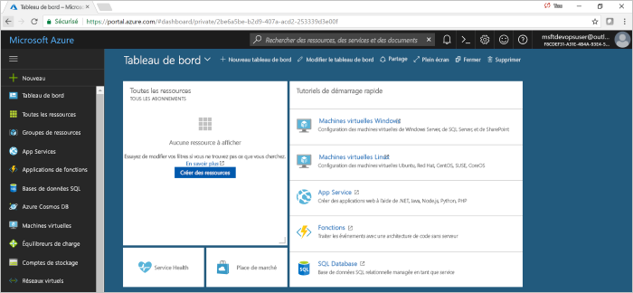
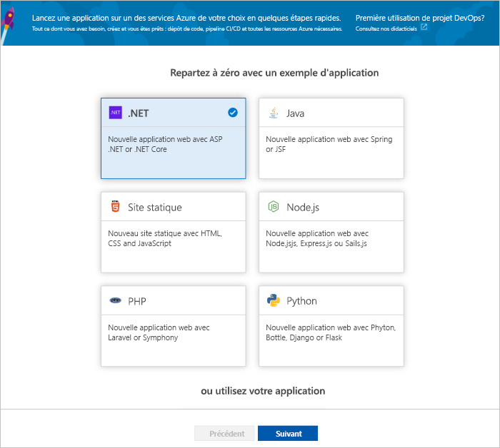

# Créer un pipeline CI/CD pour .NET avec Azure DevOps Projects

Configurez l’intégration continue (CI) et la livraison continue (CD) pour votre application .NET Core ou ASP.NET avec DevOps Projects. DevOps Projects simplifie la configuration initiale d’un pipeline de build et de mise en production dans Azure Pipelines.

Si vous ne disposez pas d’un abonnement Azure, vous pouvez en obtenir un gratuitement via [Visual Studio Dev Essentials](https://visualstudio.microsoft.com/dev-essentials/).

## Connectez-vous au portail Azure.

Azure DevOps Projects crée un pipeline CI/CD dans Azure DevOps. Vous pouvez créer une organisation Azure DevOps ou utiliser une organisation existante. DevOps Projects crée également des ressources Azure dans l’abonnement Azure de votre choix.

1. Connectez-vous au [portail Microsoft Azure](https://portal.azure.com).

1. Dans le volet gauche, sélectionnez l’icône **Créer une ressource** dans la barre de navigation gauche, puis recherchez **DevOps Projects**.  

3.  Sélectionnez **Créer**.

    

## Sélectionner un exemple d’application et le service Azure

1. Sélectionnez l’exemple d’application .NET. Les exemples .NET offrent le choix entre une infrastructure ASP.NET open source et une infrastructure .NET Core multiplateforme.

    

1. Sélectionnez le framework d’application .NET Core.  
    Cet exemple est une application MVC ASP.NET Core.
    
2. Sélectionnez **Suivant**.  
    La cible de déploiement par défaut est Web App sur Windows.  Si vous le souhaitez, vous pouvez choisir Web App sur Linux ou Web App pour conteneurs.  Le framework d’application, que vous avez choisi précédemment, détermine le type de cible de déploiement de service Azure disponible ici.  
    
3. Laissez le service par défaut, puis sélectionnez **Suivant**.

## Configurer Azure DevOps et un abonnement Azure 

1. Créez gratuitement une organisation Azure DevOps ou choisissez une organisation existante.

    a. Choisissez un nom pour votre projet. 

    b. Sélectionnez votre abonnement et un emplacement Azure, choisissez un nom pour votre application, puis sélectionnez **Terminé**.  
    Après quelques minutes, le tableau de bord DevOps Projects s’affiche dans le portail Azure. Un exemple d’application est configuré dans un dépôt de votre organisation Azure DevOps, une build est exécutée et votre application est déployée sur Azure. Ce tableau de bord donne une visibilité sur votre dépôt de code, le pipeline CI/CD et votre application dans Azure.
    

2. Sur la droite du tableau de bord, sélectionnez **Parcourir** pour voir votre application en cours d’exécution.

     

## Valider les modifications de code et exécuter CI/CD

 DevOps Projects crée un dépôt Git dans Azure Repos ou dans GitHub. Pour voir le dépôt et modifier le code dans votre application, suivez les étapes ci-dessous :

1. À gauche du tableau de bord DevOps Projects, sélectionnez le lien correspondant à votre branche **master**.  
Ce lien ouvre une vue sur le dépôt Git récemment créé.

1. Pour afficher l’URL du clone du dépôt, sélectionnez **Clone** en haut à droite du navigateur.  
Vous pouvez cloner votre dépôt Git dans votre environnement de développement intégré favori.  Dans les prochaines étapes, vous allez utiliser le navigateur web pour effectuer des modifications de code directement dans la branche master et les valider.

1. Sur la gauche du navigateur, accédez au fichier **Views/Home/index.cshtml**.

1. Sélectionnez **Modifier**, puis modifiez le titre h2. Par exemple, tapez **Prise en main directe d’Azure DevOps Projects** ou faites une autre modification.

    

1. Sélectionnez **Valider**, puis enregistrez vos modifications.

1. Dans le navigateur, accédez au tableau de bord Azure DevOps Projects.  Vous devez maintenant voir qu’une build est en cours. Les modifications que vous avez apportées font automatiquement l’objet d’une build et d’un déploiement via un pipeline CI/CD.

## Examiner le pipeline CI/CD

Dans l’étape précédente, Azure DevOps Projects a automatiquement configuré un pipeline CI/CD complet. Explorez et personnalisez le pipeline selon vos besoins. Pour vous familiariser avec les pipelines de build et de mise en production d’Azure DevOps, effectuez les étapes suivantes.

1. En haut du tableau de bord DevOps Projects, sélectionnez **Pipelines de build**.  
Ce lien ouvre un onglet du navigateur et le pipeline de build Azure DevOps pour votre nouveau projet.

1. Sélectionnez les points de suspension (...).  Cette action ouvre un menu permettant de lancer plusieurs activités, comme mettre une nouvelle build en file d’attente, mettre en pause une build et modifier le pipeline de build.

1. Sélectionnez **Modifier**.

    

1. Dans ce volet, vous pouvez examiner les différentes tâches de votre pipeline de build.  
 La build effectue différentes tâches, comme la récupération (fetch) de sources dans le dépôt Git, la restauration de dépendances et la publication des sorties utilisées pour les déploiements.

1. En haut du pipeline de build, sélectionnez le nom du pipeline de build.

1. Remplacez le nom de votre pipeline de build par un nom plus descriptif, sélectionnez **Enregistrer et mettre en file d’attente**, puis sélectionnez **Enregistrer**.

1. Sous le nom de votre pipeline de build, sélectionnez **Historique**.   
Dans le volet **Historique**, vous pouvez voir une piste d’audit des modifications que vous avez apportées récemment à la build.  Azure Pipelines fait le suivi des modifications apportées au pipeline de build et vous permet de comparer des versions.

1. Sélectionnez **Déclencheurs**.  
DevOps Projects a créé automatiquement un déclencheur CI, et chaque validation dans le dépôt lance une nouvelle build.  Vous pouvez éventuellement choisir d’inclure ou d’exclure des branches dans le processus d’intégration continue.

1. Sélectionnez **Rétention**.  
En fonction de votre scénario, vous pouvez spécifier des stratégies pour conserver ou supprimer un certain nombre de builds.

1. Sélectionnez **Build et mise en production**, puis **Mises en production**.  
DevOps Projects crée un pipeline de mise en production pour gérer les déploiements sur Azure.

1.  Sur la gauche, sélectionnez les points de suspension (...) en regard de votre pipeline de mise en production, puis sélectionnez **Modifier**.  
Le pipeline de mise en production contient un pipeline qui définit le processus de mise en production.  

1. Sous **Artefacts**, sélectionnez **Déposer**.  Le pipeline de build que vous avez examiné aux étapes précédentes génère la sortie utilisée pour l’artefact. 

1. En regard de l’icône **Déposer**, sélectionnez le **déclencheur de déploiement continu**.  
Ce pipeline de mise en production a un déclencheur CD activé, qui effectue un déploiement chaque fois qu’un nouvel artefact de build est disponible. Si vous le souhaitez, vous pouvez désactiver le déclencheur, vos déploiements nécessitant alors une exécution manuelle.  

1. Sur la gauche, sélectionnez **Tâches**.   
Les tâches sont les activités effectuées par votre processus de déploiement. Dans cet exemple, une tâche a été créée pour déployer sur Azure App Service.

1. Sur la droite, sélectionnez **Afficher les mises en production**. Cette vue affiche un historique des mises en production.

1. Sélectionnez les points de suspension (...) en regard d’une de vos mises en production, puis sélectionnez **Ouvrir**.  
Il y a plusieurs menus à explorer, comme un résumé des mises en production, les éléments de travail associés et les tests.

1. Sélectionnez **Validations**.   
Cette vue montre les validations de code associées au déploiement spécifique. 

1. Sélectionnez **Journaux d’activité**.  
Les journaux d’activité contiennent des informations utiles sur le processus de déploiement. Ils peuvent être affichés pendant et après les déploiements.

## Supprimer des ressources

Quand vous n’en avez plus besoin, vous pouvez supprimer Azure App Service et les autres ressources associées que vous avez créées. Utilisez la fonctionnalité **Supprimer** du tableau de bord DevOps Projects.

## Étapes suivantes

Pour plus d’informations sur la modification des pipelines de build et de mise en production dans le but de répondre aux besoins de votre équipe, consultez ce tutoriel :

> [!div class="nextstepaction"]
> [Personnaliser le processus CD](https://docs.microsoft.com/azure/devops/pipelines/release/define-multistage-release-process?view=vsts)

## vidéos

> [!VIDEO https://www.youtube.com/embed/itwqMf9aR0w]
