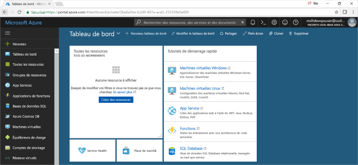
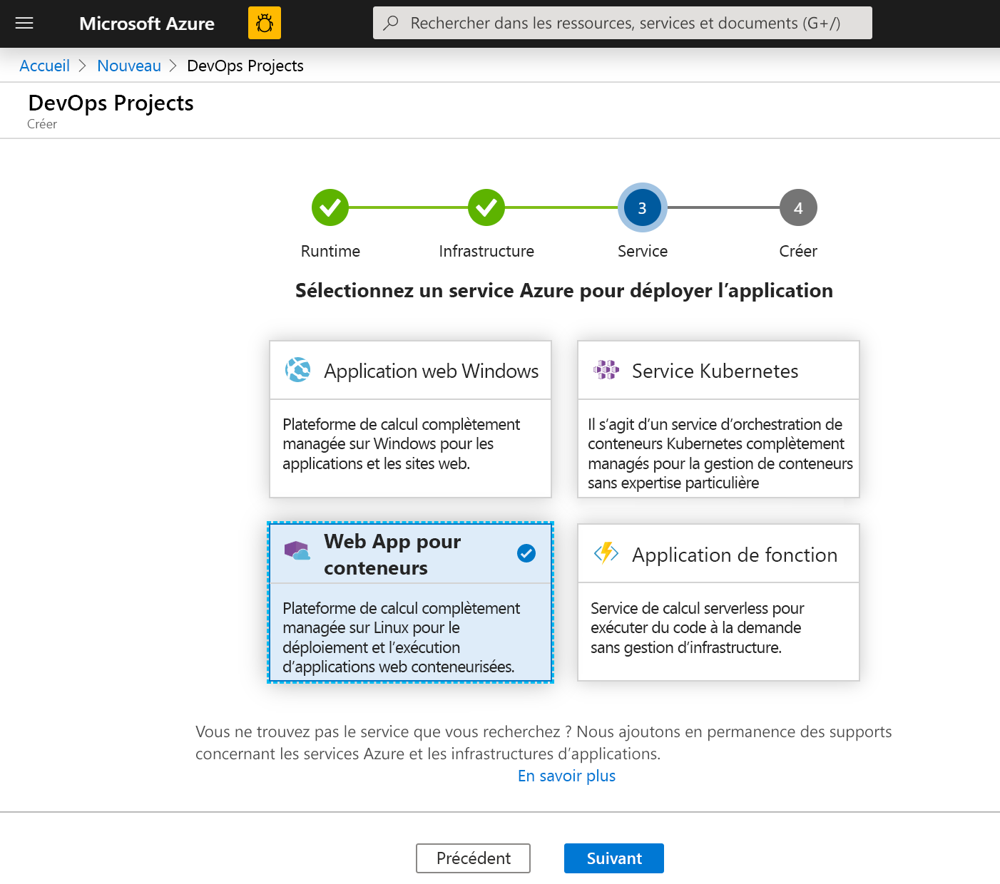
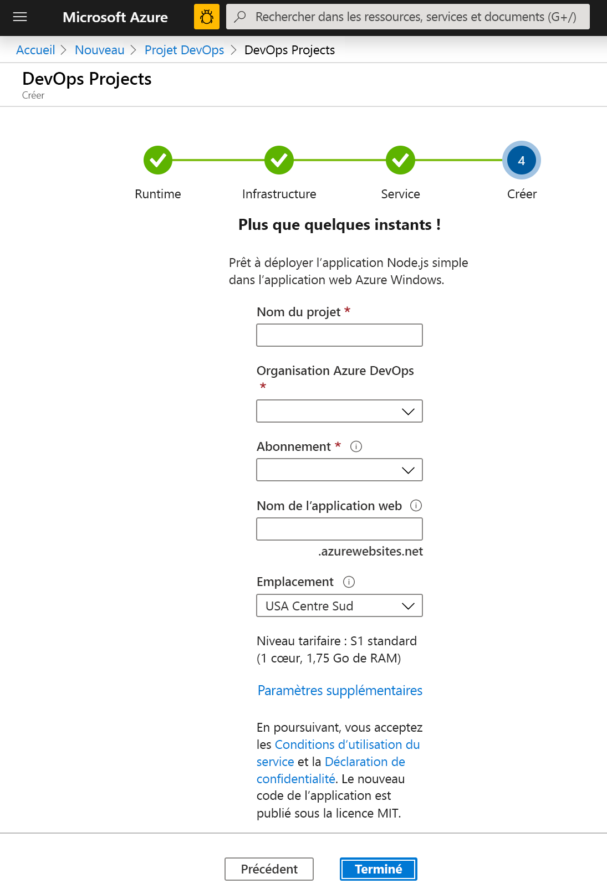
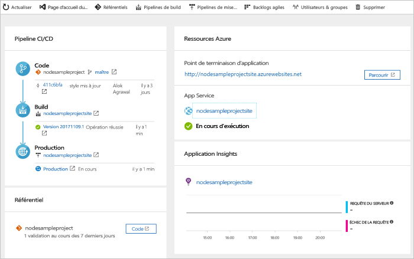
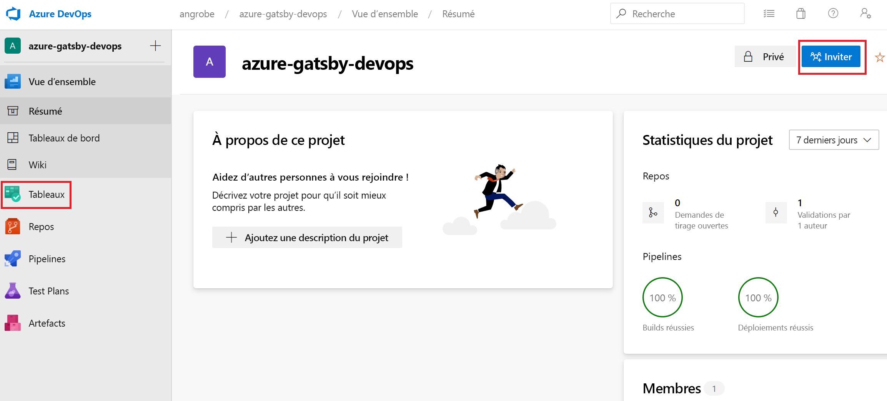
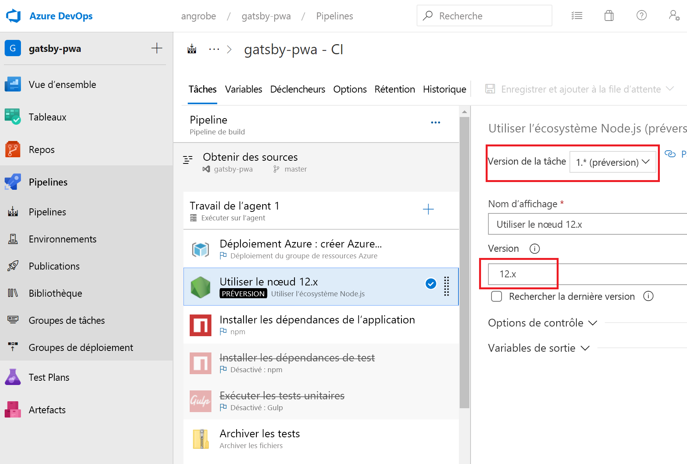
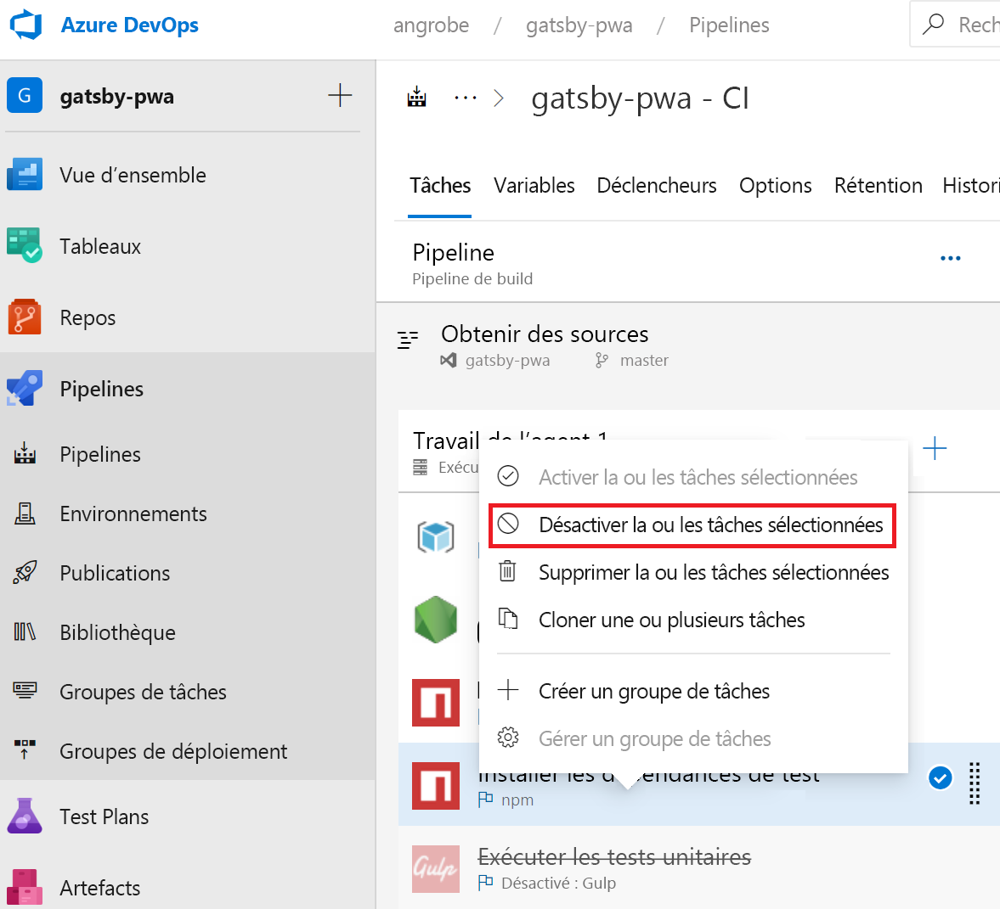
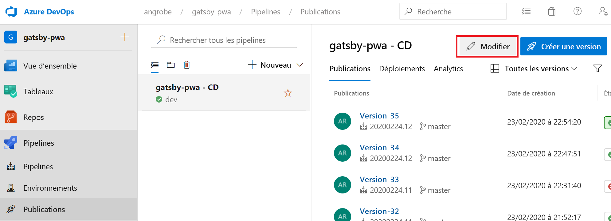
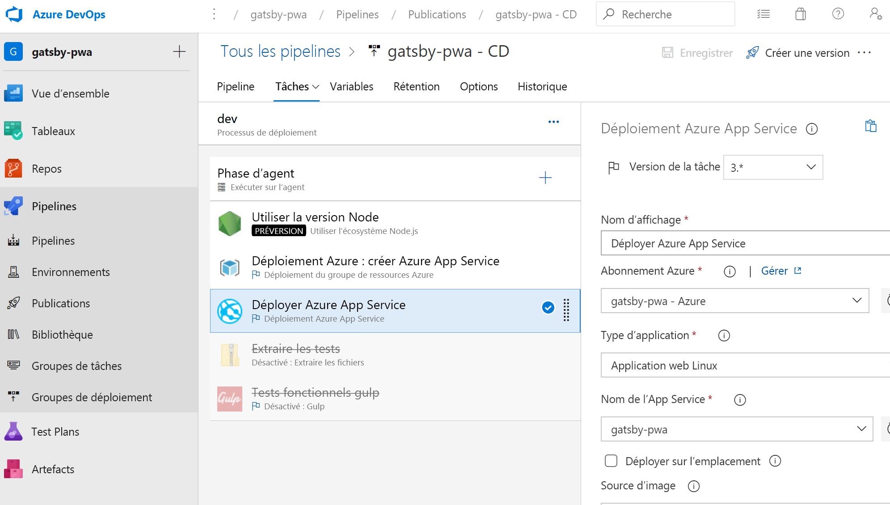

# <a name="create-a-cicd-pipeline-in-azure-pipelines-for-nodejs-with-azure-devops-starter"></a>Créer un pipeline CI/CD dans Azure Pipelines pour Node.js avec Azure DevOps Starter

Dans ce guide de démarrage rapide, vous allez créer une application web progressive (PWA, progressive web app) NodeJS en utilisant [GatsbyJS](https://www.gatsbyjs.org/) et l’expérience de création Azure DevOps Starter simplifiée. Quand vous aurez terminé, vous disposerez d’un pipeline d’intégration continue (CI) et d’un pipeline de livraison continue (CD) pour votre PWA dans Azure Pipelines. Azure DevOps Starter configure ce dont vous avez besoin pour le développement, le déploiement et la supervision.

## <a name="prerequisites"></a>Prérequis

- Compte Azure avec un abonnement actif. [Créez un compte gratuitement](https://azure.microsoft.com/free/?ref=microsoft.com&utm_source=microsoft.com&utm_medium=docs&utm_campaign=visualstudio). 
- Une organisation [Azure DevOps](https://azure.microsoft.com/services/devops/).

## <a name="sign-in-to-the-azure-portal"></a>Connectez-vous au portail Azure.

DevOps Starter crée un pipeline CI/CD dans Azure Pipelines. Vous pouvez créer une organisation Azure DevOps ou utiliser une organisation existante. DevOps Starter crée également des ressources Azure dans l’abonnement Azure de votre choix.

1. Connectez-vous au [portail Azure](https://portal.azure.com), puis dans le volet de gauche, sélectionnez **Créer une ressource**. 

   

1. Dans la zone de recherche, tapez, puis sélectionnez **DevOps Starter**. Cliquez sur le **signe +** pour créer une ressource.

    

## <a name="select-a-sample-application-and-azure-service"></a>Sélectionner un exemple d’application et le service Azure

1. Sélectionnez l’exemple d’application Node.js.   

     

1. **Express.js** est l’exemple d’infrastructure par défaut. Sélectionnez **Application Node.js simple** à la place, puis sélectionnez **Suivant**. 

     

1. Les cibles de déploiement disponibles dans cette étape dépendent du framework d’application qui a été sélectionné à l’étape 2. Dans cet exemple, **Application web Windows** est la cible de déploiement par défaut. Laissez la sélection sur **Web App pour conteneurs**, puis sélectionnez **Suivant**.

    

## <a name="configure-a-project-name-and-an-azure-subscription"></a>Configurer un nom de projet et un abonnement Azure

1. À la dernière étape du workflow de création DevOps Starter, vous attribuez un nom au projet, vous sélectionnez un abonnement Azure, puis vous sélectionnez **Terminé**.  

    

1. Une page de résumé s’affiche lorsque votre projet est généré et que votre application est déployée sur Azure. Après un court moment, un projet est créé dans votre [organisation Azure DevOps](https://dev.azure.com/) qui comprend un dépôt Git, un tableau Kanban, un pipeline de déploiement, des plans de test et les artefacts requis par votre application.  

## <a name="managing-your-project"></a>Gérer votre projet

1. Accédez à **Toutes les ressources** et recherchez votre projet DevOps Starter. Sélectionnez votre projet **DevOps Starter**.

    

1. Vous accédez à un tableau de bord qui fournit des informations sur la page d’accueil de votre projet, le dépôt de code, le pipeline CI/CD, ainsi qu’un lien vers votre application en cours d’exécution. Sélectionnez **Page d’accueil du projet** pour voir votre application dans **Azure DevOps** et, dans un autre onglet du navigateur, sélectionnez **Point de terminaison d’application** pour voir l’exemple d’application s’exécuter. Nous modifierons cet exemple plus tard afin d’utiliser l’application PWA générée avec GatsbyJS.

     

1. À partir de votre projet Azure DevOps, vous pouvez inviter des membres de l’équipe à collaborer et établir un tableau Kanban pour débuter le suivi de votre travail. Vous pourrez trouver plus d’informations [ici](/azure/devops/user-guide/what-is-azure-devops?view=azure-devops).



## <a name="clone-the-repo-and-install-your-gatsby-pwa"></a>Cloner le dépôt et installer votre application PWA Gatsby

DevOps Starter crée un dépôt Git dans Azure Repos ou dans GitHub. Cet exemple a créé un dépôt Azure. L’étape suivante consiste à cloner le dépôt et à apporter quelques modifications.

1. Sélectionnez **Dépôts** dans votre **projet DevOps**, puis cliquez sur **Cloner**.  Il existe plusieurs façons de cloner le dépôt Git sur votre bureau.  Choisissez celle qui correspond à votre expérience de développement.  

    

1. Une fois le dépôt cloné sur votre bureau, apportez des modifications au modèle de démarrage. Commencez par installer l’interface CLI GatsbyJS à partir de votre terminal.

   ```powershell
    npm install -g gatsby
   ```

1. À partir du terminal, accédez à la racine de votre dépôt. Vous devez voir trois dossiers comme dans cet exemple :

    ```powershell
    Mode                LastWriteTime         Length Name
    ----                -------------         ------ ----
    d-----        2/23/2020  10:42 PM                Application
    d-----        2/23/2020   3:05 PM                ArmTemplates
    d-----        2/23/2020   3:05 PM                Tests
    ```
    
1. Nous n’avons pas besoin des fichiers contenus dans le dossier Application, car nous allons remplacer ce dernier par un modèle de démarrage Gatsby. Exécutez les commandes suivantes, dans l’ordre, pour supprimer le dossier.
    
    ```powershell
    cp .\Application\Dockerfile .
    rmdir Application
    ```

1. Utilisez l’interface CLI Gatsby pour générer un exemple d’application PWA. Exécutez `gatsby new` à partir du terminal pour démarrer l’Assistant PWA et sélectionnez `gatsby-starter-blog` comme modèle de démarrage. Le résultat doit ressembler à cet exemple :

    ```powershell
    c:\myproject> gatsby new
    √ What is your project called? ... my-gatsby-project
    ? What starter would you like to use? » - Use arrow-keys. Return to submit.
        gatsby-starter-default
        gatsby-starter-hello-world
    >   gatsby-starter-blog
        (Use a different starter)
    ```
    
1. Vous avez maintenant un dossier nommé `my-gatsby-project`. Renommez-le en `Application` et copiez le fichier `Dockerfile` dans ce dossier.
    
    ```powershell
    mv my-gatsby-project Application
    mv Dockerfile Application
    ```
    
1. Dans votre éditeur habituel, ouvrez le fichier Dockerfile et remplacez la première ligne `FROM node:8` par `FROM node:12`. En faisant cette modification, vous configurez votre conteneur pour qu’il utilise la version 12.x de Node.js à la place de la version 8.x. GatsbyJS nécessite des versions plus modernes de Node.js.

1. Ensuite, ouvrez le fichier package.json dans le dossier Application et modifiez le [champ scripts](https://docs.npmjs.com/files/package.json#scripts) pour vous assurer que vos serveurs de développement et de production écoutent toutes les interfaces réseau disponibles (par exemple, 0.0.0.0) ainsi que le port 80. Si vous ne modifiez pas ces paramètres, le service d’applications conteneurs ne peut pas router le trafic vers votre application Node.js exécutée au sein de votre conteneur. Le champ `scripts` doit ressembler à l’exemple ci-dessous. Plus précisément, vous voulez changer les valeurs par défaut des cibles `develop`, `serve` et `start`.

    ```json
      "scripts": {
        "build": "gatsby build",
        "develop": "gatsby develop  -H 0.0.0.0 -p 80",
        "format": "prettier --write \"**/*.{js,jsx,json,md}\"",
        "start": "npm run serve",
        "serve": "npm run build && gatsby serve -H 0.0.0.0 -p 80",
        "clean": "gatsby clean",
        "test": "echo \"Write tests! -> https://gatsby.dev/unit-testing\" && exit 1"
      }
    ```
    
## <a name="edit-your-cicd-pipelines"></a>Modifier vos pipelines CI/CD

1. Avant de valider le code de la section précédente, apportez quelques modifications à vos pipelines de build et de mise en production. Modifiez votre « pipeline de build » et mettez à jour la tâche Node pour utiliser Node.js version 12.x. Définissez le champ **Version de la tâche** sur 1.x et le champ **Version** sur 12.x.

    

1. Dans ce guide de démarrage rapide, nous ne créons pas de tests unitaires et nous désactivons ces étapes dans notre pipeline de build. Quand vous écrirez des tests, vous pourrez réactiver ces étapes. Cliquez avec le bouton droit pour sélectionner les tâches nommées **Installer les dépendances de test** et **Exécuter les tests unitaires**, puis désactivez-les.

    

1. Modifiez votre pipeline de mise en production.

    

1. Comme avec le pipeline de build, modifiez la tâche Node pour utiliser la version 12.x et désactivez les deux tâches de test. Votre pipeline de mise en production doit ressembler à cette capture d’écran.

    

1. Sur la gauche du navigateur, accédez au fichier **views/index.pug**.

1. Sélectionnez **Modifier**, puis modifiez le titre h2.  Par exemple, entrez **Commencer sur le champs avec Azure DevOps Starter** ou faites une autre modification.

1. Sélectionnez **Valider**, puis enregistrez vos modifications.

1. Dans le navigateur, accédez au tableau de bord DevOps Starter.   
Vous devez maintenant voir une build en cours. Les modifications que vous avez apportées font automatiquement l’objet d’une build et d’un déploiement par le biais d’un pipeline CI/CD.

## <a name="commit-your-changes-and-examine-the-azure-cicd-pipeline"></a>Valider vos modifications et examiner le pipeline CI/CD Azure

Aux deux étapes précédentes, vous avez ajouté une application PWA générée avec Gatsby à votre dépôt Git et vous avez modifié vos pipelines utilisés pour générer et déployer le code. Nous pouvons valider le code et observer son exécution tout au long des pipelines de build et de mise en production.

1. À partir de la racine du dépôt Git de votre projet dans un terminal, exécutez les commandes suivantes pour envoyer (push) le code vers votre projet Azure DevOps :

    ```powershell
    git add .
    git commit -m "My first Gatsby PWA"
    git push
    ```
    
1. Une build est démarrée dès la fin de la commande `git push`. Vous pouvez suivre la progression de la build dans le **tableau de bord Azure DevOps**.

3. Après quelques minutes, vos pipelines de build et de mise en production se terminent et votre application PWA est déployée sur un conteneur. Cliquez sur le lien **Point de terminaison d’application** dans le tableau de bord ci-dessus. Vous devez normalement voir un projet de démarrage Gatsby pour les blogs.

## <a name="clean-up-resources"></a>Nettoyer les ressources

Si vous n’en avez plus besoin, vous pouvez supprimer Azure App Service et les autres ressources associées que vous avez créées. Utilisez la fonctionnalité **Supprimer** du tableau de bord DevOps Starter.

## <a name="next-steps"></a>Étapes suivantes

Quand vous configurez votre processus CI/CD, les pipelines de build et de mise en production sont créés automatiquement. Vous pouvez modifier ces pipelines en fonction des exigences de votre équipe. Pour en savoir plus sur le pipeline CI/CD, consultez :

> [!div class="nextstepaction"]
> [Personnaliser le processus CD](/azure/devops/pipelines/release/define-multistage-release-process?view=vsts)