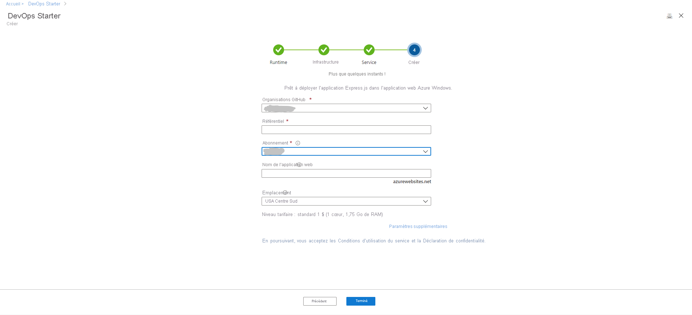
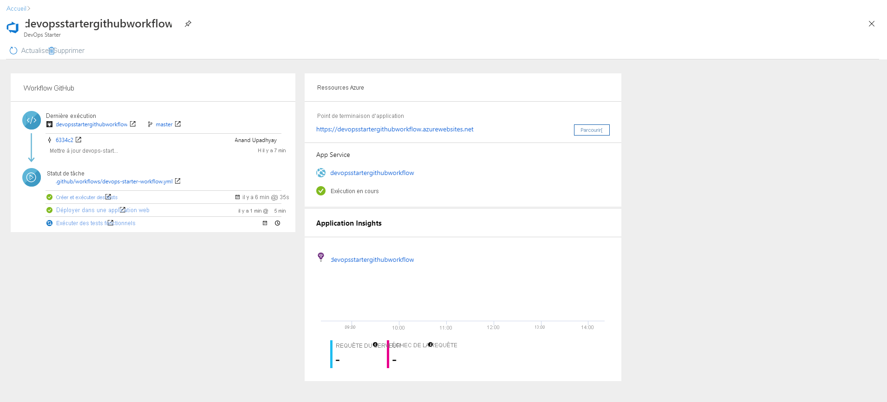

# Configurer un workflow CI/CD pour une application Node.js avec DevOps Starter à l’aide de GitHub Actions

Dans ce guide de démarrage rapide, vous allez utiliser l’expérience DevOps Starter simplifiée pour configurer un workflow d’intégration continue (CI) et de livraison continue (CD) pour votre application Node.js à l’aide de GitHub Actions. Vous pouvez utiliser DevOps Starter pour configurer tout ce dont vous avez besoin pour développer, déployer et superviser votre application. 

## Prérequis

- Compte Azure avec un abonnement actif. [Créez un compte gratuitement](https://azure.microsoft.com/free/?ref=microsoft.com&utm_source=microsoft.com&utm_medium=docs&utm_campaign=visualstudio). 
- Un compte [GitHub](https://github.com/).

## Connectez-vous au portail Azure.

DevOps Starter crée un workflow CI/CD à l’aide de GitHub Actions. DevOps Starter crée également des ressources Azure dans l’abonnement Azure de votre choix.

1. Connectez-vous au [portail Azure](https://portal.azure.com).

1. Dans la zone de recherche, tapez, puis sélectionnez **DevOps Starter**. Cliquez sur le **signe +** pour créer une ressource.

    

## Sélectionner un exemple d’application et le service Azure

1. Cliquez sur **Configurer DevOps Starter avec GitHub** dans la bannière du côté droit.

    

1. Assurez-vous que **GitHub Actions** est sélectionné comme fournisseur CI/CD.

    

1. Sélectionnez l’exemple d’application **Node.js**. Les exemples Node.js offrent le choix entre plusieurs infrastructures d’application.

1. **Express.js** est l’exemple d’infrastructure par défaut. Laissez le paramètre par défaut, puis sélectionnez **Suivant**.   

2. La cible de déploiement par défaut est Application web Windows. Le framework d’application, que vous avez choisi précédemment, détermine le type de cible de déploiement de service Azure disponible ici. Laissez le service par défaut, puis sélectionnez **Suivant**.
 
## Configurer GitHub et un abonnement Azure 

1. Authentifiez-vous auprès de GitHub.

   1. Cliquez sur le bouton **Autoriser**. 
   
   1. Connectez-vous à GitHub. Si vous n’avez pas de compte GitHub, vous pouvez vous inscrire ici également.

2. Choisissez une **organisation GitHub** existante. 
   
   1. Choisissez un nom pour votre dépôt GitHub. 
   
   1. Sélectionnez votre abonnement et un emplacement Azure, choisissez un nom pour votre application, puis sélectionnez **Terminé**.
    
       

    Après quelques minutes, le tableau de bord DevOps Starter est affiché dans le portail Azure. Un exemple d’application est configuré dans un dépôt de votre organisation Azure DevOps, un workflow GitHub est déclenché et votre application est déployée sur Azure. Ce tableau de bord donne une visibilité sur votre dépôt de code, le workflow GitHub et votre application dans Azure.
   
3. Sélectionnez **Parcourir** pour voir votre application en cours d’exécution.
    
    Le tableau de bord contient les détails du workflow GitHub et des ressources Azure. Pour afficher les détails du workflow GitHub, comme la dernière exécution, les validations et l’état des travaux, vous devez **autoriser l’accès à GitHub**.
   
   

DevOps Starter a configuré automatiquement un workflow GitHub avec des travaux de génération et de déploiement à l’aide de GitHub Actions. Vous êtes maintenant prêt à collaborer avec une équipe sur une application Node.js avec un processus CI/CD qui déploie automatiquement votre dernier travail sur votre site web.

   

## Valider les modifications de code et exécuter CI/CD

DevOps Starter crée un dépôt dans GitHub. Pour voir le dépôt et modifier le code dans votre application, suivez les étapes ci-dessous :

1. À gauche du tableau de bord DevOps Starter, sélectionnez le lien correspondant à votre branche principale. Ce lien ouvre une vue sur le dépôt GitHub récemment créé.

1. Pour afficher l’URL du clone du dépôt, sélectionnez **Cloner** en haut à droite du navigateur. Vous pouvez cloner votre référentiel Git dans votre environnement de développement intégré favori. Dans les prochaines étapes, vous allez utiliser le navigateur web pour effectuer des modifications de code directement dans la branche principale et les valider.

1. Sur la gauche du navigateur, accédez au fichier **/Application/views/index.pug**.

1. Sélectionnez **Modifier**, puis modifiez le texte.
    Par exemple, modifiez l’une des balises.

1. Sélectionnez **Valider**, puis enregistrez vos modifications.

1. Dans le navigateur, accédez au tableau de bord DevOps Starter.   
Vous devez maintenant voir un travail de génération de workflow GitHub en cours. Les modifications que vous avez apportées font automatiquement l’objet d’une génération et d’un déploiement via un workflow GitHub.

## Afficher le workflow GitHub

Dans l’étape précédente, DevOps Starter a automatiquement configuré un workflow GitHub complet. Explorez et personnalisez le workflow selon vos besoins. Effectuez les étapes suivantes pour vous familiariser avec le workflow.

1. À gauche du tableau de bord DevOps Starter, sélectionnez **GitHub workflow**. Ce lien ouvre un onglet de navigateur et le workflow GitHub de votre nouveau projet.
    > [!NOTE]
    > Ne renommez pas le fichier de workflow. Le nom du fichier de workflow doit être **devops-Starter-workflow.yml** pour que le tableau de bord reflète les modifications.

1. Le fichier yaml du workflow contient toutes les actions GitHub nécessaires pour générer et déployer l’application. Cliquez sur l’option **modifier le fichier** pour personnaliser votre fichier de workflow.

1. Sous l’onglet **Code** du dépôt, cliquez sur **commits**. Cette vue montre les validations de code associées au déploiement spécifique.

1. Sous l’onglet **Actions** du dépôt, vous pouvez voir l’historique de toutes les exécutions de workflow de votre dépôt.

1. Sélectionnez la **dernière exécution** pour voir tous les travaux qui ont été exécutés dans le workflow.

1. Cliquez sur **jobs** pour voir les journaux détaillés de l’exécution du workflow. Les journaux d’activité contiennent des informations utiles sur le processus de déploiement. Ils peuvent être affichés pendant et après les déploiements.

1. Cliquez sur l’onglet **Pull request** pour voir toutes les demandes de tirage sur votre dépôt.

## Nettoyer les ressources

Quand vous n’en avez plus besoin, vous pouvez supprimer Azure App Service et les autres ressources associées. Utilisez la fonctionnalité **Supprimer** du tableau de bord DevOps Starter.

## Étapes suivantes

Quand vous avez configuré votre processus CI/CD, le workflow GitHub a été créé automatiquement. Vous pouvez modifier ce workflow afin qu’il réponde aux besoins de votre équipe. Pour en savoir plus sur le workflow et les actions GitHub, consultez :

> [!div class="nextstepaction"]
> [Personnaliser le workflow GitHub](https://docs.github.com/actions/configuring-and-managing-workflows/configuring-and-managing-workflow-files-and-runs)
